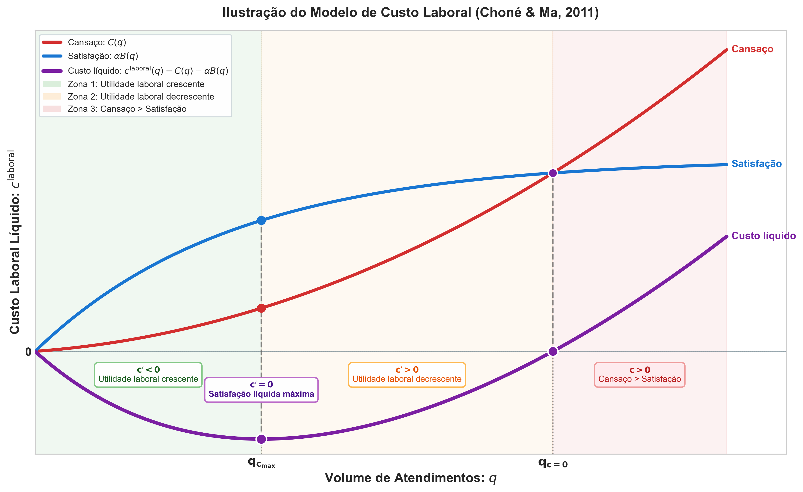

# Modelo Microeconômico da Escolha Locacional Médica

> **Classificação:** fundamentação teórica canônica pura (primitivos, derivações e modelo integrado)<br>
> **Extensão empírica e hipóteses:** ver [hipoteses_e_viabilidade_empirica.md](hipoteses_e_viabilidade_empirica.md)<br>
> **Atualização:** 3 de setembro de 2026

---

## 1. Modelo principal: escolha locacional em Moehling et al. (2020)

Moehling et al. (2020, eq. 1, p. 184) formulam a distribuição espacial de médicos pela maximização intertemporal dos retornos líquidos esperados entre localidades:

```math
\arg\max_{i \in I}\;U(\omega_i)
=
\arg\max_{i \in I}
\left\{
\sum_t\delta^t
\left[
\frac{\mathbb{E}\!\left(w_{it}^{(s)}\right)}{p_{it}}
- c_{it}^{(s)}
\right]
\right\},
```

em que:
- $i \in I$: localidade de atuação (município ou condado);
- $t$: períodos de tempo futuros e $\delta \in (0,1)$ é o fator subjetivo de desconto intertemporal;
- $s$: grupo de qualificação ou especialidade médica;
- $w_{it}^{(s)}$: rendimento nominal auferido na localidade;
- $p_{it}$: nível de preços local (deflator do custo de vida);
- $c_{it}^{(s)}$: custo locacional líquido não pecuniário.

### Propriedades estruturais do modelo:
- **Horizonte intertemporal ($\sum_t \delta^t$):** Modela escolhas dinâmicas de carreira ao longo de períodos indefinidos, capturando a decisão entre fixar-se no município ou migrar após o término de vínculos temporários.
- **Custo não pecuniário ($c_{it}^{(s)}$):** Na definição original dos autores ([p. 184](https://doi.org/10.1007/s11698-019-00187-w)), inclui *"preferences over rural or urban living, or other location-specific attributes, such as proximity to family"*.
- **Heterogeneidade por especialidade ($s$):** Generalistas praticam em postos simples; especialistas cirúrgicos ou de alta densidade diagnóstica exigem centro cirúrgico e leitos de UTI, sofrendo severa desutilidade em postos precários e abrindo mão de altos rendimentos privados em grandes centros.

---

## 2. Microfundamentação dos componentes de custo

### 2.1. Custo geográfico: distância e amenidades

O custo de vida entra diretamente no deflator $p_{it}$. O custo geográfico não pecuniário é expresso por:

```math
c^{\text{geo}}_{im} = \phi(\text{dist}_{im}) - \gamma A_m + \theta_i^{\text{rural}},
```

em que:
- $\text{dist}_{im} = d(\text{família}_i, m)$: distância física à cidade onde os familiares de fato residem (não onde o médico cursou a formação);
- $A_m$: amenidades urbanas locais (qualidade urbana, saneamento e segurança);
- $\theta_i^{\text{rural}}$: gosto pessoal por ambiente rural vs. urbano (sem derivada monotônica universal).

**Derivadas parciais:**
```math
\frac{\partial c^{\text{geo}}}{\partial \text{dist}_{im}} = \phi' > 0,
\qquad
\frac{\partial c^{\text{geo}}}{\partial A_m} = -\gamma < 0.
```

*Fundamentação:* Moehling et al. (2020, p. 184) e Redding & Rossi-Hansberg (2017, p. 28, eq. 24). Afastar-se da família impõe custos logísticos e afetivos crescentes ($\phi' > 0$); amenidades urbanas superiores tornam o município mais atraente ($-\gamma < 0$).
*(Limitação de commuting:* Os dados do CNES/edital não informam a residência do profissional por sigilo fiscal, fixando o município do estabelecimento como unidade de análise).*

---

### 2.2. Custo laboral: cansaço, satisfação e volume de atendimentos ($q$)

Com base em Choné e Ma (2011, p. 232, eq. 1), a desutilidade clínica líquida de atender $q$ pacientes é expressa pelo custo laboral não pecuniário líquido:

```math
c^{\text{laboral}}(q) = C(q) - \alpha B(q),
```

em que:
- $C(q)$: **cansaço e exaustão física/mental** ($C' > 0$, com $C'' > 0$ por desgaste biológico e cognitivo crescente);
- $B(q)$: **benefício efetivo de saúde gerado** ($B' > 0$, com $B'' < 0$ pela priorização de casos mais urgentes na triagem);
- $\alpha \ge 0$: **satisfação moral e sensação de dever cumprido** (satisfação intrínseca pela melhora do paciente).

#### Trade-off de $q$ e convexidade estrita:
O custo marginal $c'(q) = C'(q) - \alpha B'(q)$ tem sinal incerto *a priori*, mas a derivada segunda é inequivocamente positiva:

```math
c''(q) = C''(q) - \alpha B''(q) \gg 0.
```

Essa convexidade garante uma curva de custo não pecuniário em **formato de U**, com ponto de satisfação líquida máxima em $q_{c_{\max}}$ ($C'(q_{c_{\max}}) = \alpha B'(q_{c_{\max}})$) e cruzamento de custo neutro em $q_{c=0}$ ($C(q_{c=0}) = \alpha B(q_{c=0})$):



1. **Zona 1: Utilidade Laboral Crescente ($q < q_{c_{\max}}$):** A satisfação marginal supera o cansaço marginal ($\alpha B' > C' \implies c'(q) < 0$). Atender pacientes adicionais reduz o custo laboral líquido, gerando utilidade líquida crescente.
2. **Ponto Ótimo ($q = q_{c_{\max}}$):** O cansaço marginal equilibra exatamente a satisfação adicional ($c'(q_{c_{\max}}) = 0 \iff C' = \alpha B'$), atingindo a **satisfação líquida máxima** (ponto de custo laboral mínimo).
3. **Zona 2: Utilidade Laboral Decrescente ($q_{c_{\max}} < q < q_{c=0}$):** O cansaço marginal passa a superar a satisfação marginal ($c'(q) > 0 \implies C' > \alpha B'$), tornando a utilidade marginal decrescente. No entanto, o custo acumulado ainda é negativo ($c < 0$), significando que a satisfação total acumulada ainda excede o cansaço ($\alpha B > C$).
4. **Ponto Notável de Custo Neutro ($q = q_{c=0}$):** O cansaço total acumulado iguala a satisfação total ($C = \alpha B \iff c = 0$).
5. **Zona 3: Cansaço Supera a Satisfação ($q > q_{c=0}$):** O custo laboral líquido torna-se estritamente positivo ($c > 0 \iff C > \alpha B$), impondo desutilidade líquida pela sobrecarga e exaustão clínica.

---

### 2.3. Infraestrutura, insumos e pessoal de saúde ($L$ e $K$)

Pela função de produção médica (Reinhardt, 1975), a infraestrutura hospitalar instalada ($K$) e a equipe de apoio/enfermagem ($L$) exercem um **efeito duplo**:
1. **Reduzem o cansaço:** $\frac{\partial C}{\partial K} < 0$ e $\frac{\partial C}{\partial L} < 0$ (apoio técnico e retaguarda para segunda opinião diminuem a penosidade do trabalho).
2. **Multiplicam o benefício de saúde:** $\frac{\partial B}{\partial K} > 0$ e $\frac{\partial B}{\partial L} > 0$. A falta de medicamentos essenciais, insumos cirúrgicos ou maquinário quebrado esvaziam a resolutividade curativa do atendimento.

**Derivadas parciais totais:**
```math
\frac{\partial c^{\text{laboral}}}{\partial K} = \frac{\partial C}{\partial K} - \alpha \frac{\partial B}{\partial K} < 0,
\qquad
\frac{\partial c^{\text{laboral}}}{\partial L} = \frac{\partial C}{\partial L} - \alpha \frac{\partial B}{\partial L} < 0.
```

---

### 2.4. O modelo teórico integrado completo

Consolidando os blocos desenvolvidos, a decisão locacional intertemporal do médico especialista $s$ é expressa em harmonia direta com a formulação de Moehling et al. (2020):

```math
\arg\max_{m \in M}\;U_i(\omega_m)
=
\arg\max_{m \in M}
\left\{
\sum_t \delta^t
\left[
\frac{\mathbb{E}\!\left(w_{mt}^{(s)}\right)}{p_{mt}}
- c_{im}^{(s)}
\right]
\right\},
```

em que o custo locacional não pecuniário $c_{im}^{(s)}$ é formalmente aberto em seus componentes microfundamentados:

```math
c_{im}^{(s)} = \underbrace{\phi(\text{dist}_{im}) - \gamma A_m + \theta_i^{\text{rural}}}_{\text{Custo Geográfico e Amenidades}} + \underbrace{C(q_{im}; L_m, K_m, s) - \alpha_i B(q_{im}; L_m, K_m)}_{\text{Custo Laboral Líquido de Realização}}.
```

---

## 3. Referências teóricas

- Choné, P.; Ma, C.-T. A. (2011). [*Optimal Health Care Contract under Physician Agency*](https://people.bu.edu/ma/CHONE-MA_Annals2011.pdf). **Annals of Economics and Statistics**, 101/102, 229--256. [p. 232, eq. 1].
- Moehling, C. M.; Niemesh, G. T.; Thomasson, M. A.; Treber, J. (2020). [*Medical Education Reforms and the Origins of the Rural Physician Shortage*](https://doi.org/10.1007/s11698-019-00187-w). **Cliometrica**, 14, 181--225. [p. 184, eq. 1].
- Redding, S. J.; Rossi-Hansberg, E. (2017). [*Quantitative Spatial Economics*](https://doi.org/10.1146/annurev-economics-063016-103713). **Annual Review of Economics**, 9, 21--58. [p. 28, eq. 24].
- Reinhardt, U. E. (1975). *Physician Productivity and the Demand for Health Manpower: An Economic Analysis*. Ballinger Publishing Company. [caps. 3 e 4].
