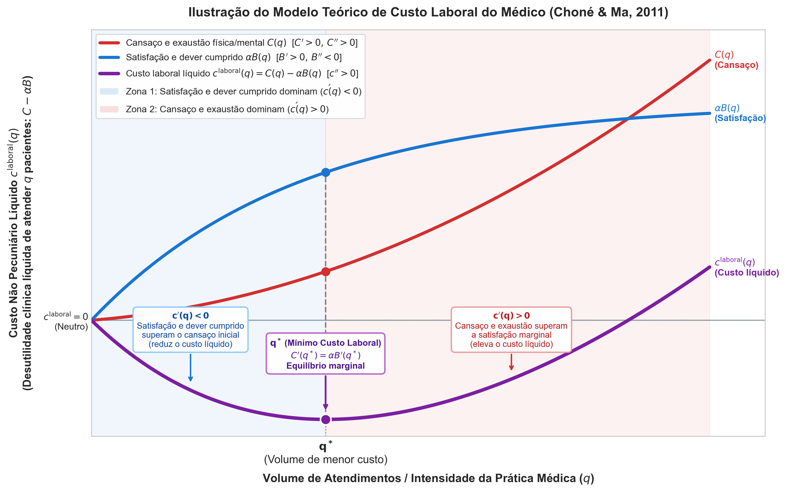

# Modelo Microeconômico da Escolha Locacional Médica

> **Classificação:** fundamentação teórica canônica — primitivos, derivações, adaptação ao PMM-E e derivação das hipóteses<br>
> **Transposição empírica:** [hipoteses_e_viabilidade_empirica.md](hipoteses_e_viabilidade_empirica.md)<br>
> **Versão apresentada:** [`docs/07_apresentacoes/banca1/02_conteudo_slides.md`](../07_apresentacoes/banca1/02_conteudo_slides.md), slides 10 a 13, 15 e 16 da estrutura de 17 slides<br>
> **Atualização:** 7 de outubro de 2026 — seções 4.3 a 4.5, agregação da escolha individual ao preenchimento da célula

> [!NOTE]
> Este documento absorveu, em 09/09/2026, o antigo `18_modelo_teorico_slides_apresentacao.md`.
> A adaptação ao PMM-E e as equações originais dos complementos estão na seção 3;
> a derivação das hipóteses, na seção 4. O documento 18 foi removido para não
> manter duas versões concorrentes da mesma teoria.

---

## 1. Modelo principal: escolha locacional em Moehling et al. (2020)

Moehling et al. (2020, eq. 1, p. 184) formulam a distribuição espacial de médicos pela maximização intertemporal dos retornos líquidos esperados entre localidades:

```math
\arg\max_{i \in I}\;U(\omega_i)
=
\arg\max_{i \in I}
\left\{
\sum_t\delta^t
\left[
\frac{\mathbb{E}\!\left(w_{it}^{(s)}\right)}{p_{it}}
- c_{it}^{(s)}
\right]
\right\},
```

em que:
- $i \in I$: localidade de atuação (município ou condado);
- $t$: períodos de tempo futuros e $\delta \in (0,1)$ é o fator subjetivo de desconto intertemporal;
- $s$: grupo de qualificação ou especialidade médica;
- $w_{it}^{(s)}$: rendimento nominal auferido na localidade;
- $p_{it}$: nível de preços local (deflator do custo de vida);
- $c_{it}^{(s)}$: custo locacional líquido não pecuniário.

### Propriedades estruturais do modelo:
- **Horizonte intertemporal ($\sum_t \delta^t$):** Modela escolhas dinâmicas de carreira ao longo de períodos indefinidos, capturando a decisão entre fixar-se no município ou migrar após o término de vínculos temporários.
- **Custo não pecuniário ($c_{it}^{(s)}$):** Na definição original dos autores ([p. 184](https://doi.org/10.1007/s11698-019-00187-w)), inclui *"preferences over rural or urban living, or other location-specific attributes, such as proximity to family"*.
- **Heterogeneidade por especialidade ($s$):** Generalistas praticam em postos simples; especialistas cirúrgicos ou de alta densidade diagnóstica exigem centro cirúrgico e leitos de UTI, sofrendo severa desutilidade em postos precários e abrindo mão de altos rendimentos privados em grandes centros.

---

## 2. Microfundamentação dos componentes de custo

### 2.1. Custo geográfico: distância e amenidades

O custo de vida entra diretamente no deflator $p_{it}$. O custo geográfico não pecuniário é expresso por:

```math
c^{\text{geo}}_{im} = \phi(\text{dist}_{im}) - \gamma A_m + \theta_i^{\text{rural}},
```

em que:
- $\text{dist}_{im} = d(\text{família}_i, m)$: distância física à cidade onde os familiares de fato residem (não onde o médico cursou a formação);
- $A_m$: amenidades urbanas locais (qualidade urbana, saneamento e segurança);
- $\theta_i^{\text{rural}}$: gosto pessoal por ambiente rural vs. urbano (sem derivada monotônica universal).

**Derivadas parciais:**
```math
\frac{\partial c^{\text{geo}}}{\partial \text{dist}_{im}} = \phi' > 0,
\qquad
\frac{\partial c^{\text{geo}}}{\partial A_m} = -\gamma < 0.
```

*Fundamentação:* Moehling et al. (2020, p. 184) e Redding & Rossi-Hansberg (2017, p. 28, eq. 24). Afastar-se da família impõe custos logísticos e afetivos crescentes ($\phi' > 0$); amenidades urbanas superiores tornam o município mais atraente ($-\gamma < 0$).
*(Limitação de commuting:* Os dados do CNES/edital não informam a residência do profissional por sigilo fiscal, fixando o município do estabelecimento como unidade de análise).*

---

### 2.2. Custo laboral: cansaço, satisfação e volume de atendimentos ($q$)

Com base em Choné e Ma (2011, p. 232, eq. 1), a desutilidade clínica líquida de atender $q$ pacientes é expressa pelo custo laboral não pecuniário líquido:

```math
c^{\text{laboral}}(q) = C(q) - \alpha B(q),
```

em que:
- $C(q)$: **cansaço e exaustão física/mental** ($C' > 0$, com $C'' > 0$ por desgaste biológico e cognitivo crescente);
- $B(q)$: **benefício efetivo de saúde gerado** ($B' > 0$, com $B'' < 0$ pela priorização de casos mais urgentes na triagem);
- $\alpha \ge 0$: **satisfação moral e sensação de dever cumprido** (satisfação intrínseca pela melhora do paciente).

#### Trade-off de $q$ e convexidade estrita:
O custo marginal $c'(q) = C'(q) - \alpha B'(q)$ tem sinal incerto *a priori*, mas a derivada segunda é inequivocamente positiva:

```math
c''(q) = C''(q) - \alpha B''(q) \gg 0.
```

Essa convexidade garante uma curva de custo não pecuniário em **formato de U**, com ponto de satisfação líquida máxima em $q_{c_{\max}}$ ($C'(q_{c_{\max}}) = \alpha B'(q_{c_{\max}})$) e cruzamento de custo neutro em $q_{c=0}$ ($C(q_{c=0}) = \alpha B(q_{c=0})$):



1. **Zona 1: Utilidade Laboral Crescente ($q < q_{c_{\max}}$):** A satisfação marginal supera o cansaço marginal ($\alpha B' > C' \implies c'(q) < 0$). Atender pacientes adicionais reduz o custo laboral líquido, gerando utilidade líquida crescente.
2. **Ponto Ótimo ($q = q_{c_{\max}}$):** O cansaço marginal equilibra exatamente a satisfação adicional ($c'(q_{c_{\max}}) = 0 \iff C' = \alpha B'$), atingindo a **satisfação líquida máxima** (ponto de custo laboral mínimo).
3. **Zona 2: Utilidade Laboral Decrescente ($q_{c_{\max}} < q < q_{c=0}$):** O cansaço marginal passa a superar a satisfação marginal ($c'(q) > 0 \implies C' > \alpha B'$), tornando a utilidade marginal decrescente. No entanto, o custo acumulado ainda é negativo ($c < 0$), significando que a satisfação total acumulada ainda excede o cansaço ($\alpha B > C$).
4. **Ponto Notável de Custo Neutro ($q = q_{c=0}$):** O cansaço total acumulado iguala a satisfação total ($C = \alpha B \iff c = 0$).
5. **Zona 3: Cansaço Supera a Satisfação ($q > q_{c=0}$):** O custo laboral líquido torna-se estritamente positivo ($c > 0 \iff C > \alpha B$), impondo desutilidade líquida pela sobrecarga e exaustão clínica.

---

### 2.3. Infraestrutura, insumos e pessoal de saúde ($L$ e $K$)

A infraestrutura hospitalar instalada ($K$) e a equipe de apoio/enfermagem ($L$) exercem um **efeito duplo**. O primeiro canal está em Choné e Ma (2011), que já escrevem o custo de atender como $C(q; L, K)$. O segundo é **extensão deste projeto**, motivada pela função de produção médica de Reinhardt (1972, 1975), na qual o produto do consultório depende de insumos não médicos: escrevemos o benefício como $B(q; L, K)$, e não $B(q)$.
1. **Reduzem o cansaço:** $\frac{\partial C}{\partial K} < 0$ e $\frac{\partial C}{\partial L} < 0$ (apoio técnico e retaguarda para segunda opinião diminuem a penosidade do trabalho).
2. **Multiplicam o benefício de saúde:** $\frac{\partial B}{\partial K} > 0$ e $\frac{\partial B}{\partial L} > 0$. A falta de medicamentos essenciais, insumos cirúrgicos ou maquinário quebrado esvaziam a resolutividade curativa do atendimento.

**Derivadas parciais totais:**
```math
\frac{\partial c^{\text{laboral}}}{\partial K} = \frac{\partial C}{\partial K} - \alpha \frac{\partial B}{\partial K} < 0,
\qquad
\frac{\partial c^{\text{laboral}}}{\partial L} = \frac{\partial C}{\partial L} - \alpha \frac{\partial B}{\partial L} < 0.
```

---

### 2.4. O modelo teórico integrado completo

Consolidando os blocos desenvolvidos, a decisão locacional intertemporal do médico especialista $s$ é expressa em harmonia direta com a formulação de Moehling et al. (2020):

```math
\arg\max_{m \in M}\;U_i(\omega_m)
=
\arg\max_{m \in M}
\left\{
\sum_t \delta^t
\left[
\frac{\mathbb{E}\!\left(w_{mt}^{(s)}\right)}{p_{mt}}
- c_{im}^{(s)}
\right]
\right\},
```

em que o custo locacional não pecuniário $c_{im}^{(s)}$ é formalmente aberto em seus componentes microfundamentados:

```math
c_{im}^{(s)} = \underbrace{\phi(\text{dist}_{im}) - \gamma A_m + \theta_i^{\text{rural}}}_{\text{Custo Geográfico e Amenidades}} + \underbrace{C(q_{im}; L_m, K_m, s) - \alpha_i B(q_{im}; L_m, K_m)}_{\text{Custo Laboral Líquido de Realização}}.
```

---

## 3. Adaptação ao PMM-E: a bolsa fixada por regra

O programa introduz no modelo um elemento que a literatura de escolha locacional
raramente observa: **um componente da remuneração fixado por regra pública e
descontínuo em um escore territorial**. A bolsa-formação $B_m$ não é negociada
com o médico nem determinada pelo mercado local; é atribuída ao município por
faixa de vulnerabilidade.

Escrevendo a decisão do médico $i$ sobre o município $m$, com a alternativa
$m=0$ representando ficar fora do programa:

```math
V_{im}^{(s)}
=
\sum_t\delta^t
\left[
\frac{\mathbb{E}\!\left(w_{imt}^{(s)}\mid B_m(IVS_m)\right)}{p_{mt}}
- c_{im}^{(s)}
\right]
+\varepsilon_{im},
\qquad
m_i^{\ast} \in \arg\max_{m \in \mathcal{M} \cup \{0\}} V_{im}^{(s)}.
```

Duas restrições de observabilidade obrigam a uma forma reduzida. Não se observa
distância à cidade da família, preço local de aluguel nem esforço clínico
individual $q$. Observa-se, para 100% dos municípios, a bolsa $B_m$ e o IVS 2010
do IPEA. O custo locacional é então escrito como função do escore territorial
mais um desvio individual:

```math
c_{im}^{(s)} = c_0^{(s)}(IVS_m) + \eta_i .
```

> [!NOTE]
> **Na banca 1 esta equação aparece sem $\varepsilon_{im}$.** Decisão do autor,
> de 17/09/2026: a apresentação é estritamente teórica e não exibe termo de erro.
> A supressão é de tela; a forma canônica é a de cima, com o erro. Ver
> [`07_apresentacoes/banca1/02_conteudo_slides.md`](../07_apresentacoes/banca1/02_conteudo_slides.md),
> slide 15.

> [!NOTE]
> **Leitura na agregação (seção 4.3).** $\varepsilon_{im}$ já carrega o que é
> do médico, e é dele que saem as parcelas de candidatos por célula. Ele não é
> o erro da equação estimada: esse é $u_j$, comum a todos os médicos.

### 3.1 Por que o IVS é a variável que organiza o custo latente

O IVS do IPEA agrega 16 indicadores censitários em três sub-índices, e cada um
deles corresponde a um bloco distinto do custo microfundamentado na seção 2:

| Sub-índice do IVS | Indicadores | Bloco teórico correspondente | Efeito esperado sobre $c$ |
|---|---|---|:---:|
| Infraestrutura urbana | saneamento, coleta de lixo, tempo de deslocamento | amenidades $A_m$ e custo espacial (Redding & Rossi-Hansberg) | $\uparrow$ |
| Capital humano | mortalidade infantil, mães adolescentes, analfabetismo | gravidade do caso $B'(q)$ e escassez de capital $K$ (Choné & Ma; Reinhardt) | ambíguo |
| Renda e trabalho | extrema pobreza, desemprego, informalidade | ausência de mercado privado pagador, logo $w \to B$ | $\uparrow$ |

O sub-índice de capital humano é o que impede assumir monotonicidade: carência
sanitária eleva o benefício marginal de atender ($B'(q)\uparrow$, o que **reduz**
o custo laboral líquido de um médico altruísta) ao mesmo tempo em que sinaliza
falta de insumos ($K\downarrow$, o que **eleva** o cansaço). Portanto

```math
c_0'(IVS) \; \gtrless \; 0 ,
```

e o sinal é questão empírica, não postulado. Essa é a razão teórica para
estudar o **degrau** da bolsa na fronteira de faixa, e não o gradiente do IVS.

> [!NOTE]
> **O que a banca 1 exibe, desde 17/09/2026.** Por decisão do autor, os slides 6,
> 15 e 17 da apresentação dizem que o custo **cresce** com o IVS, sem a ressalva
> do sub-índice de capital humano. É simplificação de exposição, e **não** muda
> esta seção: aqui e em H4 o sinal continua ambíguo, e a decomposição em
> sub-índices continua sendo o diagnóstico previsto. A divergência está
> registrada como `P11` em
> [`07_apresentacoes/banca1/03_proveniencia_figuras_e_numeros.md`](../07_apresentacoes/banca1/03_proveniencia_figuras_e_numeros.md),
> com as duas saídas possíveis de fechamento.

### 3.2 Equações originais dos complementos

Redding e Rossi-Hansberg (2017, eq. 24, p. 28), de onde vem o componente
espacial do custo:

```math
u_{nio} = \frac{z_{nio}B_n w_i}{\kappa_{ni}Q_n^{\,1-\beta}}
\implies
c^{\text{espacial}}_m = (1-\beta)\ln Q_m - \ln A_m .
```

Choné e Ma (2011, eq. 1, p. 232), com Reinhardt (1975), de onde vem o
componente clínico:

```math
U = R - C(q; L, K) + \alpha B(q)
\implies
c^{\text{laboral}}_{im} = C(q; L, K) - \alpha B(q).
```

---

## 4. Da condição de aceitação às hipóteses

O modelo só é útil ao trabalho empírico se produzir hipóteses por derivação, e
não por analogia. Esta seção faz essa passagem.

### 4.1 Condição de aceitação

O médico aceita a vaga no município $m$ quando o valor da vaga supera sua
melhor alternativa. Normalizando a alternativa em $\bar{v}_i$ e usando a forma
reduzida da seção 3:

```math
\frac{B_m}{p_m} - c_0(IVS_m) \;\geq\; \bar{v}_i .
```

Comparando dois municípios contíguos separados pela fronteira administrativa
entre faixas de bolsa, o preenchimento do lado mais vulnerável exige que o
degrau monetário supere o degrau de custo latente:

```math
\boxed{\;\frac{\Delta B_m}{p_m} \;>\; \Delta c_0\;}
\qquad\text{com}\qquad
\Delta B_m = \text{R\$ }5.000 .
```

Essa desigualdade é o objeto do trabalho. Ela não pergunta se o PMM-E funciona;
pergunta se **o preço que o programa colocou sobre a vulnerabilidade é
suficiente** para vencer a desvantagem que ele pretende compensar.

### 4.2 Estática comparativa e hipóteses derivadas

| # | Derivada | Origem no modelo | Hipótese |
|:---:|---|---|---|
| **H1** | $\dfrac{\partial \Pr(\text{aceitar})}{\partial B_m} > 0$ | $B_m$ entra aditivamente na remuneração real esperada | quanto maior a bolsa, maior a probabilidade de preenchimento |
| **H2** | $\dfrac{\partial \Pr(\text{permanecer em } t{+}k)}{\partial B_m} > 0$ | a bolsa entra em **todo** período do somatório $\sum_t\delta^t$, não apenas no primeiro | quanto maior a bolsa, maior a persistência da oferta local após o período inicial |
| **H3** | $\dfrac{\partial^2 \Pr(\text{aceitar})}{\partial B_m \, \partial w^{\text{alt}}} < 0$ | a bolsa concorre com a renda alternativa dentro do mesmo termo $\mathbb{E}(w\mid B)$ | o efeito da bolsa é maior onde e para quem a renda alternativa é menor |
| **H4** | $\text{sinal}\left(c_0'(IVS)\right)$ indefinido | sub-índices do IVS operam em sentidos opostos (seção 3.1) | decompondo o IVS, infraestrutura urbana eleva o custo e capital humano pode atenuá-lo |

H2 merece nota: ela não é uma hipótese sobre retenção individual. O modelo
prevê persistência da **decisão locacional**, e o dado disponível observa
oferta cadastrada no município, não o mesmo profissional na mesma vaga. A
distinção é mantida em toda a transposição empírica.

H3 tem duas leituras, ambas derivadas da mesma cruzada. A leitura individual
compara médicos por renda alternativa e exige microdado de renda. A leitura
territorial compara municípios pela existência de mercado privado local: onde
não há demanda privada adjacente, a remuneração colapsa no piso da bolsa,
$w = B$, e a bolsa é a totalidade do incentivo.

A transposição dessas hipóteses para especificações, variáveis e bases está em
[hipoteses_e_viabilidade_empirica.md](hipoteses_e_viabilidade_empirica.md).

### 4.3 Da escolha individual ao preenchimento da célula

> [!NOTE]
> **Melhoria de 07/10/2026.** As seções 1 a 4.2 descrevem a decisão de **um**
> médico. O dado do projeto é agregado: preenchimento por célula
> estabelecimento–curso, com bolsa e IVS do município. Esta seção faz a
> passagem de um nível ao outro sem trocar a teoria: o Moehling continua sendo
> o modelo individual, e o que se acrescenta é a agregação e a regra de
> preenchimento. A condição de aceitação da seção 4.1 vale para cada médico; o
> que muda é o objeto observado.

#### Notação

A célula $j$ é um par estabelecimento–curso, no município $m = m(j)$ e na
especialidade $s = s(j)$. O mercado relevante é a especialidade: os
$N_s$ candidatos de $s$ escolhem entre as células de $s$ ou ficam fora do
programa ($j = 0$).

Duas variáveis aleatórias aparecem e **não se confundem**:

| Símbolo | O que é | Varia entre | Papel |
|---|---|---|---|
| $\varepsilon_{ij}$ | o erro da utilidade da seção 3: o que é do médico $i$ e não está na parte comum (distância da família, origem, gosto por cidade pequena) | médicos e células | parte do **modelo de escolha**; some na agregação, porque é ele que gera a fração de médicos que escolhe cada célula |
| $u_j$ | atratividade da célula não observada pelo pesquisador e comum a todos os médicos | células | **termo de erro econométrico** da equação estimada |

#### Passo 1: agregar os médicos

A utilidade da seção 3 já vem escrita com a parte individual no erro. Na
célula $j$, ela é a parte comum a todos os médicos mais $\varepsilon_{ij}$:

```math
V_{ij} = \bar V_j + \varepsilon_{ij},
\qquad
\bar V_j = \sum_{t}\delta^t\left[\frac{\mathbb{E}\!\left(w_{jt}\mid B_j\right)}{p_{m}} - c_0^{(s)}(IVS_m)\right] + u_j,
\qquad
\bar V_0 = 0 .
```

Com $\varepsilon_{ij}$ i.i.d. de valor extremo tipo I (o logit padrão; McFadden,
1974), a fração de candidatos de $s$ que escolhe a célula $j$ é:

```math
s_j = \frac{e^{\bar V_j}}{1 + \sum_{k \in s} e^{\bar V_k}} .
```

O argmax individual vira uma **parcela**: em vez de todos os médicos irem para
a mesma célula de maior valor, cada célula recebe uma fração que cresce com
$\bar V_j$. O número de candidatos que escolhe $j$ é
$D_j \sim \text{Binomial}(N_s, s_j)$, aproximadamente Poisson com média
$\lambda_j = N_s\, s_j$ quando $s_j$ é pequeno.

#### Passo 2: regra de preenchimento

Há duas medidas possíveis, e só uma é sustentada pelo dado do ciclo 1.

**(a) Taxa de preenchimento por vaga.** Com $Q_j$ vagas abertas, o
preenchimento não passa do número de vagas:

```math
\rho_j = \frac{\mathbb{E}\left[\min(D_j, Q_j)\right]}{Q_j}
\;\approx\; \min\!\left(1, \frac{N_s\, s_j}{Q_j}\right)
\;\Rightarrow\;
\ln \rho_j = \alpha_s + \bar V_j - \ln Q_j
\quad\text{quando } \lambda_j \ll Q_j .
```

$\alpha_s = \ln N_s - \ln\!\left(1 + \sum_{k\in s} e^{\bar V_k}\right)$ é comum à
especialidade e vira efeito fixo. A aproximação pela média vale longe do
teto; perto dele, $\mathbb{E}[\min(D,Q)] < \min(\mathbb{E}[D],Q)$.
**Esta medida não pode ser construída no ciclo 1.** O portão A1
([`auditorias/08_portao_denominador_atracao.md`](../auditorias/08_portao_denominador_atracao.md))
reprovou o denominador por vaga: não há identificador persistente de vaga, a
segunda chamada não publica vagas imediatas por célula, e 15 células têm mais
confirmações que a capacidade publicada.

**(b) Célula com alguma confirmação ou homologação.** É o outcome aprovado pelo
portão A1. A célula é preenchida se ao menos um candidato a escolhe:

```math
\pi_j = \Pr(D_j \ge 1) = 1 - e^{-\lambda_j}
\;\Rightarrow\;
\ln\!\left[-\ln(1 - \pi_j)\right] = \ln \lambda_j = \alpha_s + \bar V_j .
```

A transformação é o *complementary log-log* (cloglog). Ela sai do modelo, não é
escolha de conveniência, e dispensa $Q_j$. A forma $1 - e^{-\lambda}$ é a mesma
da função de matching *urn-ball* resenhada por Petrongolo e Pissarides (2001).

#### Equação estimável

Escrevendo a remuneração esperada como parte de mercado mais bolsa,
$\mathbb{E}(w_{jt}\mid B_j) = \bar w_{j} + B_j$, e substituindo $\bar V_j$:

```math
\boxed{\;
\ln\!\left[-\ln(1 - \pi_j)\right]
=
\alpha_s + \beta\,\frac{B_j}{p_m} - c_0^{(s)}(IVS_m) + \mathbf{x}_j'\gamma + u_j
\;}
```

com $\beta = \sum_{t \in \mathcal{T}_B} \delta^t$ somado sobre os períodos em que
a bolsa é paga, e $\mathbf{x}_j$ as proxies observadas de $\bar w_j$ e do custo
(estrato territorial, estoque prévio, população; ver
[hipoteses_e_viabilidade_empirica.md](hipoteses_e_viabilidade_empirica.md), §1).
Estima-se como modelo binário com link cloglog na célula, com efeito fixo de
especialidade (e de chamada, porque $N_s$ muda entre chamadas). Pela medida
(a), a mesma equação vale para $\ln\rho_j$ com $-\ln Q_j$ como offset.

### 4.4 O que a agregação acrescenta

1. **O $\beta$ estimado com dado de célula é o parâmetro individual.** É o peso
   da bolsa no valor de Moehling, medido em unidades da dispersão de
   $\varepsilon_{ij}$, que é a normalização usual do logit. O efeito fixo
   $\alpha_s$ absorve o tamanho do mercado e a competição entre células
   (Berry, 1994).
2. **H1 em nível de célula.** Com tudo o mais contínuo no corte, a forma
   testável de H1 é um salto de $\beta\,\Delta B/p_m$ no cloglog de $\pi_j$,
   com $\Delta B = \text{R\$ }5.000$.
3. **Saltos em $\pi$ não são comparáveis entre cortes.** No nível de
   probabilidade,
   $\partial \pi_j/\partial B_j = (1-\pi_j)\left[-\ln(1-\pi_j)\right]\beta/p_m$.
   O fator multiplicativo é máximo, $1/e \approx 0{,}37$, em
   $\pi \approx 63\%$, e vale cerca de $0{,}25$ em $\pi = 30\%$. O mesmo
   $\beta$ produz saltos diferentes em cortes com preenchimento-base diferente.
   A comparação entre os cortes do IVS se faz na escala cloglog.
4. **A bolsa desloca médicos entre células da mesma especialidade.** No logit,
   $\partial s_k/\partial B_j = -\beta\, s_j s_k/p_m < 0$ para $k \ne j$. O
   salto na célula mede atração relativa. Se células dos dois lados do corte
   disputam os mesmos candidatos, o lado de controle perde médicos para o
   tratado e o salto superestima a expansão líquida. Isso reforça a regra do
   projeto: a célula mede o efeito direto e o município–mês é o teste de
   oferta líquida local.
5. **O número de vagas tem previsão própria.** Na medida (b), $Q_j$ não entra.
   Se entrar como controle, a previsão é coeficiente nulo, salvo se o tamanho
   da célula sinalizar atratividade. Na medida (a), o coeficiente de
   $\ln Q_j$ é $-1$.

### 4.5 Hipóteses de manutenção e limites

- **Independência de alternativas irrelevantes.** O logit supõe $\varepsilon_{ij}$
  independente entre células. Se médicos preferem regiões inteiras (origem,
  família), células próximas são substitutas mais fortes do que o logit
  admite, e o deslocamento do item 4 fica subestimado.
- **Alocação centralizada.** O candidato indica até dois locais e é classificado
  por barema, cotas e desempates
  ([`auditorias/01_regra_institucional.md`](../auditorias/01_regra_institucional.md)).
  Com sobra de vagas, a ordem de classificação raramente decide quem fica sem
  célula, e $D_j$ aproxima a demanda efetiva. Onde a especialidade tem mais
  candidatos que vagas, a classificação passa a importar e a aproximação piora.
- **Escolhas independentes entre médicos.** A passagem Binomial → Poisson supõe
  que um médico não escolhe por causa de outro. Duplas ou equipes que se
  candidatam juntas violam isso.
- **Aceitação e homologação.** Desistência depois da alocação entra em $s_j$
  como parte da decisão de aceitar. Indeferimento administrativo não é escolha
  do médico e entra em $u_j$.
- **Identificação.** A agregação não resolve endogeneidade. $u_j$ continua
  correlacionado com $B_j$ por meio do IVS, e a separação entre bolsa e custo
  do lugar continua dependendo do degrau na fronteira de faixa, nos termos do
  [plano do RDD](../05_identificacao/14_plano_implementacao_rdd_bolsa.md).
- **Protocolo.** A escolha entre as medidas (a) e (b), o link cloglog e o
  tratamento de $Q_j$ fazem parte da especificação e devem ser congelados no
  protocolo do RDD antes de qualquer outcome ser consultado. Esta seção não
  reabre os resultados agregados do ciclo 1.

---

## 5. Referências teóricas

- Berry, S. T. (1994). [*Estimating Discrete-Choice Models of Product Differentiation*](https://doi.org/10.2307/2555829). **The RAND Journal of Economics**, 25(2), 242--262. [inversão das parcelas de mercado; efeito fixo de mercado absorve o denominador do logit — seção 4.4].
- Choné, P.; Ma, C.-T. A. (2011). [*Optimal Health Care Contract under Physician Agency*](https://people.bu.edu/ma/CHONE-MA_Annals2011.pdf). **Annals of Economics and Statistics**, 101/102, 229--256. [p. 232, eq. 1].
- McFadden, D. (1974). *Conditional Logit Analysis of Qualitative Choice Behavior*. In: Zarembka, P. (org.), **Frontiers in Econometrics**. Nova York: Academic Press, 105--142. [agregação da escolha individual em parcelas — seção 4.3].
- Moehling, C. M.; Niemesh, G. T.; Thomasson, M. A.; Treber, J. (2020). [*Medical Education Reforms and the Origins of the Rural Physician Shortage*](https://doi.org/10.1007/s11698-019-00187-w). **Cliometrica**, 14, 181--225. [p. 184, eq. 1].
- Petrongolo, B.; Pissarides, C. A. (2001). [*Looking into the Black Box: A Survey of the Matching Function*](https://doi.org/10.1257/jel.39.2.390). **Journal of Economic Literature**, 39(2), 390--431. [probabilidade de preenchimento da vaga como objeto distinto da escolha do trabalhador; forma *urn-ball* $1-e^{-\lambda}$ — seção 4.3].
- Redding, S. J.; Rossi-Hansberg, E. (2017). [*Quantitative Spatial Economics*](https://doi.org/10.1146/annurev-economics-063016-103713). **Annual Review of Economics**, 9, 21--58. [p. 28, eq. 24].
- Reinhardt, U. E. (1972). [*A Production Function for Physician Services*](https://doi.org/10.2307/1927495). **The Review of Economics and Statistics**, 54(1), 55--66. [forma geral $Q = f(H, X_1, \ldots, X_n)$].
- Reinhardt, U. E. (1975). *Physician Productivity and the Demand for Health Manpower: An Economic Analysis*. Ballinger Publishing Company. [caps. 3 e 4]. Referência secundária: a especificação estimada não está transcrita neste repositório.
