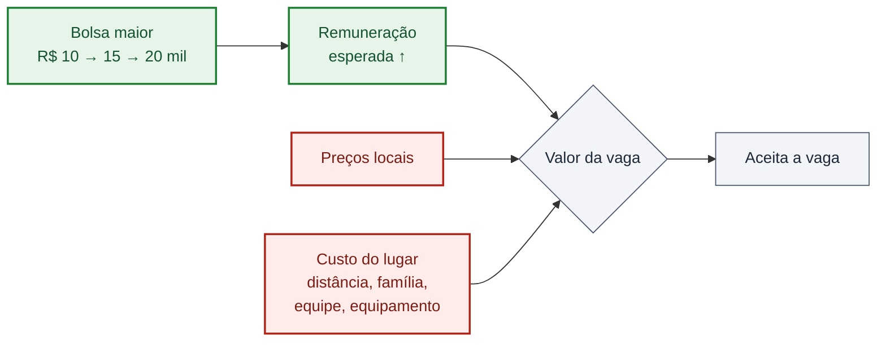

# Pagar mais preenche vagas? O que diz a literatura empírica

> **Resumo de 60 estudos**, com método e conclusão conferidos na fonte, sobre a
> hipótese que o grupo apresentou à banca. 
> **Fichamento completo:** [20 — uma ficha por estudo](20_evidencia_empirica_hipotese_remuneracao_preenchimento.md) ·
> **Catálogo de base:** [19 — escolha locacional de médicos](19_literatura_empirica_escolha_locacional_medicos.md) 
> **Atualização:** 7 de outubro de 2026

---

## A hipótese

> **Municípios com maior remuneração oferecida pelo PMM-E têm maior
> preenchimento de vagas.**

Ela sai do modelo de escolha apresentado na banca. O médico aceita o município
de maior valor:

$$\max_{m} \sum_t \delta^t \left[ \frac{\mathbb{E}(w_{m} \mid B)}{p_{m}} - c_{m} \right]$$

A bolsa $B$ eleva a remuneração esperada. Mas os preços locais $p$ e o custo
de viver e trabalhar ali, $c$, continuam contra. **É a soma dos três que decide.**

## Em uma frase

> **Pagar mais atrai — mas menos do que se imagina, menos ainda nos lugares mais
> difíceis, e o efeito pode aparecer em *quem* ocupa a vaga, não em *se* ela é
> ocupada.**

É o título da apresentação, agora com evidência: **remuneração é incentivo, e é
limitado.**

Verde: o que a política move, e a literatura confirma que move. Vermelho: o que pesa contra, e a literatura mostra que pesa muito.

---

## Cinco achados

### 1. Quando o salário muda por sorteio ou por regra, mais gente aceita a vaga

| Onde | O que mudou | O que aconteceu |
|---|---|---|
| México | salário anunciado **+33%**, por sorteio | aceitação **+15 p.p.**; acima de 200 km de casa, de **25% para ~80%** |
| Noruega | prêmio de **~10%** por regra de escassez | elasticidade da oferta **≈ 1,4** |
| Gâmbia | adicional de **30–40%** para escola remota | professores qualificados **+10 p.p.** |
| Escócia | bolsa única de **£ 20 mil** para residência em medicina de família | vagas preenchidas de **57% para 88%** (associação, não causal) |

**A direção da hipótese se sustenta.**

### 2. O custo do lugar decide quanto o dinheiro rende

- Na **Austrália**, **65%** dos médicos de família não se mudariam por nenhum
  pacote. Os outros pedem de **37% a 130%** da renda anual, conforme o posto.
- Na **Indonésia**, dinheiro modesto basta no remoto moderado, **não** no
  extremo.
- Em **Gana**, melhorar equipamento ou gestão vale **tanto quanto dobrar o
  salário**. Na **Indonésia** — a única amostra de **especialistas** —,
  segurança e formação pesam **mais que a renda**.

**O custo $c$ do modelo é grande e cresce rápido nos lugares mais difíceis.**

### 3. O caso mais parecido com o PMM-E pesa contra a margem que escolhemos

No **Peru**, um adicional para professores definido por um corte do Censo — a
mesma lógica do IVS — elevou o salário em **13%**. Um RDD no corte mostra:

| | Efeito |
|---|---|
| Probabilidade de a vaga ser preenchida | **0,063** (EP 0,048) — **não significativo** |
| Qualidade do professor que preencheu | **+0,42 desvio-padrão** |
| Aprendizagem dos alunos | **+0,2 a +0,5 desvio-padrão** |

**O dinheiro mudou *quem* ocupou a vaga, não *se* ela foi ocupada.**

### 4. Médicos respondem pouco a salário

- No **Brasil**, a elasticidade da escolha de local de médicos generalistas é
  **0,4** nas metrópoles e **0,7** no interior. Salário **+50%** no interior do
  Norte e do Nordeste traria **~25%** mais médicos. Cotas em medicina para
  nascidos em áreas carentes corrigiriam **5 vezes mais** o desequilíbrio, e a
  custo menor.
- Nos **EUA**, médicos preferem fortemente ficar perto de onde se formaram, e a
  resposta a incentivos aparece quase só **em início de carreira**.

**O PMM-E recruta especialistas já formados — o grupo que menos responde.**

### 5. Atrair não é reter, e médico cadastrado não é acesso

| Achado | Onde |
|---|---|
| retenção sobe **só enquanto o pagamento dura** (93% contra 70%; depois, 60% contra 51%) | EUA |
| com obrigação de serviço, **12%** ficam após oito anos, contra **39%** sem | EUA |
| mais médicos, mas **mesma espera** para quem já era paciente | Austrália |
| Mais Médicos: **+15,1** médicos do programa por 100 mil, só **+5,7** líquidos | Brasil |
| mais consultas, **nenhuma** melhora em saúde infantil ou mortalidade | Brasil |

**Preenchimento é o primeiro elo da cadeia, não o último.**

---

## O veredito, termo a termo

| Termo do modelo | O que a literatura diz | Para a hipótese |
|---|---|:---:|
| **Remuneração esperada** $\mathbb{E}(w \mid B)$ | move a escolha; elasticidade de 1 a 2 fora da medicina, de 0,4 a 0,7 entre médicos | ✅ |
| **Renda alternativa** | o que atrai é o salário **relativo** ao mercado local; a bolsa pesa mais onde o mercado privado é menor | ✅ |
| **Preços locais** $p$ | uma bolsa nominal igual vale mais onde tudo é mais barato; não há índice de preços municipal no Brasil | ⚠️ |
| **Custo do lugar** $c$ | distância, família, equipe e equipamento pesam tanto quanto ou mais que o salário | ⚠️ |
| **Altruísmo** $\alpha$ | pagar mais pode afastar os mais motivados (Uganda) — ou não (México, Zâmbia) | ⚠️ |
| **Horizonte** $\sum \delta^t$ | o efeito vem na entrada; a permanência responde pouco | ➖ |

✅ reforça · ⚠️ qualifica · ➖ delimita o que o preenchimento consegue afirmar

---

## Os estudos que mais importam

| Estudo | País | Método | Conclusão |
|---|---|---|---|
| [Dal Bó, Finan & Rossi (2013)](https://doi.org/10.1093/qje/qjt008), *QJE* | México | salário sorteado | pagar mais atrai mais e melhores candidatos e compensa a distância |
| [Bobba et al. (2021, rev. 2026)](https://www.nber.org/papers/w29068), NBER | Peru | RDD em corte censitário | o adicional melhora quem é recrutado, não o preenchimento |
| [Pugatch & Schroeder (2014)](https://doi.org/10.1016/j.econedurev.2014.04.003), *EER* | Gâmbia | RD e DiD em regra de distância | mais professores qualificados, menos nos lugares mais remotos |
| [Falch (2010)](https://doi.org/10.1086/649905), *JOLE* | Noruega | prêmio por regra, efeitos fixos | elasticidade da oferta ≈ 1,4 |
| [Costa, Nunes & Sanches (2024)](https://doi.org/10.1162/rest_a_01155), *REStat* | Brasil | modelo estrutural | salário é a alavanca menos custo-efetiva; origem pesa mais |
| [Scott et al. (2013)](https://doi.org/10.1016/j.socscimed.2013.07.002), *SSM* | Austrália | experimento de escolha | 65% não se mudam; os demais pedem de 37% a 130% da renda |
| [Yong et al. (2018)](https://doi.org/10.1016/j.socscimed.2018.08.014), *SSM* | Austrália | DiD em mudança de elegibilidade | só recém-formados respondem; o estoque não muda |
| [Kurniati et al. (2024)](https://doi.org/10.1371/journal.pone.0308225), *PLoS ONE* | Indonésia | experimento de escolha com especialistas | segurança e formação pesam mais que renda |
| [Hone et al. (2020)](https://doi.org/10.1186/s12913-020-05716-2), *BMC HSR* | Brasil | DiD | Mais Médicos: grande parte da oferta substituiu a que já existia |
| [Propper & Van Reenen (2010)](https://doi.org/10.1086/653137), *JPE* | Inglaterra | painel com salário regulado | salário nacional igual recruta pior onde o mercado local paga mais |
| [Glazerman et al. (2013)](https://ies.ed.gov/ncee/pubs/20144003/pdf/20144003.pdf), IES | EUA | experimento | 88% das vagas preenchidas; retenção só enquanto pagou |
| [Grobler et al. (2015)](https://doi.org/10.1002/14651858.CD005314.pub3), Cochrane | revisão | revisão sistemática | evidência causal confiável sobre incentivos a profissionais de saúde é quase inexistente |

Os outros 48, com ficha completa, estão no [fichamento](20_evidencia_empirica_hipotese_remuneracao_preenchimento.md#2-quadro-resumo).

---

## O que isso muda no nosso trabalho

1. **A contribuição é clara.** Todos os RDDs em adicionais salariais por regra
   territorial são com **professores**. Um RDD no degrau de R$ 5 mil da bolsa do
   PMM-E seria o primeiro com **médicos especialistas**.
2. **O preenchimento sozinho pode não mostrar nada.** Vale declarar, **antes** de
   olhar os dados, desfechos de **rapidez** — em qual chamada a vaga foi
   preenchida — e de **perfil** de quem a preencheu.
3. **A expectativa é de efeito modesto.** Com elasticidades de 0,4 a 0,7 e um
   degrau de +33% a +50%, uma resposta de algumas dezenas por cento é plausível;
   dobrar o preenchimento, não. Isso serve para calcular poder estatístico, não
   para julgar o resultado.
4. **A distância importa.** Vale fixar, com dados de antes do programa, a
   heterogeneidade por distância até a capital ou o polo regional.

---

**Como ler os números.** Nada aqui é estimativa do PMM-E: são resultados
de outros programas, países e profissões, que servem de referência e não de
prova. Números ainda não conferidos na versão publicada estão marcados no
[fichamento](20_evidencia_empirica_hipotese_remuneracao_preenchimento.md#6-pendências-de-verificação)
e não entram em slide sem conferência. Regra de uso completa no
[catálogo 19](19_literatura_empirica_escolha_locacional_medicos.md#1-regra-de-uso).
