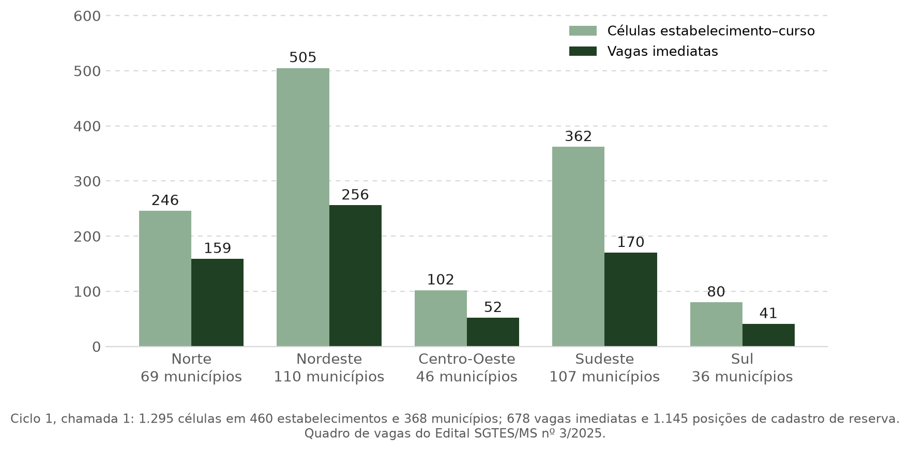
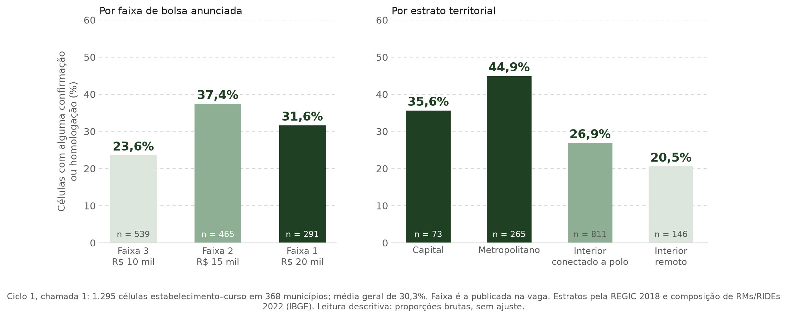

# Conteúdo da apresentação — banca 1

> Conteúdo integral da apresentação, em markdown, para ler de ponta a ponta.
> Cada seção é um slide; o cabeçalho é o título do slide. A linha em `código` é
> o rastreio de seção, exibido fora do título.
> **Atualização:** 9 de setembro de 2026.

---

## 1 — Capa

`sem rastreio`

# Desvantagens territoriais na escolha locacional de médicos especialistas

### Um modelo microeconômico para o preenchimento de vagas do Programa Mais Médicos Especialistas

Autoria · instituição · data da banca

---

## 2 — Sumário

`sem rastreio`

1. Motivação
2. Pergunta
3. Literatura teórica
4. Modelo microeconômico
5. Hipóteses
6. Viabilidade empírica

---

# 1. Motivação

## 3 — Especialistas não faltam; faltam no interior

`1. Motivação · Problema · 1 de 3`

O Brasil tinha, em 2024, **353 mil médicos especialistas** — 59% dos 597 mil
médicos do país. O problema não é o número. É onde eles estão.

| | |
|---|---|
| **55%** dos especialistas estão no Sudeste; **6%** no Norte | Demografia Médica 2025 |
| **453** especialistas por 100 mil habitantes no Distrito Federal; **68** no Maranhão e **70** no Pará | Demografia Médica 2025 |
| "apenas **10%** dos especialistas atendem no SUS. Além disso, há concentração desses profissionais nas capitais e regiões mais ricas do país" | Senado Notícias, 25/09/2025, citando o Ministério da Saúde |

Quem sente a falta é o paciente do SUS fora dos grandes centros. Em 2025 o
Ministério da Saúde reconheceu **situação de urgência em saúde pública** em todo
o país, por 24 meses, em razão do tempo de espera por consultas, exames e
cirurgias na atenção especializada — e lançou o programa Agora Tem
Especialistas, do qual o PMM-E é o braço de provimento.

> *"Ministério da Saúde decreta situação de urgência em saúde pública pelos
> próximos dois anos"* — Correio do Povo, 07/05/2025
>
> *"Aprovada no Senado, MP deve reduzir fila para atendimento por especialista
> no SUS"* — Senado Notícias, 25/09/2025

**Fontes:** Scheffer et al., *Demografia Médica no Brasil 2025* (FMUSP/AMB),
dados de dezembro de 2024; Portaria GM/MS nº 7.061, de 6 de junho de 2025;
recortes de imprensa citados.

---

## 4 — Onde a bolsa é maior, já havia menos especialistas

`1. Motivação · Problema · 2 de 3`

O retrato nacional se repete dentro do programa. Nos 295 municípios que
receberam vaga no ciclo 1, um mês antes da oferta ser publicada:

**Menos da metade.** Havia **16,0 especialistas por 100 mil habitantes** nos
municípios que pagariam R$ 10 mil e **7,3** nos que pagariam R$ 20 mil.

**E quem vai, vai sozinho.** Na Faixa 1, o especialista encontraria **2
colegas** da sua especialidade no município (mediana), contra 5 na Faixa 3; em
**42%** dos casos seria o único, ou teria um só colega.

**Fontes:** CNES, competência 06/2025; profissionais nos CBOs dos 10 cursos do
programa com correspondência unívoca curso–CBO; 295 municípios com vaga nesses
cursos no ciclo 1; população residente do Censo 2022 (IBGE). Faixa pela
categoria de IVS do Ipea. A Faixa 1 tem 19 pares município–especialidade: a
porcentagem oscila com poucos casos, a mediana não.

---

## 5 — O que o médico vê ao decidir

`1. Motivação · Problema · 3 de 3`

Para o médico, "município vulnerável" não é um índice. É um conjunto de
desvantagens concretas. Quatro aparecem de forma consistente na literatura —
duas delas nós conseguimos medir.

| Desvantagem | O que significa para o médico | Medimos? |
|---|---|:---:|
| **Retaguarda profissional** | poucos ou nenhum colega da mesma especialidade; sem segunda opinião, sem escala de plantão, sem a quem encaminhar o caso difícil | sim — slide anterior |
| **Infraestrutura** | equipamento, insumos e equipe de apoio escassos; o atendimento cansa mais e resolve menos | em parte — leitos e equipamentos do CNES |
| **Distância da família** | o custo de viver longe de onde a família está, e onde o médico nasceu ou se formou | não |
| **Mercado privado ausente** | sem consultório ou plano de saúde local, a remuneração se reduz ao que o programa paga | não |

O que a literatura diz sobre o peso de cada uma:

- Nos Estados Unidos do início do século XX, a escolha do lugar já dependia de
  *"preferences over rural or urban living, or other location-specific
  attributes, such as proximity to family"* (Moehling et al., 2020).
- No Brasil, entre 50 mil generalistas formados de 2001 a 2013, **a proximidade
  do lugar de nascimento ou de formação é o principal fator** da escolha
  locacional; salário e infraestrutura importam, mas em escala menor (Costa,
  Nunes & Sanches, 2024).
- Na Austrália, perguntou-se a 3.727 clínicos o que os faria mudar para o
  interior. **65% não mudariam por pacote nenhum.** Para os demais, o valor
  exigido depende do tamanho da cidade e — nas palavras dos autores — *"not
  only of the area but also of the characteristics of the job"* (Scott et al.,
  2013).

**Fontes:** Moehling, Niemesh, Thomasson & Treber (2020), *Cliometrica*,
p. 184; Costa, Nunes & Sanches (2024), *Review of Economics and Statistics*;
Scott et al. (2013), *Social Science & Medicine*.

---

## 6 — O que é o PMM-E

`1. Motivação · Política · 1 de 2`

**Lei.** A Lei nº 15.233/2025 criou o Projeto Mais Médicos Especialistas
dentro do Programa Mais Médicos, *"destinado ao provimento de profissionais
com vistas à redução no tempo de espera de atendimento ao usuário do SUS, nas
regiões prioritárias"*, como braço formativo do programa Agora Tem
Especialistas.

**Quem.** Médicos com diploma brasileiro ou revalidado e **registro de
especialista (RQE)** na área da vaga. Não é concurso nem emprego: o médico
recebe **bolsa-formação** mensal do Ministério da Saúde, sem vínculo.

**O quê.** Um **aprimoramento em serviço** de **12 meses**, com **20 horas
semanais** em estabelecimento do SUS, supervisão e mentoria de uma instituição
formadora, e imersões em serviços de referência. São **16 cursos**: 6
cirúrgicos (anestesiologia; cirurgia geral, oncológica, colorretal, digestiva e
ginecológica) e 10 ambulatoriais (endoscopia e colonoscopia, oncologia clínica,
radioterapia, ecocardiografia, ultrassonografia mamária, colposcopia,
videolaringoscopia, anatomia patológica). O foco é o câncer e o diagnóstico
que o SUS mais espera.

**Como a vaga chega ao médico.** O estado ou município indica o serviço e a
especialidade; a comissão bipartite prioriza; o Ministério analisa a capacidade
instalada e publica o quadro de vagas com município, estabelecimento, curso e
faixa de bolsa. O médico escolhe **até dois locais**, em ordem de preferência,
e é classificado por titulação e tempo de formação. O serviço não pode
substituir profissional já contratado por um bolsista.

**Onde, no primeiro ciclo (julho de 2025).**

**1.295 vagas** estabelecimento–curso em **460 estabelecimentos** e **368
municípios**, em todas as UFs; 678 para preenchimento imediato e 1.145 em
cadastro de reserva. O Nordeste concentra 39% das vagas; Minas Gerais é o
estado com mais vagas (252). Dois terços dos municípios têm menos de 100 mil
habitantes; 18 são capitais.

**Fontes:** Lei nº 15.233/2025, art. 22-D; Portaria GM/MS nº 7.177/2025;
Edital SGTES/MS nº 3/2025 (DOU 24/07/2025), itens 1, 3, 4, 5, 10 e 11; quadro
de vagas do ciclo 1, chamada 1; Censo 2022 (IBGE).

---

## 7 — A bolsa remunera o lugar

`1. Motivação · Política · 2 de 2`

O valor da bolsa não depende da especialidade, da carga nem do que o médico
produz. Depende de **onde fica o município**, em três passos:

1. **O índice.** O IVS 2010 do Ipea resume, em um número de 0 a 1, dezesseis
   indicadores do Censo 2010 em três dimensões: infraestrutura urbana
   (saneamento, lixo, tempo de deslocamento), capital humano (mortalidade
   infantil, analfabetismo, crianças fora da escola) e renda e trabalho
   (pobreza, desemprego, informalidade).
2. **A categoria.** O Ipea corta o índice em cinco categorias: muito baixa
   (até 0,200), baixa (0,201–0,300), média (0,301–0,400), alta (0,401–0,500) e
   muito alta (acima de 0,500).
3. **O valor.** O edital de 2025 agrupou as cinco categorias em três faixas.

| Categoria de IVS | Faixa | Bolsa mensal |
|---|:---:|---:|
| muito alta | 1 | R$ 20.000 |
| alta | 2 | R$ 15.000 |
| média, baixa ou muito baixa | 3 | R$ 10.000 |

No ciclo 1, 102 municípios foram publicados na Faixa 1, 107 na Faixa 2 e 159
na Faixa 3. Dois cuidados: a categoria que vale é a **publicada na vaga**, e em
**177 dos 368 municípios** ela não coincide com a que se obtém aplicando os
cortes do Ipea ao IVS local; e a grade mudou em 2026, quando a categoria
*alta* passou à Faixa 1.

**Fontes:** Edital SGTES/MS nº 3/2025, item 11.1.3, e retificação; Chamamento
SGTES/MS nº 1/2026; Ipea, *Atlas da Vulnerabilidade Social nos Municípios
Brasileiros* (2015); quadro de vagas do ciclo 1.

---

## 8 — Pagar mais funciona: a evidência a favor

`1. Motivação · Efeito incerto · 1 de 3`

O programa aposta que dinheiro compensa lugar ruim. A aposta tem precedente.

**No México, o salário foi sorteado.** Um concurso público real distribuiu 106
postos em municípios pobres e anunciou, ao acaso, dois salários. Onde o
salário era 33% maior, a aceitação da vaga subiu **15 pontos percentuais**. E
o efeito foi maior onde o lugar era pior: nos postos a mais de 200 km da
cidade natal do candidato, a aceitação foi de **25% para cerca de 80%** — o
aumento **anulou** a rejeição aos municípios de menor desenvolvimento humano,
sem atrair candidatos menos qualificados ou menos motivados.

> Dal Bó, Finan & Rossi (2013), *Quarterly Journal of Economics*

**O degrau do PMM-E tem o tamanho que a literatura pede.** Os estudos que
medem quanto um médico exige para ir a um posto pior chegam a valores entre
**37% e 64%** da renda anual para cidades pequenas (Austrália), e a oferta de
médicos no interior brasileiro responde a salário com elasticidade da ordem de
**0,7**. O degrau do programa — R$ 5 mil sobre R$ 10 mil, ou **+50%** — cai
dentro dessa faixa.

> Scott et al. (2013), *Social Science & Medicine*; Costa, Nunes & Sanches (2024), *Review of Economics and Statistics*

**Ressalva:** os percentuais da literatura são sobre a renda total do médico; a
bolsa do PMM-E remunera 20 horas semanais.

---

## 9 — Mas é caro, e não segura: a evidência contra

`1. Motivação · Efeito incerto · 2 de 3`

**Muitos não vão por preço nenhum.** Dos 3.727 clínicos australianos, **65%**
escolheram ficar onde estavam em todos os cenários oferecidos. Para o pior
posto, quem mudaria pedia **130%** da renda anual.

> Scott et al. (2013), *Social Science & Medicine*

**No Brasil, salário compra pouco e custa muito.** Um modelo calibrado com
todos os generalistas formados entre 2001 e 2013 estima que aumentar em **50%**
o salário público no interior do Norte e do Nordeste corrigiria **12,4%** do
desequilíbrio na distribuição de médicos — a **US$ 15,7 milhões por ponto
percentual**. Reservar vagas nas faculdades de medicina para quem nasceu
nessas regiões corrigiria **63,8%**, por **US$ 2,2 a 5,1 milhões** o ponto.

> Costa, Nunes & Sanches (2024), *Review of Economics and Statistics*

**E o médico vai embora quando a obrigação acaba.** Nos Estados Unidos, oito
anos depois, **12%** dos médicos que foram para clínicas rurais com bolsa e
obrigação de permanência ainda estavam lá — contra **39%** dos que foram sem
obrigação nenhuma.

> Pathman, Konrad & Ricketts (1992), *JAMA*

Dinheiro move alocação, mas é caro, não move todo mundo, e não garante que quem
foi fique. A evidência não decide se um degrau de R$ 5 mil basta.

---

## 10 — No primeiro ciclo, a bolsa maior não ordenou o preenchimento

`1. Motivação · Efeito incerto · 3 de 3`

Das 1.295 vagas da primeira chamada, **30%** tiveram alguém confirmado ou
homologado. A bolsa maior não veio acompanhada de mais preenchimento — e o
território, sim, ordenou o resultado:

- Por **faixa de bolsa**: 23,6% na Faixa 3 (R$ 10 mil), 37,4% na Faixa 2
  (R$ 15 mil), **31,6% na Faixa 1 (R$ 20 mil)**. Pagar o dobro não preencheu
  mais que pagar uma vez e meia.
- Por **território**: 44,9% nos municípios metropolitanos, 35,6% nas capitais,
  26,9% no interior conectado a um polo e **20,5% no interior remoto**.

Isso é descrição, não efeito: as faixas diferem em muito mais do que no valor
da bolsa. Mas é o suficiente para colocar a pergunta.

**Fontes:** quadro de vagas e resultados do ciclo 1, chamada 1 (Ministério da
Saúde, 2025); estratos pela REGIC 2018 e pela composição de regiões
metropolitanas e RIDEs de 2022 (IBGE).

---

# 2. Pergunta

## 11 — Pergunta

`2. Pergunta`

> **Maiores bolsas do PMM-E para municípios mais vulneráveis compensam suas
> desvantagens territoriais na atração de médicos especialistas?**

Dois objetos, um contra o outro: o **preço** que a política colocou sobre a
vulnerabilidade — o degrau de R$ 5 mil entre faixas — e a **desvantagem** que
esse preço pretende compensar. A margem que observamos é o **preenchimento da
vaga**: se, ao final da chamada, apareceu alguém disposto a ocupá-la.

---

# 3. Literatura teórica

## 12 — De onde vem o modelo

`3. Literatura teórica`

O modelo junta três tradições. A primeira dá a **estrutura da decisão**: o
médico compara lugares pelo rendimento real que cada um oferece, descontado do
que custa viver ali. As outras duas abrem o custo: uma diz o que há dentro do
**custo geográfico**, a outra o que há dentro do **custo de trabalhar**.

| Referência | Ideia central | Equação original |
|---|---|---|
| **Moehling, Niemesh, Thomasson & Treber (2020)**, eq. 1, p. 184 | O médico escolhe a localidade que maximiza o valor presente do rendimento real, líquido do custo não pecuniário de viver ali | $\arg\max_{i \in I} \sum_t \delta^t \left[ \dfrac{\mathbb{E}(w_{it}^{(s)})}{p_{it}} - c_{it}^{(s)} \right]$ |
| **Redding & Rossi-Hansberg (2017)**, eq. 24, p. 28 | A utilidade de trabalhar em um lugar depende do salário, das amenidades e do custo de moradia locais | $u_{nio} = \dfrac{z_{nio} B_n w_i}{\kappa_{ni} Q_n^{1-\beta}}$ |
| **Choné & Ma (2011)**, eq. 1, p. 232 | A utilidade do médico soma a renda, subtrai o custo de atender e soma o benefício ao paciente, ponderado pelo altruísmo. Equipe e capital instalado entram no custo de atender | $U = R - C(q; L, K) + \alpha B(q)$ |

Nenhuma das três trata de um componente da remuneração fixado por regra
pública sobre um índice territorial. É isso que a adaptação ao PMM-E
acrescenta.

---

# 4. Modelo microeconômico

## 13 — Como o médico escolhe onde trabalhar

`4. Modelo microeconômico · 1 de 4`

Adaptando Moehling et al. (2020), o médico $i$ escolhe o município $m$ que
maximiza o valor presente líquido da carreira:

$$V_{im} = \sum_t \delta^t \left[ \frac{\mathbb{E}(w_{imt} \mid B_m)}{p_{mt}} - c_{im} \right] + \varepsilon_{im}, \qquad m_i^{\ast} \in \arg\max_{m \in \mathcal{M} \cup \{0\}} V_{im}$$

| Termo | Leitura |
|---|---|
| $\mathbb{E}(w_{imt} \mid B_m)$ | remuneração esperada no município, dada a bolsa $B_m$ fixada pela regra |
| $p_{mt}$ | custo de vida local: o que importa é a remuneração **real** |
| $c_{im}$ | tudo o que torna estar naquele município custoso e não é pago em dinheiro |
| $\delta^t$ | a decisão é de carreira, não de um mês: o médico pesa o que o lugar oferece ao longo do tempo |
| $\varepsilon_{im}$ | gostos individuais que não observamos |

A alternativa $m = 0$ é ficar fora do programa. A vaga em $m$ é aceita quando
$V_{im} \geq V_{i0}$ e $m$ é a melhor opção entre as disponíveis.

---

## 14 — O que a bolsa paga — e o que não paga

`4. Modelo microeconômico · 2 de 4`

A remuneração tem duas partes: a bolsa, que a regra fixa, e o que o médico
obtém no **mercado local** fora das 20 horas do programa:

$$\mathbb{E}(w_{imt} \mid B_m) = B_m + w^{\text{priv}}_m$$

| Onde | Mercado privado | Remuneração |
|---|---|---|
| Capital ou região metropolitana | consultório, planos de saúde, hospitais privados | $w = B + w^{\text{priv}}$, com $w^{\text{priv}}$ alto |
| Interior isolado | sem demanda privada que sustente a especialidade | $w \to B$ |

Duas consequências. Primeiro, a bolsa maior do interior pode significar
**remuneração total menor**: R$ 20 mil sem complemento contra R$ 10 mil mais o
consultório da capital. Para compensar, $B$ precisa cobrir também a renda
privada que o médico deixa de ganhar. Segundo, onde $w^{\text{priv}} \approx 0$
a bolsa é **toda** a remuneração — e é exatamente ali que a política mais
aposta nela.

O deflator $p_{mt}$ trabalha no sentido oposto: o custo de vida é menor no
interior, o que valoriza a mesma bolsa em termos reais.

---

## 15 — O custo de estar ali

`4. Modelo microeconômico · 3 de 4`

$$c_{im} = \underbrace{\phi(\text{dist}_{im}) - \gamma A_m + \theta_i^{\text{rural}}}_{\text{geográfico}} + \underbrace{C(q; L_m, K_m) - \alpha_i B(q; L_m, K_m)}_{\text{laboral líquido}}$$

| Componente | Sinal | Significado |
|---|:---:|---|
| $\phi(\text{dist})$ | $\phi' > 0$ | afastar-se da família custa, e custa mais a cada quilômetro |
| $-\gamma A_m$ | $< 0$ | amenidade urbana — saneamento, segurança, escola — compensa |
| $\theta_i^{\text{rural}}$ | $\gtrless 0$ | gosto pessoal por cidade pequena ou grande |
| $C(q)$ | $C' > 0,\ C'' > 0$ | atender cansa, e cansa de forma crescente |
| $\alpha_i B(q)$ | $B' > 0,\ B'' < 0$ | curar dá satisfação, ponderada pelo altruísmo $\alpha_i$ |

O bloco geográfico vem de Redding & Rossi-Hansberg; o laboral, de Choné & Ma.
Equipe ($L$) e capital instalado ($K$) atuam duas vezes no bloco laboral:
reduzem o cansaço, $\partial C / \partial K < 0$, e — nossa extensão a Choné &
Ma — ampliam o benefício que o atendimento produz, $\partial B / \partial K > 0$.
Por dois caminhos, $\partial c / \partial K < 0$. Como no município vulnerável
$L$ e $K$ são baixos, **o mesmo lugar que paga mais é o que impõe maior custo
de trabalho**.

---

## 16 — O IVS organiza o custo

`4. Modelo microeconômico · 4 de 4`

Distância da família, aluguel e esforço clínico não são observados. O que se
observa, para todo município, é o IVS. Escrevemos então o custo como função do
índice mais um desvio individual:

$$c_{im} = c_0(IVS_m) + \eta_i$$

Isso não é atalho: cada dimensão do IVS corresponde a um bloco do custo.

| Dimensão do IVS | Indicadores | Bloco do custo | Efeito sobre $c$ |
|---|---|---|:---:|
| Infraestrutura urbana | saneamento, lixo, tempo de deslocamento | amenidades $A_m$ | $\uparrow$ |
| Renda e trabalho | pobreza, desemprego, informalidade | mercado privado ausente, $w \to B$ | $\uparrow$ |
| Capital humano | mortalidade infantil, analfabetismo, mães adolescentes | gravidade do caso, $B'(q)\uparrow$; e escassez de equipe e capital, $K\downarrow$ | **ambíguo** |

A terceira linha é o que impede assumir que o custo cresce com o índice.
Carência sanitária eleva o benefício de atender — o que **reduz** o custo para
um médico altruísta — ao mesmo tempo em que sinaliza falta de insumos — o que
**eleva** o cansaço. Logo $c_0'(IVS) \gtrless 0$: o sinal é questão empírica.

É por isso que o objeto do trabalho é o **degrau** da bolsa entre faixas, e
não a inclinação do índice.

---

# 5. Hipóteses

## 17 — Duas hipóteses

`5. Hipóteses`

**Passo 1 — a condição de aceitação.** O médico $i$ aceita a vaga em $m$
quando o que ela vale supera sua melhor alternativa $\bar{v}_i$:

$$\frac{B_m + w^{\text{priv}}_m}{p_m} - c_0(IVS_m) \geq \bar{v}_i$$

**Passo 2 — do médico à vaga.** A vaga é preenchida se existir ao menos um
candidato para quem a desigualdade vale. Tudo o que aumenta o lado esquerdo
aumenta essa probabilidade.

**Passo 3 — as derivadas.**

| | Hipótese | Derivada |
|:---:|---|---|
| **H1** | Maior remuneração real aumenta a probabilidade de preenchimento da vaga | $\dfrac{\partial \Pr(\text{preenchimento}_m)}{\partial (B_m / p_m)} > 0$ |
| **H2** | Maior custo locacional reduz a probabilidade de preenchimento da vaga | $\dfrac{\partial \Pr(\text{preenchimento}_m)}{\partial c_m} < 0$ |

**Passo 4 — as duas juntas.** Na fronteira entre duas faixas, o preenchimento
do lado mais vulnerável exige que o degrau monetário supere o degrau de custo:

$$\frac{\Delta B_m}{p_m} > \Delta c_0, \qquad \Delta B_m = \text{R\$ } 5.000$$

A pergunta da apresentação é se essa desigualdade vale.

---

# 6. Viabilidade empírica

## 18 — Viabilidade empírica

`6. Viabilidade empírica`

**Temos como medir cada peça do modelo?**

| Peça do modelo | O que observamos | Fonte |
|---|---|---|
| Preenchimento da vaga | se a vaga teve alguém confirmado ou homologado | quadro de vagas e resultados do ciclo 1: 1.295 vagas em 368 municípios |
| Bolsa $B_m$ | o valor anunciado na vaga: R$ 10, 15 ou 20 mil | edital |
| Custo $c_m$ | o IVS e suas três dimensões; se o município é capital, metropolitano, polo do interior ou interior remoto; quantos especialistas e que estrutura já havia | Ipea; REGIC 2018 e RMs 2022 (IBGE); CNES mensal, jun/2024 a jul/2026 |
| Custo de vida $p_m$ | diferenças entre estados | IBGE |
| Mercado local $w^{\text{priv}}_m$ | — | não observado |
| Distância da família | — | não observado |

Sim, para o essencial. Duas peças ficam de fora — a renda no mercado privado
local e a distância da família — e entram no modelo como parte do custo que o
IVS e a tipologia territorial resumem.

**A dificuldade.** A bolsa e a vulnerabilidade andam juntas porque a regra
fixa uma pela outra: **não existe município com bolsa alta e vulnerabilidade
baixa**. Separar H1 de H2 exige comparar municípios parecidos que caíram em
faixas diferentes — e a faixa publicada não coincide com a que sai dos cortes
do Ipea em 177 dos 368 municípios do ciclo 1. Recuperar a regra exata que o
Ministério aplicou é o primeiro passo do trabalho empírico.
