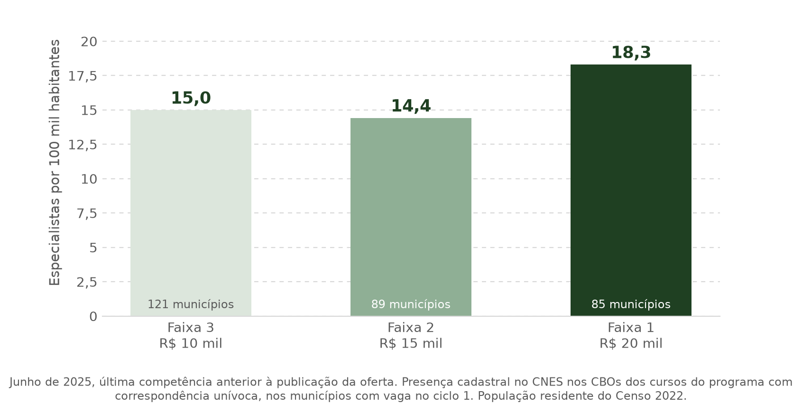
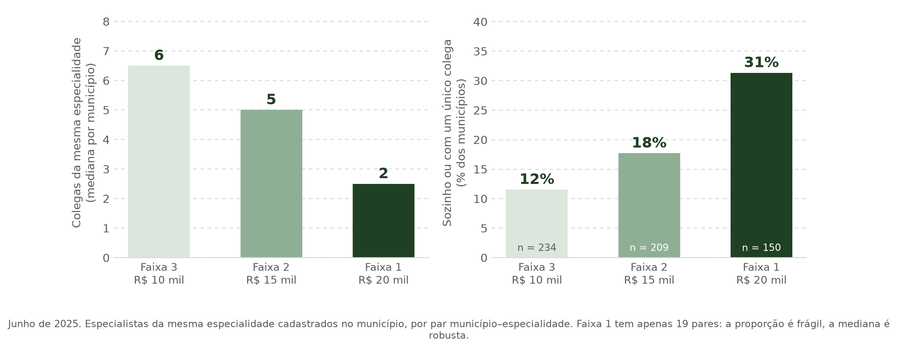
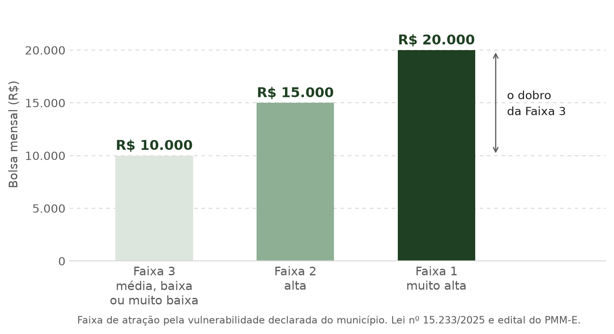

# Conteúdo da apresentação — banca 1

> Conteúdo integral da apresentação, em markdown, para ler de ponta a ponta.
> Cada seção é um slide; o cabeçalho é o título do slide. A linha em `código` é
> o rastreio de seção, exibido fora do título.
> **Atualização:** 9 de setembro de 2026.

---

## 1 — Capa

`sem rastreio`

# Desvantagens territoriais na escolha locacional de médicos especialistas

### Um modelo microeconômico para o preenchimento de vagas do Programa Mais Médicos Especialistas

Autoria · instituição · data da banca

---

## 2 — Sumário

`sem rastreio`

**Parte I — Introdução**
1. Motivação
2. Pergunta

**Parte II — Teoria**
3. Literatura teórica
4. Modelo microeconômico
5. Hipóteses

**Parte III — Empiria**
6. Viabilidade empírica

---

# Parte I — Introdução

## 3 — Faltam especialistas justamente onde trabalhar é mais difícil

`Parte I · Motivação · 1 de 3`

Quando um médico decide onde clinicar, o município vulnerável chega com quatro
desvantagens. Duas delas nós medimos:

**A oferta é escassa onde a vulnerabilidade é alta.** Nos municípios que
receberam vaga, havia **16,0 especialistas por 100 mil habitantes** onde a bolsa
seria de R$ 10 mil e **7,3** onde seria de R$ 20 mil — menos da metade, antes de
o programa começar.

**E quem vai trabalha sozinho.** O especialista que fosse para um município de
Faixa 1 encontraria **2 colegas da sua especialidade**, contra 5 na Faixa 3. Em
**42%** dos casos seria o único, ou teria um único colega — sem escala, sem
segunda opinião, sem retaguarda para o caso difícil.

**As outras duas desvantagens a literatura documenta, e nossos dados não
alcançam:** a distância da família e o isolamento; e a ausência de mercado
privado local, que faz a remuneração colapsar no valor da bolsa, sem a
complementação de renda que o médico teria na capital.

**Fontes:** CNES, competência 06/2025, CBOs dos 10 cursos do programa com
correspondência unívoca curso–CBO, 295 municípios com vaga no ciclo 1;
população residente do Censo 2022 (IBGE). Faixa 1 tem 19 pares
município–especialidade: a mediana é robusta, a proporção é frágil.

---

## 4 — O PMM-E paga mais onde a vulnerabilidade é maior

`Parte I · Motivação · 2 de 3`

O Mais Médicos Especialistas (Lei nº 15.233/2025) paga uma **bolsa-formação
mensal** por vaga — 20 horas semanais em estabelecimento do SUS, por até 12
meses. O valor não é uniforme: depende da vulnerabilidade do município.

**Como o valor é definido, em três passos:**

1. **O índice.** O IVS 2010 do Ipea resume, em um número de 0 a 1, dezesseis
   indicadores do Censo 2010, em três dimensões: infraestrutura urbana
   (saneamento, lixo, tempo de deslocamento), capital humano (mortalidade
   infantil, analfabetismo, crianças fora da escola) e renda e trabalho
   (pobreza, desemprego, informalidade).
2. **A categoria.** O Ipea corta o índice em cinco faixas: muito baixa
   (até 0,200), baixa (0,201–0,300), média (0,301–0,400), alta (0,401–0,500) e
   muito alta (acima de 0,500).
3. **O valor.** O edital de 2025 agrupou as cinco categorias em três faixas de
   bolsa.

| Categoria de IVS | Faixa | Bolsa mensal |
|---|:---:|---:|
| muito alta | 1 | R$ 20.000 |
| alta | 2 | R$ 15.000 |
| média, baixa ou muito baixa | 3 | R$ 10.000 |

A bolsa, portanto, não remunera o médico pelo que ele produz nem pelo mercado
local: **remunera o lugar**. Duas ressalvas: a categoria que vale é a publicada
na vaga, e em **177 dos 368 municípios** do ciclo 1 ela não coincide com a que
se obtém aplicando os cortes do Ipea ao IVS local; e a grade mudou em 2026,
quando a categoria *alta* passou à Faixa 1.

**Fontes:** Lei nº 15.233/2025; Edital SGTES/MS nº 3/2025 e retificação;
Chamamento SGTES/MS nº 1/2026; Ipea, *Atlas da Vulnerabilidade Social nos
Municípios Brasileiros* (2015).

---

## 5 — Pagar mais funciona?

`Parte I · Motivação · 3 de 3`

| Estudo | País e desenho | Achado |
|---|---|---|
| Dal Bó, Finan & Rossi (2013), *QJE* | México — salário anunciado **sorteado** entre 106 postos de um concurso público real | Salário 33% maior eleva a aceitação da vaga em **15 p.p.** Em postos a mais de 200 km, a aceitação sobe de **25% para cerca de 80%** — e o aumento **anula** a rejeição a municípios de IDH baixo |
| Scott et al. (2013), *Soc Sci Med* | Austrália — experimento de escolha discreta, 3.727 clínicos gerais | **65% não mudariam de lugar por nenhum pacote oferecido.** Quem mudaria exige de **37%** (cidade de 5 a 20 mil hab.) a **130%** da renda anual (pior posto) |
| Costa, Nunes & Sanches (2024), *REStat* | Brasil — modelo estrutural de escolha discreta, generalistas formados entre 2001 e 2013 | Oferta **inelástica**: elasticidade-salário em torno de **0,4** nas metrópoles e **0,7** no interior. Elevar em **50%** o salário público no interior do N/NE corrige apenas **12,4%** do desequilíbrio, a **US$ 15,7 mi por ponto percentual** — contra **US$ 2,2 a 5,1 mi** das cotas por local de nascimento, que corrigem **63,8%** |
| Pathman, Konrad & Ricketts (1992), *JAMA* | EUA — coorte de 9 anos, 412 médicos em clínicas rurais | Oito anos depois, **12%** dos médicos com bolsa e obrigação de serviço seguiam na clínica original, contra **39%** dos que foram sem obrigação |

**O dinheiro move a chegada, e move mais justamente onde o posto é pior.** É a
aposta do PMM-E, e ela tem respaldo experimental.

**Mas o preço é alto.** A literatura estima um prêmio de 35% a 65% da renda para
deslocar um médico para área remota. O degrau do PMM-E — R$ 5 mil sobre
R$ 10 mil, ou **+50%** — cai dentro dessa faixa, o que torna a pergunta empírica
e não retórica. Ressalva: os prêmios da literatura são sobre a **renda total**,
e a bolsa cobre 20 horas semanais.

**E no PMM-E a bolsa maior não ordenou o preenchimento.** Das 1.295 vagas
estabelecimento–curso da primeira chamada, 30,3% tiveram alguma confirmação ou
homologação: **31,6% na Faixa 1, 37,4% na Faixa 2 e 23,6% na Faixa 3.**

**Fontes:** referências citadas na tabela; quadro de vagas e resultados do ciclo
1, chamada 1 (Ministério da Saúde, 2025).

---

## 6 — Pergunta

`Parte I · Pergunta`

> **Maiores bolsas do PMM-E para municípios mais vulneráveis compensam suas
> desvantagens territoriais na atração de médicos especialistas?**

---

# Parte II — Teoria

## 7 — Três primitivas teóricas

`Parte II · Literatura teórica`

| Referência | Ideia central | Equação original |
|---|---|---|
| **Moehling, Niemesh, Thomasson & Treber (2020)**, eq. 1, p. 184 | O médico escolhe a localidade que maximiza o valor presente do rendimento real, líquido do custo não pecuniário de viver ali | $\arg\max_{i \in I} \sum_t \delta^t \left[ \dfrac{\mathbb{E}(w_{it}^{(s)})}{p_{it}} - c_{it}^{(s)} \right]$ |
| **Choné & Ma (2011)**, eq. 1, p. 232 | A utilidade do médico soma a renda, subtrai o custo de atender e soma o benefício ao paciente, ponderado pelo altruísmo | $U = R - C(q; L, K) + \alpha B(q)$ |
| **Reinhardt (1972)**, *REStat* 54(1) | O produto do consultório depende das horas do médico e de um vetor de outros insumos — pessoal auxiliar e capital instalado | $Q = f(H, X_1, X_2, \ldots, X_n)$ |
| **Redding & Rossi-Hansberg (2017)**, eq. 24, p. 28 | A utilidade de trabalhar em um lugar depende do salário, das amenidades e do custo de moradia locais | $u_{nio} = \dfrac{z_{nio} B_n w_i}{\kappa_{ni} Q_n^{1-\beta}}$ |

---

## 8 — A decisão locacional do médico

`Parte II · Modelo microeconômico · 1 de 2`

Adaptando Moehling et al. (2020), o médico $i$ escolhe o município $m$ que
maximiza o valor presente líquido da carreira:

$$V_{im} = \sum_t \delta^t \left[ \frac{\mathbb{E}(w_{imt} \mid B_m)}{p_{mt}} - c_{im} \right] + \varepsilon_{im}, \qquad m_i^{\ast} \in \arg\max_{m \in \mathcal{M} \cup \{0\}} V_{im}$$

| Termo | Leitura |
|---|---|
| $\mathbb{E}(w_{imt} \mid B_m)$ | A remuneração esperada tem duas partes: a bolsa $B_m$, fixada pela regra, e o que o médico obtém no **mercado local**, $w^{\text{priv}}_m$. Na capital, $w = B + w^{\text{priv}}$; no interior isolado, sem demanda privada, $w \to B$. A bolsa precisa compensar também a renda privada que o médico deixa de ganhar |
| $p_{mt}$ | O que importa é a remuneração **real**, deflacionada pelo custo de vida local |
| $c_{im}$ | Tudo o que torna estar naquele município custoso e não é pago em dinheiro |

A alternativa $m = 0$ é ficar fora do programa. A vaga em $m$ é aceita quando
$V_{im} \geq V_{i0}$.

---

## 9 — O custo de estar ali

`Parte II · Modelo microeconômico · 2 de 2`

$$c_{im} = \underbrace{\phi(\text{dist}_{im}) - \gamma A_m + \theta_i^{\text{rural}}}_{\text{geográfico}} + \underbrace{C(q; L_m, K_m) - \alpha_i B(q; L_m, K_m)}_{\text{laboral líquido}}$$

| Componente | Sinal | Significado |
|---|:---:|---|
| $\phi'(\text{dist})$ | $> 0$ | Afastar-se da família custa, e custa mais a cada quilômetro |
| $-\gamma A_m$ | $< 0$ | Amenidade urbana compensa |
| $C(q)$ | $C' > 0,\ C'' > 0$ | Atender cansa, e cansa de forma crescente |
| $\alpha_i B(q)$ | $B' > 0,\ B'' < 0$ | Curar dá satisfação, ponderada pelo altruísmo $\alpha_i$ |

Equipe ($L$) e capital instalado ($K$) atuam duas vezes — reduzem o cansaço,
$\partial C / \partial K < 0$, e ampliam o benefício produzido,
$\partial B / \partial K > 0$ — de modo que $\partial c / \partial K < 0$ por
dois caminhos. Como no município vulnerável $L$ e $K$ são baixos, **o mesmo
lugar que paga mais é o que impõe maior custo laboral**.

---

## 10 — Duas hipóteses

`Parte II · Hipóteses`

Escrevendo o custo latente como função da vulnerabilidade,
$c_{im} = c_0(IVS_m) + \eta_i$, o médico aceita a vaga em $m$ quando

$$\frac{B_m + w^{\text{priv}}_m}{p_m} - c_0(IVS_m) \geq \bar{v}_i$$

A vaga é preenchida se existir ao menos um candidato para quem a desigualdade
vale. Derivando:

| | Hipótese | Derivada |
|:---:|---|---|
| **H1** | Maior remuneração real aumenta a probabilidade de preenchimento da vaga | $\dfrac{\partial \Pr(\text{preenchimento}_m)}{\partial (B_m / p_m)} > 0$ |
| **H2** | Maior custo locacional reduz a probabilidade de preenchimento da vaga | $\dfrac{\partial \Pr(\text{preenchimento}_m)}{\partial c_m} < 0$ |

Na fronteira entre duas faixas, as duas se encontram em uma única condição: o
preenchimento do lado mais vulnerável exige que o degrau monetário supere o
degrau de custo,

$$\frac{\Delta B_m}{p_m} > \Delta c_0, \qquad \Delta B_m = \text{R\$ } 5.000$$

---

# Parte III — Empiria

## 11 — Viabilidade empírica

`Parte III`

**Como cada hipótese aparece nos dados que temos**

| | Objeto do modelo | Variável observada | Fonte |
|:---:|---|---|---|
| **Desfecho** | preenchimento da vaga | alguma confirmação ou homologação na célula estabelecimento–curso | quadro de vagas do ciclo 1 — 1.295 células, 368 municípios |
| **H1** | remuneração $B_m$ | faixa anunciada na vaga: R$ 10, 15 ou 20 mil | edital |
| **H2** | custo $c_m$ | IVS 2010 e seus três sub-índices; tipologia territorial; estoque prévio de especialistas no município | Ipea; REGIC 2018; CNES mensal, jun/2024 a jul/2026 |

**O desafio.** A bolsa é função da categoria de IVS: **não existe município com
bolsa alta e vulnerabilidade baixa**. Por construção da regra, $B_m$ e
$c_0(IVS_m)$ são colineares, e uma regressão que inclua os dois separa H1 de H2
apenas por extrapolação funcional.

A saída é comparar municípios **na fronteira entre faixas**, onde a bolsa salta
R$ 5 mil e a vulnerabilidade é praticamente a mesma. Isso exige recuperar o
escore administrativo que o Ministério de fato aplicou — a faixa publicada não
reproduz os cortes do Ipea em 177 dos 368 municípios. Até lá, o que se estima é
**gradiente, não efeito da bolsa**.
