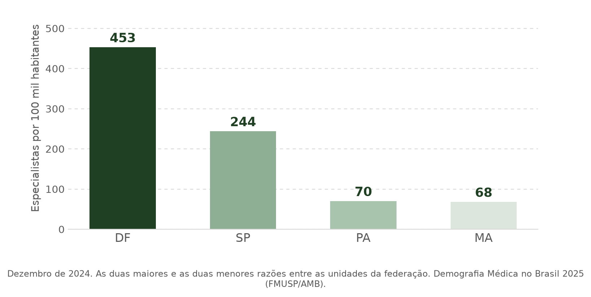
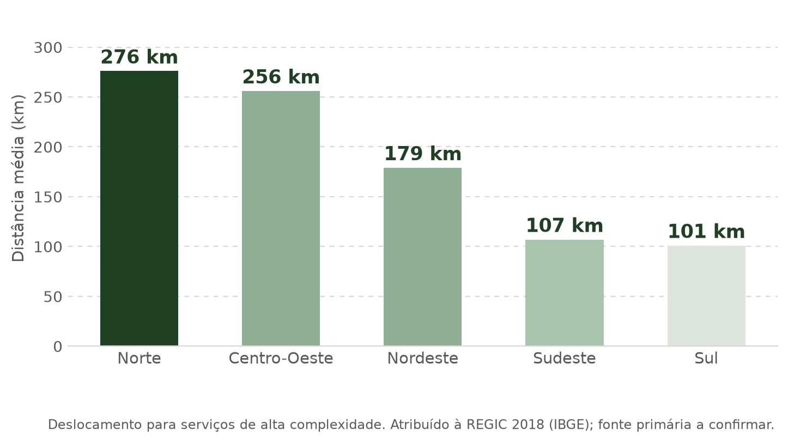
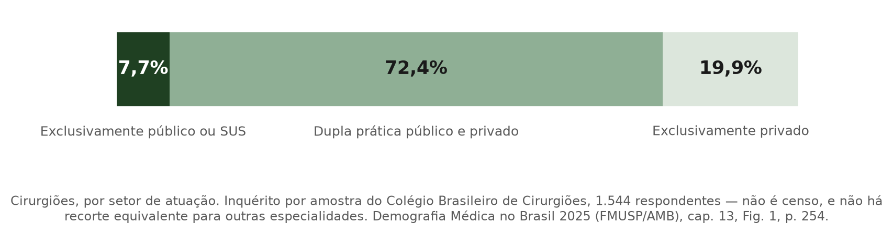

> [!IMPORTANT]
> **Como ler este arquivo.** O deck começa e termina nos comentários
> `deck:inicio` e `deck:fim`, invisíveis na renderização. Entre eles, **cada
> cabeçalho é um slide, e só os cabeçalhos são slides**:
>
> | Nível | O que é | Uso |
> |:---:|---|---|
> | `#` | **slide**, layout de capa | a capa e as três divisórias de seção |
> | `##` | **slide**, layout de conteúdo | os treze slides de conteúdo |
> | `###` | **build** dentro do slide | um `\only<n>` no Beamer, um clique no Slidev |
>
> Um slide sem `###` é de tela única. Um slide com três `###` é **um** frame com
> **três** builds, não três frames: a contagem de slides não muda.
>
> Abaixo do cabeçalho do slide, a linha em `código` é o **rastreio** do rodapé,
> no formato `Seção · Rótulo do roteiro`. Os rótulos são os do roteiro acordado
> (Problema, Política, Efeitos, …) e os títulos são as manchetes de tela.
>
> **O que não vai à tela:** a linha `**Fontes:**`, que vira nota de rodapé
> pequena, e todo bloco marcado `**Nota de produção.**`, que é instrução para
> quem monta o deck. Tudo o mais no corpo do slide é conteúdo de tela.
>
> **Orçamento de frame.** Cada build foi dimensionado para caber em cerca de
> **14 linhas de tela**. Quatro builds foram compilados de verdade em Beamer
> 16:9, 11 pt, tema Warsaw, todos **sem Overfull** e com folga vertical: a tabela
> das duas cláusulas e as duas figuras lado a lado no slide 5, o diagrama da
> teoria da mudança como cadeia TikZ — que em 17/09/2026 passou ao slide 8 — e a
> tabela do que falta no slide 17.
>
> Os decks em [`deck_beamer/`](deck_beamer/) e [`deck_slidev/`](deck_slidev/)
> são **derivados** deste arquivo: divergência entre deck e documento é erro do
> deck. Em 17/09/2026 os decks ainda estão na estrutura de **15 slides**, duas
> estruturas atrás — divergência conhecida e datada, a resolver na próxima
> reconstrução.

## Mapa da apresentação

| # | Layout | Builds | Seção | Rótulo do roteiro | Título na tela |
|:---:|:---:|:---:|:---:|---|---|
| 1 | capa | 1 | — | — | Capa |
| 2 | conteúdo | 1 | — | Sumário | Sumário |
| 3 | capa | 1 | 1 | — | **Motivação e Pergunta** |
| 4 | conteúdo | 3 | 1 | Problema | O especialista está longe do interior — e quase nunca é só do SUS |
| 5 | conteúdo | 3 | 1 | Política | A bolsa é do município, não do médico nem da especialidade |
| 6 | conteúdo | 2 | 1 | IVS e suas dimensões | Quanto maior o IVS, mais difícil é exercer ali |
| 7 | conteúdo | 3 | 1 | Efeitos | O programa já deu sinais; a literatura aponta para os dois lados |
| 8 | conteúdo | 2 | 1 | Pergunta de Pesquisa | A pergunta que organiza o trabalho |
| 9 | capa | 1 | 2 | — | **Literatura Teórica e Modelo Microeconômico** |
| 10 | conteúdo | 1 | 2 | Literatura teórica usada | Três tradições sustentam uma equação |
| 11 | conteúdo | 2 | 2 | Modelo microeconômico conjunto | A escolha locacional maximiza a renda real líquida |
| 12 | conteúdo | 3 | 2 | Custo da localidade | O custo da localidade tem duas metades: o lugar e o trabalho |
| 13 | conteúdo | 2 | 2 | Remuneração da localidade | A bolsa é o piso da remuneração, não o total |
| 14 | capa | 1 | 3 | — | **Hipótese e Viabilidade Empírica** |
| 15 | conteúdo | 3 | 3 | Implicações para o PMM-E | No PMM-E, a regra fixa a remuneração e o IVS organiza o custo |
| 16 | conteúdo | 1 | 3 | Hipótese do trabalho | Mais remuneração real, mais vagas preenchidas |
| 17 | conteúdo | 2 | 3 | Disponibilidade de dados | Há dado para quase todo termo — e sabemos quais faltam |

---

<!-- deck:inicio -->

# Remuneração como incentivo limitado

### Um modelo de escolha racional para o Programa Mais Médicos Especialistas

**Grupo 2** · Bernardo Gomes · Bruno Manta · Felipe Barros · Felipe Marques ·
Gabriel Benegra · Kauã Santos · Vinicius Sbruzzi

`sem rastreio`

> [!NOTE]
> **Nota de produção.** "Incentivo limitado" antecipa uma conclusão que esta
> banca não entrega. Alternativa neutra, se a banca preferir: *"Quanto vale o
> lugar? Um modelo de escolha locacional para o PMM-E"*. Mantido o título do
> grupo até decisão do autor.

---

## Sumário

`sem rastreio`

1. **Motivação e Pergunta**
2. **Literatura Teórica e Modelo Microeconômico**
3. **Hipótese e Viabilidade Empírica**

> [!NOTE]
> **Nota de produção.** O sumário aparece uma vez. As divisórias de seção
> substituem as quatro repetições do deck anterior.

---

# 1. Motivação e Pergunta

### O problema, a política, o índice, os efeitos e a pergunta

`sem rastreio`

---

## O especialista está longe do interior — e quase nunca é só do SUS

`1. Motivação e Pergunta · Problema`

### Onde eles estão

> **A escassez é territorial — e onde há menos especialista o paciente anda mais.**

### De quem é o tempo desse especialista

**O SUS não compra a carreira do especialista. Compra uma fração dela** — e
disputa o resto com o mercado privado. A bolsa do PMM-E compra **20 horas**
dessa fração.

### E quais especialistas faltam

- Maiores ofertas do ciclo 1: **endoscopia digestiva alta**, **colonoscopia** e
  **anestesiologia**.
- Em 2025 o Ministério declarou **urgência em saúde pública por 24 meses** pelo
  tempo de espera, e lançou o **Agora Tem Especialistas**, de que o PMM-E é o
  braço de provimento.

**Fontes:** Scheffer et al., *Demografia Médica no Brasil 2025* (FMUSP/AMB),
cap. 11 e cap. 13, Fig. 1, p. 254; deslocamento: origem provável na REGIC 2018
(IBGE), **a confirmar**; Portaria GM/MS nº 7.061/2025; Edital SGTES/MS nº
3/2025, Tabela 3; `output/aquisicao/quadro_vagas_tratamento.parquet`; figuras
por `scripts/apresentacao/gerar_figuras_banca1.py`.

> [!NOTE]
> **Nota de produção — as três figuras.** Desde 17/09/2026 as três saem do
> pipeline, e o texto que elas substituem saiu da tela: os quatro marcadores do
> retrato nacional, a tabela dos três percentuais de atuação e os dois
> marcadores de cursos. A ressalva de cobertura do inquérito — **1.544
> cirurgiões, não censo** — continua **na tela**, dentro do rodapé da figura.
> A figura de UF é dos **extremos**, não das 27 unidades: só quatro UFs têm
> valor em fonte registrada. A do deck do grupo mostrava 16 barras e **não é
> usável** — ver a pendência 1.

> [!NOTE]
> **Nota de produção — o que não dá para dizer.** A frase "apenas 10% dos
> especialistas atendem no SUS" **não se sustenta**: é fala do ministro em
> debate no Senado, 24/09/2025, sem metodologia, e a fonte primária a contradiz
> — somando dupla prática e exclusivos do público, **80,1%** dos cirurgiões
> atendem SUS. O defensável é o inverso: **exclusividade** ao SUS é que é rara.
> O recorte **por especialidade não existe** em fonte pública; o estudo só o traz
> para cirurgiões, por amostra do Colégio Brasileiro de Cirurgiões, não por censo.

---

## A bolsa é do município, não do médico nem da especialidade

`1. Motivação e Pergunta · Política`

### O que o programa oferece

**Lei nº 15.233/2025**, para reduzir o **tempo de espera** do SUS.
Bolsa-formação **sem vínculo**, até **12 meses**, **20 h semanais**, **RQE**
exigido, com supervisão de instituição formadora — **igual em toda vaga**. O
**valor** é a única coisa que varia. Ciclo 1, jul/2025: **1.295 células**
estabelecimento–curso em **368 municípios**, **678** com vaga imediata.

> **O programa não forma especialista: exige RQE e compra 20 horas de quem já é.**

### Quem fixa o valor

**Não fixam:** especialidade, curso, estabelecimento, carga, produção,
desempenho — nem o médico. **Fixa:** o **município**, e só ele.

| Cláusula | O que fixa o valor | Situação |
|---|---|---|
| **11.1.4** | categoria de **IVS 2010** do Ipea: muito alta → **R$ 20 mil**, alta → **R$ 15 mil**, demais → **R$ 10 mil** | pública |
| **11.1.3** | *"critérios de **localização e vulnerabilidade** definidos de acordo com a faixa de atração definida no **Anexo IV**"* | **não público** |

Em **177 dos 368** municípios a faixa publicada está **acima** da categoria de
IVS; **zero** abaixo.

> **O IVS é o piso da bolsa, não o critério dela.**

### Para onde a regra manda o dinheiro

**Por habitante**, a bolsa maior não vai para onde falta mais. **Em colegas**,
vai: a mediana cai de **6,5** para **2,5**.

> **A Faixa 1 compensa isolamento, não cobertura.**

**Fontes:** Lei nº 15.233/2025, art. 21; Edital SGTES/MS nº 3/2025, itens 1.1,
1.2.1, 1.2.5, 11.1 a 11.4; Ipea, *Atlas da Vulnerabilidade Social* (2015); CNES
06/2025 e Censo 2022 (IBGE); `output/aquisicao/quadro_vagas_tratamento.parquet`;
figuras por `scripts/apresentacao/gerar_figuras_banca1.py`.

> [!NOTE]
> **Nota de produção — o que saiu daqui em 17/09/2026.** O slide tinha **cinco
> builds** e passou a **três**. Saíram da tela: o diagrama de **teoria da
> mudança**, que foi para o slide da pergunta de pesquisa — o **slide 8** na
> numeração de 17 slides —, onde faz o trabalho de tornar a
> pergunta inevitável; a frase sobre nenhuma célula município–curso aparecer com
> mais de uma faixa, que é conferência, não argumento; e as duas notas de bolso
> — a **contribuição previdenciária** do item 11.2 e o **adicional** da Lei
> (art. 22-D, §4º) para Amazônia Legal, territórios indígenas e alta
> vulnerabilidade, **não regulamentado** no ciclo 1. As duas continuam
> registradas em `auditorias/01_regra_institucional.md` e servem para responder
> à banca; nenhuma vira afirmação sobre o tamanho líquido do degrau, que
> depende do teto de contribuição e não foi calculado.

> [!NOTE]
> **Nota de produção — três correções do PR de ajuste estrutural.** (1) **D1**:
> "1.295 vagas" virou **1.295 células** estabelecimento–curso, com as **678**
> vagas imediatas ditas na tela — chamar célula de vaga reintroduzia o
> denominador que o portão A1 rejeitou. (2) **F2**: o pacote formativo entrou no
> slide como o que **não** varia — é o que sustenta, mais adiante, que o
> contraste de R$ 5 mil compara valor com pacote constante dos dois lados.
> (3) **F5**, **pendente de decisão do autor**: a retaguarda é medida no
> **município**, mas 42,6% das células estão em estabelecimento de gestão
> estadual e 93 dos 460 CNES têm "REGIONAL" no nome — o incentivo é fixado pelo
> IVS do município-sede e a clientela é regional. Cabe uma linha no build 3
> ("a medida é municipal; para hospital regional a fronteira relevante é
> outra") ou uma limitação declarada. Não entrou na tela sem essa decisão.

> [!NOTE]
> **Nota de produção — o IVS ganhou slide próprio em 17/09/2026.** A explicação
> do que é o índice e das suas três dimensões estava no slide das implicações,
> na seção 3, e o autor pediu que viesse para cá: o valor da bolsa é fixado por
> ele, e a banca precisa saber o que ele mede antes de ver para onde o dinheiro
> vai. Como este slide já era o mais carregado do deck, a explicação entrou no
> **slide 6**, e não como quarto build daqui.

---

## Quanto maior o IVS, mais difícil é exercer ali

`1. Motivação e Pergunta · IVS e suas dimensões`

### O que o índice mede

**IVS 2010, do Ipea** — do *Atlas da Vulnerabilidade Social nos Municípios
Brasileiros*. Resume **16 indicadores** do **Censo 2010** em um número de **0 a
1**: quanto maior, mais vulnerável. Existe para **todos** os municípios, e é a
**parte pública** da regra do valor — a outra, a do Anexo IV, não é.

As categorias do item 11.1.4 são as do próprio Atlas: **muito alta** acima de
**0,500**, **alta** entre **0,400** e **0,500**, e **demais** abaixo disso.

### As três dimensões

| Dimensão | Indicadores | O que significa para quem vai atender ali |
|---|---|---|
| **Infraestrutura urbana** | saneamento, coleta de lixo, tempo de deslocamento | morar e circular custam mais |
| **Capital humano** | mortalidade infantil, analfabetismo, mães adolescentes | população mais doente, e serviço mais precário |
| **Renda e trabalho** | extrema pobreza, desemprego, informalidade | quase não há mercado privado para complementar a renda |

> **As três apontam para o mesmo lado: quanto maior o índice, mais caro é viver
> ali e mais duro é atender ali.**

**Fontes:** Ipea, *Atlas da Vulnerabilidade Social nos Municípios Brasileiros*
(2015) — 16 indicadores do Censo 2010 em três sub-índices, e as faixas de
classificação; Edital SGTES/MS nº 3/2025, item 11.1.4;
[`modelo_micro.md`](../../02_teoria/modelo_micro.md), §3.1.

> [!NOTE]
> **Nota de produção — a monotonicidade é decisão do autor, de 17/09/2026.** O
> documento canônico trata o sinal de $c_0'(IVS)$ como **ambíguo**: em
> [`modelo_micro.md`](../../02_teoria/modelo_micro.md), §3.1, o sub-índice de
> capital humano opera nos dois sentidos, porque carência sanitária eleva o
> benefício de atender ao mesmo tempo que sinaliza falta de insumo. O autor
> pediu que a apresentação **removesse a nuance** e dissesse o custo crescente no
> índice. É o que a tela faz, aqui e nos slides 15 e 17. A divergência com o
> documento canônico está registrada como pendência 9 e **não** foi resolvida
> mudando a teoria.

---

## O programa já deu sinais; a literatura aponta para os dois lados

`1. Motivação e Pergunta · Efeitos`

### O que o ciclo 1 mostra

Das **1.295 células** da primeira chamada, **393 (30,3%)** tiveram alguém
confirmado ou homologado.

### A leitura

- **Por faixa, não há ordem.** Pagar o dobro (31,6%) não preencheu mais que
  pagar uma vez e meia (37,4%).
- **Por território, há.** De **44,9%** no metropolitano a **20,5%** no interior
  remoto.

> **Isto é descrição, não efeito.** As faixas diferem em muito mais que na
> bolsa, e território prevê melhor que ela. Linguagem correta: **gradiente** e
> **associação**.

### A literatura aponta para os dois lados

| Pagar mais funciona | Pagar mais não basta |
|---|---|
| **México, salário sorteado.** Em 106 postos, salário **33% maior** elevou a aceitação em **15 p.p.**; a mais de 200 km da cidade natal, de 25% para cerca de **80%**, sem perda de qualificação. | **Brasil, o programa-irmão.** No Mais Médicos, **+15,1** médicos do programa por 100 mil viraram **+5,7** de expansão **líquida**. O resto substituiu quem já estava lá. |
| **O degrau tem o tamanho que a literatura pede.** O prêmio exigido para um posto pior vai de **37% a 64%** da renda anual, e a elasticidade da oferta no interior é **0,7**. O degrau do PMM-E é **+50%**. | **Austrália, a maioria não vai por preço.** De 3.727 clínicos, **65%** ficaram onde estavam em **todos** os cenários. Para o pior posto, quem mudaria pedia **130%** da renda anual. |

**Ressalva:** os percentuais são sobre a **renda total** do médico; a bolsa
remunera **20 horas**.

> **A evidência não decide se um degrau de R$ 5 mil basta.**

**Fontes:** Dal Bó, Finan & Rossi (2013), *QJE*; Scott et al. (2013), *Soc Sci
Med* 96; Hone et al. (2020), *BMC HSR* 20:873. Ciclo 1:
`output/tema_trabalho/`, módulos A4 e A5.

> [!NOTE]
> **Nota de produção — dois de cada lado, e o que saiu.** A tabela tinha dois a
> favor e **quatro** contra. Ficaram os dois que atacam elos distintos: a
> **expansão líquida** (Hone) e a **não resposta a preço** (Scott). Saíram da
> tela, e ficam de reserva para pergunta da banca: **Costa, Nunes & Sanches
> (2024)**, *REStat* — subir 50% o salário público no interior do N e NE
> corrige **12,4%** do desequilíbrio a **US$ 15,7 mi** por ponto, contra
> **63,8%** por US$ 2,2 a 5,1 mi reservando vaga na faculdade para quem nasceu
> ali; e **Pathman, Konrad & Ricketts (1992)**, *JAMA* — oito anos depois,
> **12%** dos que foram por obrigação seguiam lá, contra **39%** dos que foram
> sem. Costa et al. continua citado no slide 12.

> [!NOTE]
> **Nota de produção — o que saiu da leitura.** Saíram dois números que são
> **saída de estimação**, e a banca 1 não apresenta resultado de estimação:
> **+0,50** especialista cadastrado por célula com atração em mar/2026, erro
> padrão **0,234**; e o contraste ajustado de **+20,9 p.p.** do estrato
> metropolitano. O gradiente bruto por território continua na tela, na figura e
> na leitura. A série mensal por faixa é reprodutível e pode entrar como
> contexto descritivo; a tabela de inclinações pré/pós do deck do grupo, não —
> motivo e critério de fechamento na **pendência 4**.

---

## A pergunta que organiza o trabalho

`1. Motivação e Pergunta · Pergunta de Pesquisa`

### A cadeia que a política supõe

**Verde e cheia:** está em ato oficial. **Laranja e tracejada:** suposição.
Nem o elo cheio seguinte assegura **oferta líquida**: o edital só veda
substituição de quem já está lá.

### A pergunta

> ### O incentivo financeiro oferecido pelo PMM-E funciona para atrair especialistas para regiões mais vulneráveis?

Dois objetos, um contra o outro:

- o **preço** que a política pôs sobre a vulnerabilidade, o degrau de **R$ 5 mil**;
- a **desvantagem** que esse preço pretende compensar.

A margem observada é o **preenchimento da vaga** — o terceiro elo da cadeia, e o
primeiro elo suposto é a hipótese do trabalho. Permanência fica fora desta banca.

**Fontes:** Lei nº 15.233/2025; Edital SGTES/MS nº 3/2025, item 1.2.5;
[`01_pergunta_escopo/15`](../../01_pergunta_escopo/15_incentivos_ivs_provimento_duradouro.md).

> [!NOTE]
> **Nota de produção.** O diagrama veio do slide 5 em 17/09/2026. É onde ele
> trabalha: separa os elos **escritos em ato oficial** dos que são **suposição
> do programa**, e é isso que torna a pergunta inevitável em vez de retórica.
> Formulação canônica equivalente, em
> [`01_pergunta_escopo/15`](../../01_pergunta_escopo/15_incentivos_ivs_provimento_duradouro.md):
> *"maiores bolsas do PMM-E para municípios mais vulneráveis compensam suas
> desvantagens territoriais na atração de médicos especialistas?"*. No Beamer o
> diagrama é a cadeia TikZ horizontal de seis nós em `font=\tiny`, compilada em
> 16/09/2026 sem Overfull.

---

# 2. Literatura Teórica e Modelo Microeconômico

### De onde vem a equação de escolha, e o que há dentro do custo

`sem rastreio`

---

## Três tradições sustentam uma equação

`2. Literatura e Modelo · Literatura teórica usada`

| Trabalho | Entra no modelo como | Equações originais |
|---|---|---|
| **Moehling, Niemesh, Thomasson & Treber (2020)**, eq. 1, p. 184 | escolha locacional intertemporal: o médico maximiza o valor presente do rendimento real, líquido de um custo não pecuniário | $\arg\max\limits_{i \in I} \left\{ \sum_t \delta^t \left[ \frac{\mathbb{E}(w_{it}^{(s)})}{p_{it}} - c_{it}^{(s)} \right] \right\}$ |
| **Redding & Rossi-Hansberg (2017)**, eq. 24, p. 28 | equilíbrio espacial: amenidades e custo de moradia determinam a atratividade do lugar | $u_{nio} = \dfrac{z_{nio}\, B_n\, w_i}{\kappa_{ni}\, Q_n^{\,1-\beta}}$ |
| **Choné & Ma (2011)**, eq. 1, p. 232, com **Reinhardt (1972, 1975)** | utilidade do médico com altruísmo: atender cansa e satisfaz, e os dois passam por equipe e capital | $U = R - C(q; L, K) + \alpha B(q)$ |

Em Redding & Rossi-Hansberg, o numerador é o que **atrai** — salário $w_i$,
amenidades $B_n$, gosto pessoal $z_{nio}$ — e o denominador é o que **repele**:
deslocamento $\kappa_{ni}$ e moradia $Q_n$.

> **Atenção ao símbolo $B$.** Aqui $B_n$ é **amenidade** e $B(q)$ é **benefício
> ao paciente**. A **bolsa** é $B_m$, e só aparece no slide 13.

**Fontes:** Moehling et al. (2020), *Cliometrica* 14, p. 184, eq. 1; Redding &
Rossi-Hansberg (2017), *Annual Review of Economics* 9, p. 28, eq. 24; Choné & Ma
(2011), *Annals of Economics and Statistics* 101/102, p. 232, eq. 1; Reinhardt
(1972, 1975); [`modelo_micro.md`](../../02_teoria/modelo_micro.md), §1, §2 e §3.2.

> [!NOTE]
> **Nota de produção — slide novo em 17/09/2026.** O autor pediu que as
> **equações originais** saíssem do slide do custo e viessem para um slide
> próprio, no formato da tabela das três tradições que havia no slide 9 da
> estrutura anterior, até 16/09/2026, com a coluna **"Equações originais"** no
> lugar de "Primitiva que fornece". O slide do custo ficou só com as equações que
> **inferimos** delas, para que a explicação termo a termo caiba na tela.

> [!NOTE]
> **Nota de produção — correção de referência, 17/09/2026.** Até aqui o deck
> citava Choné & Ma (2011) como *IJHCFE* 11. A referência canônica em
> [`modelo_micro.md`](../../02_teoria/modelo_micro.md), §5, é *Annals of
> Economics and Statistics* 101/102, 229–256, e é ela que contém a p. 232 da
> equação citada. Corrigido aqui e nos slides seguintes.

---

## A escolha locacional maximiza a renda real líquida

`2. Literatura e Modelo · Modelo microeconômico conjunto`

### A equação de escolha

O médico $i$ escolhe o município $m$ que maximiza o valor presente do rendimento
**real**, líquido do custo não pecuniário de viver e atender ali:

$$\arg\max_{m \in M} \left\{ \sum_t \delta^t \left[ \frac{\mathbb{E}(w_{mt}^{(s)})}{p_{mt}} - c_{im}^{(s)} \right] \right\}$$

| Termo | O que é |
|---|---|
| $m \in M$ | **municípios** candidatos |
| $\mathbb{E}(w^{(s)}_{mt})$ | remuneração esperada em $m$, no ano $t$, na especialidade $s$ |
| $p_{mt}$ | nível de preços local, o deflator |
| $c^{(s)}_{im}$ | custo **não pecuniário** de viver e atender ali |
| $\sum_t \delta^t$ | a escolha é de **carreira**, não de um mês |

### Interpretação

Deflaciona a remuneração, subtrai o custo do lugar, desconta a carreira inteira
pelo fator $\delta$ e devolve o município de maior valor.

> **Salário nominal alto não compensa preços e custos locais altos.**

Na equação original $i$ é a localidade; **daqui em diante $i$ é o médico e $m$ é
o município**, porque o custo depende de quem escolhe, e não só de onde.

Para os próprios autores, $c$ reúne *"preferences over rural or urban living …
such as proximity to family"* — uma **caixa-preta**. Os dois slides seguintes a
abrem: primeiro o **custo** do lugar, depois a **remuneração** dele.

**Fontes:** Moehling et al. (2020), *Cliometrica* 14, p. 184, eq. 1;
[`modelo_micro.md`](../../02_teoria/modelo_micro.md), §1 e §2.4.

---

## O custo da localidade tem duas metades: o lugar e o trabalho

`2. Literatura e Modelo · Custo da localidade`

### O lugar

De Redding & Rossi-Hansberg, o custo do **lugar**:

$$c^{\text{geo}}_{im} = \phi(\text{dist}_{im}) - \gamma A_m + \theta_i^{\text{rural}}$$

$\phi(\text{dist}_{im})$ é o afastamento da família, $A_m$ são as amenidades
urbanas e $\theta_i^{\text{rural}}$ é o gosto pessoal por cidade pequena — o
único termo sem sinal universal.

### O trabalho

De Choné & Ma, com Reinhardt, o custo do **trabalho**:

$$c^{\text{laboral}}_{im} = C(q; L_m, K_m) - \alpha_i B(q; L_m, K_m)$$

$C$ é o cansaço de atender $q$ pacientes, $B$ é o benefício gerado a eles e
$\alpha_i$ é o altruísmo do médico. Atender cansa de forma crescente
($C'' > 0$) e curar satisfaz de forma decrescente ($B'' < 0$): a curva do custo
líquido é um **U** — atender mais compensa até um mínimo, e depois exaure.

**Extensão deste projeto**, motivada por Reinhardt: escrever $B(q; L, K)$, e não
$B(q)$ — equipe e capital não só poupam esforço como ampliam o que o atendimento
produz.

### As três desvantagens, na visão do médico

| Desvantagem | Termo | Por que pesa | Medimos? |
|---|:---:|---|:---:|
| **Sem retaguarda** | $L_m$ | não há segunda opinião nem a quem encaminhar: cansa mais e resolve menos | sim, colegas no CNES |
| **Sem infraestrutura** | $K_m$ | falta leito, insumo e equipamento: o mesmo esforço rende menos saúde | em parte |
| **Longe da família** | $\phi(\text{dist})$ | cada quilômetro custa, e ninguém paga por ele | não |

No Brasil, entre 50 mil generalistas formados de 2001 a 2013, **a proximidade do
lugar de nascimento ou de formação é o principal fator**; salário e
infraestrutura pesam menos.

**Limitação assumida:** CNES e edital não informam a residência do profissional,
por sigilo fiscal. A unidade é o **município do estabelecimento**; a distância
entra como latente.

**Fontes:** [`modelo_micro.md`](../../02_teoria/modelo_micro.md), §2.1 a §2.3 e
§3.2, de onde vêm as duas equações inferidas; Costa, Nunes & Sanches (2024),
*REStat*; as equações originais estão no slide 10.

> [!NOTE]
> **Nota de produção — o que mudou em 17/09/2026.** Saíram daqui as duas
> **equações originais**, que foram para o slide 10, e a quarta desvantagem,
> **mercado privado ausente**, que passou ao slide 13 — é de remuneração, não de
> custo, e o autor pediu que entrasse só lá. O que sobrou nos dois primeiros
> builds é a equação inferida e a definição dos seus termos; a leitura termo a
> termo, que o autor pediu como padrão, ficou concentrada no terceiro.

---

## A bolsa é o piso da remuneração, não o total

`2. Literatura e Modelo · Remuneração da localidade`

### A remuneração total

A lei fixa a **bolsa**, não a remuneração. A bolsa compra **20 horas**; o que o
médico ganha além delas é mercado local. Por construção, a remuneração é maior
ou igual à bolsa:

$$\mathbb{E}(w_{imt} \mid B_m) = \underbrace{B_m}_{\text{fixado pela regra}} + \underbrace{w^{\text{priv}}_m}_{\text{mercado local}} \;\geq\; B_m, \qquad w^{\text{priv}}_m \geq 0$$

| | Capital ou metrópole | Interior isolado |
|---|---|---|
| **Bolsa $B_m$** | R$ 10 mil | R$ 20 mil |
| **Mercado $w^{\text{priv}}_m$** | maior | **menor — não nulo** |
| **Total $w$** | $\geq$ R$ 10 mil, e pode passar dos R$ 20 mil | $\geq$ R$ 20 mil, e perto do piso |
| **Deflator $p_m$** | custo de vida alto | supomos menor, e não é garantido: o custo logístico encarece parte da cesta |

### Interpretação

A bolsa do interior é o **dobro** da da capital, e ainda assim a **remuneração
total** pode ser **menor** lá: o que a regra acrescenta, o mercado local deixa de
acrescentar. O deflator puxa no sentido oposto, e não se sabe a priori qual força
vence.

> **Esta é a quarta desvantagem do lugar: onde o mercado privado é fino, a
> remuneração encosta no piso da bolsa.**

Pela dupla prática do slide 4, $w^{\text{priv}} > 0$ é a regra, não a exceção — o
interior isolado tem **menos** mercado, não nenhum.

A política aposta que R$ 5 mil compensam o lugar. O modelo diz que eles competem
com um mercado privado cuja escassez é, ela própria, uma desvantagem do lugar.

**Fontes:** [`modelo_micro.md`](../../02_teoria/modelo_micro.md), §3;
[`hipoteses_e_viabilidade_empirica.md`](../../02_teoria/hipoteses_e_viabilidade_empirica.md), §2;
Lei nº 15.233/2025, art. 21; Edital SGTES/MS nº 3/2025, itens 11.1.3 e 11.3.b.

> [!NOTE]
> **Nota de produção — três ajustes de 17/09/2026.** (1) O objetivo do slide
> passou a ser a **contenção legal**: a lei fixa a bolsa, e a remuneração é maior
> ou igual a ela — a desigualdade está na equação e na linha "Total" dos dois
> lados da tabela. (2) O mercado privado do interior isolado deixou de ser
> **ausente** e passou a ser **menor, não nulo**: o dado que temos é de dupla
> prática, e ele não sustenta zero. (3) O custo de vida do interior deixou de ser
> **baixo** e passou a ser **suposto menor**, com a ressalva do custo logístico na
> própria célula — vários itens da cesta são mais caros lá.

---

# 3. Hipótese e Viabilidade Empírica

### O que o modelo implica, o que se testa e o que os dados permitem

`sem rastreio`

---

## No PMM-E, a regra fixa a remuneração e o IVS organiza o custo

`3. Hipótese e Viabilidade · Implicações para o PMM-E`

### O modelo integrado

$$V_{im} = \sum_t \delta^t \left[ \frac{\mathbb{E}(w_{imt} \mid \mathbf{B}_m)}{p_{mt}} - c_{im} \right]$$

para o médico $i$ no município $m$, com
$\mathbb{E}(w \mid \mathbf{B}_m) = \mathbf{B}_m + \mathbf{w}^{\text{priv}}_m$ do
slide 13 e $c_{im} = c^{\text{geo}}_{im} + c^{\text{laboral}}_{im}$ do slide 12.

| Termo | Variável do programa | Derivada | Leitura |
|---|---|:---:|---|
| $\mathbf{B}_m$ | valor da bolsa | $\partial V/\partial \mathbf{B}_m > 0$ | é o instrumento |
| $\mathbf{w}^{\text{priv}}_m$ | mercado local, não observado | $\partial^2 V/\partial \mathbf{B}_m\, \partial \mathbf{w}^{\text{priv}} < 0$ | a bolsa vale mais onde há menos mercado |
| $p_m$ | custo de vida, por UF | $\partial V/\partial p_m < 0$ | opera contra a vulnerabilidade |
| $c_{im}$ | **IVS** e suas dimensões, do slide 6 | $c_0'(IVS) > 0$ | o custo **cresce** com o índice |

> **O que Moehling, Redding & Rossi-Hansberg e Choné & Ma não têm:** remuneração
> fixada por **regra pública sobre um índice territorial**. É só isso que a
> adaptação ao PMM-E acrescenta.

### A condição de aceitação

Distância, aluguel, mercado local e esforço clínico **não são observados**; o IVS
é. O custo do lugar entra por ele, e o que é do médico fica no desvio individual:
$c_{im} = c_0(IVS_m) + \eta_i$.

O médico $i$ aceita a vaga em $m$ quando ela supera sua melhor alternativa
$\bar{v}_i$:

$$\frac{\mathbf{B}_m + \mathbf{w}^{\text{priv}}_m}{p_m} - c_0(IVS_m) \;\geq\; \bar{v}_i$$

A vaga é preenchida se existir **ao menos um** candidato para quem isso vale.
Tudo que aumenta o lado esquerdo aumenta essa probabilidade.

### Na fronteira entre faixas

**O custo é obstáculo, não hipótese.** Ele não varia livremente: a regra do
edital o amarra à bolsa, e os dois sobem juntos. Preencher a vaga do lado mais
vulnerável da fronteira exige

$$\frac{\Delta \mathbf{B}_m}{p_m} > \Delta c_0, \qquad \Delta \mathbf{B}_m = \text{R\$ } 5.000$$

> **A pergunta da apresentação é se essa desigualdade vale.**

**Fontes:** [`modelo_micro.md`](../../02_teoria/modelo_micro.md), §2.4, §3, §3.1
e §4.1;
[`hipoteses_e_viabilidade_empirica.md`](../../02_teoria/hipoteses_e_viabilidade_empirica.md), §3;
Edital SGTES/MS nº 3/2025, item 11.1.3.

> [!NOTE]
> **Nota de produção — o que mudou em 17/09/2026.** Três ajustes pedidos pelo
> autor. (1) O **termo de erro saiu**: $V_{im}$ é escrito sem $\varepsilon_{im}$,
> porque esta banca é estritamente teórica e nenhum slide dela estima nada. A
> forma com erro continua em
> [`modelo_micro.md`](../../02_teoria/modelo_micro.md), §3. (2) **$B$ e
> $w^{\text{priv}}$ em negrito** na equação e na tabela, para separar o que a
> regra fixa do que o mercado dá. (3) O build **"Por que o IVS organiza o custo"**
> saiu inteiro: a explicação do índice é agora o **slide 6**, na seção 1, e aqui
> restou a linha do custo na tabela. No lugar dele entraram a **condição de
> aceitação** e a **fronteira entre faixas**, que vieram do slide da hipótese.

---

## Mais remuneração real, mais vagas preenchidas

`3. Hipótese e Viabilidade · Hipótese do trabalho`

> ### H1 — Uma elevação na remuneração oferecida pelo PMM-E eleva a taxa de preenchimento das vagas ofertadas

$$\frac{\partial \Pr(\text{preenchimento}_m)}{\partial (\mathbf{B}_m / p_m)} > 0$$

A margem é o **preenchimento** da vaga ofertada; permanência está fora desta
apresentação.

**Fontes:** [`modelo_micro.md`](../../02_teoria/modelo_micro.md), §4.1 e §4.2;
[`hipoteses_e_viabilidade_empirica.md`](../../02_teoria/hipoteses_e_viabilidade_empirica.md), §4.2.

> [!NOTE]
> **Nota de produção — slide reduzido em 17/09/2026.** A pedido do autor, este
> slide ficou **estritamente** com a enunciação da hipótese: a condição de
> aceitação, a leitura "tudo que aumenta o lado esquerdo" e a condição de degrau
> na fronteira passaram ao **slide 15**. Ficou com **um build só**, como o slide
> 10, e é de propósito: a hipótese fica sozinha na tela.

---

## Há dado para quase todo termo — e sabemos quais faltam

`3. Hipótese e Viabilidade · Disponibilidade de dados`

### O que observamos

| Termo | O que observamos | Fonte | Grau |
|---|---|---|:---:|
| **Preenchimento** | confirmação ou homologação por célula estabelecimento–curso, **ciclo 1** | quadros do edital | 🟢 direto |
| **Bolsa $\mathbf{B}_m$** | faixa anunciada em cada vaga e seu valor | edital e quadro de vagas, ciclos 1 a 3 | 🟢 direto |
| **Custo do lugar $c_m$** | o **IVS 2010**, que resume em um número o custo que não se observa | Ipea | 🟡 proxy |
| **Custo de vida $p_m$** | diferenças entre estados, por efeito fixo de UF | IBGE | 🟡 proxy |
| **Equipe $L$** | colegas da especialidade no município, 12 meses prévios | CNES mensal | 🟡 proxy |

### O que falta

| Termo | Por que não observamos | Por onde entra |
|---|---|---|
| **Mercado local $\mathbf{w}^{\text{priv}}$** | RAIS nunca adquirida; CNES não traz renda nem carga horária | IVS, dimensão de renda e trabalho |
| **Custo de moradia** | sem fonte municipal no repositório | IVS, dimensão de infraestrutura urbana |
| **Capital $K$ e volume $q$** | competências do CNES físico não baixadas; SIH bloqueado | IVS, dimensões de infraestrutura e capital humano |
| **Distância da família** | residência do profissional é sigilo fiscal | não é do lugar: fica no desvio individual $\eta_i$ |

**Sim, para o essencial:** desfecho e instrumento são diretos, e o custo do lugar
entra inteiro pelo **IVS** — quanto maior o índice, maior o custo.

> **O IVS é a proxy declarada do que não se mede. Isso é uma escolha, não uma
> solução.**

**Fontes:** [`04_dados/02_inventario_dados_por_outcome.md`](../../04_dados/02_inventario_dados_por_outcome.md);
[`hipoteses_e_viabilidade_empirica.md`](../../02_teoria/hipoteses_e_viabilidade_empirica.md), §3;
Ipea, *Atlas da Vulnerabilidade Social* (2015);
`output/tema_trabalho/` e `output/aquisicao/`.

> [!NOTE]
> **Nota de produção — o deck termina aqui desde 17/09/2026.** O slide do
> **desafio metodológico** foi removido a pedido do autor: a separação entre
> efeito da bolsa e efeito da vulnerabilidade não é tratada nesta apresentação. O
> conteúdo dele — suporte comum, ausência de descontinuidade nos cortes e a
> variação residual que segue a remoticidade — continua em
> [`05_identificacao/16_sintese_achados_e_novo_plano_causal.md`](../../05_identificacao/16_sintese_achados_e_novo_plano_causal.md)
> e serve para responder à banca, sem slide.

> [!NOTE]
> **Nota de produção — duas simplificações desta tela.** Ambas são decisão do
> autor, de 17/09/2026, e ambas afastam o slide do documento canônico sem mudar a
> teoria. (1) Os custos geográficos deixaram de aparecer como proxy própria — a
> tipologia territorial em quatro estratos continua no repositório e no
> [`inventário`](../../04_dados/02_inventario_dados_por_outcome.md), mas na tela
> tudo que é do lugar entra pelo IVS. (2) A frase "o custo cresce com o índice"
> é a monotonicidade da pendência 9: em
> [`modelo_micro.md`](../../02_teoria/modelo_micro.md), §3.1, o sinal é ambíguo.

---

<!-- deck:fim -->

## Pendências abertas em 17/09/2026

Registradas aqui porque afetam o que vai à tela. Detalhe e rastreio em
[03 — Proveniência](03_proveniencia_figuras_e_numeros.md).

| # | Pendência | Efeito | O que fecha |
|:---:|---|---|---|
| **1** | ✅ **Fechada em 17/09/2026 quanto ao pipeline, aberta quanto à cobertura.** As três figuras do slide 4 passaram a sair de `gerar_figuras_banca1.py`. Mas a figura de UF do deck do grupo **não era usável**: calibrada pelos dois rótulos impressos, ela põe **SP em ≈ 419** e **PA em ≈ 135**, contra os **244** e **70** da série citada na proveniência — só os dois extremos rotulados batem. A figura nova é dos **quatro** valores com fonte registrada, não das 27 UFs | a tela perde o panorama completo por UF | registrar em `data/raw/` a tabela por UF da *Demografia Médica 2025*, com hash, e trocar a figura dos extremos pela das 27 unidades |
| **2** | Os valores do gráfico de deslocamento (Norte 276 km … Sul 101 km) **não tiveram a fonte primária confirmada**. Desde 17/09/2026 a figura é gerada por script, e o rodapé dela diz *"atribuído à REGIC 2018 (IBGE); fonte primária a confirmar"* — o pipeline não confirma fonte | número em tela sem rastreio | localizar a tabela da REGIC 2018 sobre deslocamentos para serviços de saúde e registrar o arquivo em `data/raw/` |
| **3** | A proveniência registrava "10% dos cirurgiões atuando exclusivamente no SUS"; a fonte primária diz **7,7%** | número errado, agora corrigido no slide 4 | ✅ corrigido em 16/09/2026; PDF da *Demografia Médica 2025* a registrar em `data/raw/` com hash |
| **4** | A tabela de inclinações pré/pós por faixa do deck do grupo (0,012 / 0,271 …) **não é reproduzível** a partir do repositório e não tem grupo de comparação | seria resultado sem rastreio | mantida **fora** do slide 7; a série mensal por faixa é reprodutível e pode entrar como contexto descritivo |
| **5** | "Sudeste 55,4% dos especialistas" está conferido em **cobertura**, não localizado no PDF integral | ressalva de fonte | conferir na *Demografia Médica 2025* ao registrar o PDF |
| **6** | Os decks Beamer e Slidev ainda estão na estrutura de **15 slides**, agora **duas** estruturas atrás; a vigente tem **17 slides** e **32 builds** | divergência deck × documento | reconstruir os dois decks sobre esta estrutura |
| **7** | ✅ **Fechada em 17/09/2026 por remoção do slide.** A figura que faltava — IVS contra faixa publicada, com os cortes marcados — era do slide de **desafio metodológico**, que saiu do deck a pedido do autor | nenhum: não há mais slide que a peça | reaberta se o desafio metodológico voltar à apresentação; o achado que ela ilustraria continua em [`05_identificacao/16`](../../05_identificacao/16_sintese_achados_e_novo_plano_causal.md), §3.5 |
| **9** | **Divergência declarada entre a tela e o documento canônico, decisão do autor de 17/09/2026.** Os slides 6, 15 e 17 dizem que o **custo cresce com o IVS**; [`modelo_micro.md`](../../02_teoria/modelo_micro.md), §3.1, e a hipótese H4 de [`hipoteses_e_viabilidade_empirica.md`](../../02_teoria/hipoteses_e_viabilidade_empirica.md), §4, tratam $c_0'(IVS)$ como **ambíguo**, porque o sub-índice de capital humano opera nos dois sentidos | a tela afirma uma monotonicidade que a teoria do projeto não postula | ou o autor autoriza fixar o sinal no documento canônico, com a justificativa, ou a tela volta a declarar a ambiguidade. Enquanto isso, a simplificação é da apresentação e está registrada nas notas de produção dos três slides |
| **8** | **Decisão do autor, do PR de ajuste estrutural (F5).** A retaguarda do slide 5 é medida no **município**, mas 42,6% das células estão em estabelecimento de gestão estadual e 93 dos 460 CNES têm "REGIONAL" no nome: o incentivo é fixado pelo IVS do município-sede e a clientela é regional | ou o slide ganha uma linha de limitação, ou o descasamento vira argumento próprio da motivação | decisão do autor; o teste de deslocamento intrarregional depende da malha territorial versionada (F4 do mesmo PR) |

## Ressalvas de conteúdo encerradas

1. **Cursos ambulatoriais.** A contagem de 10 ambulatoriais e 6 cirúrgicos foi
   conferida na Tabela 3 do edital e nos códigos 1 a 16 de
   `output/aquisicao/quadro_vagas_tratamento.parquet`. Encerrada em 16/09/2026.
2. **Figura do custo laboral.** `curva_custo_laboral_burnout.png` saiu do deck;
   o formato em U é descrito em texto no slide 12. A figura permanece como
   ilustração canônica em `docs/02_teoria/figuras/`. Encerrada em 16/09/2026.
3. **Portaria GM/MS nº 7.177/2025.** O texto bruto não está preservado em
   `data/`. Nenhum slide a cita entre aspas; ela aparece apenas como referência.
   Encerrada em 16/09/2026 por remoção da citação direta.
