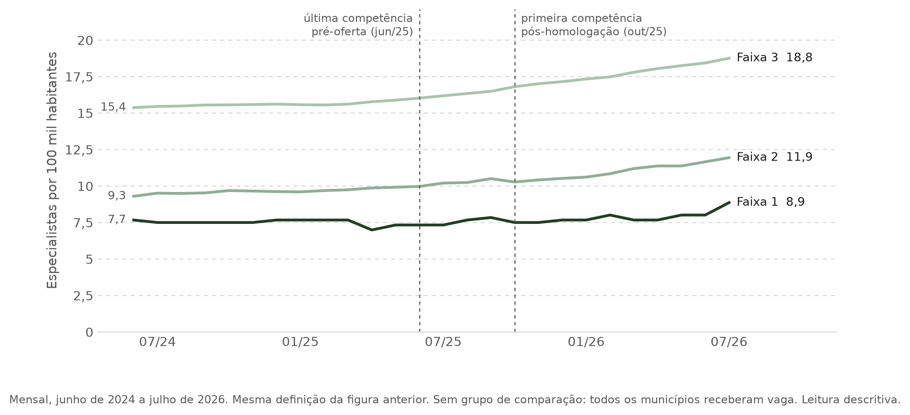

# Conteúdo da apresentação — banca 1

> Conteúdo integral da apresentação, em markdown, para ler de ponta a ponta.
> Cada seção é um slide; o cabeçalho é o título do slide, sempre a afirmação que
> ele sustenta. A linha em `código` é o rastreio de seção, exibido fora do
> título. **Atualização:** 9 de setembro de 2026.

---

## 1 — Capa

`sem rastreio`

# Incentivos financeiros e custos territoriais na escolha locacional de médicos especialistas

### Um modelo microeconômico para o preenchimento de vagas do Programa Mais Médicos Especialistas

Autoria · instituição · data da banca

---

## 2 — Sumário

`sem rastreio`

1. **Motivação e pergunta**
2. **Literatura teórica, modelo microeconômico e hipóteses**
3. **Viabilidade empírica**

---

# Parte 1 — Motivação e pergunta

## 3 — A escassez de especialistas é territorial — e já é tratada como urgência sanitária

`Parte 1 · Motivação · 1 de 3`

- O Ministério da Saúde decreta **situação de urgência em saúde pública por dois
  anos** para reduzir a espera por consultas, exames e cirurgias.
- Segundo o próprio Ministério, **apenas 10% dos especialistas atendem no SUS**,
  concentrados em capitais e regiões mais ricas.
- A permanência dos especialistas do programa é **prorrogada até fevereiro de
  2027**; 52% atuam no interior.

- Nos municípios que receberam vaga, a presença de especialistas por habitante
  **cai com a vulnerabilidade**: 16,0 por 100 mil habitantes onde a bolsa seria
  de R$ 10 mil, 10,0 onde seria de R$ 15 mil, **7,3** onde seria de R$ 20 mil —
  uma razão de 2,2 vezes entre os extremos, antes de o programa começar.

- O acesso segue a mesma geografia: o deslocamento médio até serviços de alta
  complexidade é de **276 km no Norte** e **256 km no Centro-Oeste**, contra
  **101 km no Sul**.

**Fontes:** Correio do Povo, 07/05/2025; Senado Notícias, 25/09/2025; gov.br,
26/08/2026. CNES, competência 06/2025, CBOs dos 10 cursos do programa com correspondência
unívoca curso–CBO, 295 municípios com vaga nesses cursos no ciclo 1; população
residente do Censo 2022 (IBGE).
IBGE, *Regiões de Influência das Cidades — REGIC 2018*.

---

## 4 — O programa responde com um preço explícito pela vulnerabilidade do município

`Parte 1 · Motivação · 2 de 3`

O Mais Médicos Especialistas (Lei nº 15.233/2025) paga uma **bolsa-formação
mensal** por vaga de especialista — 20 horas semanais em estabelecimento do
SUS, por até 12 meses — cujo valor depende da **vulnerabilidade declarada do
município**.

**De onde vem a vulnerabilidade declarada.** É a categoria do município no
**Índice de Vulnerabilidade Social (IVS) 2010**, do Ipea: um índice de 0 a 1
que agrega 16 indicadores do Censo 2010 em três dimensões —

| Dimensão | Indicadores |
|---|---|
| Infraestrutura urbana | saneamento, coleta de lixo, tempo de deslocamento casa–trabalho |
| Capital humano | mortalidade infantil, mães adolescentes, analfabetismo, crianças fora da escola |
| Renda e trabalho | pobreza extrema, desemprego, informalidade, dependência de renda de idosos |

O Ipea corta o índice em cinco categorias: **muito baixa** (até 0,200),
**baixa** (0,201–0,300), **média** (0,301–0,400), **alta** (0,401–0,500) e
**muito alta** (acima de 0,500). O edital de 2025 converteu categoria em faixa,
e faixa em valor:

| Categoria de IVS do município | Faixa de atração | Bolsa mensal |
|---|:---:|---:|
| muito alta | 1 | R$ 20.000 |
| alta | 2 | R$ 15.000 |
| média, baixa ou muito baixa | 3 | R$ 10.000 |

**O que isso significa.** A bolsa não remunera o médico pelo que ele produz nem
pelo mercado local: remunera o **lugar**. Um município pior no IVS paga mais
pela mesma vaga, e a regra é pública e uniforme dentro de cada faixa. Duas
ressalvas que importam para o desenho: a categoria é a **publicada na vaga** —
em 177 dos 368 municípios com vaga no ciclo 1 ela não coincide com a que se
obtém aplicando os cortes do Ipea ao IVS local — e a grade mudou em 2026, quando
a categoria *alta* passou à Faixa 1.

**Fontes:** Lei nº 15.233/2025; Edital SGTES/MS nº 3/2025 e retificação;
Chamamento SGTES/MS nº 1/2026; Ipea, *Atlas da Vulnerabilidade Social nos
Municípios Brasileiros* (2015).

---

## 5 — Depois da oferta a presença de especialistas cresceu em todas as faixas, mas só 30% das vagas tiveram confirmação — e a bolsa maior não ordenou o preenchimento

`Parte 1 · Motivação · 3 de 3`

- No ano anterior à oferta, a presença de especialistas por habitante estava
  **estável ou em queda** onde a bolsa é maior: −4% na Faixa 1, +7% na Faixa 2,
  +4% na Faixa 3.
- Nos treze meses seguintes, cresceu em todas: **+21% na Faixa 1**, +20% na
  Faixa 2, +17% na Faixa 3. A Faixa 1 partiu de 7,3 e chegou a 8,9 por 100 mil.
- O gráfico é descritivo: todos esses municípios receberam vaga, o CNES registra
  presença cadastral e não participação no programa, e não há grupo de
  comparação. Ele mostra que algo mudou, não o quanto foi o programa.

**O que o cadastro de vagas mostra.** Das 1.295 células estabelecimento–curso
ofertadas na primeira chamada, **393 (30,3%) tiveram alguma confirmação ou
homologação**. Por faixa: **31,6%** na Faixa 1, **37,4%** na Faixa 2, **23,6%**
na Faixa 3. A bolsa maior **não ordena** o preenchimento — e é isso que a
pergunta precisa explicar.

**Fontes:** CNES, competências 06/2024 a 07/2026, CBOs dos 10 cursos com
correspondência unívoca, 295 municípios; população residente do Censo 2022
(IBGE); quadro de vagas e resultados do ciclo 1, chamada 1 (Ministério da Saúde,
2025).

---

## 6 — Bolsa maior compensa município pior no preenchimento das vagas?

`Parte 1 · Pergunta`

Um município mais vulnerável paga **R$ 5 mil a mais** por mês pela mesma vaga.
Esse degrau é suficiente para que a vaga seja preenchida, apesar da
desvantagem territorial que justificou o valor maior?

Em termos do modelo: a remuneração adicional compensa o custo adicional de
estar ali?

---

# Parte 2 — Literatura teórica, modelo microeconômico e hipóteses

## 7 — O modelo combina três primitivas da literatura teórica

`Parte 2 · Literatura teórica`

| Referência | Ideia central | Equação original | O que entra no nosso modelo |
|---|---|---|---|
| **Moehling, Niemesh, Thomasson e Treber (2020)**, eq. 1 | o médico escolhe a localidade que maximiza o valor presente do rendimento real, líquido do custo não pecuniário de viver ali | $\displaystyle \arg\max_{i\in I} U(\omega_i)=\arg\max_{i\in I}\left\{\sum_t \delta^t\left[\frac{\mathbb{E}\!\left(w_{it}^{(s)}\right)}{p_{it}}-c_{it}^{(s)}\right]\right\}$ | a estrutura da decisão: remuneração real menos custo locacional, por localidade |
| **Choné e Ma (2011)**, eq. 1, com **Reinhardt (1975)** | a utilidade do médico soma a renda, subtrai o custo de atender e soma o benefício ao paciente ponderado pelo altruísmo; equipe e capital instalado reduzem o custo e ampliam o benefício | $U = R - C(q;\,L,K) + \alpha\,B(q)$ | o custo laboral líquido $C(q) - \alpha B(q)$, o altruísmo $\alpha$ e o papel da infraestrutura $L$, $K$ |
| **Redding e Rossi-Hansberg (2017)**, eq. 24 | a utilidade de trabalhar em um lugar depende do salário, das amenidades e do custo de moradia locais | $\displaystyle u_{nio} = \frac{z_{nio}\,B_n\,w_i}{\kappa_{ni}\,Q_n^{\,1-\beta}}$ | as amenidades $A_m$ e o custo de vida $p_m$ do lugar |

---

## 8 — O médico aceita a vaga quando a remuneração real supera o custo de estar ali

`Parte 2 · Modelo · 1 de 3`

O médico $i$ escolhe o município $m$ que maximiza o valor presente líquido da
carreira, adaptando Moehling et al. (2020):

$$V_{im} = \sum_t \delta^t\left[\frac{\mathbb{E}\left(w_{imt}\mid B_m\right)}{p_{mt}} - c_{im}\right] + \varepsilon_{im},
\qquad m_i^\ast \in \arg\max_{m\,\in\,\mathcal{M}\cup\{0\}} V_{im}$$

| Termo | Leitura |
|---|---|
| $\mathbb{E}(w_{imt}\mid B_m)$ | a remuneração esperada tem duas partes: a bolsa $B_m$, fixada pela regra, e o que o médico consegue no **mercado local**, $w^{\text{priv}}_m$. Em capitais e polos, $w = B + w^{\text{priv}}$; no interior isolado, sem demanda privada, $w \to B$. A bolsa precisa compensar também a renda de mercado que o médico deixa de ter |
| $p_{mt}$ | o que importa é a remuneração **real**, deflacionada pelo custo de vida local |
| $c_{im}$ | tudo o que torna estar naquele município custoso e não é pago em dinheiro |

A alternativa $m = 0$ é ficar fora do programa. A vaga em $m$ é aceita quando
$V_{im} \geq V_{i0}$.

---

## 9 — O custo de estar ali tem duas partes, e a infraestrutura entra nas duas

`Parte 2 · Modelo · 2 de 3`

$$c_{im} = \underbrace{\phi(\text{dist}_{im}) - \gamma A_m + \theta_i^{\text{rural}}}_{\text{geográfico}} \; + \; \underbrace{C(q; L_m, K_m) - \alpha_i B(q; L_m, K_m)}_{\text{laboral líquido}}$$

| Componente | Sinal | Significado |
|---|:---:|---|
| $\phi'(\text{dist})$ | $>0$ | afastar-se da família custa, e custa mais a cada quilômetro |
| $-\gamma A_m$ | $<0$ | amenidade urbana compensa |
| $C(q)$ | $C'>0,\;C''>0$ | atender cansa, e cansa de forma crescente |
| $\alpha_i B(q)$ | $B'>0,\;B''<0$ | curar dá satisfação, ponderada pelo altruísmo $\alpha_i$ |

Equipe ($L$) e capital instalado ($K$) atuam duas vezes — reduzem o cansaço,
$\partial C/\partial K<0$, e ampliam o benefício produzido, $\partial B/\partial K>0$
— de modo que $\partial c/\partial K<0$ por dois caminhos; e como no município
vulnerável $K$ e $L$ são baixos, o mesmo lugar que paga mais é o que impõe
maior custo laboral.

---

## 10 — Da condição de aceitação saem duas hipóteses: remuneração atrai, custo repele

`Parte 2 · Modelo · 3 de 3 · Hipóteses`

Escrevendo o custo latente como função da vulnerabilidade,
$c_{im} = c_0(IVS_m) + \eta_i$, o médico aceita a vaga em $m$ quando

$$\frac{B_m + w^{\text{priv}}_m}{p_m} - c_0(IVS_m) \;\geq\; \bar{v}_i .$$

A probabilidade de a vaga ser preenchida é a probabilidade de existir algum
candidato para quem essa desigualdade vale. Dela saem, por derivação direta:

| | Hipótese | Derivada |
|:---:|---|---|
| **H1** | Maior remuneração real aumenta a probabilidade de preenchimento da vaga | $\dfrac{\partial \Pr(\text{preenchimento}_m)}{\partial\,(B_m/p_m)} > 0$ |
| **H2** | Maior custo locacional reduz a probabilidade de preenchimento da vaga | $\dfrac{\partial \Pr(\text{preenchimento}_m)}{\partial\, c_m} < 0$ |

Comparando dois municípios contíguos separados pela fronteira entre faixas, as
duas hipóteses se encontram em uma única condição: o preenchimento do lado mais
vulnerável exige que o degrau monetário supere o degrau de custo,

$$\frac{\Delta B_m}{p_m} \;>\; \Delta c_0, \qquad \Delta B_m = \text{R\$ }5.000 .$$

**Como cada objeto aparece nos nossos dados**

| Objeto do modelo | Como observamos | O que isso permite |
|---|---|---|
| preenchimento | alguma confirmação ou homologação na célula estabelecimento–curso, no quadro de vagas do ciclo 1 | o outcome de H1 e H2, binário por célula |
| remuneração $B_m$ | faixa anunciada na vaga — três valores, determinados pela categoria de IVS | a bolsa só varia com a vulnerabilidade: por construção da regra, $B$ e $c_0(IVS)$ são colineares. Separá-los exige a fronteira entre faixas, com o escore que o Ministério de fato aplicou |
| custo $c_m$ | IVS 2010 e seus três sub-índices; tipologia territorial (capital, metropolitano, interior polo, interior remoto); estoque prévio de especialistas e leitos no CNES | o gradiente de H2, como associação condicional a curso e UF |

---

# Parte 3 — Viabilidade empírica

## 11 — Os dados são públicos; o desafio empírico é separar bolsa de vulnerabilidade, que a regra amarra

`Parte 3 · Viabilidade empírica`

**O que temos, tudo público e já no repositório**

| Base | O que dá |
|---|---|
| IVS 2010 (Ipea), 5.565 municípios, com os três sub-índices | a vulnerabilidade e a regra de faixa |
| Quadro de vagas e resultados do ciclo 1 — 1.295 células estabelecimento–curso em 368 municípios, com faixa, confirmações e homologações | o preenchimento por célula |
| CNES mensal, jun/2024 a jul/2026, 368 municípios, 16 cursos | a presença de especialistas antes e depois |
| Cadastro dos ativos do programa (1.480 em 12/08/2026) e série mensal desde dez/2025 | quem está ativo, onde e em que curso |
| População residente do Censo 2022 (IBGE) | o denominador por habitante |

**O que dá para medir hoje.** O preenchimento por célula, o gradiente de
preenchimento por vulnerabilidade e por território, e a evolução da presença
cadastral — tudo como **associação**.

**O desafio.** A bolsa é função da categoria de IVS: não há município com bolsa
alta e vulnerabilidade baixa. Para separar o efeito da remuneração (H1) do
efeito do custo (H2) é preciso comparar municípios **na fronteira entre
faixas** — e a faixa publicada não reproduz os cortes do Ipea em 177 dos 368
municípios, o que exige recuperar o escore que o Ministério de fato aplicou. Até
lá, o que se estima é gradiente, não efeito da bolsa.

---

## 12 — Perguntas

`sem rastreio`

**Bolsa maior compensa município pior no preenchimento das vagas?**
