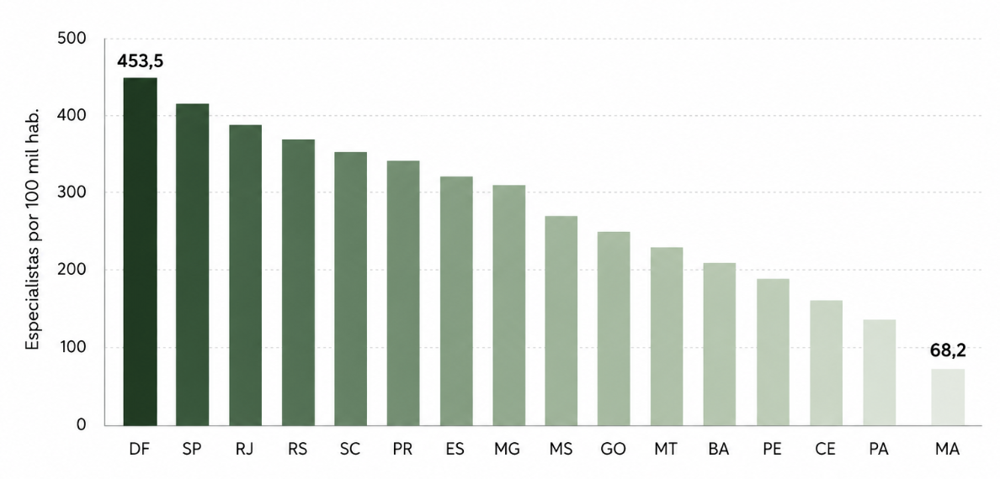
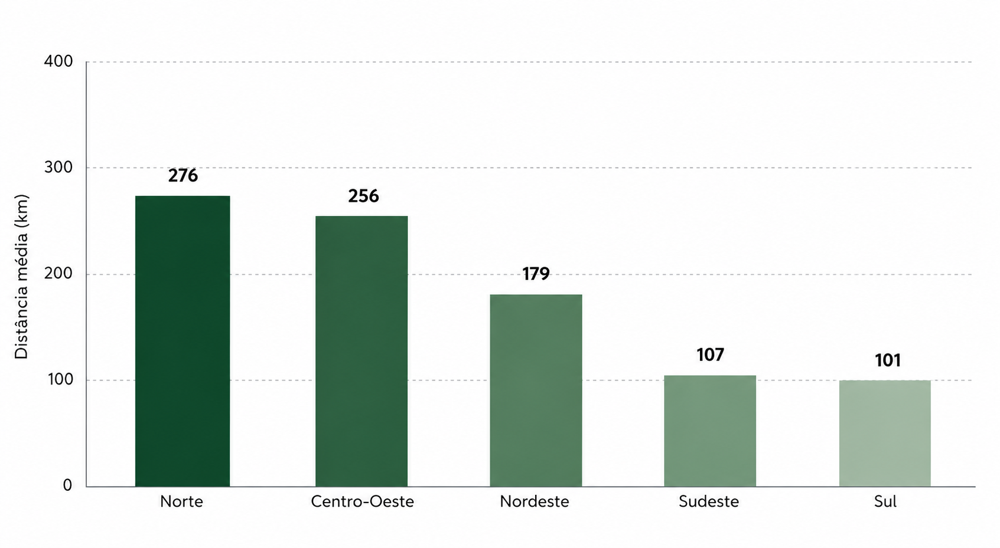
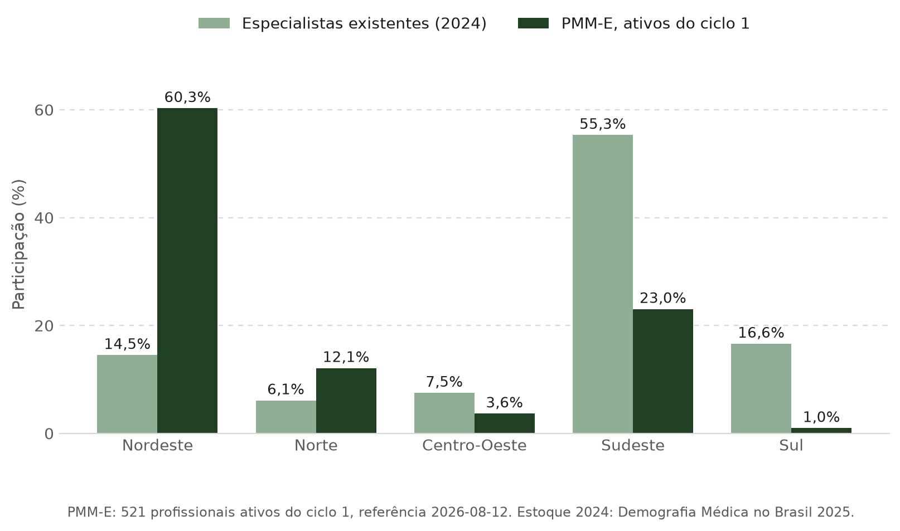

# Conteúdo da apresentação — banca 1

> **O que é este documento:** o conteúdo integral da apresentação, em markdown,
> pronto para ler de ponta a ponta. É a fonte de verdade; qualquer deck montado
> a partir daqui é artefato derivado. 
> **Escopo:** termina na viabilidade empírica. Nenhum resultado de estimação. 
> **Regras de composição e rastreio do feedback:** [01_roteiro_narrativo.md](01_roteiro_narrativo.md) 
> **Proveniência de cada número:** [03_proveniencia_figuras_e_numeros.md](03_proveniencia_figuras_e_numeros.md) 
> **Atualização:** 9 de setembro de 2026

**Como ler.** Cada seção é um slide. O cabeçalho da seção é o título que vai ao
slide — sempre a afirmação que ele sustenta, nunca o nome do bloco. A linha em
`código` logo abaixo é o rastreio de seção, que no slide fica em faixa separada
do título. `Nota` não vai ao slide: é fala do apresentador e defesa antecipada
de arguição.

**Sequência dos títulos.** Lidos em ordem, sem mais nada, eles são o argumento
inteiro. Esse é o teste de aceitação da apresentação.

---

## 1 — Capa

`sem rastreio`

# Bolsa maior compensa município pior?

**Um modelo de escolha locacional para o preenchimento e a permanência de vagas
no Mais Médicos Especialistas**

Autoria · instituição · data da banca

> **Nota:** o título anterior — *"Bolsa-formação como diferencial compensatório:
> um modelo de escolha racional…"* — nomeava o mecanismo antes de a banca saber
> qual é o problema. A capa faz a pergunta; o mecanismo aparece no bloco teórico.

---

## 2 — O argumento em três partes

`sem rastreio`

| Parte | Conteúdo | Em uma linha |
|:---:|---|---|
| **1** | Motivação e pergunta | há uma dor territorial, há uma política que coloca preço sobre ela, e o efeito desse preço está em aberto |
| **2** | Literatura teórica, modelo micro e hipóteses | a decisão do médico é um problema de escolha locacional, e dele saem três hipóteses testáveis |
| **3** | Viabilidade empírica | onde estão os dados, o que eles permitem afirmar e o que ainda falta |

> **Nota:** este slide também é o contrato de escopo. Dizer em voz alta que a
> apresentação termina na viabilidade evita a pergunta "e os resultados?" no fim.

---

# Parte 1 — Motivação e pergunta

## 3 — A escassez de especialistas já é tratada como urgência sanitária pelo próprio governo

`Parte 1 · Motivação · 1 de 4`

- O Ministério da Saúde decreta **situação de urgência em saúde pública por dois
  anos** para reduzir tempo de espera por consultas, exames e cirurgias.
- Dados do Ministério citados no Senado: **apenas 10% dos especialistas atendem
  no SUS**, concentrados em capitais e regiões mais ricas.
- A permanência dos especialistas do programa é **prorrogada até fevereiro de
  2027**; 52% atuam no interior.

> **Fonte:** Correio do Povo, 07/05/2025; Senado Notícias, 25/09/2025; gov.br —
> Agora Tem Especialistas, 26/08/2026.
>
> **Nota:** o problema é reconhecido pelo formulador, não só pela literatura —
> isso dispensa argumentar que o tema é relevante. A prorrogação de agosto de
> 2026 também é dado de desenho: o ciclo 1 ainda corria quando a política foi
> estendida, o que afeta o horizonte de permanência observável.

---

## 4 — Onde há menos especialista, o paciente percorre mais quilômetros

`Parte 1 · Motivação · 2 de 4`

- Densidade de especialistas: **453,5 por 100 mil habitantes no Distrito
  Federal** contra **68,2 no Maranhão** — razão de **6,6 vezes**.
- Deslocamento médio até alta complexidade: **276 km no Norte** e **256 km no
  Centro-Oeste**, contra **101 km no Sul**.
- As duas medidas descrevem a mesma falha por ângulos diferentes: a oferta é
  suficiente no agregado nacional e ausente no território.

> **Fonte:** Scheffer, M. (coord.), *Demografia Médica no Brasil 2025*; IBGE,
> *Regiões de Influência das Cidades — REGIC 2018*.
>
> **Nota:** dois gráficos porque sustentam **uma** afirmação. Se perguntarem por
> que não usar leitos ou produção: ambas as medidas são pré-programa e
> independentes do desfecho que se pretende estudar. O gráfico por UF mostra
> dezesseis unidades, não as 27 — isso precisa estar dito no rótulo.

---

## 5 — O programa responde com um preço explícito pela vulnerabilidade do município

`Parte 1 · Motivação · 3 de 4`

- O Mais Médicos Especialistas (Lei nº 15.233/2025) oferece **bolsa-formação
  mensal** por vaga, com carga de 20 horas semanais em estabelecimento do SUS.
- O valor **não é uniforme**: é fixado por faixa de atração, definida pela
  vulnerabilidade declarada do município.
- A Faixa 1 paga **o dobro** da Faixa 3. Entre faixas contíguas, o degrau é de
  **R$ 5.000**.

> **Fonte:** Lei nº 15.233/2025 e edital do PMM-E.
>
> **Nota:** este é o slide que torna o trabalho possível, e vale desacelerar
> nele. A política não apenas aloca médicos: ela **coloca um preço em reais
> sobre a vulnerabilidade territorial**, por regra publicada, uniforme dentro da
> faixa e descontínua na fronteira. O degrau de R$ 5.000 é o objeto de interesse
> — não a participação no programa.

---

## 6 — As vagas foram de fato para as regiões desassistidas, o que não diz que foram preenchidas nem mantidas

`Parte 1 · Motivação · 4 de 4`

- O Nordeste concentra **14,5%** dos especialistas do país e **60,3%** dos
  ativos do ciclo 1 do programa. O Norte, **6,1%** e **12,1%**.
- O Sudeste faz o caminho inverso: **55,3%** do estoque nacional e **23,0%** do
  programa. Sul e Centro-Oeste também entram sub-representados.
- A alocação foi redistributiva. Três coisas que o gráfico **não** mostra:
  1. se as vagas ofertadas foram preenchidas — ele conta quem está ativo, não a
     razão sobre vagas ofertadas;
  2. se quem entrou permaneceu;
  3. se a bolsa maior é a **causa** dessa alocação, ou se apenas acompanha onde
     o programa decidiu ofertar vaga.

> **Fonte:** `data/pmm_especialistas_nominal.csv`, ciclo 1, 521 profissionais,
> referência 12/08/2026, figura gerada por
> `scripts/apresentacao/gerar_figuras_banca1.py`; estoque de 2024 de Scheffer,
> M. (coord.), *Demografia Médica no Brasil 2025*.
>
> **Nota:** o terceiro item é a transição para a pergunta, e é onde a linguagem
> precisa ser mais disciplinada — descrição de alocação administrativa, nunca
> efeito. A versão anterior desta figura trazia o Sudeste com 10,6%; o valor
> correto é 23,0%, e a diferença exagerava a redistributividade. O achado está
> registrado em
> [`docs/04_dados/02_inventario_dados_por_outcome.md`](../../04_dados/02_inventario_dados_por_outcome.md),
> seção 4.1.

---

## 7 — Bolsa maior compensa município pior?

`Parte 1 · Pergunta`

**Em uma linha:** um degrau de **R$ 5.000** na bolsa é suficiente para vencer a
desvantagem territorial de um município mais vulnerável?

A pergunta se decompõe em duas margens observáveis:

| | Margem | Pergunta operacional |
|---|---|---|
| a | **Entrar** | a vaga com bolsa maior é preenchida? |
| b | **Ficar** | a oferta médica local persiste depois da entrada? |

**O que a pergunta não é:**

- não é o efeito de participar do PMM-E;
- não é o efeito total do Agora Tem Especialistas;
- não é o efeito causal do IVS — vulnerabilidade não é tratamento manipulável.

> **Fonte:** [`docs/01_pergunta_escopo/15_incentivos_ivs_provimento_duradouro.md`](../../01_pergunta_escopo/15_incentivos_ivs_provimento_duradouro.md),
> "Formulação curta canônica".
>
> **Nota:** o bloco final existe para desarmar a arguição mais provável, a de
> que o trabalho estaria reivindicando avaliar o programa inteiro. O estimando
> candidato é o incentivo marginal, próximo a uma fronteira administrativa.

---

# Parte 2 — Literatura teórica, modelo micro e hipóteses

## 8 — A literatura modela a escolha locacional do médico, mas não testa um preço fixado por regra

`Parte 2 · Literatura teórica`

**As três primitivas que o modelo da Parte 2 usa, e de onde vêm**

| Trabalho | Primitiva que fornece | Entra no modelo como |
|---|---|---|
| Moehling, Niemesh, Thomasson & Treber (2020) | escolha locacional intertemporal: o médico maximiza o valor presente do rendimento real menos um custo locacional não pecuniário | a **equação de escolha** e o horizonte $\sum_t\delta^t$ |
| Choné & Ma (2011); Reinhardt (1975) | utilidade do médico com altruísmo: atender gera cansaço $C(q)$ e satisfação $\alpha B(q)$, ambos mediados por equipe e capital instalado | o **custo laboral líquido** e o papel de $L$ e $K$ |
| Redding & Rossi-Hansberg (2017) | equilíbrio espacial: amenidades e custo de moradia determinam a atratividade de um lugar | o **custo geográfico** e o deflator $p_m$ |

**Evidência empírica de apoio.** Costa, Nunes & Sanches (2024) estimam escolha
discreta para médicos formados no Brasil e encontram salário real, vínculo de
origem e infraestrutura pesando na localização. Diamond (2016) mostra como
tratar renda, moradia e amenidades em conjunto. Sivey et al. (2012) medem, em
experimento de escolha discreta, a disposição a aceitar posto remoto em troca de
incentivo monetário.

**A lacuna.** Essas evidências vêm de salário de mercado, de escolha declarada
ou de contexto histórico. Nenhuma observa um **valor fixado por regra pública,
uniforme dentro da faixa e descontínuo em um escore territorial publicado** —
que é exatamente o que o PMM-E oferece.

> **Fonte:** [`docs/03_literatura_empirica/19_literatura_empirica_escolha_locacional_medicos.md`](../../03_literatura_empirica/19_literatura_empirica_escolha_locacional_medicos.md),
> seções 2 e 7.
>
> **Nota:** a separação em duas colunas não é estética, é regra do projeto —
> trabalho empírico não fundamenta equação teórica, e magnitude estimada em
> outro contexto não vira primitiva. Moehling é a exceção declarada: sua
> **equação de escolha** fundamenta a teoria; suas magnitudes históricas, não.

---

## 9 — O médico aceita a vaga quando o ganho monetário supera o custo de estar ali

`Parte 2 · Modelo micro · 1 de 3`

O médico $i$ escolhe o município $m$ que maximiza o valor presente líquido da
carreira, adaptando Moehling et al. (2020, eq. 1):

$$V_{im} = \sum_t \delta^t\left[\frac{\mathbb{E}\left(w_{imt}\mid B_m\right)}{p_{mt}} - c_{im}\right] + \varepsilon_{im},
\qquad m_i^\ast \in \arg\max_{m\,\in\,\mathcal{M}\cup\{0\}} V_{im}$$

Três leituras que o modelo impõe:

| Termo | Leitura |
|---|---|
| $\mathbb{E}(w_{imt}\mid B_m)$ | a bolsa **entra na remuneração esperada**; é fixada pela regra, não negociada |
| $p_{mt}$ | o que importa é a bolsa **real**, deflacionada pelo custo de vida local |
| $c_{im}$ | tudo o que torna estar naquele município custoso e não é pago em dinheiro |

A alternativa $m=0$ é ficar fora do programa. Aceitar a vaga exige
$V_{im} \geq V_{i0}$.

> **Fonte:** [`docs/02_teoria/modelo_micro.md`](../../02_teoria/modelo_micro.md), seções 1 e 3.
>
> **Nota:** o horizonte $\sum_t\delta^t$ não é ornamento. É ele que permite
> tratar **entrar** e **ficar** como duas margens do mesmo problema, em vez de
> dois modelos separados — e é dele que sai H2.

---

## 10 — O custo de estar ali tem duas partes, e a infraestrutura entra nas duas

`Parte 2 · Modelo micro · 2 de 3`

$$c_{im} = \underbrace{\phi(\text{dist}_{im}) - \gamma A_m + \theta_i^{\text{rural}}}_{\text{geográfico}} \; + \; \underbrace{C(q; L_m, K_m) - \alpha_i B(q; L_m, K_m)}_{\text{laboral líquido}}$$

| Componente | Sinal | Significado |
|---|:---:|---|
| $\phi'(\text{dist})$ | $>0$ | afastar-se da família custa, e custa mais a cada quilômetro |
| $-\gamma A_m$ | $<0$ | amenidade urbana compensa |
| $C(q)$ | $C'>0,\;C''>0$ | atender cansa, e cansa de forma crescente |
| $\alpha_i B(q)$ | $B'>0,\;B''<0$ | curar dá satisfação, ponderada pelo altruísmo $\alpha_i$ |

**Equipe ($L$) e capital instalado ($K$) atuam duas vezes:** reduzem o cansaço
($\partial C/\partial K<0$) e ampliam o benefício de saúde produzido
($\partial B/\partial K>0$). Logo $\partial c/\partial K<0$ por dois caminhos.

**Consequência incômoda:** no município vulnerável, $K$ e $L$ são baixos. O
mesmo lugar que paga mais é o que impõe maior custo laboral.

> **Fonte:** [`docs/02_teoria/modelo_micro.md`](../../02_teoria/modelo_micro.md), seções 2.1 a 2.4.
>
> **Nota:** havendo tempo, mencionar a forma em U do custo laboral líquido e o
> ponto de satisfação máxima $q_{c_{\max}}$
> (figura em `docs/02_teoria/figuras/curva_custo_laboral_burnout.png`). Não é
> necessária para as hipóteses e pode ser sacrificada sem perda.

---

## 11 — Da condição de aceitação saem três hipóteses testáveis

`Parte 2 · Modelo micro · 3 de 3`

Escrevendo o custo latente como função da vulnerabilidade,
$c_{im} = c_0(IVS_m) + \eta_i$, o médico aceita $m$ quando

$$\frac{B_m}{p_m} - c_0(IVS_m) \;\geq\; \bar{v}_i .$$

Comparando dois municípios contíguos separados pela fronteira de faixa, o
preenchimento do lado mais vulnerável exige que o degrau monetário supere o
degrau de custo latente:

$$\frac{\Delta B_m}{p_m} \;>\; \Delta c_0
\qquad\text{com}\qquad \Delta B_m = \text{R\$ }5.000 .$$

Cada derivada gera uma hipótese:

| Derivada | Leitura | Gera |
|---|---|:---:|
| $\dfrac{\partial \Pr(\text{aceitar})}{\partial B_m} > 0$ | mais bolsa, mais chance de a vaga ser ocupada | **H1** |
| $\dfrac{\partial \Pr(\text{permanecer em } t{+}k)}{\partial B_m} > 0$ | a bolsa entra em **todo** período descontado, não só no primeiro | **H2** |
| $\dfrac{\partial^2 \Pr(\text{aceitar})}{\partial B_m\,\partial w^{\text{alt}}} < 0$ | o mesmo real de bolsa pesa mais para quem tem menor renda alternativa | **H3** |

E uma ambiguidade que o desenho precisa enfrentar: $c_0'(IVS)$ **não é
monotônico**. Infraestrutura urbana precária eleva o custo; carência sanitária
eleva $B'(q)$ e pode reduzi-lo pela via do altruísmo.

> **Fonte:** [`docs/02_teoria/modelo_micro.md`](../../02_teoria/modelo_micro.md),
> seção 4 — a condição de degrau e a estática comparativa estão derivadas lá.
>
> **Nota:** este é o slide que atende ao pedido de derivar as hipóteses
> diretamente. A ambiguidade de $c_0'(IVS)$ é declarada de propósito: é
> honestidade teórica e, ao mesmo tempo, a justificativa para estudar o
> **degrau** e não o gradiente.

---

## 12 — As três hipóteses distinguem entrar, ficar e para quem o incentivo pesa mais

`Parte 2 · Hipóteses`

| | Hipótese | Forma testável | Margem |
|---|---|---|---|
| **H1** | Quanto maior a bolsa, maior a probabilidade de preenchimento da vaga | salto no preenchimento administrativo da célula CNES–curso na fronteira de faixa | entrar |
| **H2** | Quanto maior a bolsa, maior a persistência da oferta médica local após o período inicial | salto no estoque e na cobertura municipal do CBO em horizonte fixo de 6 e 12 meses | ficar |
| **H3** | O efeito da bolsa é maior onde a renda alternativa é menor | interação entre faixa e ausência de mercado privado local: no interior isolado a remuneração colapsa no piso da bolsa, $w = B$ | heterogeneidade |

**H3 tem duas leituras.** A territorial é testável com dados públicos, pela
tipologia REGIC combinada com RM/RIDE. A individual exigiria microdado de renda
que o projeto não possui.

**Extensão registrada, fora do slide se faltar tempo (H4):** decompondo o IVS, a
dimensão de infraestrutura urbana deve elevar o custo, enquanto a de capital
humano pode atenuá-lo.

> **Fonte:** [`docs/02_teoria/hipoteses_e_viabilidade_empirica.md`](../../02_teoria/hipoteses_e_viabilidade_empirica.md), seção 4.
>
> **Nota — correspondência:** o documento canônico lista quatro hipóteses mais
> uma complementar, e a apresentação leva três. A tabela de mapeamento está na
> seção 4.2 daquele documento e é a resposta pronta caso a banca pergunte.
>
> **Nota — linguagem:** H2 fala em **persistência da oferta local**, não em
> retenção do bolsista. Retenção individual exigiria identificador longitudinal
> que não existe nas bases públicas; dizer "retenção" em slide seria afirmar
> mais do que o dado permite.

---

# Parte 3 — Viabilidade empírica

## 13 — Temos o cadastro de quem está ativo e a regra da bolsa

`Parte 3 · Viabilidade empírica · 1 de 2`

| Base | Conteúdo | Cobertura |
|---|---|---|
| `ivs_ipea_2010_municipios.csv` | IVS 2010 e seus três sub-índices, IDHM, população e renda | 5.565 municípios; IVS de 0,066 a 0,752 |
| `pmm_especialistas_nominal.csv` | profissionais ativos, com município, estabelecimento, curso e faixa | 1.480 registros; 325 municípios; 518 CNES; 16 cursos; referência 12/08/2026 |
| `pmm_especialistas_serie_historica.csv` | ativos agregados por município e curso | 7.276 registros; 9 competências, de dez/2025 a ago/2026 |
| Painel CNES mensal | estoque de profissionais por município e especialidade | base do outcome de persistência da oferta |
| Lei nº 15.233/2025 e editais | faixa de atração e valor da bolsa por município | regra completa, publicada |

**A variação de interesse existe e é pública:** o valor da bolsa muda em degrau
na fronteira de faixa, e a faixa é função de um escore territorial.

> **Fonte:** [`docs/04_dados/02_inventario_dados_por_outcome.md`](../../04_dados/02_inventario_dados_por_outcome.md), seção 1.
>
> **Nota:** dizer explicitamente que nenhuma dessas bases foi construída para
> avaliação — todas são subprodutos administrativos de transparência. Isso
> condiciona tudo o que vem no slide seguinte.

---

## 14 — Falta o denominador: sem universo de vagas, descrevemos, não testamos

`Parte 3 · Viabilidade empírica · 2 de 2`

O quadro original do ciclo 1 publica **678 vagas imediatas** e **1.145 posições
de reserva**. Três problemas simultâneos:

- não existe identificador persistente de vaga que a acompanhe entre oferta,
  realocação e homologação;
- a segunda chamada não publica capacidade imediata por célula;
- há células com mais confirmações do que a capacidade publicada.

**Decisão de portão, 01/09/2026:** a unidade **célula CNES–curso** foi aprovada
como denominador; a **vaga física individual** foi reprovada.

| Outcome | Situação |
|---|---|
| Preenchimento administrativo da célula | ✅ viável |
| Persistência da oferta local em 6 e 12 meses | ✅ viável, com data-base explícita |
| Taxa de preenchimento por vaga | ❌ bloqueado, sem `id_vaga` |
| Retenção individual do bolsista | ❌ bloqueado, sem identificador longitudinal |
| Salário efetivamente recebido | ❌ não observado |

**Próximo passo declarado:** reconstruir a regra de atribuição de faixa e o
escore administrativo, e só então abrir os outcomes. Nenhum resultado será usado
para escolher fronteira, janela ou especificação.

> **Fonte:** [`docs/auditorias/08_portao_denominador_atracao.md`](../../auditorias/08_portao_denominador_atracao.md);
> [`docs/01_pergunta_escopo/15_incentivos_ivs_provimento_duradouro.md`](../../01_pergunta_escopo/15_incentivos_ivs_provimento_duradouro.md), seção 4.
>
> **Nota:** apresentar como força, não como fraqueza. O projeto sabe o que pode
> e o que não pode afirmar, e registrou isso **antes** de olhar qualquer
> resultado. Uma banca desconfia de quem não conhece os próprios limites.

---

## 15 — Perguntas

`sem rastreio`

Repetir, em uma linha, a pergunta da capa e as duas margens: **bolsa maior
compensa município pior — para entrar, e para ficar?**

---

## Anexo — material de apoio, não apresentado

| # | Conteúdo | Quando usar |
|---|---|---|
| A1 | Curva de custo laboral líquido em U, com $q_{c_{\max}}$ e $q_{c=0}$ | arguição sobre altruísmo, ou sobre por que atender pode não ser custoso |
| A2 | Decomposição do IVS em três sub-índices e as forças opostas | arguição sobre o IVS como running variable |
| A3 | Hipóteses canônicas H3, clínico versus cirúrgico, e H4, decomposição do IVS | arguição sobre heterogeneidade por especialidade |
| A4 | Tabela de linguagem máxima permitida por outcome | arguição sobre o que o trabalho poderá afirmar |
| A5 | Tipologia territorial capital / metropolitano / interior polo / interior remoto | arguição sobre a definição de "fora das capitais" |
