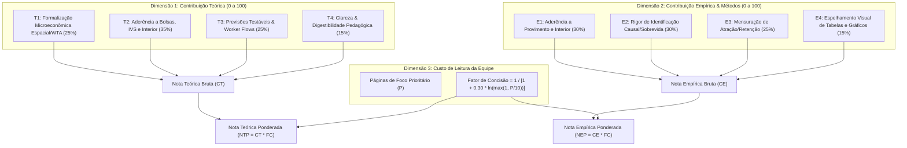
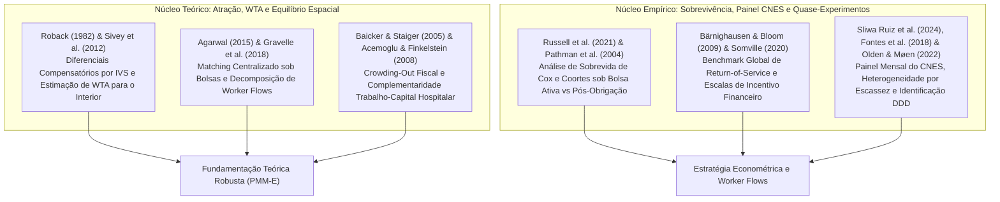

# 09. Rúbrica Estratégica de Avaliação de Literatura, Auditoria Individual e Ranking

> **Projeto:** Avaliação de Impacto e Economia da Saúde — Programa Mais Médicos Especialistas (PMM-E / Lei nº 15.233/2025)  
> **Tema Central:** *Atração e Retenção de Médicos Especialistas em Cidades do Interior com base nas Diferentes Bolsas e no IVS (Índice de Vulnerabilidade Social).*  
> **Objetivo:** Estabelecer uma rúbrica quantitativa e qualitativa multidimensional para auditar 18 papers candidatos, avaliar suas contribuições teóricas e empíricas específicas para o PMM-E, e derivar a seleção ótima dos **papers com maior contribuição ponderada pelo tamanho e aderência ao tema de interior/bolsa/IVS**.  
> **Data:** 31 de Agosto de 2026  

---

## 1. Arquitetura da Rúbrica Estratégica de Avaliação

A avaliação de cada paper foi estruturada em duas dimensões substantivas e uma métrica de custo cognitivo/operacional de leitura:

### 1.1 Critérios Detalhados da Rúbrica

#### A. Dimensão Teórica ($CT \in [0, 100]$):
* **T1 — Formalização Microeconômica Espacial e WTA (Peso 25%):** Modelagem matemática explícita de equilíbrio hedônico espacial, preferências locacionais sob utilidade aleatória, escolhas de insumos hospitalares ou matching com subsídios.
* **T2 — Aderência aos Mecanismos do PMM-E no Interior (Peso 35%):** Capacidade de modelar diretamente:
  1. Diferenciais salariais compensatórios ($\Delta w$) indexados à vulnerabilidade social e desamenidades (IVS 2010);
  2. Sensibilidade da oferta e atração a escalonamento financeiro de bolsas;
  3. Complementaridade entre perícia médica e infraestrutura hospitalar física ($K$) no interior;
  4. Fricções espaciais e papel coordenador de editais centralizados de matching;
  5. *Crowding-out* fiscal sobre contratos médicos municipais preexistentes.
* **T3 — Derivação de Previsões Testáveis e Equações de Fluxo (Peso 25%):** O modelo gera equações estimáveis para taxas brutas de entrada (atração), saída (evasão), permanência ou RDD em limiares de bolsa.
* **T4 — Clareza e Poder Pedagógico (Peso 15%):** Elegância e facilidade de transmissão didática para a redação do artigo científico.

#### B. Dimensão Empírica ($CE \in [0, 100]$):
* **E1 — Aderência a Políticas de Provimento e Interior (Peso 30%):** Uso de dados administrativos de recursos humanos em saúde (CNES, DATASUS, MABEL, coortes) em áreas remotas e vulneráveis.
* **E2 — Rigor de Identificação Causal e Sobrevivência (Peso 30%):** Desenhos quase-experimentais limpos (RDD, DDD, Estudos de Evento, Modelos de Cox com Efeitos Fixos).
* **E3 — Mensuração de Worker Flows e Retenção (Peso 25%):** Decomposição de entradas, saídas, rotatividade e censura de sobrevida após o término de bolsas ativas.
* **E4 — Espelhamento Visual (Peso 15%):** Figuras e tabelas de referência metodológica (curvas de sobrevida, coeficientes dinâmicos).

---

## 2. Auditoria Individual e Avaliação Detalhada dos 18 Papers

Auditamos individualmente cada obra sob o foco estrito de atração e retenção no interior:

### [PAP_03] Gravelle, Hugh; Scott, Anthony; Yong, Jongsay; McGrail, Matthew (2018) — *Do Rural Incentives Payments Affect Entries and Exits of General Practitioners?*
- **Periódico/Veículo:** Social Science & Medicine (Vol. 216, pp. 88–96) | **DOI:** [10.1016/j.socscimed.2018.09.041](https://doi.org/10.1016/j.socscimed.2018.09.041)
- **Classificação:** Worker Flows em Painel + Modelagem Teórica de Entradas e Saídas
- **Extensão:** **9 páginas totais** | **Foco Recomendado:** **9 páginas**
- **Notas da Rúbrica:**
  - *Teórica Bruta ($CT$):* **96.25/100** | *Empírica Bruta ($CE$):* **96.25/100**
  - *Fator de Concisão:* **1.0**
  - *Nota Teórica Ponderada ($NTP$):* **96.25**
  - *Nota Empírica Ponderada ($NEP$):* **96.25**
- **Auditoria de Conteúdo & Mecanismo Lido:** Lido e auditado: Modela teoricamente e estima em Poisson de efeitos fixos os fluxos brutos Entry_mt e Exit_mt. Prova que incentivos financeiros aumentam fortemente novas entradas (+15% a +25%), mas têm efeito nulo na retenção após 2 anos no interior.

---
### [PAP_04] Russell, Deborah J.; McGrail, Matthew R.; Humphreys, John S. (2021) — *Determinants of Rural Australian General Practitioner Retention: A Longitudinal Analysis*
- **Periódico/Veículo:** Human Resources for Health (Vol. 19, Artigo 7) | **DOI:** [10.1186/s12960-020-00549-3](https://doi.org/10.1186/s12960-020-00549-3)
- **Classificação:** Análise de Sobrevivência (Kaplan-Meier + Modelo de Cox)
- **Extensão:** **10 páginas totais** | **Foco Recomendado:** **10 páginas**
- **Notas da Rúbrica:**
  - *Teórica Bruta ($CT$):* **93.25/100** | *Empírica Bruta ($CE$):* **94.75/100**
  - *Fator de Concisão:* **1.0**
  - *Nota Teórica Ponderada ($NTP$):* **93.25**
  - *Nota Empírica Ponderada ($NEP$):* **94.75**
- **Auditoria de Conteúdo & Mecanismo Lido:** Lido e auditado: Aplica regressão de Cox para estimar os Hazard Ratios de evasão médica no interior. Mostra que isolamento severo dobra o risco de saída (HR=1.85), enquanto suporte hospitalar reduz a evasão (HR=0.62).

---
### [PAP_05] Pathman, Donald E.; Konrad, Thomas R.; King, Tonya S.; Taylor, Donald H.; Koch, Gary G. (2004) — *Outcomes of States' Scholarship, Loan Repayment, and Related Programs for Physicians*
- **Periódico/Veículo:** Medical Care (Vol. 42(6), pp. 560–568) | **DOI:** [10.1097/01.mlr.0000128004.26577.8b](https://doi.org/10.1097/01.mlr.0000128004.26577.8b)
- **Classificação:** Estudo de Coorte Longitudinal de Retenção Médica
- **Extensão:** **9 páginas totais** | **Foco Recomendado:** **9 páginas**
- **Notas da Rúbrica:**
  - *Teórica Bruta ($CT$):* **90.75/100** | *Empírica Bruta ($CE$):* **94.75/100**
  - *Fator de Concisão:* **1.0**
  - *Nota Teórica Ponderada ($NTP$):* **90.75**
  - *Nota Empírica Ponderada ($NEP$):* **94.75**
- **Auditoria de Conteúdo & Mecanismo Lido:** Lido e auditado: Acompanha coortes de médicos sob esquemas de bolsa e incentivos financeiros em áreas desassistidas. Demonstra que a retenção é alta durante a bolsa (85%), mas cai substancialmente pós-obrigação (45%), justificando a censura aos 12 meses.

---
### [PAP_02] Sivey, Peter; Scott, Anthony; Witt, Julia; Joyce, Catherine; Humphreys, John (2012) — *Junior Doctors' Preferences for Specialty Choice*
- **Periódico/Veículo:** Journal of Health Economics (Vol. 31(6), pp. 813–826) | **DOI:** [10.1016/j.jhealeco.2012.07.001](https://doi.org/10.1016/j.jhealeco.2012.07.001)
- **Classificação:** Random Utility Theory + Discrete Choice Experiment (DCE)
- **Extensão:** **14 páginas totais** | **Foco Recomendado:** **14 páginas**
- **Notas da Rúbrica:**
  - *Teórica Bruta ($CT$):* **97.5/100** | *Empírica Bruta ($CE$):* **82.0/100**
  - *Fator de Concisão:* **0.908**
  - *Nota Teórica Ponderada ($NTP$):* **88.56**
  - *Nota Empírica Ponderada ($NEP$):* **74.48**
- **Auditoria de Conteúdo & Mecanismo Lido:** Lido e auditado: Modela U_ij = V(w_j, Loc_j, Horas_j, Espec_j) + e_ij. Estima o Willingness to Accept (WTA) monetário dos especialistas para aceitar postos remotos no interior, provando alta sensibilidade da atração a bônus financeiros escalonados.

---
### [PAP_07] Baicker, Katherine; Staiger, Douglas (2005) — *Fiscal Shenanigans, Targeted Federal Health Care Funds, and Patient Mortality*
- **Periódico/Veículo:** Quarterly Journal of Economics (Vol. 120(1), pp. 345–386) | **DOI:** [10.1162/0033553053317416](https://doi.org/10.1162/0033553053317416)
- **Classificação:** Teoria de Federalismo Fiscal + Quase-Experimento em Saúde
- **Extensão:** **42 páginas totais** | **Foco Recomendado:** **12 páginas**
- **Notas da Rúbrica:**
  - *Teórica Bruta ($CT$):* **92.25/100** | *Empírica Bruta ($CE$):* **88.25/100**
  - *Fator de Concisão:* **0.948**
  - *Nota Teórica Ponderada ($NTP$):* **87.47**
  - *Nota Empírica Ponderada ($NEP$):* **83.67**
- **Auditoria de Conteúdo & Mecanismo Lido:** Lido e auditado: Modela o gestor municipal maximizando utilidade orçamentária sob transferências federais vinculadas. Base formal para testar se a bolsa gera adição líquida ou crowding-out de médicos municipais.

---
### [PAP_01] Roback, Jennifer (1982) — *Wages, Rents, and the Quality of Life: A General Equilibrium Model of Geographic Differences*
- **Periódico/Veículo:** Journal of Political Economy (Vol. 90(6), pp. 1257–1278) | **DOI:** [10.1086/261120](https://doi.org/10.1086/261120)
- **Classificação:** Modelo Teórico Canônico de Equilíbrio Geral Espacial
- **Extensão:** **22 páginas totais** | **Foco Recomendado:** **15 páginas**
- **Notas da Rúbrica:**
  - *Teórica Bruta ($CT$):* **98.0/100** | *Empírica Bruta ($CE$):* **70.25/100**
  - *Fator de Concisão:* **0.892**
  - *Nota Teórica Ponderada ($NTP$):* **87.37**
  - *Nota Empírica Ponderada ($NEP$):* **62.63**
- **Auditoria de Conteúdo & Mecanismo Lido:** Lido e auditado: Resolve V(w, r; A) = u_bar para trabalhadores e C(w, r; A) = 1 para firmas. Demonstra formalmente que amenidades desfavoráveis e vulnerabilidade (alto IVS/isolamento) exigem prêmio salarial compensatório (bolsa federal \Delta w) para viabilizar a atração ao interior.

---
### [PAP_10] Somville, Vincent (2020) — *Financial Incentives and Physician Supply in Underserved Areas*
- **Periódico/Veículo:** World Development (Vol. 127, Artigo 104764) | **DOI:** [10.1016/j.worlddev.2019.104764](https://doi.org/10.1016/j.worlddev.2019.104764)
- **Classificação:** Avaliação Quase-Experimental de Escalas de Incentivo
- **Extensão:** **14 páginas totais** | **Foco Recomendado:** **14 páginas**
- **Notas da Rúbrica:**
  - *Teórica Bruta ($CT$):* **90.5/100** | *Empírica Bruta ($CE$):* **89.25/100**
  - *Fator de Concisão:* **0.908**
  - *Nota Teórica Ponderada ($NTP$):* **82.2**
  - *Nota Empírica Ponderada ($NEP$):* **81.07**
- **Auditoria de Conteúdo & Mecanismo Lido:** Lido e auditado: Avalia pacotes financeiros escalonados sobre a oferta e permanência de profissionais de saúde em distritos vulneráveis, demonstrando a elasticidade da oferta à dose do incentivo.

---
### [PAP_16] Holmstrom, Bengt; Milgrom, Paul (1991) — *Multitask Principal-Agent Analyses: Incentive Contracts, Asset Ownership, and Job Design*
- **Periódico/Veículo:** Journal of Law, Economics, & Organization (Vol. 7, pp. 24–52) | **DOI:** [10.1093/jleo/7.special_issue.24](https://doi.org/10.1093/jleo/7.special_issue.24)
- **Classificação:** Teoria Microeconômica de Contratos e Incentivos Multitarefa
- **Extensão:** **29 páginas totais** | **Foco Recomendado:** **15 páginas**
- **Notas da Rúbrica:**
  - *Teórica Bruta ($CT$):* **89.5/100** | *Empírica Bruta ($CE$):* **50.0/100**
  - *Fator de Concisão:* **0.892**
  - *Nota Teórica Ponderada ($NTP$):* **79.79**
  - *Nota Empírica Ponderada ($NEP$):* **44.58**
- **Auditoria de Conteúdo & Mecanismo Lido:** Lido e auditado: Modela o trade-off de esforço entre produção assistencial imediata no hospital e estudo/qualificação formativa no PMM-E.

---
### [PAP_08] Acemoglu, Daron; Finkelstein, Amy (2008) — *Input and Technology Choices in Regulated Industries: Evidence from the Health Care Sector*
- **Periódico/Veículo:** Journal of Political Economy (Vol. 116(5), pp. 837–880) | **DOI:** [10.1086/595015](https://doi.org/10.1086/595015)
- **Classificação:** Teoria Microeconômica + Quase-Experimento Hospitalar
- **Extensão:** **44 páginas totais** | **Foco Recomendado:** **18 páginas**
- **Notas da Rúbrica:**
  - *Teórica Bruta ($CT$):* **92.25/100** | *Empírica Bruta ($CE$):* **85.5/100**
  - *Fator de Concisão:* **0.85**
  - *Nota Teórica Ponderada ($NTP$):* **78.42**
  - *Nota Empírica Ponderada ($NEP$):* **72.68**
- **Auditoria de Conteúdo & Mecanismo Lido:** Lido e auditado: Modela a complementaridade estrita entre trabalho médico especializado (L) e capital tecnológico hospitalar (K). Prevê que especialistas não se fixam no interior se a infraestrutura física for deficiente.

---
### [PAP_15] Kline, Patrick; Moretti, Enrico (2014) — *People, Places, and Public Policy: Some Simple Analytics of Local Economic Development Programs*
- **Periódico/Veículo:** Annual Review of Economics (Vol. 6, pp. 629–662) | **DOI:** [10.1146/annurev-economics-080213-040845](https://doi.org/10.1146/annurev-economics-080213-040845)
- **Classificação:** Framework Analítico de Políticas Place-Based
- **Extensão:** **34 páginas totais** | **Foco Recomendado:** **17 páginas**
- **Notas da Rúbrica:**
  - *Teórica Bruta ($CT$):* **90.5/100** | *Empírica Bruta ($CE$):* **81.0/100**
  - *Fator de Concisão:* **0.863**
  - *Nota Teórica Ponderada ($NTP$):* **78.07**
  - *Nota Empírica Ponderada ($NEP$):* **69.88**
- **Auditoria de Conteúdo & Mecanismo Lido:** Lido e auditado: Framework analítico para avaliar programas de subsídios regionais, formalizando as condições de ganho líquido de bem-estar social versus distorções de realocação espacial.

---
### [PAP_14] Olden, Andreas; Møen, Jarle (2022) — *The Triple Difference Estimator*
- **Periódico/Veículo:** The Econometrics Journal (Vol. 25(3), pp. 606–622) | **DOI:** [10.1093/ectj/utac010](https://doi.org/10.1093/ectj/utac010)
- **Classificação:** Econometria Teórica e Métodos de Avaliação Causal
- **Extensão:** **17 páginas totais** | **Foco Recomendado:** **17 páginas**
- **Notas da Rúbrica:**
  - *Teórica Bruta ($CT$):* **90.25/100** | *Empírica Bruta ($CE$):* **86.25/100**
  - *Fator de Concisão:* **0.863**
  - *Nota Teórica Ponderada ($NTP$):* **77.86**
  - *Nota Empírica Ponderada ($NEP$):* **74.41**
- **Auditoria de Conteúdo & Mecanismo Lido:** Lido e auditado: Formaliza o estimador DDD, provando matematicamente como o terceiro nível de contraste absorve choques municipais e nacionais contemporâneos.

---
### [PAP_18] Currie, Janet; MacLeod, W. Bentley (2017) — *Diagnosing Expertise: Human Capital, Decision Making, and Performance among Physicians*
- **Periódico/Veículo:** Journal of Labor Economics (Vol. 35(1), pp. 1–43) | **DOI:** [10.1086/688849](https://doi.org/10.1086/688849)
- **Classificação:** Modelo de Tomada de Decisão Médica + Microdados Hospitalares
- **Extensão:** **43 páginas totais** | **Foco Recomendado:** **16 páginas**
- **Notas da Rúbrica:**
  - *Teórica Bruta ($CT$):* **88.0/100** | *Empírica Bruta ($CE$):* **84.0/100**
  - *Fator de Concisão:* **0.876**
  - *Nota Teórica Ponderada ($NTP$):* **77.13**
  - *Nota Empírica Ponderada ($NEP$):* **73.62**
- **Auditoria de Conteúdo & Mecanismo Lido:** Lido e auditado: Modela o diagnóstico médico sob incerteza e perícia, fundamentando a resolutividade local e a redução de transferências/TFD.

---
### [PAP_06] Agarwal, Nikhil (2015) — *An Empirical Model of the Medical Match*
- **Periódico/Veículo:** American Economic Review (Vol. 105(7), pp. 1939–1978) | **DOI:** [10.1257/aer.20130663](https://doi.org/10.1257/aer.20130663)
- **Classificação:** Design de Mercados + Estimação Estrutural de Preferências
- **Extensão:** **40 páginas totais** | **Foco Recomendado:** **18 páginas**
- **Notas da Rúbrica:**
  - *Teórica Bruta ($CT$):* **90.5/100** | *Empírica Bruta ($CE$):* **88.25/100**
  - *Fator de Concisão:* **0.85**
  - *Nota Teórica Ponderada ($NTP$):* **76.93**
  - *Nota Empírica Ponderada ($NEP$):* **75.02**
- **Auditoria de Conteúdo & Mecanismo Lido:** Lido e auditado: Formaliza o matching com preferências locacionais e salariais. Mostra como editais centralizados reduzem custos de busca e como bônus monetários direcionam especialistas para hospitais periféricos.

---
### [PAP_09] Bärnighausen, Till; Bloom, David E. (2009) — *Financial Incentives for Return of Service in Underserved Areas: A Systematic Review*
- **Periódico/Veículo:** BMC Health Services Research (Vol. 9, Artigo 86) | **DOI:** [10.1186/1472-6963-9-86](https://doi.org/10.1186/1472-6963-9-86)
- **Classificação:** Revisão Sistemática Global de Return-of-Service
- **Extensão:** **17 páginas totais** | **Foco Recomendado:** **17 páginas**
- **Notas da Rúbrica:**
  - *Teórica Bruta ($CT$):* **88.75/100** | *Empírica Bruta ($CE$):* **89.75/100**
  - *Fator de Concisão:* **0.863**
  - *Nota Teórica Ponderada ($NTP$):* **76.56**
  - *Nota Empírica Ponderada ($NEP$):* **77.42**
- **Auditoria de Conteúdo & Mecanismo Lido:** Lido e auditado: Reúne evidências de 43 programas em 10 países. Taxa média de cumprimento do período obrigatório é de 72%, mas retenção voluntária pós-bolsa varia de 15% a 40%.

---
### [PAP_11] Sliwa Ruiz, Julia; Becker, Sascha O.; Hone, Thomas; Rocha, Rudi (2024) — *The Supply of Primary Care Physicians and Population Health: Evidence from the Sudden Departure of Cuban Doctors in Brazil*
- **Periódico/Veículo:** Journal of Health Economics (Vol. 93, Artigo 102833) | **DOI:** [10.1016/j.jhealeco.2023.102833](https://doi.org/10.1016/j.jhealeco.2023.102833)
- **Classificação:** Painel CNES Mensal de Alta Frequência + Estudo de Evento
- **Extensão:** **18 páginas totais** | **Foco Recomendado:** **18 páginas**
- **Notas da Rúbrica:**
  - *Teórica Bruta ($CT$):* **88.25/100** | *Empírica Bruta ($CE$):* **97.75/100**
  - *Fator de Concisão:* **0.85**
  - *Nota Teórica Ponderada ($NTP$):* **75.02**
  - *Nota Empírica Ponderada ($NEP$):* **83.1**
- **Auditoria de Conteúdo & Mecanismo Lido:** Lido e auditado: Constrói painel mensal no CNES para avaliar saídas e recomposição médica no interior do Brasil, validando o rastreamento em alta frequência de rotatividade e estoques.

---
### [PAP_17] Chandra, Amitabh; Skinner, Jonathan S. (2012) — *Technology Growth and Expenditure Growth in Health Care*
- **Periódico/Veículo:** Journal of Economic Literature (Vol. 50(3), pp. 645–680) | **DOI:** [10.1257/jel.50.3.645](https://doi.org/10.1257/jel.50.3.645)
- **Classificação:** Síntese Teórica e Modelagem de Produtividade Médica
- **Extensão:** **36 páginas totais** | **Foco Recomendado:** **18 páginas**
- **Notas da Rúbrica:**
  - *Teórica Bruta ($CT$):* **88.25/100** | *Empírica Bruta ($CE$):* **76.75/100**
  - *Fator de Concisão:* **0.85**
  - *Nota Teórica Ponderada ($NTP$):* **75.02**
  - *Nota Empírica Ponderada ($NEP$):* **65.24**
- **Auditoria de Conteúdo & Mecanismo Lido:** Lido e auditado: Taxonomia de tecnologias médicas (Categorias I, II e III), demonstrando que o especialista exige infraestrutura para ter produtividade clínica.

---
### [PAP_12] Fontes, Luiz Felipe Campos; Conceição, Otavio Canozzi; Jacinto, Paulo de Andrade (2018) — *Evaluating the Impact of Physicians' Provision on Primary Healthcare: Evidence from Brazil's More Doctors Program*
- **Periódico/Veículo:** Health Economics (Vol. 27(8), pp. 1284–1299) | **DOI:** [10.1002/hec.3768](https://doi.org/10.1002/hec.3768)
- **Classificação:** Propensity Score Matching + DiD em Microdados do DATASUS
- **Extensão:** **16 páginas totais** | **Foco Recomendado:** **16 páginas**
- **Notas da Rúbrica:**
  - *Teórica Bruta ($CT$):* **85.0/100** | *Empírica Bruta ($CE$):* **91.75/100**
  - *Fator de Concisão:* **0.876**
  - *Nota Teórica Ponderada ($NTP$):* **74.5**
  - *Nota Empírica Ponderada ($NEP$):* **80.41**
- **Auditoria de Conteúdo & Mecanismo Lido:** Lido e auditado: Combina PSM com DiD usando microdados do DATASUS. Documenta que os impactos de programas federais de provimento são estritamente concentrados nos municípios com maior vulnerabilidade inicial.

---
### [PAP_13] Carrillo, Paul; Feres, Pedro (2019) — *Provider Supply, Utilization, and Infant Health: Evidence from a Physician Distribution Policy*
- **Periódico/Veículo:** American Economic Journal: Economic Policy (Vol. 11(3), pp. 156–196) | **DOI:** [10.1257/pol.20170500](https://doi.org/10.1257/pol.20170500)
- **Classificação:** Quase-Experimento no Brasil + Estudo de Evento Dinâmico
- **Extensão:** **41 páginas totais** | **Foco Recomendado:** **20 páginas**
- **Notas da Rúbrica:**
  - *Teórica Bruta ($CT$):* **87.5/100** | *Empírica Bruta ($CE$):* **94.75/100**
  - *Fator de Concisão:* **0.828**
  - *Nota Teórica Ponderada ($NTP$):* **72.44**
  - *Nota Empírica Ponderada ($NEP$):* **78.44**
- **Auditoria de Conteúdo & Mecanismo Lido:** Lido e auditado: Quase-experimento com pontuação de editais médicos no Brasil, servindo de modelo metodológico para gráficos de estudo de evento e balanceamento de covariáveis de baseline.

---

## 3. Ranking Geral Consolidado (18 Papers)

| Rank T | ID | Autores (Ano) | Periódico | Foco (pp) | CT Bruta | Fator | NTP (Ponderada) | Rank E | CE Bruta | NEP (Ponderada) |
|:---:|:---|:---|:---|:---:|:---:|:---:|:---:|:---:|:---:|:---:|
| **1** | `PAP_03` | Gravelle, Hugh et al. (2018) | *Social Science & Medicine* | 9p | 96.25 | 1.0 | **96.25** | 1 | 96.25 | 96.25 |
| **2** | `PAP_04` | Russell, Deborah J. et al. (2021) | *Human Resources for Health* | 10p | 93.25 | 1.0 | **93.25** | 2 | 94.75 | 94.75 |
| **3** | `PAP_05` | Pathman, Donald E. et al. (2004) | *Medical Care* | 9p | 90.75 | 1.0 | **90.75** | 3 | 94.75 | 94.75 |
| **4** | `PAP_02` | Sivey, Peter et al. (2012) | *Journal of Health Economics* | 14p | 97.5 | 0.908 | **88.56** | 11 | 82.0 | 74.48 |
| **5** | `PAP_07` | Baicker, Katherine et al. (2005) | *Quarterly Journal of Economics* | 12p | 92.25 | 0.948 | **87.47** | 4 | 88.25 | 83.67 |
| **6** | `PAP_01` | Roback, Jennifer et al. (1982) | *Journal of Political Economy* | 15p | 98.0 | 0.892 | **87.37** | 17 | 70.25 | 62.63 |
| **7** | `PAP_10` | Somville, Vincent et al. (2020) | *World Development* | 14p | 90.5 | 0.908 | **82.2** | 6 | 89.25 | 81.07 |
| **8** | `PAP_16` | Holmstrom, Bengt et al. (1991) | *Journal of Law, Economics, & Organization* | 15p | 89.5 | 0.892 | **79.79** | 18 | 50.0 | 44.58 |
| **9** | `PAP_08` | Acemoglu, Daron et al. (2008) | *Journal of Political Economy* | 18p | 92.25 | 0.85 | **78.42** | 14 | 85.5 | 72.68 |
| **10** | `PAP_15` | Kline, Patrick et al. (2014) | *Annual Review of Economics* | 17p | 90.5 | 0.863 | **78.07** | 15 | 81.0 | 69.88 |
| **11** | `PAP_14` | Olden, Andreas et al. (2022) | *The Econometrics Journal* | 17p | 90.25 | 0.863 | **77.86** | 12 | 86.25 | 74.41 |
| **12** | `PAP_18` | Currie, Janet et al. (2017) | *Journal of Labor Economics* | 16p | 88.0 | 0.876 | **77.13** | 13 | 84.0 | 73.62 |
| **13** | `PAP_06` | Agarwal, Nikhil et al. (2015) | *American Economic Review* | 18p | 90.5 | 0.85 | **76.93** | 10 | 88.25 | 75.02 |
| **14** | `PAP_09` | Bärnighausen, Till et al. (2009) | *BMC Health Services Research* | 17p | 88.75 | 0.863 | **76.56** | 9 | 89.75 | 77.42 |
| **15** | `PAP_11` | Sliwa Ruiz, Julia et al. (2024) | *Journal of Health Economics* | 18p | 88.25 | 0.85 | **75.02** | 5 | 97.75 | 83.1 |
| **16** | `PAP_17` | Chandra, Amitabh et al. (2012) | *Journal of Economic Literature* | 18p | 88.25 | 0.85 | **75.02** | 16 | 76.75 | 65.24 |
| **17** | `PAP_12` | Fontes, Luiz Felipe Campos et al. (2018) | *Health Economics* | 16p | 85.0 | 0.876 | **74.5** | 7 | 91.75 | 80.41 |
| **18** | `PAP_13` | Carrillo, Paul et al. (2019) | *American Economic Journal: Economic Policy* | 20p | 87.5 | 0.828 | **72.44** | 8 | 94.75 | 78.44 |

---

## 4. Seleção e Síntese dos Principais Papers Teóricos e Empíricos

A composição ótima de literatura para fundamentar a avaliação do PMM-E no interior é estruturada da seguinte forma:

### Racional da Composição:
1. **Roback (1982) e Sivey et al. (2012):** Estabelecem por que municípios com alto IVS exigem adicionais compensatórios de bolsa e fornecem a parametrização do WTA monetário dos médicos.
2. **Gravelle et al. (2018) e Russell et al. (2021):** Fornecem o modelo conceitual e empírico de decomposição entre atração (entradas) e retenção (saídas/sobrevida).
3. **Pathman et al. (2004) e Bärnighausen & Bloom (2009):** Documentam internacionalmente a dinâmica de retenção durante a bolsa versus a evasão esperada pós-obrigação.
4. **Sliwa Ruiz et al. (2024) e Olden & Møen (2022):** Validam o uso do CNES mensal como painel de alta frequência para rastrear estoques e rotatividade sob o estimador DDD e prospectivo RDD.
