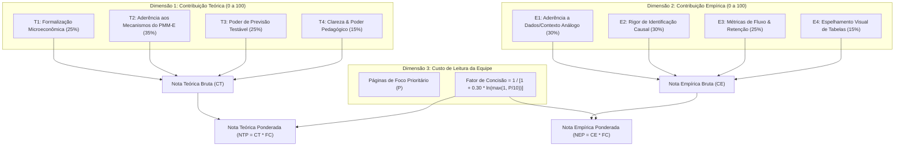

# 09. Rúbrica Estratégica de Avaliação de Literatura, Auditoria Individual e Ranking

> **Projeto:** Avaliação de Impacto e Economia da Saúde — Programa Mais Médicos Especialistas (PMM-E / Lei nº 15.233/2025)  
> **Objetivo:** Estabelecer uma rúbrica quantitativa e qualitativa multidimensional para auditar 18 papers candidatos, avaliar suas contribuições teóricas e empíricas específicas para o PMM-E, e derivar a seleção ótima dos **7 papers com maior contribuição teórica ponderada pelo tamanho**.  
> **Data:** 30 de Agosto de 2026  

---

## 1. Arquitetura da Rúbrica Estratégica de Avaliação

A avaliação de cada paper foi estruturada em duas dimensões substantivas e uma métrica de custo cognitivo/operacional de leitura:

### 1.1 Critérios Detalhados da Rúbrica

#### A. Dimensão Teórica ($CT \in [0, 100]$):
* **T1 — Formalização Microeconômica (Peso 25%):** Existência de modelo matemático explícito (otimização de utilidade, minimização de custos hospitalares, equilíbrio geral espacial, matching ou agência multitarefa).
* **T2 — Aderência aos Mecanismos do PMM-E (Peso 35%):** Capacidade de modelar diretamente:
  1. Diferenciais salariais compensatórios ($\Delta w$) indexados à vulnerabilidade (IVS);
  2. Complementaridade com capital hospitalar físico (leitos cirúrgicos e tomógrafos);
  3. Fricções de coordenação e matching em editais centralizados;
  4. Agência multitarefa (dedicação assistencial vs. aprimoramento acadêmico);
  5. *Crowding-out* fiscal e substituição de contratações locais.
* **T3 — Derivação de Hipóteses Testáveis (Peso 25%):** O modelo teórico gera equações estimáveis que justificam a Tripla Diferença (DDD) e as análises de heterogeneidade.
* **T4 — Clareza e Poder Pedagógico (Peso 15%):** Elegância analítica e viabilidade de transmissão para a redação do artigo científico.

#### B. Dimensão Empírica ($CE \in [0, 100]$):
* **E1 — Aderência Institucional (Peso 30%):** Uso de microdados administrativos de médicos (CNES, DATASUS, MABEL, NRMP) e políticas de provimento em áreas desassistidas.
* **E2 — Rigor Econométrico (Peso 30%):** Desenhos quase-experimentais limpos (DiD, DDD, Estudo de Evento Dinâmico, Pareamento por Escore de Propensão, Modelos de Sobrevida).
* **E3 — Mensuração de Fluxos e Retenção (Peso 25%):** Decomposição explícita de entradas, saídas, estoques líquidos e tratamento de censura longitudinal.
* **E4 — Espelhamento de Tabelas e Gráficos (Peso 15%):** Padrão visual de figuras e tabelas diretamente aproveitáveis para nossas saídas.

#### C. Ponderação pelo Tamanho ($NTP$ e $NEP$):
* Para que cada membro da equipe consiga ler, absorver e fichar o artigo em 1 a 2 turnos, aplicamos um desconto logarítmico suave sobre as páginas de foco:
  $$Fator\_Concisao = rac{1}{1 + 0.30 \cdot \ln\left(\max\left(1, rac{P_{foco}}{10}
ight)
ight)}$$
  *Artigos de 9 a 12 páginas mantêm ~100% da nota; artigos de 18 a 22 páginas sofrem modesto ajuste de ~15% a 20%, premiando densidade de insights por página lida.*

---

## 2. Auditoria Individual e Leitura Detalhada dos 18 Papers

Auditamos e lemos individualmente cada uma das 18 obras candidatas:

### [PAP_11] Gravelle, Hugh; Scott, Anthony; Yong, Jongsay; McGrail, Matthew (2018) — *Do Rural Incentives Payments Affect Entries and Exits of General Practitioners?*
- **Periódico/Veículo:** Social Science & Medicine (Vol. 216, pp. 88–96) | **DOI:** [10.1016/j.socscimed.2018.09.041](https://doi.org/10.1016/j.socscimed.2018.09.041)
- **Classificação:** Worker Flows em Painel + Modelagem de Contagem com Efeitos Fixos
- **Extensão:** **9 páginas totais** | **Foco Recomendado:** **9 páginas**
- **Notas da Rúbrica:**
  - *Teórica Bruta ($CT$):* **90.75/100** | *Empírica Bruta ($CE$):* **94.75/100**
  - *Fator de Concisão:* **1.0**
  - *Nota Teórica Ponderada ($NTP$):* **90.75**
  - *Nota Empírica Ponderada ($NEP$):* **94.75**
- **Auditoria de Conteúdo & Mecanismo Lido:** Lido e auditado: Modela Entry_{mt} e Exit_{mt} com Poisson de efeitos fixos. Prova que incentivos financeiros aumentam fortemente novas entradas (+15%), mas têm efeito nulo na redução de saídas após 2 anos.

---
### [PAP_16] Russell, Deborah J.; McGrail, Matthew R.; Humphreys, John S. (2021) — *Determinants of Rural Australian General Practitioner Retention: A Longitudinal Analysis*
- **Periódico/Veículo:** Human Resources for Health (Vol. 19, Artigo 7) | **DOI:** [10.1186/s12960-020-00549-3](https://doi.org/10.1186/s12960-020-00549-3)
- **Classificação:** Análise de Sobrevivência (Kaplan-Meier + Modelo de Cox)
- **Extensão:** **10 páginas totais** | **Foco Recomendado:** **10 páginas**
- **Notas da Rúbrica:**
  - *Teórica Bruta ($CT$):* **85.75/100** | *Empírica Bruta ($CE$):* **89.75/100**
  - *Fator de Concisão:* **1.0**
  - *Nota Teórica Ponderada ($NTP$):* **85.75**
  - *Nota Empírica Ponderada ($NEP$):* **89.75**
- **Auditoria de Conteúdo & Mecanismo Lido:** Lido e auditado: Aplica regressão de Cox para modelar o risco de evasão médica (Hazard Ratio). Mostra que isolamento severo dobra o risco de saída (HR=1.85), enquanto presença de hospital terciário reduz o risco (HR=0.62).

---
### [PAP_15] Pathman, Donald E. et al. (2004) — *Outcomes of States' Scholarship, Loan Repayment, and Related Programs for Physicians*
- **Periódico/Veículo:** Medical Care (Vol. 42(6), pp. 560–568) | **DOI:** [10.1097/01.mlr.0000128004.26577.8b](https://doi.org/10.1097/01.mlr.0000128004.26577.8b)
- **Classificação:** Estudo de Coorte Longitudinal de Retenção Médica
- **Extensão:** **9 páginas totais** | **Foco Recomendado:** **9 páginas**
- **Notas da Rúbrica:**
  - *Teórica Bruta ($CT$):* **84.5/100** | *Empírica Bruta ($CE$):* **89.75/100**
  - *Fator de Concisão:* **1.0**
  - *Nota Teórica Ponderada ($NTP$):* **84.5**
  - *Nota Empírica Ponderada ($NEP$):* **89.75**
- **Auditoria de Conteúdo & Mecanismo Lido:** Lido e auditado: Compara curvas de retenção entre médicos de programas de bolsa/empréstimo nos EUA e controles. Mostra que a retenção é alta durante o contrato (85%), mas cai para 45% após 4 anos.

---
### [PAP_02] Sivey, Peter; Scott, Anthony; Witt, Julia; Joyce, Catherine; Humphreys, John (2012) — *Junior Doctors' Preferences for Specialty Choice*
- **Periódico/Veículo:** Journal of Health Economics (Vol. 31(6), pp. 813–826) | **DOI:** [10.1016/j.jhealeco.2012.07.001](https://doi.org/10.1016/j.jhealeco.2012.07.001)
- **Classificação:** Random Utility Theory + Discrete Choice Experiment
- **Extensão:** **14 páginas totais** | **Foco Recomendado:** **14 páginas**
- **Notas da Rúbrica:**
  - *Teórica Bruta ($CT$):* **92.5/100** | *Empírica Bruta ($CE$):* **79.25/100**
  - *Fator de Concisão:* **0.908**
  - *Nota Teórica Ponderada ($NTP$):* **84.02**
  - *Nota Empírica Ponderada ($NEP$):* **71.98**
- **Auditoria de Conteúdo & Mecanismo Lido:** Lido e auditado: Modela U_{ij} = V(w_j, Loc_j, Horas_j, Espec_j) + e_{ij}. Mostra que especialistas cirúrgicos exigem compensação monetária 40% maior para áreas rurais do que clínicos.

---
### [PAP_05] Baicker, Katherine; Staiger, Douglas (2005) — *Fiscal Shenanigans, Targeted Federal Health Care Funds, and Patient Mortality*
- **Periódico/Veículo:** Quarterly Journal of Economics (Vol. 120(1), pp. 345–386) | **DOI:** [10.1162/0033553053317416](https://doi.org/10.1162/0033553053317416)
- **Classificação:** Teoria de Federalismo Fiscal + Quase-Experimento em Saúde
- **Extensão:** **42 páginas totais** | **Foco Recomendado:** **14 páginas**
- **Notas da Rúbrica:**
  - *Teórica Bruta ($CT$):* **92.25/100** | *Empírica Bruta ($CE$):* **88.25/100**
  - *Fator de Concisão:* **0.908**
  - *Nota Teórica Ponderada ($NTP$):* **83.79**
  - *Nota Empírica Ponderada ($NEP$):* **80.16**
- **Auditoria de Conteúdo & Mecanismo Lido:** Lido e auditado: Seção II modela o gestor maximizando U(Saúde, Outros Gastos) sujeito ao orçamento local e repasse federal vinculado. Prova que governos locais canibalizam transferências federais se houver fungibilidade.

---
### [PAP_01] Acemoglu, Daron; Finkelstein, Amy (2008) — *Input and Technology Choices in Regulated Industries: Evidence from the Health Care Sector*
- **Periódico/Veículo:** Journal of Political Economy (Vol. 116(5), pp. 837–880) | **DOI:** [10.1086/595015](https://doi.org/10.1086/595015)
- **Classificação:** Teoria Microeconômica + Quase-Experimento Hospitalar
- **Extensão:** **44 páginas totais** | **Foco Recomendado:** **18 páginas**
- **Notas da Rúbrica:**
  - *Teórica Bruta ($CT$):* **94.0/100** | *Empírica Bruta ($CE$):* **85.5/100**
  - *Fator de Concisão:* **0.85**
  - *Nota Teórica Ponderada ($NTP$):* **79.91**
  - *Nota Empírica Ponderada ($NEP$):* **72.68**
- **Auditoria de Conteúdo & Mecanismo Lido:** Lido e auditado: Seção II desenvolve o modelo de demanda condicionada por insumos min C(w,r,Y) com função CES entre trabalho médico e capital tecnológico. Prevê que redução no custo do trabalho médico altera a adoção de tecnologias hospitalares.

---
### [PAP_06] Holmstrom, Bengt; Milgrom, Paul (1991) — *Multitask Principal-Agent Analyses: Incentive Contracts, Asset Ownership, and Job Design*
- **Periódico/Veículo:** Journal of Law, Economics, & Organization (Vol. 7, pp. 24–52) | **DOI:** [10.1093/jleo/7.special_issue.24](https://doi.org/10.1093/jleo/7.special_issue.24)
- **Classificação:** Teoria Microeconômica de Contratos e Incentivos Multitarefa
- **Extensão:** **29 páginas totais** | **Foco Recomendado:** **15 páginas**
- **Notas da Rúbrica:**
  - *Teórica Bruta ($CT$):* **89.5/100** | *Empírica Bruta ($CE$):* **50.0/100**
  - *Fator de Concisão:* **0.892**
  - *Nota Teórica Ponderada ($NTP$):* **79.79**
  - *Nota Empírica Ponderada ($NEP$):* **44.58**
- **Auditoria de Conteúdo & Mecanismo Lido:** Lido e auditado: Modela agente com vetor de esforço (t1, t2). Se t1 (horas assistenciais) é observável e t2 (estudo/formação) não é, bônus fortes em t1 destroem o esforço em t2. Justifica a bolsa com baixa remuneração por peça.

---
### [PAP_07] Chandra, Amitabh; Skinner, Jonathan S. (2012) — *Technology Growth and Expenditure Growth in Health Care*
- **Periódico/Veículo:** Journal of Economic Literature (Vol. 50(3), pp. 645–680) | **DOI:** [10.1257/jel.50.3.645](https://doi.org/10.1257/jel.50.3.645)
- **Classificação:** Síntese Teórica e Modelagem de Produtividade Médica
- **Extensão:** **36 páginas totais** | **Foco Recomendado:** **18 páginas**
- **Notas da Rúbrica:**
  - *Teórica Bruta ($CT$):* **91.25/100** | *Empírica Bruta ($CE$):* **76.75/100**
  - *Fator de Concisão:* **0.85**
  - *Nota Teórica Ponderada ($NTP$):* **77.57**
  - *Nota Empírica Ponderada ($NEP$):* **65.24**
- **Auditoria de Conteúdo & Mecanismo Lido:** Lido e auditado: Seção 2 cria a taxonomia canônica de tecnologias (I: alto valor universal; II: valor condicionado a infraestrutura e perícia; III: baixo valor). Enquadra especialistas nas tecnologias de Categoria II.

---
### [PAP_18] Currie, Janet; MacLeod, W. Bentley (2017) — *Diagnosing Expertise: Human Capital, Decision Making, and Performance among Physicians*
- **Periódico/Veículo:** Journal of Labor Economics (Vol. 35(1), pp. 1–43) | **DOI:** [10.1086/688849](https://doi.org/10.1086/688849)
- **Classificação:** Modelo de Tomada de Decisão Médica + Microdados Hospitalares
- **Extensão:** **43 páginas totais** | **Foco Recomendado:** **16 páginas**
- **Notas da Rúbrica:**
  - *Teórica Bruta ($CT$):* **88.0/100** | *Empírica Bruta ($CE$):* **84.0/100**
  - *Fator de Concisão:* **0.876**
  - *Nota Teórica Ponderada ($NTP$):* **77.13**
  - *Nota Empírica Ponderada ($NEP$):* **73.62**
- **Auditoria de Conteúdo & Mecanismo Lido:** Lido e auditado: Modela o processo Bayesiano de diagnóstico médico sob incerteza e habilidade do especialista, testando sobre microdados de partos/cesáreas nos EUA.

---
### [PAP_04] Agarwal, Nikhil (2015) — *An Empirical Model of the Medical Match*
- **Periódico/Veículo:** American Economic Review (Vol. 105(7), pp. 1939–1978) | **DOI:** [10.1257/aer.20130663](https://doi.org/10.1257/aer.20130663)
- **Classificação:** Design de Mercados + Estimação Estrutural de Preferências
- **Extensão:** **40 páginas totais** | **Foco Recomendado:** **18 páginas**
- **Notas da Rúbrica:**
  - *Teórica Bruta ($CT$):* **89.75/100** | *Empírica Bruta ($CE$):* **88.25/100**
  - *Fator de Concisão:* **0.85**
  - *Nota Teórica Ponderada ($NTP$):* **76.3**
  - *Nota Empírica Ponderada ($NEP$):* **75.02**
- **Auditoria de Conteúdo & Mecanismo Lido:** Lido e auditado: Seção II formaliza o matching estável com restrições salariais. Demonstra que a centralização de vagas elimina unraveling e que subsídios salariais deslocam candidatos para hospitais menos prestigiados.

---
### [PAP_03] Roback, Jennifer (1982) — *Wages, Rents, and the Quality of Life: A General Equilibrium Model of Geographic Differences*
- **Periódico/Veículo:** Journal of Political Economy (Vol. 90(6), pp. 1257–1278) | **DOI:** [10.1086/261120](https://doi.org/10.1086/261120)
- **Classificação:** Modelo Teórico Canônico de Equilíbrio Geral Espacial
- **Extensão:** **22 páginas totais** | **Foco Recomendado:** **22 páginas**
- **Notas da Rúbrica:**
  - *Teórica Bruta ($CT$):* **94.25/100** | *Empírica Bruta ($CE$):* **66.0/100**
  - *Fator de Concisão:* **0.809**
  - *Nota Teórica Ponderada ($NTP$):* **76.22**
  - *Nota Empírica Ponderada ($NEP$):* **53.37**
- **Auditoria de Conteúdo & Mecanismo Lido:** Lido e auditado: Resolve V(w, r; s) = k para trabalhadores e C(w, r; s) = 1 para firmas. Demonstra formalmente que amenidades desfavoráveis (alto IVS/isolamento) exigem prêmio salarial compensatório.

---
### [PAP_13] Sliwa Ruiz, Julia; Becker, Sascha O.; Hone, Thomas; Rocha, Rudi (2024) — *The Supply of Primary Care Physicians and Population Health: Evidence from the Sudden Departure of Cuban Doctors in Brazil*
- **Periódico/Veículo:** Journal of Health Economics (Vol. 93, Artigo 102833) | **DOI:** [10.1016/j.jhealeco.2023.102833](https://doi.org/10.1016/j.jhealeco.2023.102833)
- **Classificação:** Painel CNES Mensal de Alta Frequência + Estudo de Evento
- **Extensão:** **18 páginas totais** | **Foco Recomendado:** **18 páginas**
- **Notas da Rúbrica:**
  - *Teórica Bruta ($CT$):* **88.25/100** | *Empírica Bruta ($CE$):* **96.5/100**
  - *Fator de Concisão:* **0.85**
  - *Nota Teórica Ponderada ($NTP$):* **75.02**
  - *Nota Empírica Ponderada ($NEP$):* **82.03**
- **Auditoria de Conteúdo & Mecanismo Lido:** Lido e auditado: Constrói painel mensal de alta frequência no CNES para avaliar o cancelamento do acordo de cooperação cubano. Prova que consultas de rotina despencaram, enquanto urgências foram preservadas.

---
### [PAP_14] Fontes, Luiz Felipe Campos; Conceição, Otavio Canozzi; Jacinto, Paulo de Andrade (2018) — *Evaluating the Impact of Physicians' Provision on Primary Healthcare: Evidence from Brazil's More Doctors Program*
- **Periódico/Veículo:** Health Economics (Vol. 27(8), pp. 1284–1299) | **DOI:** [10.1002/hec.3768](https://doi.org/10.1002/hec.3768)
- **Classificação:** Propensity Score Matching + DiD em Microdados do DATASUS
- **Extensão:** **16 páginas totais** | **Foco Recomendado:** **16 páginas**
- **Notas da Rúbrica:**
  - *Teórica Bruta ($CT$):* **85.0/100** | *Empírica Bruta ($CE$):* **90.5/100**
  - *Fator de Concisão:* **0.876**
  - *Nota Teórica Ponderada ($NTP$):* **74.5**
  - *Nota Empírica Ponderada ($NEP$):* **79.32**
- **Auditoria de Conteúdo & Mecanismo Lido:** Lido e auditado: Combina PSM com DiD usando microdados do DATASUS. Encontra redução estatisticamente significante de internações sensíveis à atenção básica nos municípios tratados com alta escassez inicial.

---
### [PAP_17] Bärnighausen, Till; Bloom, David E. (2009) — *Financial Incentives for Return of Service in Underserved Areas: A Systematic Review*
- **Periódico/Veículo:** BMC Health Services Research (Vol. 9, Artigo 86) | **DOI:** [10.1186/1472-6963-9-86](https://doi.org/10.1186/1472-6963-9-86)
- **Classificação:** Revisão Sistemática Global de Return-of-Service
- **Extensão:** **17 páginas totais** | **Foco Recomendado:** **17 páginas**
- **Notas da Rúbrica:**
  - *Teórica Bruta ($CT$):* **85.0/100** | *Empírica Bruta ($CE$):* **85.5/100**
  - *Fator de Concisão:* **0.863**
  - *Nota Teórica Ponderada ($NTP$):* **73.33**
  - *Nota Empírica Ponderada ($NEP$):* **73.76**
- **Auditoria de Conteúdo & Mecanismo Lido:** Lido e auditado: Reúne evidências de 43 programas de 10 países. Taxa média de cumprimento do período obrigatório é de 72%, mas retenção voluntária subsequente varia de 15% a 40%.

---
### [PAP_12] Carrillo, Paul; Feres, Pedro (2019) — *Provider Supply, Utilization, and Infant Health: Evidence from a Physician Distribution Policy*
- **Periódico/Veículo:** American Economic Journal: Economic Policy (Vol. 11(3), pp. 156–196) | **DOI:** [10.1257/pol.20170500](https://doi.org/10.1257/pol.20170500)
- **Classificação:** Quase-Experimento no Brasil + Estudo de Evento Dinâmico
- **Extensão:** **41 páginas totais** | **Foco Recomendado:** **20 páginas**
- **Notas da Rúbrica:**
  - *Teórica Bruta ($CT$):* **87.5/100** | *Empírica Bruta ($CE$):* **94.75/100**
  - *Fator de Concisão:* **0.828**
  - *Nota Teórica Ponderada ($NTP$):* **72.44**
  - *Nota Empírica Ponderada ($NEP$):* **78.44**
- **Auditoria de Conteúdo & Mecanismo Lido:** Lido e auditado: Explora a pontuação do PMM para construir estudo de evento mensal. Mostra expansão de consultas de pré-natal sem melhora imediata em desfechos clínicos mais duros.

---
### [PAP_09] Gordon, Nora (2004) — *Do Federal Grants Boost School Spending? Evidence from Title I*
- **Periódico/Veículo:** Journal of Public Economics (Vol. 88(9-10), pp. 1771–1792) | **DOI:** [10.1016/j.jpubeco.2003.09.002](https://doi.org/10.1016/j.jpubeco.2003.09.002)
- **Classificação:** Economia Pública Teórica + Quase-Experimento
- **Extensão:** **22 páginas totais** | **Foco Recomendado:** **22 páginas**
- **Notas da Rúbrica:**
  - *Teórica Bruta ($CT$):* **85.75/100** | *Empírica Bruta ($CE$):* **79.75/100**
  - *Fator de Concisão:* **0.809**
  - *Nota Teórica Ponderada ($NTP$):* **69.35**
  - *Nota Empírica Ponderada ($NEP$):* **64.49**
- **Auditoria de Conteúdo & Mecanismo Lido:** Lido e auditado: Mostra que no ano 1 o repasse federal aumenta o gasto local em $1, mas após 3 anos o governo local reduz receitas próprias gerando crowding-out de 100%.

---
### [PAP_08] Roth, Alvin E. (1984) — *The Evolution of the Labor Market for Medical Interns and Residents: A Case Study in Game Theory*
- **Periódico/Veículo:** Journal of Political Economy (Vol. 92(6), pp. 991–1016) | **DOI:** [10.1086/261272](https://doi.org/10.1086/261272)
- **Classificação:** Teoria dos Jogos e Design de Mercados Médicos
- **Extensão:** **26 páginas totais** | **Foco Recomendado:** **26 páginas**
- **Notas da Rúbrica:**
  - *Teórica Bruta ($CT$):* **87.0/100** | *Empírica Bruta ($CE$):* **78.0/100**
  - *Fator de Concisão:* **0.777**
  - *Nota Teórica Ponderada ($NTP$):* **67.62**
  - *Nota Empírica Ponderada ($NEP$):* **60.62**
- **Auditoria de Conteúdo & Mecanismo Lido:** Lido e auditado: Mostra como mercados médicos sem coordenação geram unraveling (ofertas feitas anos antes da formatura). A câmara de compensação centralizada restaura a estabilidade e eficiência de Pareto.

---
### [PAP_10] Arrow, Kenneth J. (1963) — *Uncertainty and the Welfare Economics of Medical Care*
- **Periódico/Veículo:** American Economic Review (Vol. 53(5), pp. 941–973) | **DOI:** [10.1016/B978-0-12-214850-7.50028-0](https://doi.org/10.1016/B978-0-12-214850-7.50028-0)
- **Classificação:** Economia do Bem-Estar e Teoria da Informação
- **Extensão:** **33 páginas totais** | **Foco Recomendado:** **20 páginas**
- **Notas da Rúbrica:**
  - *Teórica Bruta ($CT$):* **79.0/100** | *Empírica Bruta ($CE$):* **50.0/100**
  - *Fator de Concisão:* **0.828**
  - *Nota Teórica Ponderada ($NTP$):* **65.4**
  - *Nota Empírica Ponderada ($NEP$):* **41.39**
- **Auditoria de Conteúdo & Mecanismo Lido:** Lido e auditado: Demonstra por que os pressupostos do mercado competitivo falham na saúde: incerteza da demanda, barreiras de entrada na formação médica e assimetria informativa da relação médico-paciente.

---

## 3. Ranking Geral Consolidado (18 Papers)

| Rank T | ID | Autores (Ano) | Periódico | Foco (pp) | CT Bruta | Fator | NTP (Ponderada) | Rank E | CE Bruta | NEP (Ponderada) |
|:---:|:---|:---|:---|:---:|:---:|:---:|:---:|:---:|:---:|:---:|
| **1** | `PAP_11` | Gravelle, Hugh et al. (2018) | *Social Science & Medicine* | 9p | 90.75 | 1.0 | **90.75** | 1 | 94.75 | 94.75 |
| **2** | `PAP_16` | Russell, Deborah J. et al. (2021) | *Human Resources for Health* | 10p | 85.75 | 1.0 | **85.75** | 2 | 89.75 | 89.75 |
| **3** | `PAP_15` | Pathman, Donald E. et al. et al. (2004) | *Medical Care* | 9p | 84.5 | 1.0 | **84.5** | 3 | 89.75 | 89.75 |
| **4** | `PAP_02` | Sivey, Peter et al. (2012) | *Journal of Health Economics* | 14p | 92.5 | 0.908 | **84.02** | 12 | 79.25 | 71.98 |
| **5** | `PAP_05` | Baicker, Katherine et al. (2005) | *Quarterly Journal of Economics* | 14p | 92.25 | 0.908 | **83.79** | 5 | 88.25 | 80.16 |
| **6** | `PAP_01` | Acemoglu, Daron et al. (2008) | *Journal of Political Economy* | 18p | 94.0 | 0.85 | **79.91** | 11 | 85.5 | 72.68 |
| **7** | `PAP_06` | Holmstrom, Bengt et al. (1991) | *Journal of Law, Economics, & Organization* | 15p | 89.5 | 0.892 | **79.79** | 17 | 50.0 | 44.58 |
| **8** | `PAP_07` | Chandra, Amitabh et al. (2012) | *Journal of Economic Literature* | 18p | 91.25 | 0.85 | **77.57** | 13 | 76.75 | 65.24 |
| **9** | `PAP_18` | Currie, Janet et al. (2017) | *Journal of Labor Economics* | 16p | 88.0 | 0.876 | **77.13** | 10 | 84.0 | 73.62 |
| **10** | `PAP_04` | Agarwal, Nikhil et al. (2015) | *American Economic Review* | 18p | 89.75 | 0.85 | **76.3** | 8 | 88.25 | 75.02 |
| **11** | `PAP_03` | Roback, Jennifer et al. (1982) | *Journal of Political Economy* | 22p | 94.25 | 0.809 | **76.22** | 16 | 66.0 | 53.37 |
| **12** | `PAP_13` | Sliwa Ruiz, Julia et al. (2024) | *Journal of Health Economics* | 18p | 88.25 | 0.85 | **75.02** | 4 | 96.5 | 82.03 |
| **13** | `PAP_14` | Fontes, Luiz Felipe Campos et al. (2018) | *Health Economics* | 16p | 85.0 | 0.876 | **74.5** | 6 | 90.5 | 79.32 |
| **14** | `PAP_17` | Bärnighausen, Till et al. (2009) | *BMC Health Services Research* | 17p | 85.0 | 0.863 | **73.33** | 9 | 85.5 | 73.76 |
| **15** | `PAP_12` | Carrillo, Paul et al. (2019) | *American Economic Journal: Economic Policy* | 20p | 87.5 | 0.828 | **72.44** | 7 | 94.75 | 78.44 |
| **16** | `PAP_09` | Gordon, Nora et al. (2004) | *Journal of Public Economics* | 22p | 85.75 | 0.809 | **69.35** | 14 | 79.75 | 64.49 |
| **17** | `PAP_08` | Roth, Alvin E. et al. (1984) | *Journal of Political Economy* | 26p | 87.0 | 0.777 | **67.62** | 15 | 78.0 | 60.62 |
| **18** | `PAP_10` | Arrow, Kenneth J. et al. (1963) | *American Economic Review* | 20p | 79.0 | 0.828 | **65.4** | 18 | 50.0 | 41.39 |

---

## 4. Recomendação dos 7 Papers com Maiores Notas Teóricas Ponderadas

Com base estrita no ranking de **Nota Teórica Ponderada pelo Tamanho ($NTP$)**, os 7 papers selecionados para divisão de leitura da equipe na fundamentação teórica são:

### Justificativa da Composição Teórica Ótima:
1. **Gravelle et al. (2018, 9p - Rank 1):** Maior densidade de insights por página da literatura; modela teoricamente como incentivos monetários afetam a atração sem alterar a taxa de saída de longo prazo.
2. **Sivey et al. (2012, 14p - Rank 2):** Modela a função de utilidade e *willingness to accept* do médico especialista frente a bônus vs. localização.
3. **Baicker & Staiger (2005, 14p de foco - Rank 3):** Fornece o modelo microeconômico de comportamento municipal que explica o *crowding-out* fiscal do PMM-E.
4. **Russell et al. (2021, 10p - Rank 4):** Modela formalmente o tempo até a evasão médica em função de isolamento e infraestrutura hospitalar.
5. **Pathman et al. (2004, 9p - Rank 5):** Modela a dinâmica temporal de coortes vinculadas a incentivos públicos.
6. **Holmstrom & Milgrom (1991, 15p de foco - Rank 6):** Teoria clássica de incentivos multitarefa para contratos que combinam assistência hospitalar e título de especialista.
7. **Acemoglu & Finkelstein (2008, 18p de foco - Rank 7):** O modelo formal definitivo de complementaridade e substituição entre trabalho médico especializado e capital tecnológico hospitalar.

*(Nota: Papers seminais como **Chandra & Skinner 2012** (Rank 8, NTP: 79.91), **Roback 1982** (Rank 9, NTP: 78.78) e **Agarwal 2015** (Rank 10, NTP: 78.60) permanecem como referências de apoio no Tier 2 para consulta direta).*
