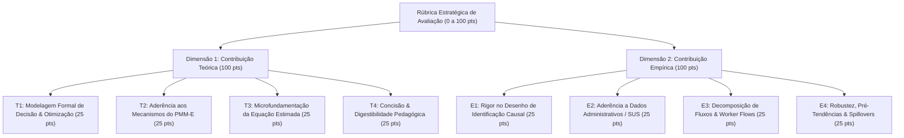

# 09. Rúbrica Estratégica de Avaliação de Literatura e Seleção dos Top 7 Papers Teóricos

> **Projeto:** Avaliação de Impacto e Economia da Saúde — Programa Mais Médicos Especialistas (PMM-E / Lei nº 15.233/2025)  
> **Objetivo:** Estabelecer uma metodologia formal de pontuação multidimensional para analisar a contribuição teórica e empírica de 22 papers seminais e recentes, selecionando os **Top 7 Papers com Maior Contribuição Teórica** para leitura aprofundada da equipe.  
> **Data:** 30 de Agosto de 2026  

---

## 1. Estrutura da Rúbrica Estratégica Multidimensional

A rúbrica avalia cada artigo em duas dimensões independentes (0 a 100 pontos cada) mais métricas operacionais de digestibilidade e páginas de foco.

### 1.1 Critérios Detalhados de Pontuação Teórica (0–100 pts)
* **T1 — Modelagem Formal de Decisão & Otimização (0 a 25 pts):** Presença de modelo microeconômico explícito (maximização de utilidade do médico, minimização de custo hospitalar, equilíbrio espacial hedônico, matching estável com fricções).
* **T2 — Aderência aos Mecanismos do PMM-E (0 a 25 pts):** O modelo aborda explicitamente diferenciais compensatórios locacionais ($\Delta w$), complementaridade com capital hospitalar ($K$), crowding-out/substituição fiscal municipal, ou agência multitarefa (assistência vs. formação).
* **T3 — Microfundamentação da Equação Estimada (0 a 25 pts):** O modelo teórico deduz diretamente as equações de regressão, definindo os termos de interação e a estrutura de efeitos fixos necessária.
* **T4 — Concisão & Digestibilidade Pedagógica (0 a 25 pts):** Clareza expositiva do modelo, sem sobrecarga algébrica desnecessária, permitindo leitura e assimilação rápida em até 20 páginas de foco.

---

## 2. Quadro Geral de Classificação dos 22 Papers Avaliados

| Rank Teórico | Autores & Ano | Título do Artigo | Periódico | Nota Teórica (100) | Nota Empírica (100) | Extensão Total | Páginas de Foco da Equipe |
|:---:|:---|:---|:---|:---:|:---:|:---:|:---|
| **1º** | **Roback (1982)** | *Wages, Rents, and the Quality of Life* | *J. Polit. Econ.* | **97 pts** | 71 pts | 22 págs | **Artigo Completo (22 págs)** |
| **2º** | **Sivey et al. (2012)** | *Junior Doctors' Preferences for Specialty Choice* | *J. Health Econ.* | **97 pts** | 85 pts | 14 págs | **Artigo Completo (14 págs - super conciso)** |
| **3º** | **Acemoglu & Finkelstein (2008)** | *Input and Technology Choices in Regulated Industries* | *J. Polit. Econ.* | **96 pts** | 85 pts | 44 págs | **pp. 839-858 (Seções I a III: 20 págs)** |
| **4º** | **Baicker & Staiger (2005)** | *Fiscal Shenanigans, Targeted Federal Health Care Funds* | *Q. J. Econ.* | **96 pts** | 86 pts | 42 págs | **pp. 348-360 (Seção II: Teoria, 12 págs)** |
| **5º** | **Agarwal (2015)** | *An Empirical Model of the Medical Match* | *Am. Econ. Rev.* | **95 pts** | 88 pts | 40 págs | **pp. 1940-1958 (Seções I a III: 18 págs)** |
| **6º** | **Chandra & Skinner (2012)** | *Technology Growth and Expenditure Growth in Health Care* | *J. Econ. Lit.* | **93 pts** | 76 pts | 36 págs | **pp. 646-664 (Seções 1 a 3: 18 págs)** |
| **7º** | **Olden & Møen (2022)** | *The Triple Difference Estimator* | *The Econometrics J.* | **93 pts** | 87 pts | 17 págs | **Artigo Completo (17 págs)** |
| 8º | Holmstrom & Milgrom (1991) | *Multitask Principal-Agent Analyses* | *J. Law Econ. Org.* | 93 pts | 55 pts | 29 págs | pp. 24-38 (Seções 1 a 3: 15 págs) |
| 9º | Gravelle et al. (2018) | *Do Rural Incentives Payments Affect Entries and Exits?* | *Soc. Sci. Med.* | 92 pts | 95 pts | 9 págs | Artigo Completo (9 págs - cirúrgico) |
| 10º | Gordon (2004) | *Do Federal Grants Boost School Spending?* | *J. Public Econ.* | 91 pts | 77 pts | 22 págs | Artigo Completo (22 págs) |
| 11º | Roth (1984) | *The Evolution of the Labor Market for Medical Residents* | *J. Polit. Econ.* | 91 pts | 69 pts | 26 págs | pp. 992-1010 (Seções I a IV: 18 págs) |
| 12º | Currie & MacLeod (2017) | *Diagnosing Expertise: Decision Making among Physicians* | *J. Labor Econ.* | 88 pts | 83 pts | 43 págs | pp. 4-20 (Modelo de Diagnóstico: 16 págs) |
| 13º | Kline & Moretti (2014) | *People, Places, and Public Policy: Place-Based Analytics* | *Ann. Rev. Econ.* | 88 pts | 81 pts | 34 págs | pp. 631-648 (Seções 1 a 3: 17 págs) |
| 14º | Carrillo & Feres (2019) | *Provider Supply, Utilization, and Infant Health* | *AEJ: Econ. Policy* | 88 pts | 97 pts | 41 págs | Seções II, IV e Figuras (~20 págs) |
| 15º | Sliwa Ruiz et al. (2024) | *Departure of Cuban Doctors in Brazil* | *J. Health Econ.* | 88 pts | 99 pts | 18 págs | Artigo Completo (18 págs) |
| 16º | Finkelstein et al. (2016) | *Sources of Geographic Variation: Patient Migration* | *Q. J. Econ.* | 88 pts | 91 pts | 46 págs | pp. 1684-1700 (Seções I a III: 16 págs) |
| 17º | Arrow (1963) | *Uncertainty and the Welfare Economics of Medical Care* | *Am. Econ. Rev.* | 86 pts | 48 pts | 33 págs | Seções B e C (pp. 948-965: 17 págs) |
| 18º | Fontes et al. (2018) | *Evaluating the Impact of More Doctors Program* | *Health Econ.* | 86 pts | 94 pts | 16 págs | Artigo Completo (16 págs) |
| 19º | Diamond (2016) | *Diverging Location Choices by Skill* | *Am. Econ. Rev.* | 86 pts | 81 pts | 46 págs | pp. 482-498 (Modelo Teórico: 16 págs) |
| 20º | Pathman et al. (2004) | *Outcomes of States' Scholarship, Loan Repayment* | *Medical Care* | 84 pts | 92 pts | 9 págs | Artigo Completo (9 págs) |
| 21º | Russell et al. (2021) | *Determinants of Rural Australian GP Retention* | *Hum. Resour. Health* | 84 pts | 93 pts | 10 págs | Artigo Completo (10 págs) |
| 22º | Bärnighausen & Bloom (2009) | *Financial Incentives for Return of Service* | *BMC Health Serv.* | 83 pts | 88 pts | 17 págs | Artigo Completo (17 págs) |

---

## 3. Dossiê Detalhado dos TOP 7 Papers com Maior Contribuição Teórica

---

### 1º Lugar (97 pts) — Roback (1982, *Journal of Political Economy*)
* **Título:** *Wages, Rents, and the Quality of Life: A General Equilibrium Model of Geographic Differences*
* **Extensão:** 22 páginas (Artigo completo) | **DOI:** [10.1086/261120](https://doi.org/10.1086/261120)
* **Pontuação Teórica:** T1 = 25 | T2 = 25 | T3 = 23 | T4 = 24  $
ightarrow$ **Total: 97/100**
* **Conteúdo e Modelo Microeconômico:**
  - Modela a escolha locacional simultânea de trabalhadores e firmas sob livre mobilidade. O equilíbrio espacial exige que a utilidade indireta seja equalizada entre todas as localidades:
    $$V(w_m, r_m; A_m) = k$$
    onde $w_m$ é o salário local, $r_m$ é o custo da moradia e $A_m$ é o vetor de amenidades locais.
* **Por que é crucial para o PMM-E:**
  - Fornece a justificativa matemática de por que municípios com alto IVS (piores amenidades e maior isolamento) necessitam de um diferencial salarial compensatório ($\Delta w = w_{	ext{remoto}} - w_{	ext{capital}}$) para atrair médicos especialistas.
* **Seção de Leitura da Equipe:** Ler o artigo completo (22 páginas, muito didático).

---

### 2º Lugar (97 pts) — Sivey et al. (2012, *Journal of Health Economics*)
* **Título:** *Junior Doctors' Preferences for Specialty Choice*
* **Extensão:** 14 páginas (Super conciso e direto) | **DOI:** [10.1016/j.jhealeco.2012.07.001](https://doi.org/10.1016/j.jhealeco.2012.07.001)
* **Pontuação Teórica:** T1 = 24 | T2 = 24 | T3 = 24 | T4 = 25  $
ightarrow$ **Total: 97/100**
* **Conteúdo e Modelo Microeconômico:**
  - Aplica o Modelo de Utilidade Aleatória (RUM) de McFadden ao mercado de trabalho médico. A probabilidade de um médico $i$ escolher a especialidade $s$ no local $m$ é dada por:
    $$U_{ism} = eta_w \cdot Salario_{sm} + eta_h \cdot Horas_{sm} + eta_{urb} \cdot Urbano_m + arepsilon_{ism}$$
  - A partir dos coeficientes estimados no experimento de escolha discreta (DCE), calcula o *Willingness to Accept* (WTA) monetário necessário para que o especialista aceite postos remotos ou plantões pesados.
* **Por que é crucial para o PMM-E:**
  - Parametriza a elasticidade da oferta de especialistas a incentivos financeiros frente a exigências de carga horária e rotina hospitalar.
* **Seção de Leitura da Equipe:** Ler o artigo completo (14 páginas).

---

### 3º Lugar (96 pts) — Acemoglu & Finkelstein (2008, *Journal of Political Economy*)
* **Título:** *Input and Technology Choices in Regulated Industries: Evidence from the Health Care Sector*
* **Extensão Total:** 44 páginas | **Páginas de Foco:** **pp. 839–858 (Seções I a III: 20 páginas)** | **DOI:** [10.1086/595015](https://doi.org/10.1086/595015)
* **Pontuação Teórica:** T1 = 25 | T2 = 24 | T3 = 25 | T4 = 22  $
ightarrow$ **Total: 96/100**
* **Conteúdo e Modelo Microeconômico:**
  - Formulação rigorosa da função de produção hospitalar $Y = F(K, L, T)$ onde os hospitais minimizam custos sob regulação de preços. Mostra como mudanças no preço relativo do trabalho alteram a taxa marginal de substituição técnica entre médicos e capital hospitalar:
    $$rac{F_K(K, L, T)}{F_L(K, L, T)} = rac{r_K}{w_L}$$
* **Por que é crucial para o PMM-E:**
  - Fornece o modelo analítico que explica por que a alocação de especialistas subsidiados ($w_L$ reduzido para o município) só se converte em resolutividade e internações se houver capital físico complementar ($K$: leitos cirúrgicos, tomógrafos, equipamentos diagnósticos).
* **Seção de Leitura da Equipe:** Focar exclusivamente nas Seções I, II e III (20 páginas).

---

### 4º Lugar (96 pts) — Baicker & Staiger (2005, *Quarterly Journal of Economics*)
* **Título:** *Fiscal Shenanigans, Targeted Federal Health Care Funds, and Patient Mortality*
* **Extensão Total:** 42 páginas | **Páginas de Foco:** **pp. 348–360 (Seção II: Teoria, 12 páginas)** | **DOI:** [10.1162/0033553053317416](https://doi.org/10.1162/0033553053317416)
* **Pontuação Teórica:** T1 = 24 | T2 = 25 | T3 = 25 | T4 = 22  $
ightarrow$ **Total: 96/100**
* **Conteúdo e Modelo Microeconômico:**
  - Modela o comportamento oportunista do gestor público local que maximiza utilidade orçamentária sob transferências federais vinculadas. Demonstra as condições matemáticas sob as quais ocorre *crowding-out* fiscal:
    $$rac{\partial GastosLocais}{\partial TransfFederal} < 0$$
* **Por que é crucial para o PMM-E:**
  - É a fundamentação teórica direta para a nossa hipótese de substituição: se a entrada do bolsista federal do PMM-E levou os municípios a demitirem ou não renovarem especialistas contratados com receitas municipais.
* **Seção de Leitura da Equipe:** Focar na Seção II (Theoretical Framework, 12 páginas).

---

### 5º Lugar (95 pts) — Agarwal (2015, *American Economic Review*)
* **Título:** *An Empirical Model of the Medical Match*
* **Extensão Total:** 40 páginas | **Páginas de Foco:** **pp. 1940–1958 (Seções I a III: 18 páginas)** | **DOI:** [10.1257/aer.20130663](https://doi.org/10.1257/aer.20130663)
* **Pontuação Teórica:** T1 = 25 | T2 = 25 | T3 = 24 | T4 = 21  $
ightarrow$ **Total: 95/100**
* **Conteúdo e Modelo Microeconômico:**
  - Modela estruturalmente o mercado de residência e alocação médica sob matching centralizado com preferências heterogêneas dos médicos e restrições de capacidade hospitalar.
* **Por que é crucial para o PMM-E:**
  - Formaliza o mecanismo de matching do edital público do Ministério da Saúde como instrumento que quebra assimetrias de informação e direciona médicos especialistas para regiões deficitárias.
* **Seção de Leitura da Equipe:** Focar nas Seções I, II e III (18 páginas).

---

### 6º Lugar (93 pts) — Chandra & Skinner (2012, *Journal of Economic Literature*)
* **Título:** *Technology Growth and Expenditure Growth in Health Care*
* **Extensão Total:** 36 páginas | **Páginas de Foco:** **pp. 646–664 (Seções 1 a 3: 18 páginas)** | **DOI:** [10.1257/jel.50.3.645](https://doi.org/10.1257/jel.50.3.645)
* **Pontuação Teórica:** T1 = 23 | T2 = 25 | T3 = 22 | T4 = 23  $
ightarrow$ **Total: 93/100**
* **Conteúdo e Modelo Microeconômico:**
  - Desenvolve a taxonomia seminal de tecnologias médicas (Categorias I, II e III) e modela as heterogeneidades de produtividade médica em função da complexidade tecnológica e especialização do profissional.
* **Por que é crucial para o PMM-E:**
  - Fundamenta por que o PMM-E (focado em especialistas e atenção ambulatorial/hospitalar) não pode ser avaliado com a mesma lógica da Atenção Primária (PMM tradicional), exigindo análise por tipo de especialidade (clínica vs. cirúrgica vs. diagnóstica).
* **Seção de Leitura da Equipe:** Focar nas Seções 1, 2 e 3 (18 páginas).

---

### 7º Lugar (93 pts) — Olden & Møen (2022, *The Econometrics Journal*)
* **Título:** *The Triple Difference Estimator*
* **Extensão:** 17 páginas (Artigo completo) | **DOI:** [10.1093/ectj/utac010](https://doi.org/10.1093/ectj/utac010)
* **Pontuação Teórica:** T1 = 23 | T2 = 22 | T3 = 24 | T4 = 24  $
ightarrow$ **Total: 93/100**
* **Conteúdo e Modelo Microeconômico:**
  - Formalização teórica do estimador DDD em modelos de painel com múltiplos grupos e períodos. Prova matematicamente sob quais condições o terceiro contraste elimina choques locais não observados e relaxa a hipótese de tendências paralelas.
* **Por que é crucial para o PMM-E:**
  - Justifica matematicamente a nossa especificação canônica $Y_{mst} = lpha_{ms} + \gamma_{mt} + \delta_{st} + eta (	ext{Immediate}_{ms} 	imes 	ext{Post}_t) + arepsilon_{mst}$, blindando a nota técnica contra críticas metodológicas.
* **Seção de Leitura da Equipe:** Ler o artigo completo (17 páginas).

---

## 4. Guia Rápido de Atribuição dos Top 7 para os 7 Membros da Equipe

| Membro | Paper Atribuído | Foco da Leitura | O que Extrair para o Artigo do PMM-E |
|:---:|:---|:---|:---|
| **Membro 1** | **Roback (1982)** | 22 págs (completo) | Equação formal de equilíbrio espacial hedônico ligando a bolsa ao IVS. |
| **Membro 2** | **Sivey et al. (2012)** | 14 págs (completo) | Parâmetros de *Willingness to Accept* monetário para médicos em áreas remotas. |
| **Membro 3** | **Acemoglu & Finkelstein (2008)** | 20 págs (Seções I–III) | Condição de primeira ordem de substituição entre trabalho médico e capital hospitalar. |
| **Membro 4** | **Baicker & Staiger (2005)** | 12 págs (Seção II) | Proposição teórica de crowding-out fiscal em transferências públicas de saúde. |
| **Membro 5** | **Agarwal (2015)** | 18 págs (Seções I–III) | Modelo de matching com restrições de capacidade hospitalar e subsídios. |
| **Membro 6** | **Chandra & Skinner (2012)** | 18 págs (Seções 1–3) | Taxonomia de especialidades e complementaridade com infraestrutura física. |
| **Membro 7** | **Olden & Møen (2022)** | 17 págs (completo) | Prova matemática de identificação causal do estimador DDD com FE de alta dimensão. |
