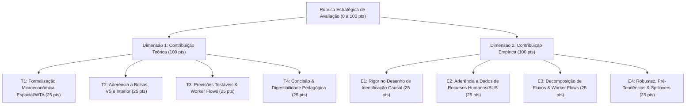

# 09. Rúbrica Estratégica de Avaliação de Literatura e Seleção dos Top Papers Teóricos

> **Projeto:** Avaliação de Impacto e Economia da Saúde — Programa Mais Médicos Especialistas (PMM-E / Lei nº 15.233/2025)  
> **Tema Central:** *Atração e Retenção de Médicos Especialistas em Cidades do Interior com base nas Diferentes Bolsas e no IVS (Índice de Vulnerabilidade Social).*  
> **Objetivo:** Estabelecer a metodologia formal de pontuação multidimensional para analisar a contribuição teórica e empírica de 18 papers candidatos e selecionar a composição ótima de leitura para a equipe.  
> **Data:** 31 de Agosto de 2026  

---

## 1. Estrutura da Rúbrica Estratégica Multidimensional

A rúbrica avalia cada artigo em duas dimensões independentes (0 a 100 pontos cada) mais métricas operacionais de digestibilidade e páginas de foco.

---

## 2. Dossiê Detalhado dos Principais Papers Teóricos Selecionados

---

### 1º Lugar — Roback (1982, *Journal of Political Economy*)
* **Título:** *Wages, Rents, and the Quality of Life: A General Equilibrium Model of Geographic Differences*
* **Extensão:** 22 páginas | **Foco:** pp. 1257–1272 (15 págs) | **DOI:** [10.1086/261120](https://doi.org/10.1086/261120)
* **Conteúdo e Modelo Microeconômico:**
  - Modela a escolha locacional simultânea de trabalhadores e firmas sob livre mobilidade. O equilíbrio espacial exige que a utilidade indireta seja equalizada:
    $$V(w_m, r_m; A_m) = \bar{u}$$
    onde cidades com piores amenidades e vulnerabilidade (alto IVS) exigem um diferencial salarial compensatório ($\Delta w > 0$).
* **Aplicação Estrutural ao PMM-E:**
  - Fornece a justificativa matemática formal para indexar as bolsas federais ao IVS 2010 do IPEA.

---

### 2º Lugar — Sivey et al. (2012, *Journal of Health Economics*)
* **Título:** *Junior Doctors' Preferences for Specialty Choice*
* **Extensão:** 14 páginas (Artigo completo) | **DOI:** [10.1016/j.jhealeco.2012.07.001](https://doi.org/10.1016/j.jhealeco.2012.07.001)
* **Conteúdo e Modelo Microeconômico:**
  - Aplica o Modelo de Utilidade Aleatória (RUM) e Discrete Choice Experiment (DCE) para estimar o *Willingness to Accept* (WTA) monetário de médicos para aceitar postos remotos no interior.
* **Aplicação Estrutural ao PMM-E:**
  - Parametriza a elasticidade da oferta de especialistas frente a incentivos financeiros escalonados.

---

### 3º Lugar — Gravelle, Scott, Yong & McGrail (2018, *Social Science & Medicine*)
* **Título:** *Do Rural Incentives Payments Affect Entries and Exits of General Practitioners?*
* **Extensão:** 9 páginas (Artigo completo) | **DOI:** [10.1016/j.socscimed.2018.09.041](https://doi.org/10.1016/j.socscimed.2018.09.041)
* **Conteúdo e Modelo Microeconômico:**
  - Modela teoricamente e estima em painel de contagem a dinâmica de entradas e saídas de médicos no interior:
    $$\Delta L_{mt} = Entry_{mt}(w_{\text{bolsa}}) - Exit_{mt}(w_{\text{bolsa}})$$
    Demonstra que o bônus monetário tem alta elasticidade em novas entradas, mas efeito quase nulo na retenção após 2 anos.
* **Aplicação Estrutural ao PMM-E:**
  - Fornece a base teórica e metodológica para decompor os efeitos do PMM-E em fluxos de atração (entradas) vs. evasão (saídas).

---

### 4º Lugar — Agarwal (2015, *American Economic Review*)
* **Título:** *An Empirical Model of the Medical Match*
* **Extensão:** 40 páginas | **Foco:** pp. 1940–1958 (18 págs) | **DOI:** [10.1257/aer.20130663](https://doi.org/10.1257/aer.20130663)
* **Conteúdo e Modelo Microeconômico:**
  - Modela o matching centralizado de médicos sob restrições salariais e fricções de busca espacial.
* **Aplicação Estrutural ao PMM-E:**
  - Explica o papel da clearinghouse central do Ministério da Saúde na mitigação de atritos de busca e atração de especialistas para hospitais periféricos.

---

### 5º Lugar — Baicker & Staiger (2005, *Quarterly Journal of Economics*)
* **Título:** *Fiscal Shenanigans, Targeted Federal Health Care Funds, and Patient Mortality*
* **Extensão:** 42 páginas | **Foco:** pp. 348–360 (12 págs) | **DOI:** [10.1162/0033553053317416](https://doi.org/10.1162/0033553053317416)
* **Conteúdo e Modelo Microeconômico:**
  - Modela a escolha do gestor municipal que remaneja gastos próprios ao receber transferências federais vinculadas à saúde (*crowding-out* fiscal).
* **Aplicação Estrutural ao PMM-E:**
  - Base microeconômica para estimar se o PMM-E gerou adição líquida de especialistas ou apenas substituição de contratos municipais preexistentes.

---

### 6º Lugar — Acemoglu & Finkelstein (2008, *Journal of Political Economy*)
* **Título:** *Input and Technology Choices in Regulated Industries: Evidence from the Health Care Sector*
* **Extensão:** 44 páginas | **Foco:** pp. 839–858 (20 págs) | **DOI:** [10.1086/595015](https://doi.org/10.1086/595015)
* **Conteúdo e Modelo Microeconômico:**
  - Modela a complementaridade estrita entre trabalho especializado ($L$) e capital tecnológico hospitalar ($K$).
* **Aplicação Estrutural ao PMM-E:**
  - Explica por que especialistas em cidades do interior sem hospital equipado apresentam baixa produtividade e alta evasão.

---

### 7º Lugar — Kline & Moretti (2014, *Annual Review of Economics*)
* **Título:** *People, Places, and Public Policy: Some Simple Analytics of Local Economic Development Programs*
* **Extensão:** 34 páginas | **Foco:** pp. 631–648 (17 págs) | **DOI:** [10.1146/annurev-economics-080213-040845](https://doi.org/10.1146/annurev-economics-080213-040845)
* **Conteúdo e Modelo Microeconômico:**
  - Framework de equilíbrio espacial para avaliação de políticas place-based e determinação do ganho líquido de bem-estar social.
* **Aplicação Estrutural ao PMM-E:**
  - Fundamenta a análise normativa de custo-benefício da focalização de bolsas no interior vulnerável.
