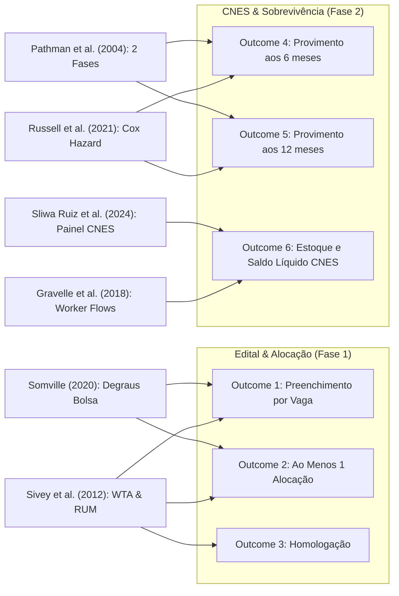
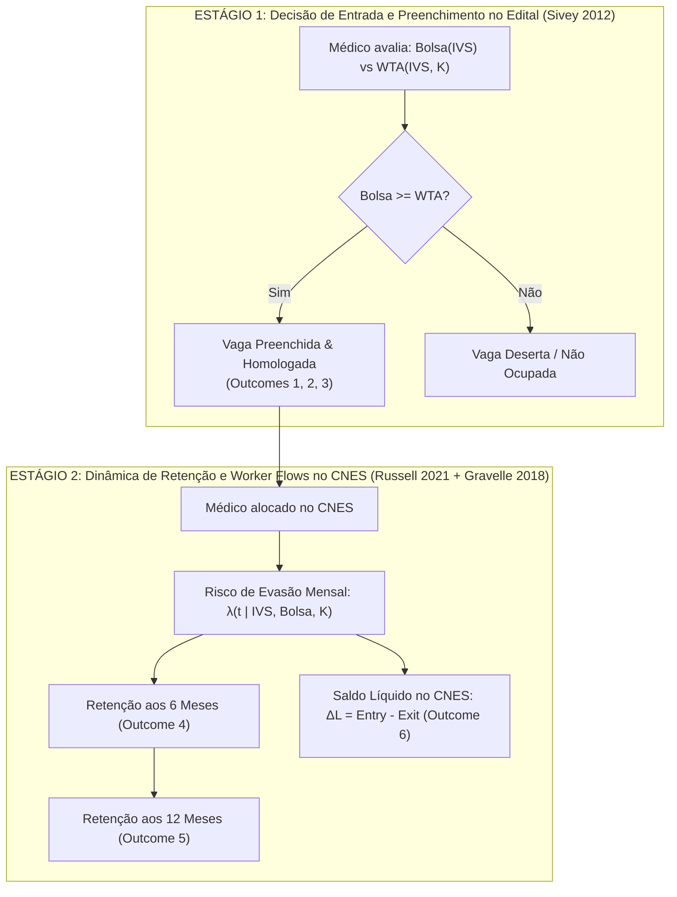

# 16. Equações Matemáticas dos 7 Papers Focais e Seleção do Modelo Microeconômico do PMM-E

> **Documento Teórico e Metodológico de Referência**  
> **Projeto:** Avaliação de Impacto e Economia da Saúde — Programa Mais Médicos Especialistas (PMM-E / Lei nº 15.233/2025)  
> **Tema Recomendado:** *Incentivos financeiros, vulnerabilidade territorial e provimento duradouro de especialistas: evidências do Mais Médicos Especialistas.*  
> **Pergunta Central:** *Bolsas maiores conseguem compensar as desvantagens territoriais no preenchimento e na manutenção das vagas do PMM-E?*  
> **Cadeia de Outcomes em Ordem:**  
> 1. Preenchimento por vaga ($Y^{(1)}_{vms}$);  
> 2. Ao menos uma alocação confirmada ($Y^{(2)}_{ms}$);  
> 3. Homologação, separada de alocação ($Y^{(3)}_{vms}$);  
> 4. Provimento ainda observado após 6 meses ($Y^{(4)}_{ims}$);  
> 5. Provimento ainda observado após 12 meses ($Y^{(5)}_{ims}$);  
> 6. Estoque municipal e entradas líquidas no CNES ($L_{mt}, \Delta L_{mt} = Entry_{mt} - Exit_{mt}$).  
> **Data de Consolidação:** 31 de Agosto de 2026  

---

## 1. Mapeamento das Equações Principais dos 7 Papers Focais

---

### [PAPER 1] Sivey et al. (2012, *Journal of Health Economics*) — Escolha Discreta e WTA da Bolsa no Interior

#### Equação 1.1 — Função de Utilidade Aleatória de McFadden (RUM)
$$U_{ijmt} = V_{ijmt} + \varepsilon_{ijmt} = \alpha_i + \beta_{w,i} \ln(w_{jmt}) + \beta_{loc,i} Loc_m + \beta_{h,i} Horas_j + \mathbf{X}_{ij}' \boldsymbol{\gamma} + \varepsilon_{ijmt}$$
* **Explicação:** A utilidade do médico $i$ ao escolher a vaga $j$ no município $m$ no edital $t$ é composta por uma parcela determinística ($V$) e um choque idiossincrático ($\varepsilon$). $w_{jmt}$ é a remuneração (bolsa federal + eventuais complementações), $Loc_m$ mensura o isolamento/vulnerabilidade territorial ($IVS_m$), e $Horas_j$ são as horas hospitalares/plantões exigidos.

#### Equação 1.2 — Probabilidade de Preenchimento da Vaga (Mixed Logit)
$$P_{jmt} = \mathbb{P}(U_{ijmt} \ge U_{iklt}, \forall k \ne j) = \int \frac{\exp\left( \beta_w \ln(w_{jmt}) + \beta_{loc} IVS_m + \beta_h Horas_j \right)}{\sum_{k \in \mathcal{C}} \exp\left( \beta_w \ln(w_{k}) + \beta_{loc} IVS_{m_k} + \beta_h Horas_k \right)} f(\boldsymbol{\beta} \mid \boldsymbol{\theta}) d\boldsymbol{\beta}$$
* **Explicação:** A probabilidade de uma vaga ser preenchida decorre da agregação das escolhas de todos os candidatos elegíveis. Quanto maior a bolsa $w_{jmt}$, maior o numerador; quanto maior o $IVS_m$ (desamenidade), menor a atratividade da vaga.

#### Equação 1.3 — Willingness to Accept (WTA) para Vulnerabilidade Territorial
$$WTA_{\text{interior}} = -\left. \frac{d w}{d IVS} \right|_{dU = 0} = - \frac{\partial U / \partial IVS}{\partial U / \partial w} = - \frac{\beta_{loc}}{\beta_w / w} = \left( \frac{-\beta_{loc}}{\beta_w} \right) w$$
* **Explicação:** O WTA é o adicional financeiro exato de bolsa ($\Delta w$) necessário para manter a utilidade do médico invariante ao aceitar uma vaga em município vulnerável. Se $\Delta \text{Bolsa}(IVS) \ge WTA(IVS)$, a vaga é preenchida ($Outcome \ 1 = 1$); se $\Delta \text{Bolsa}(IVS) < WTA(IVS)$, a vaga permanece deserta ($Outcome \ 1 = 0$).

#### Equação 1.4 — Heterogeneidade Estrutural: Prêmio Cirúrgico vs. Clínico
$$WTA_{\text{cirúrgico}} - WTA_{\text{clínico}} = \left( -\frac{\beta_{loc}^{\text{cir}}}{\beta_w^{\text{cir}}} \right) w - \left( -\frac{\beta_{loc}^{\text{clín}}}{\beta_w^{\text{clín}}} \right) w > 0$$
* **Explicação:** Especialistas cirúrgicos exigem prêmio monetário ~40% superior a clínicos porque o isolamento territorial restringe volume de procedimentos e capital físico hospitalar.

---

### [PAPER 2] Gravelle, Scott, Yong & McGrail (2018, *Social Science & Medicine*) — Worker Flows: Entradas vs. Saídas

#### Equação 2.1 — Equação Dinâmica de Transição de Estoque Municipal
$$L_{mt} = L_{m,t-1} + Entry_{mt} - Exit_{mt} \iff \Delta L_{mt} = Entry_{mt} - Exit_{mt}$$
* **Explicação:** A variação do estoque de médicos especialistas no município $m$ no mês $t$ é a diferença líquida entre fluxos brutos de entrada ($Entry$) e saída ($Exit$).

#### Equação 2.2 — Taxa de Entrada (Atração Imediata — FE Poisson)
$$\mathbb{E}[Entry_{mt} \mid \text{Bolsa}_m, IVS_m] = \exp\left( \alpha_m^E + \beta^E \ln(\text{Bolsa}_{mt}) + \gamma^E IVS_m + \delta_t^E \right)$$
* **Explicação:** As novas admissões/entradas respondem com elasticidade $\beta^E > 0$ ao valor da bolsa.

#### Equação 2.3 — Taxa de Saída (Evasão / Não Retenção — FE Poisson)
$$\mathbb{E}[Exit_{mt} \mid \text{Bolsa}_m, IVS_m] = \exp\left( \alpha_m^X + \beta^X \ln(\text{Bolsa}_{mt}) + \gamma^X IVS_m + \delta_t^X \right)$$
* **Explicação:** A evasão de médicos é determinada pelo IVS ($\gamma^X > 0$) e pela bolsa ($\beta^X$). O achado empírico clássico de Gravelle et al. é que $\beta^X \approx 0$ (a bolsa atrai na entrada, mas não segura na saída de longo prazo).

#### Equação 2.4 — Derivada do Saldo Líquido no CNES
$$\frac{\partial \Delta L_{mt}}{\partial \text{Bolsa}} = \underbrace{\beta^E \cdot Entry_{mt}}_{\text{Ganho de Atração } (>0)} - \underbrace{\beta^X \cdot Exit_{mt}}_{\text{Redução de Evasão } (\approx 0)}$$
* **Explicação:** Mostra analiticamente por que medir apenas o estoque bruto é insuficiente: um programa pode ter alta atração imediata (alto $Entry$), mas gerar acúmulo nulo se a rotatividade ($Exit$) for acelerada.

---

### [PAPER 3] Russell, McGrail & Humphreys (2021, *Human Resources for Health*) — Sobrevivência e Riscos Proporcionais de Cox

#### Equação 3.1 — Função de Taxa de Falha / Hazard de Evasão
$$\lambda(t \mid \mathbf{Z}_{im}) = \lim_{\Delta t \to 0} \frac{\mathbb{P}(t \le T < t + \Delta t \mid T \ge t)}{\Delta t} = \lambda_0(t) \exp\left( \mathbf{Z}_{im}' \boldsymbol{\gamma} \right)$$
* **Explicação:** $\lambda(t)$ é a taxa instantânea de cancelamento de contrato/saída do município no mês $t$, condicional a ter permanecido até $t-1$. $\lambda_0(t)$ é a taxa basal de saída e $\exp(\mathbf{Z}' \boldsymbol{\gamma})$ é o multiplicador de risco.

#### Equação 3.2 — Especificação do Multiplicador de Risco com Bolsa e IVS
$$\ln \left( \frac{\lambda(t \mid \mathbf{Z}_{im})}{\lambda_0(t)} \right) = \gamma_1 IVS_m - \gamma_2 \text{Bolsa}_m - \gamma_3 \text{InfraHospitalar}_m + \mathbf{X}_{im}' \boldsymbol{\beta}$$
* **Explicação:** O risco de evasão cresce com a vulnerabilidade ($IVS_m$, $\gamma_1 > 0$) e decresce com a bolsa ($\gamma_2 > 0$) e a infraestrutura hospitalar ($\gamma_3 > 0$).

#### Equação 3.3 — Função de Sobrevivência de Kaplan-Meier e Retenção aos 6 e 12 Meses
$$S(t \mid \mathbf{Z}_{im}) = \mathbb{P}(T > t) = \exp\left( -\int_0^t \lambda(u \mid \mathbf{Z}_{im}) du \right) = \left[ S_0(t) \right]^{\exp(\mathbf{Z}_{im}' \boldsymbol{\gamma})}$$
* **Aos 6 Meses ($Outcome \ 4$):** $S(6) = \mathbb{P}(\text{Provimento no CNES } \ge 6 \text{ meses}) = [S_0(6)]^{\exp(\gamma_1 IVS_m - \gamma_2 \text{Bolsa}_m - \gamma_3 K_m)}$.
* **Aos 12 Meses ($Outcome \ 5$):** $S(12) = \mathbb{P}(\text{Provimento no CNES } \ge 12 \text{ meses}) = [S_0(12)]^{\exp(\gamma_1 IVS_m - \gamma_2 \text{Bolsa}_m - \gamma_3 K_m)}$.

---

### [PAPER 4] Pathman et al. (2004, *Medical Care*) — Dinâmica de Coortes: Bolsa Ativa vs. Pós-Obrigação

#### Equação 4.1 — Estrutura de Taxa de Falha em Duas Fases Temporais
$$\lambda(t) = \begin{cases} 
\lambda_0(t) \exp\left( -\gamma_{\text{bolsa}} \text{Bolsa}_m - \theta \text{MultaContratual} \right), & \text{se } t \le T_{\text{obrigação}} \ (t \le 12\text{ meses, Bolsa Ativa}) \\
\lambda_0(t) \exp\left( \delta IVS_m - \gamma_{\text{mercado}} SalarioMercado_m - \mu Amenidades_m \right), & \text{se } t > T_{\text{obrigação}} \ (t > 12\text{ meses, Pós-Bolsa})
\end{cases}$$
* **Explicação:** Durante o período de bolsa ativa ($t \le 12\text{m}$), a taxa de saída é quase nula devido à transferência financeira e penalidades contratuais ($\lambda(t) \approx 0 \implies \text{Retenção } \approx 85\%-90\%$). Quando a bolsa cessa ($t > 12\text{m}$), o médico decide ficar apenas se a remuneração de mercado do município compensar o IVS.

#### Equação 4.2 — Probabilidade de Fixação Duradoura Condicional
$$\mathbb{P}(\text{Permanência no ano } 2 \mid \text{Bolsa}) = \underbrace{S(12)}_{\text{Conformidade Contratual (Alto)}} \times \underbrace{S_{\text{pós}}(12)}_{\text{Fixação Voluntária Local (Queda Severa)}}$$
* **Explicação:** O paper demonstra que o sucesso de curto prazo durante a bolsa não garante fixação após o 12º mês.

---

### [PAPER 5] Somville (2020, *World Development*) — Degraus de Incentivo e Dose-Resposta

#### Equação 5.1 — Função de Oferta Médica sob Degraus de Incentivo (Notches)
$$S_{mst} = \alpha_m + \gamma_t + \sum_{k=1}^K \beta_k \cdot \mathbb{I}(IVS_m \ge c_k) \times \text{Post}_t + g(IVS_m) + \mathbf{X}_{mst}' \boldsymbol{\theta} + \varepsilon_{mst}$$
* **Explicação:** Modela a resposta da oferta médica quando a bolsa salta descontinuamente em cutoffs $c_k$ de vulnerabilidade (ex.: R$ 15k $\to$ R$ 20k no IVS `0,400`, e R$ 20k $\to$ R$ 25k no IVS `0,500`).

#### Equação 5.2 — Interação com Infraestrutura Instalada (Capital Complementar)
$$\frac{\partial S_{mst}}{\partial \text{Bolsa}_m} = \phi_0 + \phi_1 \cdot \text{InfraHospitalar}_{ms}, \quad \text{com } \phi_1 > 0$$
* **Explicação:** A elasticidade da oferta em relação ao valor da bolsa é atenuada se o município não possuir infraestrutura clínica/hospitalar mínima para o especialista trabalhar.

---

### [PAPER 6] Bärnighausen & Bloom (2009, *BMC Health Services Research*) — Síntese Global e Modelo Híbrido

#### Equação 6.1 — Eficácia Global do Modelo Híbrido (Bolsa + Especialização)
$$P(\text{Conclusão}) = P(\text{Completar Serviço} \mid \text{Bolsa}) \times \left( 1 + \delta_{\text{acadêmica}} \cdot \mathbb{I}(\text{Titulação de Especialista}) \right)$$
* **Explicação:** A probabilidade de o profissional cumprir o contrato e não abandonar o posto aumenta em $\delta_{\text{acadêmica}} \approx +34\%$ quando a bolsa é atrelada a uma pós-graduação/especialização médica supervisionada (o desenho da Lei 15.233/2025).

---

### [PAPER 7] Sliwa Ruiz, Becker, Hone & Rocha (2024, *Journal of Health Economics*) — Dinâmica do CNES Mensal e Tempo de Vacância

#### Equação 7.1 — Taxa de Preenchimento / Hazard de Ocupação da Vaga no CNES
$$h_{\text{ocupação}}(t \mid IVS_m, \text{Bolsa}_m) = h_0(t) \exp\left( \beta_1 \ln(\text{Bolsa}_m) - \beta_2 IVS_m + \beta_3 (\ln(\text{Bolsa}_m) \times IVS_m) \right)$$
* **Explicação:** Modela a velocidade com que uma vaga aberta no CNES é ocupada por um médico credenciado. O termo de interação $\beta_3$ testa se uma bolsa maior consegue encurtar o tempo de vacância especificamente em municípios com alto IVS.

---

## 2. Como as Equações Mapeiam Cada um dos 6 Outcomes do Projeto

| Outcome a Medir | Nível de Análise | Equação Teórica Correspondente | Mecanismo Econômico a Testar |
|:---|:---|:---|:---|
| **1. Preenchimento por Vaga** | Vaga ($vms$) | $P_{vms} = \mathbb{I}\left( \text{Bolsa}(IVS_m) \ge WTA_i(IVS_m, K_{ms}) \right)$ (Sivey 2012; Somville 2020) | A bolsa da faixa é suficiente para superar o WTA territorial do médico para aquela vaga? |
| **2. Ao Menos 1 Alocação** | Município-Especialidade ($ms$) | $P_{ms}^{\ge 1} = 1 - \prod_{v=1}^{V_{ms}} (1 - P_{vms})$ (Sivey 2012; Agarwal 2015) | O município atrai pelo menos um especialista para abrir o serviço local? |
| **3. Homologação vs. Alocação** | Vaga / Inscrição | $P(\text{Homolog} \mid \text{Alocado}) = f(\text{Bolsa}_m, \text{CustosInstalação}_m)$ (Pathman 2004) | Fricção pós-alocação: desiste antes de iniciar por incompatibilidade de infraestrutura? |
| **4. Provimento aos 6 Meses** | Médico-Município ($ims$) | $S(6 \mid \mathbf{Z}) = \exp\left( -\int_0^6 \lambda_{\text{ativa}}(u) du \right)$ (Russell 2021; Pathman 2004) | Retenção sob bolsa ativa: adesão e cumprimento do primeiro semestre. |
| **5. Provimento aos 12 Meses** | Médico-Município ($ims$) | $S(12 \mid \mathbf{Z}) = \exp\left( -\int_0^{12} \lambda(u) du \right)$ (Russell 2021; Pathman 2004) | Retenção no limiar crítico de transição de ciclo formativo. |
| **6. Estoque e Saldo Líquido CNES** | Município-Mês ($mt$) | $\Delta L_{mt} = Entry_{mt}(\text{Bolsa}) - Exit_{mt}(\text{Bolsa})$ (Gravelle 2018; Sliwa Ruiz 2024) | Adição líquida real vs. substituição / efeito balde furado no SUS municipal. |

---

## 3. Avaliação das Melhores Opções para o Modelo Microeconômico Central

Analisamos três opções de modelagem microeconômica para o artigo/dissertação:

---

### OPÇÃO A — Modelo de Escolha Discreta Espacial e WTA (Base: Sivey et al. 2012 + Roback 1982)
* **Estrutura:** O médico escolhe o município $m$ que maximiza sua utilidade indireta $U_{im} = \alpha \ln(w_m) - \beta IVS_m + \gamma K_m + \varepsilon_{im}$.
* **Vantagens:** 
  - Extremamente intuitivo e elegante;
  - Deduz diretamente o conceito de **Willingness to Accept (WTA)** da bolsa para compensar o IVS;
  - Conecta-se perfeitamente com a pergunta central do trabalho (*"Bolsas maiores conseguem compensar desvantagens territoriais?"*).
* **Limitações:** Foca predominantemente na decisão estática de entrada/preenchimento (Outcomes 1, 2 e 3), sendo menos detalhado na dinâmica de evasão ao longo do tempo (Outcomes 4, 5 e 6).

---

### OPÇÃO B — Modelo de Worker Flows e Transição de Estoque no SUS (Base: Gravelle et al. 2018 + Baicker & Staiger 2005)
* **Estrutura:** O município possui um estoque $L_{mt} = L_{m,t-1} + Entry_{mt}(w_m) - Exit_{mt}(w_m)$. A bolsa federal altera os fluxos brutos de admissão e demissão.
* **Vantagens:** 
  - Conexão direta com os microdados administrativos do CNES mensal;
  - Modela perfeitamente o fenômeno do "balde furado" (alta entrada com alta saída) e o risco de *crowding-out* fiscal.
* **Limitações:** Trata os fluxos no nível agregado municipal, perdendo a decisão individual do médico e a heterogeneidade de preferências.

---

### OPÇÃO C — Modelo de Sobrevivência Dinâmica e Taxa de Evasão (Base: Russell et al. 2021 + Pathman et al. 2004)
* **Estrutura:** O médico aceita o posto e decide a cada mês $t$ se permanece ou evade via função de risco $\lambda(t \mid IVS_m, Bolsa_m, K_m)$.
* **Vantagens:** 
  - Modela diretamente a sustentabilidade e a duração do vínculo (Outcomes 4 e 5: 6 meses e 12 meses);
  - Captura a distinção crucial entre bolsa ativa e pós-obrigação.
* **Limitações:** Assume que a atração inicial já ocorreu, focando apenas no pós-alocação.

---

## 4. Recomendação Definitiva: O Modelo Canônico em Dois Estágios (Sivey + Gravelle/Russell)

A formulação teórica ideal para o trabalho é um **Modelo Microeconômico Unificado em Dois Estágios**, que integra as equações mais elegantes de **Sivey et al. (2012)** (Estágio 1: Atração no Edital) e **Gravelle et al. (2018) / Russell et al. (2021)** (Estágio 2: Retenção e Worker Flows no CNES).

### Formalização do Modelo Recomendado para o Paper

#### Estágio 1 — A Decisão de Entrada e Preenchimento da Vaga:
O médico $i$ se inscreve e aceita a vaga no município $m$ se e somente se:
$$\ln(\text{Bolsa}_m) \ge \ln(WTA_{im}) \iff \ln(\text{Bolsa}_m) \ge \frac{\beta_{loc}}{\beta_w} IVS_m - \frac{\beta_K}{\beta_w} K_{ms} + \xi_{im}$$
Assim, a probabilidade de **Preenchimento da Vaga** ($Outcome \ 1$) e de **Ao Menos Uma Alocação** ($Outcome \ 2$) é dada por:
$$Y^{(1)}_{vms} = \Phi\left( \beta_0 + \beta_1 \ln(\text{Bolsa}_m) - \beta_2 IVS_m + \beta_3 (\ln(\text{Bolsa}_m) \times IVS_m) + \beta_4 K_{ms} \right)$$
* **Previsão Testável 1:** Se $\beta_3 > 0$, a bolsa maior consegue compensar a desvantagem territorial do alto IVS no preenchimento.

#### Estágio 2 — A Dinâmica de Sobrevivência e Retenção no CNES:
Uma vez alocado ($Y^{(1)} = 1$), o médico permanece no município a cada mês $t \in [1, 12]$ sob uma taxa instantânea de evasão $\lambda(t)$:
$$\lambda(t \mid IVS_m, \text{Bolsa}_m, K_{ms}) = \lambda_0(t) \exp\left( \gamma_1 IVS_m - \gamma_2 \text{Bolsa}_m - \gamma_3 K_{ms} \right)$$
A probabilidade de **Provimento Observado aos 6 e 12 Meses** ($Outcomes \ 4 \text{ e } 5$) é a função de sobrevida:
$$S(t) = \exp\left( -\Lambda_0(t) e^{\gamma_1 IVS_m - \gamma_2 \text{Bolsa}_m - \gamma_3 K_{ms}} \right)$$
E o impacto agregado sobre o **Estoque Municipal e Entradas Líquidas no CNES** ($Outcome \ 6$) é:
$$\Delta L_{mt} = \underbrace{Entry_{mt}(\text{Bolsa}_m, IVS_m)}_{\text{Estágio 1 (Atração)}} - \underbrace{\lambda(t \mid IVS_m, \text{Bolsa}_m) \cdot L_{m,t-1}}_{\text{Estágio 2 (Evasão)}}$$
* **Previsão Testável 2:** A política é um sucesso sustentável se a bolsa não apenas impulsiona $Entry$, mas também reduz $\lambda(t)$, garantindo que $\Delta L_{mt} > 0$ aos 6 e 12 meses.
