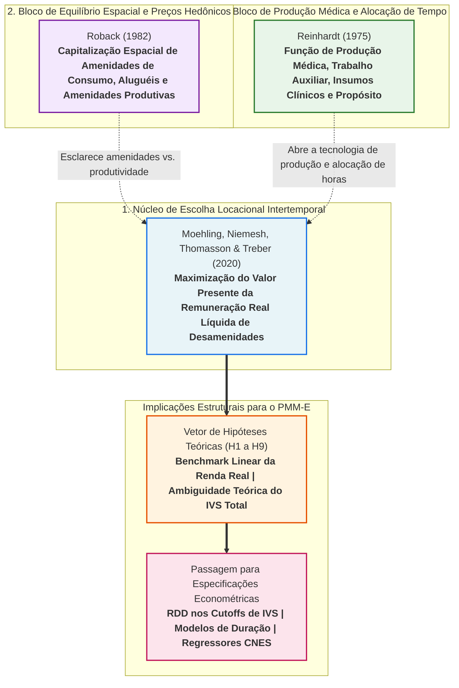

# 17. Base Microeconômica da Escolha Locacional Médica

> **Projeto:** Avaliação de Impacto e Economia da Saúde — Programa Mais Médicos Especialistas (PMM-E / Lei nº 15.233/2025)  
> **Objeto:** Decisão intertemporal de alocação espacial, utilidade e oferta de trabalho médico  
> **Status:** Documento teórico canônico de referência para hipóteses, canais de transmissão e especificações econométricas  
> **Data de Consolidação:** 31 de agosto de 2026  

---

## 1. Arquitetura Teórica

A fundamentação microeconômica do projeto estrutura-se em **três camadas complementares**:



1. **Moehling et al. (2020) constituem o núcleo:** formalizam o problema intertemporal de escolha locacional do médico como a maximização do fluxo descontado de remuneração real esperado líquido de desamenidades e custos locais.
2. **Roback (1982) complementa o bloco espacial:** explicita o mecanismo de equilíbrio espacial geral, no qual amenidades de consumo, custos de moradia (aluguéis) e amenidades produtivas se equilibram no território via diferenciais compensatórios.
3. **Reinhardt (1975) complementa o bloco de produção médica:** explicita a microfundamentação da prática médica por meio da alocação de tempo (trabalho vs. lazer), insumos auxiliares e de capital físico, tecnologia de produção e senso de responsabilidade comunitária ($D$).

> [!NOTE]
> **Autonomia e Coerência Teórica:**  
> Os três trabalhos seminais não foram escritos como um modelo único conjunto. A integração aqui adotada é **estritamente interpretativa e conceitual**: Roback (1982) e Reinhardt (1975) abrem os mecanismos econômicos que operam em forma reduzida na equação locacional de Moehling et al. (2020). **Nenhuma função *ad hoc* artificial é inventada** para fundi-los; preservam-se rigorosamente as equações originais publicadas.

---

## 2. Moehling et al. (2020) — Escolha Locacional Intertemporal

Moehling, Niemesh, Thomasson e Treber (2020, p. 187) escrevem o problema microeconômico de escolha locacional do médico como:

$$
\arg\max_{i \in \mathcal{I}} U(\omega_i) = \arg\max_{i \in \mathcal{I}} \left\{ \sum_t \delta^t \left[ \frac{\mathbb{E}\left(w^{(s)}_{it}\right)}{p_{it}} - c^{(s)}_{it} \right] \right\}
$$

onde:

* $i \in \mathcal{I}$ indexa a localidade / município pertencente ao conjunto de escolhas viáveis $\mathcal{I}$;
* $t$ indexa o período temporal (horizonte de planejamento);
* $s$ identifica o grupo de qualificação / especialidade médica;
* $w^{(s)}_{it}$ é a remuneração nominal esperada do especialista do tipo $s$ no município $i$ no tempo $t$;
* $p_{it}$ é o nível geral de preços / custo de vida local;
* $c^{(s)}_{it}$ reúne custos de instalação, custos de transporte e desamenidades de consumo da localidade;
* $\delta \in (0, 1)$ é o fator de desconto intertemporal subjetivo.

### Mecanismo Econômico

O médico escolhe a localidade que maximiza o **valor presente líquido da remuneração real esperada**, deduzida dos custos e desamenidades locacionais ($c$).

* **Custos e amenidades de consumo ($c$):** O artigo inclui expressamente preferências por estilo de vida (rural vs. urbano), distância da família e custos de moradia/deslocamento.
* **Amenidades produtivas:** Hospitais, laboratórios, densidade de mercado, malha viária, aglomeração profissional e proximidade de polos universitários são modelados como atributos que elevam o retorno nominal esperado $\mathbb{E}(w^{(s)}_{it})$.
* **Produção em forma reduzida:** Moehling et al. não especificam uma função de produção clínica explícita; a tecnologia local e o capital hospitalar deslocam o retorno monetário esperado $\mathbb{E}(w)$, que altera o valor da opção espacial.

---

## 3. Reinhardt (1975) — Utilidade, Alocação de Tempo e Produção Médica

Reinhardt (1975, pp. 131–162) formaliza a microeconomia da prática médica através do seguinte sistema estrutural:

### 3.1 Função de Utilidade do Médico

$$
U = U(R, Y, L, D; \mathbf{Z})
$$

### 3.2 Restrição de Dotação Temporal

$$
\bar{H} = R + H
$$

### 3.3 Função de Produção de Serviços Médicos

$$
q = f(H, L, K; \boldsymbol{\Omega})
$$

### 3.4 Renda Líquida Disponível

$$
Y = [1 - t(\pi + I)] \cdot (\pi + I)
$$

### 3.5 Lucro / Saldo Operacional da Prática

$$
\pi = p q - w L - r K
$$

onde:

* $R$: horas dedicadas ao lazer;
* $H$: horas dedicadas ao trabalho clínico pelo médico;
* $\bar{H}$: dotação total de tempo disponível ($\bar{H} = R + H$);
* $Y$: renda líquida disponível do profissional;
* $I$: renda externa à prática clínica;
* $t(\cdot)$: função de tributação sobre a renda total;
* $q$: volume físico de serviços e procedimentos médicos produzidos;
* $L$: contratação de pessoal de apoio e enfermagem (trabalho auxiliar);
* $K$: vetor de insumos de capital físico não laborais (leitos, equipamentos diagnósticos, salas cirúrgicas);
* $D$: dimensão de responsabilidade comunitária e impacto assistencial percebido pelo médico;
* $\mathbf{Z}$: vetor de características individuais e de ciclo de vida que deslocam as preferências de utilidade;
* $\boldsymbol{\Omega}$: parâmetros tecnológicos e de infraestrutura de saúde da rede;
* $p$: preço unitário ou valor de reembolso/remuneração por unidade de procedimento médico;
* $w, r$: custos unitários dos fatores auxiliares de trabalho ($w$) e de capital físico ($r$).

> [!TIP]
> **Distinção de Notação:**  
> O símbolo $p$ possui significado estritamente diferenciado entre os modelos: em **Moehling et al. (2020)**, $p_{it}$ representa o *índice de preços ao consumidor / custo de vida municipal*; em **Reinhardt (1975)**, $p$ representa a *tarifa de reembolso / remuneração unitária do procedimento clínico*.

---

## 4. Roback (1982) — Amenidades de Consumo e Amenidades Produtivas no Equilíbrio Espacial

Roback (1982, pp. 1257–1278) formaliza a equalização espacial de utilidades e custos no território:

### 4.1 Problema de Otimização do Trabalhador

$$
\max_{x, \ell^c} U(x, \ell^c; s) \quad \text{sujeito a} \quad w + I = x + r \ell^c
$$

### 4.2 Condição de Equilíbrio Espacial do Trabalho (Livre Mobilidade)

$$
V(w, r; s) = k
$$

### 4.3 Condição de Equilíbrio da Produção (Custo Unitário Normalizado)

$$
C(w, r; s) = 1
$$

onde:

* $x$: consumo do bem numerário composto ($p_x = 1$);
* $\ell^c$: quantidade de terra / moradia demandada para consumo residencial;
* $r$: preço da terra / aluguel imobiliário local;
* $w$: remuneração salarial nominal;
* $I$: renda não originada do trabalho;
* $s$: vetor de atributos, amenidades urbanas e características territoriais da localidade;
* $V(w, r; s)$: função de utilidade indireta do trabalhador;
* $C(w, r; s)$: função de custo unitário de operação na localidade.

### Mecanismo de Capitalização Espacial

O modelo de Roback demonstra que atributos territoriais ($s$) exercem dupla influência no equilíbrio espacial:
1. **Pelo lado da utilidade (amenidades de consumo):** áreas de maior atratividade e qualidade de vida geram utilidade direta, permitindo que trabalhadores aceitem salários nominais menores e/ou paguem aluguéis mais altos;
2. **Pelo lado da firma (amenidades produtivas):** infraestrutura local, malha logística e insumos complementares reduzem custos de produção, viabilizando o pagamento de salários nominais superiores.

---

## 5. Relação Estrutural entre os Três Modelos

| Dimensão Teórica | Moehling et al. (2020) | Roback (1982) | Reinhardt (1975) |
| :--- | :--- | :--- | :--- |
| **Pergunta Central** | *Qual localidade o médico escolhe para exercer sua profissão?* | *Como amenidades, salários e aluguéis se equalizam no espaço?* | *Como o médico combina tempo, equipe e insumos para produzir saúde?* |
| **Tratamento da Produção** | **Forma Reduzida:** amenidades produtivas deslocam a remuneração esperada $\mathbb{E}(w)$. | **Função de Custo Geral:** produtividade local entra na função de custo $C(w, r; s)$. | **Função de Produção Explícita:** $q = f(H, L, K; \boldsymbol{\Omega})$. |
| **Tratamento da Renda** | **Poder de Compra Real:** remuneração deflacionada $\mathbb{E}(w)/p$. | **Restrição Orçamentária:** renda nominal gasta em consumo ($x$) e moradia ($r \ell^c$). | **Lucro da Prática e Impostos:** $Y = [1-t(\pi+I)](\pi+I)$. |
| **Espaço e Amenidades** | Custos e desamenidades aditivas ($-c$); amenidades produtivas em $\mathbb{E}(w)$. | Vetor $s$ desloca simultaneamente utilidade ($V$) e custos da firma ($C$). | Vetor $\mathbf{Z}$ desloca utilidade; vetor $\boldsymbol{\Omega}$ desloca tecnologia. |
| **Papel no Projeto PMM-E** | **Equação de Escolha Canônica** para a decisão do especialista. | **Microfundamentação do Equilíbrio Espacial** e diferenciais por IVS. | **Microfundamentação da Infraestrutura Clínica** e restrição temporal. |

---

## 6. Modelo Microeconômico Adotado

O modelo microeconômico adotado como **fundamento canônico** para o estudo é o problema intertemporal de escolha locacional de **Moehling et al. (2020)**. Ele é adotado de forma estrita, preservando seus primitivos.

Para viabilizar a derivação de estáticas comparativas e hipóteses testáveis sem alterar o modelo, define-se o índice de atratividade da localidade $i$ por:

$$
V_i \equiv \sum_t \delta^t \left[ \frac{\mathbb{E}\left(w^{(s)}_{it}\right)}{p_{it}} - c^{(s)}_{it} \right]
$$

A regra de decisão ótima do médico especialista consiste em:

$$
i^* = \arg\max_{i \in \mathcal{I}} V_i
$$

Dessa forma, a avaliação comparativa de cada município pondera:
1. **Remuneração nominal esperada:** bolsa-formação federal fixada pela política e eventuais contrapartidas;
2. **Poder de compra real:** nível local de preços e custos habitacionais;
3. **Custos e desamenidades de consumo:** distância geográfica da família, infraestrutura urbana e transporte;
4. **Desconto intertemporal:** peso relativo atribuído a ganhos presentes versus benefícios futuros de qualificação e certificação profissional ($\delta^t$).

---

## 7. Contextualização e Mapeamento dos Primitivos para o PMM-E

> [!IMPORTANT]
> **Status Epistemológico do IVS 2010:**  
> O **Índice de Vulnerabilidade Social (IVS 2010 do IPEA)** não é um primitivo matemático das funções originais. No PMM-E, o IVS atua simultaneamente como:
> 1. **Regra Administrativa de Pagamento:** determina as faixas de bolsa (R\$ 10.000, R\$ 15.000, R\$ 20.000);
> 2. **Indicador de Desamenidade Urbana:** correlacionado com menor oferta de lazer e isolamento;
> 3. **Indicador de Restrição de Capital Físico:** correlacionado com escassez de leitos e equipamentos no CNES;
> 4. **Indicador de Necessidade de Saúde:** demanda epidemiológica não atendida ($D$).
> 
> Por essa razão, **o IVS não pode ser reduzido a uma única dimensão teórica**, e seu efeito líquido total é teoricamente ambíguo. O IVS 2010 permanece a **running variable canônica** do estudo.

| Primitivo Teórico | Interpretação Econômica no PMM-E | Proxy e Mapeamento Empírico no Repositório |
| :--- | :--- | :--- |
| $\frac{\mathbb{E}(w)}{p}$ *(Moehling et al.)* | Retorno monetário real esperado da bolsa-formação | Faixa de Bolsa Federal (R\$ 10k / 15k / 20k) deflacionada por índice de custo regional |
| $c$ *(Moehling et al.)* | Custos de deslocamento, dupla residência e desamenidades | Distância rodoviária até polo regional/capital, indicadores de infraestrutura urbana |
| Amenidades Produtivas | Infraestrutura hospitalar, apoio diagnóstico e densidade de equipe | Variáveis CNES basais: leitos, tomógrafos, ultrassons, equipe de enfermagem |
| $\delta^t$ *(Moehling et al.)* | Ponderação intertemporal de retornos de formação e certificação | Duração do programa (12 a 24 meses), bônus de titulação e progressão de carreira |
| $s, r$ *(Roback)* | Amenidades residenciais e custo local de moradia | Aluguel médio estimado, indicadores de serviços urbanos e segurança pública |
| $H, R$ *(Reinhardt)* | Divisão da carga de trabalho médico entre SUS e lazer | Carga horária semanal no PMM-E (20h) e acúmulo de vínculos no CNES |
| $L, K, \boldsymbol{\Omega}$ *(Reinhardt)* | Capital complementar de suporte à prática clínica especializada | Estoque de pessoal auxiliar ($L$) e equipamentos instalados ($K$) no estabelecimento |
| $D$ *(Reinhardt)* | Motivação por impacto assistencial e compromisso social | Vulnerabilidade social da população atendida e índice de carência de especialistas |

---

## 8. Hipóteses Teóricas Derivadas

As hipóteses estruturais a seguir decorrem diretamente das equações dos modelos canônicos selecionados sob condições explícitas de monotonicidade:

```
+---------------------------------------------------------------------------------------------------+
| H1: Remuneração Real Esperada (+)          | dV/dE(w) = delta^t / p_it > 0                        |
| H2: Nível de Preços e Custo de Vida (-)    | dV/dp_it = -delta^t * E(w) / p_it^2 < 0              |
| H3: Desamenidades e Custo Locacional (-)   | dV/dc = -delta^t < 0                                 |
| H4: Amenidades Produtivas Complementares(+)| dV/da_it = (delta^t / p_it) * [dE(w)/da_it] > 0      |
| H5: Desutilidade do Trabalho no Lazer (-)  | dU/dH |_(Y,L,D) = -U_R < 0                           |
| H6: Capital Clínico e Equipe Auxiliar (+)  | dq/dK > 0, dq/dL > 0 (via expansão de renda/impacto) |
| H7: Propósito Assistencial Social (+)      | dU/dD = U_D > 0 (condicional a médicos motivados)    |
| H8: Desconto Temporal da Formação Futura   | Peso delta^t decrescente com o horizonte de tempo t  |
| H9: Ambiguidade Teórica do IVS Total       | dV/d(IVS) = Sinais opostos entre Bolsa vs. Desamenid.|
+---------------------------------------------------------------------------------------------------+
```

---

### Hipótese 1. A remuneração real esperada eleva linearmente o valor da opção

Na equação de Moehling et al. (2020), para $p_{it} > 0$ e $\delta > 0$:

$$
\frac{\partial V_i}{\partial \mathbb{E}\left(w^{(s)}_{it}\right)} = \frac{\delta^t}{p_{it}} > 0
$$

* **Implicação Empírica:** Aumentos no valor nominal da bolsa-formação elevam de forma monótona a atratividade do município e a taxa de preenchimento de vagas ($Outcome \ 1$), mantidos constantes os preços locais e custos de instalação.

---

### Hipótese 2. Níveis de preços mais altos reduzem a atratividade da remuneração nominal

Diferenciando $V_i$ em relação ao nível de preços local $p_{it}$, para $\mathbb{E}(w^{(s)}_{it}) > 0$:

$$
\frac{\partial V_i}{\partial p_{it}} = -\delta^t \frac{\mathbb{E}\left(w^{(s)}_{it}\right)}{p_{it}^2} < 0
$$

* **Implicação Empírica:** Uma mesma bolsa nominal de R\$ 15.000 gera menor atratividade e retenção em municípios com elevado custo de vida e aluguel habitacional. O modelo de Roback (1982) reforça esse canal através do custo de terra/moradia ($r \ell^c$).

---

### Hipótese 3. Custos e desamenidades locacionais diminuem o valor da opção

$$
\frac{\partial V_i}{\partial c^{(s)}_{it}} = -\delta^t < 0
$$

* **Implicação Empírica:** Municípios distantes de capitais, com baixa conectividade e escassas opções de lazer exigem maior diferencial compensatório para atrair profissionais.

---

### Hipótese 4. Amenidades produtivas ampliam a atração quando elevam o retorno esperado

Seja $a_{it}$ uma amenidade produtiva (ex.: centro cirúrgico equipado, laboratório de imagens) que eleva o rendimento esperado da prática:

$$
\frac{\partial V_i}{\partial a_{it}} = \frac{\delta^t}{p_{it}} \cdot \frac{\partial \mathbb{E}\left(w^{(s)}_{it}\right)}{\partial a_{it}} > 0 \quad \Longleftrightarrow \quad \frac{\partial \mathbb{E}\left(w^{(s)}_{it}\right)}{\partial a_{it}} > 0
$$

* **Implicação Empírica:** A existência de infraestrutura prévia no CNES potencializa o impacto da bolsa federal, aumentando o preenchimento de vagas cirúrgicas e diagnósticas.

---

### Hipótese 5. Horas de trabalho geram desutilidade pelo canal do lazer

Da restrição temporal de Reinhardt (1975), $R = \bar{H} - H$. Sob $U_R \equiv \frac{\partial U}{\partial R} > 0$:

$$
\left. \frac{\partial U}{\partial H} \right|_{Y, L, D} = -U_R < 0
$$

* **Implicação Empírica:** Sobrecargas de plantão e ausência de flexibilidade de jornada reduzem o bem-estar do especialista, acelerando a taxa de evasão ($Exit$).

---

### Hipótese 6. Condições produtivas dependem de canais tecnológicos específicos

Na tecnologia $q = f(H, L, K; \boldsymbol{\Omega})$, melhorias em equipe de enfermagem ($L$) e capital diagnóstico ($K$) expandem a utilidade se:
1. Elevarem a receita e o rendimento líquido ($\pi$);
2. Reduzirem o esforço temporal necessário por atendimento;
3. Ampliarem a resolutividade e o impacto assistencial ($D$).

---

### Hipótese 7. Necessidade de saúde gera utilidade sob preferências orientadas por propósito

Na formulação de Reinhardt (1975), $D$ entra diretamente em $U$. A atuação em áreas carentes amplia o bem-estar do médico se e somente se:

$$
\frac{\partial U}{\partial D} = U_D > 0
$$

* **Implicação Empírica:** Municípios com carência assistencial extrema atraem prioritariamente especialistas com forte orientação pró-social e vocação pública para o SUS.

---

### Hipótese 8. Benefícios e certificações futuras sofrem desconto intertemporal

Pelo fator $\delta^t$, ganhos acumulados no período $t$ recebem peso estritamente decrescente quando $0 < \delta < 1$.

* **Implicação Empírica:** O valor formativo do PMM-E (título de especialista e mentoria) exerce maior atração sobre médicos recém-formados em início de carreira do que sobre profissionais seniores consolidados.

---

### Hipótese 9. O efeito líquido total do IVS sobre a escolha é teoricamente ambíguo

Como o IVS 2010 atua simultaneamente em canais com sinais contrários:
* **Canal Positivo (+):** Faixa de bolsa mais alta (R\$ 20.000 no IVS $\ge 0{,}500$);
* **Canal Negativo (-):** Maior desamenidade urbana ($c$) e precariedade de capital clínico ($K$);
* **Canal Condicional ($\pm$):** Necessidade epidemiológica compatível com o vetor de propósito ($D$),

a teoria **não impõe sinal único a priori** para $\frac{dV_i}{d(IVS_m)}$. Essa ambiguidade é um resultado estrutural da teoria, reforçando a necessidade de identificação causal empírica.

---

## 9. Implicações Estruturais sobre Formas Funcionais

1. **Benchmark Linear em Nível Real:** A formulação de Moehling et al. (2020) introduz a remuneração real linearmente ($\mathbb{E}(w)/p$). Portanto, a especificação primária recomendada para o estudo utiliza a bolsa em termos reais em nível, sem impor *a priori* retornos marginais decrescentes artificiais.
2. **Restrição a Formas Logarítmicas ou Exponenciais:** Embora especificações logarítmicas ($\ln w$) possam ser testadas em análises de sensibilidade (associadas a modelos de utilidade côncava do tipo Bernoulli), elas constituem hipóteses teóricas alternativas e não decorrem da equação de Moehling et al. Funções exponenciais do tipo CARA ($-\exp(-aw)$) não possuem respaldo nos modelos de escolha espacial médica selecionados.
3. **Não Imposição de Sinal para o IVS:** O modelo veda a imposição mecânica de interações artificiais como $\beta_{\text{Bolsa} \times \text{IVS}} > 0$ sem fundamentação econométrica explícita, preservando a transparência na identificação de cada mecanismo de transmissão.

---

## 10. Referências Canônicas

* **Moehling, C. M.; Niemesh, G. T.; Thomasson, M. A.; Treber, J. (2020).** [*Medical Education Reforms and the Origins of the Rural Physician Shortage*](https://doi.org/10.1007/s11698-019-00187-w). **Cliometrica**, 14(2), 181–225. ([Manuscrito dos Autores](https://niemesgt.github.io/files/MoehlingNiemeshThomassonTreber2019.pdf)).
* **Reinhardt, U. E. (1975).** [*Health Manpower Planning in a Market Context: The Case of Physician Manpower*](https://pure.iiasa.ac.at/213/1/XB-75-001.pdf), em N. T. J. Bailey e M. Thompson (eds.), *Systems Aspects of Health Planning*, North-Holland / IIASA, pp. 131–162.
* **Roback, J. (1982).** [*Wages, Rents, and the Quality of Life: A General Equilibrium Model of Geographic Differences*](https://doi.org/10.1086/261120). **Journal of Political Economy**, 90(6), 1257–1278. ([PDF](https://www.nathanschiff.com/webdocs/grad_urban/urban_papers/Roback_JPE_1982.pdf)).
