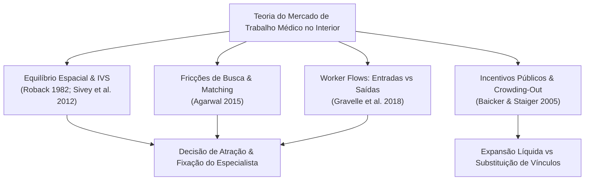
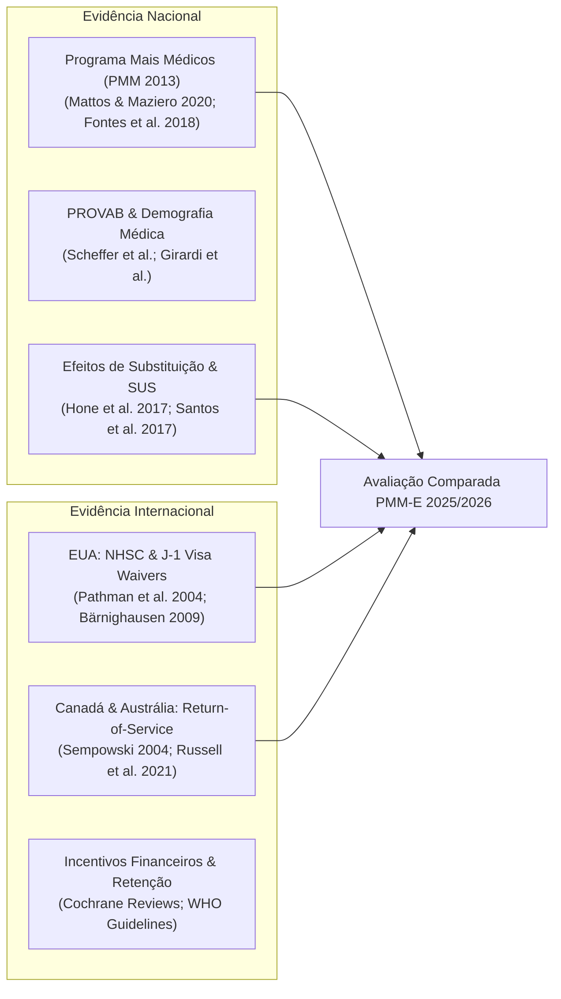
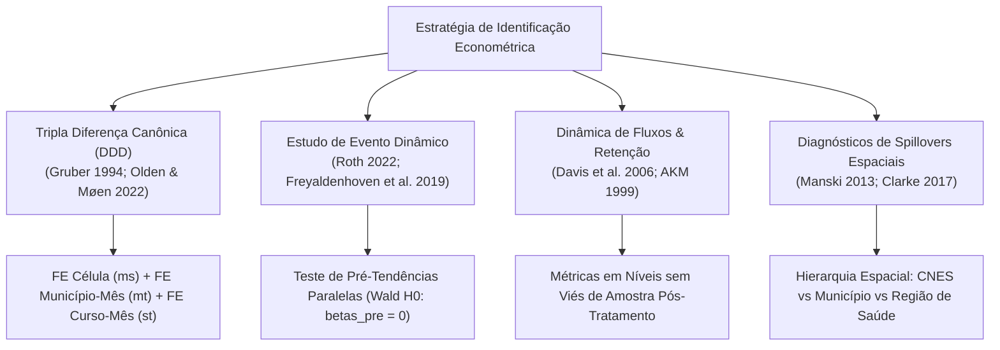
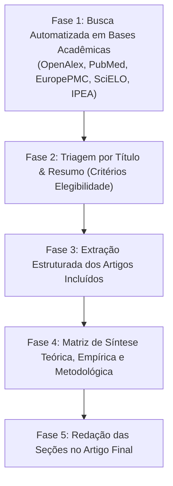

# 07. Estratégia de Revisão Profunda de Literatura e Fundamentação Econométrica

> [!CAUTION]
> **Arquivo histórico misto, não canônico.** Foi produzido antes da separação entre teoria, evidência empírica e econometria. Use o [mapa da documentação](../README.md), o [modelo teórico](../02_teoria/17_fundamentacao_teorica_formacao_utilidade_regressores.md) e a [literatura empírica](../03_literatura_empirica/19_literatura_empirica_escolha_locacional_medicos.md).

> **Documento Estratégico e Metodológico**  
> **Projeto:** Avaliação de Impacto e Economia da Saúde — Programa Mais Médicos Especialistas (PMM-E / Lei nº 15.233/2025)  
> **Tema Central:** *Atração e Retenção de Médicos Especialistas em Cidades do Interior com base nas Diferentes Bolsas e no IVS (Índice de Vulnerabilidade Social).*  
> **Pergunta Central:** *Em que medida as bolsas escalonadas e o edital do PMM-E induzem a atração imediata (novas entradas) e a retenção sustentada (permanência/sobrevida) de especialistas no interior do Brasil, e como esse efeito varia ao longo da distribuição de vulnerabilidade (IVS)?*  
> **Data:** 31 de Agosto de 2026  
> **Status:** Vigente e Estruturado  

---

## 1. Introdução e Contextualização do Problema

O objetivo desta estratégia de revisão de literatura é fornecer uma fundamentação teórica rigorosa, um mapeamento empírico exaustivo e diretrizes de modelagem econométrica para avaliar a **atração e fixação de médicos especialistas em municípios do interior vulnerável**.

O núcleo do estudo investiga perguntas fundamentais de economia do trabalho e economia da saúde:
$$\text{"Como o escalonamento financeiro de bolsas federais e o edital centralizado alteram as taxas brutas de entrada (atração), saída (evasão) e sobrevida de especialistas em cidades do interior com diferentes níveis de IVS?"}$$

A revisão é estruturada em **cinco pilares interconectados**:
1. **Fundamentação Teórica:** Equilíbrio hedônico espacial (Roback 1982), preferências locacionais e Willingness to Accept (Sivey et al. 2012), matching sob bolsas (Agarwal 2015) e complementaridade de capital hospitalar (Acemoglu & Finkelstein 2008).
2. **Evidência Empírica Nacional e Internacional:** Worker flows de médicos no interior (Gravelle et al. 2018), análise longitudinal de sobrevida de Cox (Russell et al. 2021), coortes de retenção sob bolsa ativa vs. pós-obrigação (Pathman et al. 2004) e revisões globais de return-of-service (Bärnighausen & Bloom 2009).
3. **Inspirações para Modelagem Econométrica:** Decomposição de fluxos de trabalhadores no CNES mensal, Desenho de Descontinuidade de Regressão (RDD) nos cutoffs de IVS (0,400 e 0,500) e Tripla Diferença (DDD).
4. **Inspirações para Dados e Heterogeneidades:** Running variable canônica do **IVS 2010 do IPEA**, infraestrutura hospitalar instalada no CNES e faixas de bolsa.
5. **Protocolo Operacional de Execução:** Estratégia sistemática de busca (OpenAlex, PubMed, NBER, SciELO), strings booleanas e matriz estruturada de evidências.

---

## 2. Pilar 1 — Fundamentação Teórica



### 1.1 Teoria dos Diferenciais Compensatórios e Escolha Espacial (Equalizing Differences)
- **Referências Fundamentais:** Roback (1982); Rosen (1986); Sivey et al. (2012); Moretti (2011).
- **Mecanismo:** Médicos especialistas possuem elevado custo de oportunidade e fortes preferências por capitais. A atração para municípios vulneráveis ou remotos exige um diferencial salarial compensatório ($\Delta w = w_{\text{remoto}} - w_{\text{polo}}$) que cubra deseconomias de isolamento, ausência de pares e escassez de infraestrutura familiar e médica.
- **Aplicação ao PMM-E:** As bolsas do PMM-E (escalonadas por faixas de vulnerabilidade IVS) operam como um choque de diferencial compensatório:
  $$S_{mst} = f(\text{Bolsa}(IVS_m), IVS_m, \text{Amenidades}_m, \text{Infraestrutura}_{ms})$$

### 1.2 Preferências Locacionais, Willingness to Accept (WTA) e Elasticidade da Oferta
- **Referências Fundamentais:** Sivey et al. (2012); Agarwal (2015).
- **Mecanismo:** Modelos de utilidade aleatória (RUM) demonstram que a atratividade do posto depende do valor monetário do incentivo e da carga horária hospitalar. Especialistas cirúrgicos exigem compensação financeira substancialmente superior à de clínicos para aceitar postos no interior.
- **Aplicação ao PMM-E:** Parametrização da sensibilidade da oferta médica a diferentes faixas de bolsa e identificação da heterogeneidade por especialidade.

### 1.3 Dinâmica de Worker Flows: Entradas vs Saídas
- **Referências Fundamentais:** Gravelle, Scott, Yong & McGrail (2018).
- **Mecanismo:** Incentivos financeiros geram forte efeito positivo nas decisões de entrada (atração imediata), mas possuem efeito atenuado na redução da taxa de evasão (retenção sustentada).
- **Aplicação ao PMM-E:** Justifica a decomposição formal do estoque líquido em entradas, saídas e taxa de permanência no CNES mensal.

### 1.4 Federalismo Fiscal e Substituição de Vínculos (Crowding-Out)
- **Referências Fundamentais:** Baicker & Staiger (2005); Gordon (2004).
- **Mecanismo:** O fornecimento de bolsas federais pode induzir o gestor municipal a remanejar recursos próprios e descontinuar contratos locais, gerando substituição fiscal.
- **Aplicação ao PMM-E:** Exige a auditoria explícita do estoque total no CNES para estimar se o ganho de especialistas é líquido ou compensado por demissões locais.


---

## 3. Pilar 2 — Literatura Empírica Nacional e Internacional



### 2.1 Evidências do Programa Mais Médicos (PMM 2013) e PROVAB no Brasil
- **Estudos Seminais:**
  - *Mattos & Maziero (2020)*: Avaliação do PMM encontrando aumento de consultas de APS, mas documentando expressivo efeito de substituição (*crowding-out*) em que municípios reduziram contratações locais.
  - *Fontes, Conceição & Jacinto (2018)*: Avaliação causal do PMM sobre indicadores municipais de saúde e redução de internações por condições sensíveis à atenção primária (ICSAP).
  - *Hone et al. (2017) / Santos et al. (2017)*: Efeitos da expansão do PMM sobre desigualdades geográficas no acesso à saúde.
  - *Scheffer et al. (Demografia Médica no Brasil, USP/CFM)*: Diagnóstico estrutural da hiperconcentração de especialistas nas capitais e no setor privado, evidenciando o gargalo assistencial no SUS do interior.
- **Diferenciação Crítica para o PMM-E:** O PMM original focava em médicos generalistas na APS; o **PMM-E (Lei 15.233/2025)** foca em médicos especialistas em atenção ambulatorial e hospitalar de média e alta complexidade, operando sob dinâmicas de mercado, custos de oportunidade e exigências de infraestrutura profundamente distintas.

### 2.2 Evidência Internacional: Programas de Provimento e Retenção em Áreas Desassistidas
- **Estados Unidos:**
  - *National Health Service Corps (NHSC)*: Esquemas de perdão de dívida estudantil (*loan repayment*) e bolsas condicionadas a serviço em áreas de escassez médica (HPSAs). Estudos (Pathman et al. 2004; Cullen et al.) demonstram alta atração de curto prazo, mas taxas de abandono e migração pós-vínculo obrigatório de 40% a 60% após 3 a 5 anos.
  - *J-1 Visa Waiver & Conrad 30 Program*: Alocação de médicos estrangeiros em áreas rurais; literatura demonstra dependência estrutural dessas localidades de fluxos contínuos de imigrantes para repor a alta rotatividade.
- **Canadá, Austrália e Noruega:**
  - *Return-of-Service (RoS) Agreements*: Subsídios de residência médica condicionados à permanência no interior. Estudos apontam que incentivos puramente financeiros atraem profissionais temporários (*transient physicians*), enquanto a fixação de longo prazo depende de integração com a comunidade médica local, planos de carreira estruturados e condições de trabalho hospitalar.
- **Revisões Sistemáticas Globais (Cochrane & OMS):**
  - *Grobler et al. (Cochrane Database of Systematic Reviews)*: Intervenções financeiras aumentam a probabilidade de aceitação de vagas remotas, mas possuem evidência limitada sobre sustentabilidade a longo prazo sem intervenções educacionais e regulatórias combinadas.

---

## 4. Pilar 3 — Inspirações Metodológicas e Modelagem Econométrica



### 3.1 Identificação por Tripla Diferença (DDD) em Mercados Locais
- **Fundamentação:** Gruber (1994); Olden & Møen (2022); Wooldridge (2010, 2021).
- **Avanço Metodológico:** Uma simples Diferença em Diferenças (DiD) ao nível municipal poderia sofrer com choques locais contemporâneos não observados (e.g., eleição municipal, crise fiscal do município, abertura de um hospital privado local). A **Tripla Diferença (DDD)** resolve isso estruturando a variação ao nível `município × especialidade × mês`:
  $$Y_{mst} = \alpha_{ms} + \gamma_{mt} + \delta_{st} + \beta (\text{Immediate}_{ms} \times \text{Post}_t) + \varepsilon_{mst}$$
  - $\alpha_{ms}$ (FE Município–Curso): absorve vantagens comparativas e níveis basais históricos de cada especialidade em cada município;
  - $\gamma_{mt}$ (FE Município–Mês): absorve **todos** os choques locais invariantes à especialidade (gestão, finanças municipais, choques demográficos);
  - $\delta_{st}$ (FE Curso–Mês): absorve **todas** as tendências nacionais da especialidade médica (formação na residência, inovações tecnológicas, sazonalidades);
  - $\beta$: mede a diferença ajustada associada à disponibilização imediata da
    vaga em relação à permanência em cadastro de reserva. A interpretação
    causal foi vedada após a falha do portão de relevância administrativa.

### 3.2 Validação Dinâmica e Testes de Pré-Tendências (Event Studies)
- **Fundamentação:** Freyaldenhoven, Hansen & Shapiro (2019); Roth (2022); Sun & Abraham (2021); Rambachan & Roth (2023).
- **Prática Canônica:** Estimação de coeficientes dinâmicos $\beta_k$ para todos os meses pré-tratamento ($k \in [2024\text{-}06, 2025\text{-}06]$) normalizando o mês prévio ao anúncio ($2025\text{-}06 = 0$). O teste conjunto de Wald ($H_0: \beta_k = 0, \forall k < 2025\text{-}07$) é apenas um diagnóstico: não rejeitar zero não prova tendências paralelas, especialmente com poucos clusters e intervalos largos.

### 3.3 Decomposição de Fluxos de Trabalhadores (*Worker Flows*) e Métricas de Retenção
- **Fundamentação:** Davis, Faberman & Haltiwanger (2006, 2012); Abowd, Kramarz & Margolis (AKM 1999).
- **Prevenção de Vieses Metodológicos:** A literatura econômica alerta enfaticamente contra o uso de taxas condicionadas a resultados pós-tratamento (e.g., $\frac{\text{Retidos}}{\text{Entrantes}}$), pois o tratamento altera tanto o numerador quanto a composição do denominador (*endogenous sample selection bias*).
- **Diretriz Adotada:**
  1. Estimar modelos ajustados sobre **contagens brutas em níveis**: Entradas ($n\_entradas_{mst}$), Saídas ($n\_saidas_{mst}$) e Saldo Líquido ($saldo_{mst}$), sem linguagem causal enquanto o desenho não satisfizer seus portões;
  2. Apresentar taxas de sobrevivência de coortes pré-especificadas (entrantes de 2025-08 a 2026-01 seguidos por 6 meses) estritamente como estatísticas descritivas de sobrevivência longitudinal;
  3. Marcar explicitamente como censurados os horizontes ainda não maduros (12 meses).

### 3.4 Diagnóstico de Spillovers Espaciais e Hierarquia Territorial
- **Fundamentação:** Manski (2013); Clarke (2017); Berg, Streitz & Wedow (2017); Butts (2023).
- **Problema de SUTVA:** Se a atração de um especialista para o Município A decorre da saída de um profissional do Município B vizinho, a hipótese de não-interferência (*Stable Unit Treatment Value Assumption*) é violada.
- **Solução Empírica:** Estimar os modelos em três escalas espaciais concêntricas:
  1. **Nível Estabelecimento (CNES):** Capta a atração no hospital alvo;
  2. **Nível Município (Canônico):** Elimina o remanejamento interno entre estabelecimentos municipais;
  3. **Nível Região de Saúde (Spillover Regional):** Revela se o programa gerou expansão agregada da malha regional ou mera canibalização entre municípios contíguos.

---

## 5. Pilar 4 — Inspiração para Dados, Controles e Heterogeneidades

| Dimensão | Variáveis de Inspiração na Literatura | Fonte de Dados no Brasil | Papel na Modelagem |
|:---|:---|:---|:---|
| **Vulnerabilidade Socioeconômica** | Índice de Vulnerabilidade Social (IVS), IDHM, Renda per Capita | IPEA (IVS 2010), IBGE (Censo) | **Running variable canônica** e principal canal de heterogeneidade |
| **Capacidade Hospitalar Instalada** | Leitos cirúrgicos, leitos de UTI, salas cirúrgicas, aparelhos de imagem | CNES (tbInstalacaoFisica, tbEquipamento) | Diagnóstico de binding constraints de infraestrutura |
| **Acessibilidade & Isolamento** | Distância/tempo de viagem a capitais, índice de ruralidade | IBGE / Malha Rodoviária DNIT | Heterogeneidade de custos de deslocamento |
| **Estrutura Salarial Local** | Remuneração médica média municipal, diferenciais público-privado | RAIS / CNES carga horária | Teste de atratividade relativa do incentivo da bolsa |
| **Características do Programa** | Faixa de bolsa (Incentivo financeiro R\$ 12k a R\$ 30k) | Editais PMM-E / SGTES | Gradiente de dose de incentivo |
| **Complexidade da Especialidade** | Especialidade Clínica vs Cirúrgica vs Diagnóstica | CFM / CBO 2002 | Sensibilidade a requisitos de capital físico |

---

## 6. Pilar 5 — Protocolo Operacional de Execução da Revisão



### 5.1 Estratégia de Strings de Busca Booleanas

As buscas sistemáticas devem combinar termos de quatro blocos conceituais:

```text
(Bloco 1: Força de Trabalho Especializada)
("medical specialists" OR "physician workforce" OR "specialist doctors" OR "physician supply" OR "médicos especialistas" OR "força de trabalho médica")

AND

(Bloco 2: Atração, Retenção e Mobilidade Espacial)
("physician retention" OR "geographic distribution" OR "recruitment" OR "physician shortage" OR "spatial mobility" OR "worker flows" OR "turnover" OR "fixação de médicos" OR "rotatividade médica" OR "provimento")

AND

(Bloco 3: Políticas Públicas, Vagas e Incentivos Financeiros)
("financial incentives" OR "wage bonus" OR "loan repayment" OR "bonding schemes" OR "Mais Medicos" OR "PMM" OR "public provision" OR "incentivos financeiros" OR "bolsa")

AND

(Bloco 4: Métodos Econométricos e Avaliação Causal)
("difference-in-differences" OR "triple differences" OR "event study" OR "impact evaluation" OR "quasi-experiment" OR "tripla diferença" OR "avaliação de impacto")
```

### 5.2 Critérios de Elegibilidade (Inclusão e Exclusão)
- **Critérios de Inclusão:**
  1. Estudos teóricos sobre economia do trabalho médico, diferenciais salariais e localização espacial;
  2. Avaliações de impacto empíricas causais (DiD, DDD, RDD, variáveis instrumentais) de programas de provimento de saúde no Brasil ou no exterior;
  3. Artigos metodológicos sobre modelagem de fluxos de trabalhadores, dinâmica de painel e spillovers espaciais;
  4. Artigos com foco explícito em retenção, persistência e sustentabilidade de recursos humanos em saúde.
- **Critérios de Exclusão:**
  1. Estudos puramente de opinião, editoriais ou relatos de caso sem base empírica/quantitativa;
  2. Estudos sobre desfechos clínicos sem conexão com oferta médica, capacidade instalada ou alocação de profissionais;
  3. Trabalhos sem identificação causal clara que atribuam causalidade a meras correlações descritivas.

### 5.3 Matriz de Síntese e Extração de Evidências (Layout Padronizado)

Para cada artigo selecionado na revisão, será gerada uma entrada na matriz estruturada contendo:
1. **Identificação:** Autor(es), Ano, Título, Periódico, DOI;
2. **Contexto & Intervenção:** País/Região, Programa analisado, Período temporal;
3. **Estratégia Econométrica:** Desenho (DiD, DDD, RDD, Event Study), Unidade de análise, Estrutura de Efeitos Fixos e Clusterização;
4. **Outcomes Principais:** Estoque de médicos, taxas de entrada/saída, retenção ($ tenure $), desfechos assistenciais;
5. **Principais Resultados e Tamanho de Efeito:** Coeficientes estimados, significância estatística, elasticidades;
6. **Mecanismos e Heterogeneidades:** Fatores determinantes (renda, vulnerabilidade, infraestrutura, valores de incentivo);
7. **Lições e Implicações Diretas para o PMM-E:** Como o paper fundamenta a teoria, a escolha de dados ou a especificação econométrica do presente projeto.

---

## 7. Cronograma e Integração no Repositório

O plano operacional de execução desta revisão integra-se à estrutura do projeto:
- **Script de Busca e Mineração Bibliográfica:** Utilização dos módulos de busca integrados (`literature_search_openalex`, `pubmed-database`, `literature-search-europepmc`) para raspagem e extração automatizada de metadados e resumos;
- **Base Consolidada de Artigos:** Armazenamento das tabelas de artigos extraídos em `output/revisao_literatura/matriz_evidencias_artigos.parquet` e `.csv`;
- **Síntese Teórico-Empírica no Relatório:** Inclusão dos insights consolidados nos capítulos introdutórios e metodológicos do relatório e artigo científico final.
