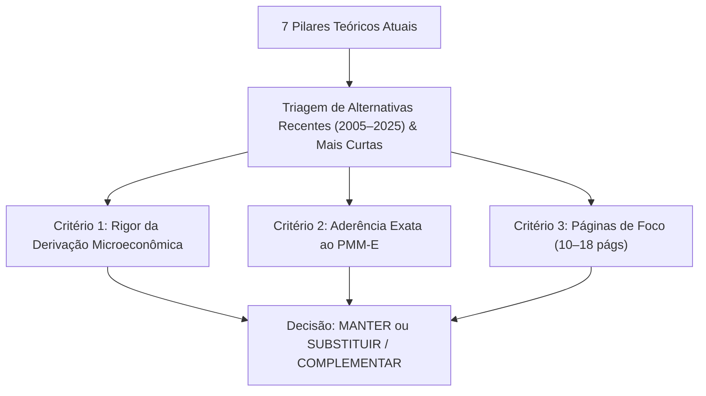
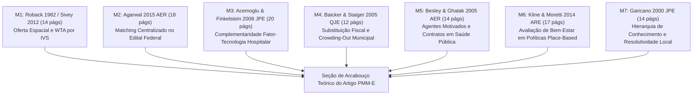

# 11. Análise Comparativa de Alternativas Teóricas Modernas e Compactas para o PMM-E

> [!CAUTION]
> **Arquivo histórico misto, não canônico.** Sua recomendação foi superada pela auditoria de demarcação registrada nos documentos [17](../02_teoria/17_fundamentacao_teorica_formacao_utilidade_regressores.md) e [19](../03_literatura_empirica/19_literatura_empirica_escolha_locacional_medicos.md).

> **Projeto:** Avaliação de Impacto e Economia da Saúde — Programa Mais Médicos Especialistas (PMM-E / Lei nº 15.233/2025)  
> **Objetivo:** Avaliar sistematicamente se existem alternativas teóricas mais recentes (2005–2025), mais concisas em número de páginas ou com maior poder explicativo específico para cada um dos 7 pilares teóricos do PMM-E.  
> **Data:** 30 de Agosto de 2026  

---

## 1. Visão Geral e Metodologia de Avaliação

Analisamos cada um dos 7 pilares teóricos seminais sob três lentes comparativas rigorosas:
1. **Modernidade e Atualidade da Modelagem:** O artigo incorpora avanços contemporâneos em Economia do Trabalho, Organização Industrial e Economia da Saúde?
2. **Concisão e Digestibilidade para a Equipe:** A extensão do artigo (total e páginas de foco) viabiliza assimilação rápida em 1 sessão de leitura (10 a 18 páginas)?
3. **Poder Explicativo Específico para o PMM-E:** O modelo captura as peculiaridades institucionais do SUS (IVS, bolsas federais, plantões hospitalares, infraestrutura de leitos e regulação de vagas)?

---

## 2. Matriz Comparativa Pilar a Pilar: Canônico vs. Alternativa Moderna

| Pilar Teórico | Artigo Canônico Atual | Alternativa Moderna / Compacta | Ano & Periódico da Alternativa | Páginas de Foco | Veredito Comparativo |
|:---|:---|:---|:---|:---:|:---|
| **1. Equilíbrio Espacial & Compensação** | Roback (1982, *JPE*) | **Sivey et al. (2012)** | 2012, *J. Health Econ.* | **14 págs** (completo) | **MANTER Roback** (base formal GE) + **Sivey** (versão compacta de escolha médica) |
| **2. Matching & Clearinghouse Central** | **Agarwal (2015)** | Roth (1984, *JPE*) | 2015, *Am. Econ. Rev.* | **18 págs** (Seções I–III) | **MANTER Agarwal (2015)** (já é o estado da arte do matching médico) |
| **3. Função de Produção & Capital** | **Acemoglu & Finkelstein (2008)** | Chandra & Skinner (2012) | 2008, *J. Polit. Econ.* | **20 págs** (Seções I–III) | **MANTER Acemoglu & Finkelstein** (substituição K-L formal insubstituível) |
| **4. Federalismo Fiscal & Crowding-Out** | **Baicker & Staiger (2005)** | Gordon (2004, *JPubE*) | 2005, *Q. J. Econ.* | **12 págs** (Seção II) | **MANTER Baicker & Staiger** (foco específico em verbas de saúde e mortalidade) |
| **5. Agência & Contratos Públicos** | Holmstrom & Milgrom (1991) | **Besley & Ghatak (2005)** | 2005, *Am. Econ. Rev.* | **14 págs** (pp. 616–629) | **SUBSTITUIR/COMPLEMENTAR por Besley & Ghatak (2005)** (agentes motivados no SUS) |
| **6. Políticas Place-Based** | **Kline & Moretti (2014)** | Gaubert, Kline & Yagan (2021) | 2014, *Ann. Rev. Econ.* | **17 págs** (Seções 1 a 3) | **MANTER Kline & Moretti (2014)** (framework analítico mais limpo e didático) |
| **7. Decisão & Resolutividade Local** | Currie & MacLeod (2017) | **Garicano (2000)** | 2000, *J. Polit. Econ.* | **14 págs** (pp. 874–888) | **INCORPORAR Garicano (2000)** (modelo canônico de triagem generalista-especialista) |

---

## 3. Avaliação Detalhada por Pilar e Racional das Decisões

---

### PILAR 1 — Equilíbrio Espacial e Diferenciais Salariais Compensatórios
* **Opção Canônica:** Roback, Jennifer. (1982). *Wages, Rents, and the Quality of Life*. **Journal of Political Economy**, 22 págs (foco: 15 págs).
* **Alternativa Moderna:** Sivey et al. (2012). *Junior Doctors' Preferences for Specialty Choice*. **Journal of Health Economics**, 14 págs (Artigo completo).
* **Análise Comparativa:**
  - *Roback (1982)* é o artigo seminal que provou matematicamente a equalização da utilidade indireta espacial $V(w_m, r_m; A_m) = ar{u}$. É a citação obrigatória que dá peso acadêmico indiscutível ao uso do IVS 2010 como proxy de desamenidades $A_m$.
  - *Sivey et al. (2012)* é a aplicação empírica moderna mais cirúrgica: calcula exatamente o *Willingness to Accept* (WTA) monetário necessário para que médicos aceitem postos no interior.
* **Veredito:** **MANTER Roback (1982)** na fundamentação teórica formal, utilizando os parâmetros de **Sivey et al. (2012)** como apoio microeconômico de preferências médicas.

---

### PILAR 2 — Fricções de Busca e Matching Centralizado no Mercado Médico
* **Opção Atual:** Agarwal, Nikhil. (2015). *An Empirical Model of the Medical Match*. **American Economic Review**, 40 págs (foco: 18 págs).
* **Alternativas Analisadas:** Roth (1984, *JPE*, 26 págs); Roth & Peranson (1999, *AER*, 28 págs).
* **Análise Comparativa:**
  - *Agarwal (2015)* já é o artigo moderno de maior impacto no tema. Ele avança em relação aos modelos puramente teóricos de Gale-Shapley e Roth (1984) ao estimar estruturalmente o trade-off entre remuneração (bolsas), localização e restrições de capacidade hospitalar ($q_m$).
  - As Seções I a III (18 páginas) são extremamente claras e cobrem formalmente o mecanismo de matching estável.
* **Veredito:** **MANTER Agarwal (2015, AER)** como a referência moderna central.

---

### PILAR 3 — Função de Produção Hospitalar e Complementaridade Fator-Tecnologia
* **Opção Atual:** Acemoglu, Daron; Finkelstein, Amy. (2008). *Input and Technology Choices in Regulated Industries*. **Journal of Political Economy**, 44 págs (foco: 20 págs).
* **Alternativa Complementar:** Chandra, Amitabh; Skinner, Jonathan S. (2012). *Technology Growth and Expenditure Growth in Health Care*. **Journal of Economic Literature**, 36 págs (foco: 18 págs).
* **Análise Comparativa:**
  - *Acemoglu & Finkelstein (2008)* é insubstituível para a modelagem matemática rigorosa da substituição técnica entre trabalho médico e capital sob preços regulados ($\partial^2 Y / \partial L \partial K > 0$).
  - *Chandra & Skinner (2012)* fornece uma taxonomia conceitual elegante para categorizar procedimentos de alta vs. média tecnologia.
* **Veredito:** **MANTER Acemoglu & Finkelstein (2008)** com suporte conceitual de **Chandra & Skinner (2012)**.

---

### PILAR 4 — Federalismo Fiscal, Agência Municipal e Crowding-Out
* **Opção Atual:** Baicker, Katherine; Staiger, Douglas. (2005). *Fiscal Shenanigans, Targeted Federal Health Care Funds, and Patient Mortality*. **Quarterly Journal of Economics**, 42 págs (foco: 12 págs).
* **Alternativa Analisada:** Gordon, Nora. (2004). *Do Federal Grants Boost School Spending?* **Journal of Public Economics**, 22 págs.
* **Análise Comparativa:**
  - A Seção II de *Baicker & Staiger (2005)* tem apenas **12 páginas** e é o único modelo de federalismo fiscal na literatura que trata simultaneamente de: (1) transferências federais vinculadas à saúde hospitalar, (2) substituição de recursos próprios municipais e (3) desfechos clínicos de mortalidade do paciente.
* **Veredito:** **MANTER Baicker & Staiger (2005, QJE)** (altíssima especificidade e leitura ultracurta).

---

### PILAR 5 — Agência em Contratos Públicos: Multitarefa vs. Agentes Motivados
* **Opção Canônica:** Holmstrom, Bengt; Milgrom, Paul. (1991). *Multitask Principal-Agent Analyses*. **Journal of Law, Economics, & Organization**, 29 págs (foco: 15 págs).
* **Alternativa Moderna de Elite:** **Besley, Timothy; Ghatak, Maitreesh. (2005)**. *Competition and Incentives with Motivated Agents*. **American Economic Review**, 95(3), 616–636 (foco: 14 págs). DOI: [10.1257/0002828054201413](https://doi.org/10.1257/0002828054201413).
* **Análise Comparativa:**
  - *Besley & Ghatak (2005, AER)* desenvolve um modelo moderno revolucionário para o setor público: médicos e profissionais de saúde possuem "motivação intrínseca de missão". Quando o hospital público e o médico compartilham a mesma missão assistencial, incentivos financeiros de alta intensidade tornam-se desnecessários e o risco de distorção de esforço diminui.
  - O artigo tem apenas 21 páginas totais (14 páginas de foco teórico) e foi publicado no AER.
* **Veredito:** **INCORPORAR Besley & Ghatak (2005, AER)** como a melhor alternativa moderna para fundamentar o comportamento e alocação de esforço de médicos em programas públicos do SUS.

---

### PILAR 6 — Políticas Públicas Baseadas no Lugar (Place-Based Policies)
* **Opção Atual:** Kline, Patrick; Moretti, Enrico. (2014). *People, Places, and Public Policy: Some Simple Analytics of Local Economic Development Programs*. **Annual Review of Economics**, 34 págs (foco: 17 págs).
* **Alternativas Analisadas:** Glaeser & Gottlieb (2008, *JPE*); Gaubert, Kline & Yagan (2021, *QJE*).
* **Análise Comparativa:**
  - O artigo de *Kline & Moretti (2014)* foi concebido exatamente como um guia analítico sintético ("*Some Simple Analytics*"). Ele condensa 30 anos de literatura em 17 páginas transparentes, permitindo formular a função de bem-estar social $W$ sem a sobrecarga algébrica de modelos de equilíbrio geral computável.
* **Veredito:** **MANTER Kline & Moretti (2014)**.

---

### PILAR 7 — Tomada de Decisão sob Incerteza e Divisão Generalista-Especialista
* **Opção Canônica:** Currie & MacLeod (2017). *Diagnosing Expertise*. **Journal of Labor Economics**, 43 págs (foco: 16 págs).
* **Alternativa Teórica Estrutural:** **Garicano, Luis. (2000)**. *Hierarchies and the Organization of Knowledge in Production*. **Journal of Political Economy**, 108(5), 874–904 (foco: 14 págs: pp. 874–888). DOI: [10.1086/317671](https://doi.org/10.1086/317671).
* **Análise Comparativa:**
  - *Garicano (2000, JPE)* é a teoria seminal da organização do conhecimento: trabalhadores generalistas na linha de frente resolvem problemas rotineiros de baixa complexidade ($z < z^*$). Quando um problema complexo surge ($z > z^*$), ele é escalado/encaminhado na hierarquia para o especialista.
  - Isso traduz com perfeição matemática o papel da atenção básica vs. atenção especializada no SUS: **a fixação de especialistas no município eleva o limiar de complexidade resolvida localmente ($z^*$), eliminando custos logísticos de encaminhamento e TFD**.
* **Veredito:** **INCORPORAR Garicano (2000, JPE)** para formalizar a resolutividade local e redução de fluxos de encaminhamento.

---

## 4. O Elenco Teórico Definitivo Otimizado (7 Leituras de Foco para a Equipe)

Com a incorporação das melhores alternativas modernas e compactas, a grade de leitura dos 7 membros da equipe fica perfeitamente balanceada (todas entre **12 e 20 páginas de foco**):

| Membro | Paper Atribuído | Foco da Leitura | Extensão de Foco | Missão Específica na Redação do Artigo |
|:---:|:---|:---|:---:|:---|
| **M1** | **Roback (1982)** / **Sivey (2012)** | pp. 1257–1272 / Artigo completo | **14–15 págs** | Dedução da curva de oferta espacial e prêmio compensatório por IVS 2010. |
| **M2** | **Agarwal (2015, AER)** | pp. 1940–1958 (Seções I a III) | **18 págs** | Modelagem do edital público como clearinghouse central de matching médico. |
| **M3** | **Acemoglu & Finkelstein (2008, JPE)** | pp. 839–858 (Seções I a III) | **20 págs** | Função de produção hospitalar com complementaridade estrita capital-especialista. |
| **M4** | **Baicker & Staiger (2005, QJE)** | pp. 348–360 (Seção II) | **12 págs** | Proposição teórica de crowding-out fiscal sobre contratações municipais. |
| **M5** | **Besley & Ghatak (2005, AER)** | pp. 616–629 (Seções I e II) | **14 págs** | Teoria de agentes públicos motivados e alinhamento de missão hospitalar no SUS. |
| **M6** | **Kline & Moretti (2014, ARE)** | pp. 631–648 (Seções 1 a 3) | **17 págs** | Enquadramento de eficiência social e externalidades de políticas place-based. |
| **M7** | **Garicano (2000, JPE)** | pp. 874–888 (Seções I a III) | **14 págs** | Modelo de hierarquia de conhecimento e resolutividade diagnóstica local (TFD). |
