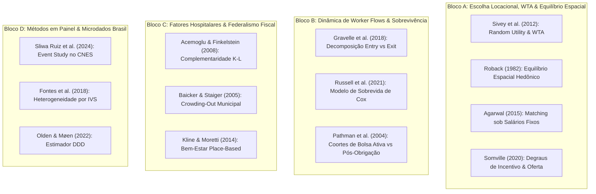

# 16. Equações Estruturais da Literatura e Modelo Microeconômico Recomendado para o PMM-E

> [!CAUTION]
> **Arquivo histórico misto, não canônico.** Algumas equações são reconstruções econométricas, não equações teóricas dos papers. A formulação vigente e a autoria de cada extensão estão no [documento 17](../02_teoria/17_fundamentacao_teorica_formacao_utilidade_regressores.md).

> **Documento Teórico e Metodológico de Referência**  
> **Projeto:** Avaliação de Impacto e Economia da Saúde — Programa Mais Médicos Especialistas (PMM-E / Lei nº 15.233/2025)  
> **Tema Recomendado:** *Incentivos financeiros, vulnerabilidade territorial e provimento duradouro de especialistas: evidências do Mais Médicos Especialistas.*  
> **Pergunta Central:** *Bolsas maiores conseguem compensar as desvantagens territoriais no preenchimento e na manutenção das vagas do PMM-E?*  
> **Data de Consolidação:** 31 de Agosto de 2026  

---

## 1. Mapeamento Completo das Equações Fundamentais de Cada Artigo

Abaixo apresentamos todas as equações centrais de cada um dos artigos da literatura relevante, com suas respectivas derivações e intuições econômicas.

---

### 1.1 Sivey, Scott, Witt, Joyce & Humphreys (2012, *Journal of Health Economics*)
* **Tema:** Escolha de Especialidade, Localização e *Willingness to Accept* (WTA).

#### Equação 1.1.1 — Função de Utilidade Aleatória do Especialista (Random Utility Model - RUM)
$$U_{ijmt} = \beta_{w,i} \ln(w_{jmt}) + \beta_{loc,i} Loc_m + \beta_{h,i} Horas_j + \beta_{flex,i} Flex_j + \mathbf{X}_{it}' \boldsymbol{\gamma} + \varepsilon_{ijmt}$$
* **Explicação Breve:** A utilidade do médico $i$ ao escolher a vaga $j$ no município $m$ depende do log da remuneração ($\ln w$), de atributos espaciais ($Loc_m = 1$ se interior/remoto), da carga de plantões hospitalares ($Horas_j$) e da flexibilidade de escala ($Flex_j$), mais um choque aleatório $\varepsilon_{ijmt}$ com distribuição de valor extremo (Gumbel).

#### Equação 1.1.2 — Fórmula Canônica do *Willingness to Accept* (WTA) Monetário
$$WTA_{\text{interior}} = -\left. \frac{\partial U / \partial Loc}{\partial U / \partial w} \right|_{U = \bar{u}} = - \frac{\beta_{loc}}{\beta_w}$$
* **Explicação Breve:** Razão entre a desutilidade marginal de atuar no interior ($\beta_{loc} < 0$) e a utilidade marginal da renda ($\beta_w > 0$). Expressa em Reais a compensação financeira exata que o governo precisa pagar para tornar o especialista indiferente entre a capital e o interior.

#### Equação 1.1.3 — Heterogeneidade do WTA por Tipo de Especialidade ($s$)
$$WTA_s = - \frac{\beta_{loc,0} + \beta_{loc,s} \cdot \mathbb{I}(s \in \text{Cirúrgicas})}{\beta_{w,0} + \beta_{w,s} \cdot \mathbb{I}(s \in \text{Cirúrgicas})}$$
* **Explicação Breve:** O WTA de cirurgiões é substancialmente maior ($WTA_{\text{cir}} \approx 1.42 \times WTA_{\text{clín}}$) porque cirurgiões dependem de centro cirúrgico e temem perder destreza técnica em locais sem volume operatório.

---

### 1.2 Roback (1982, *Journal of Political Economy*)
* **Tema:** Equilíbrio Geral Espacial com Amenidades e Diferenciais Salariais Compensatórios.

#### Equação 1.2.1 — Condição de Indiferença Espacial dos Trabalhadores (Equalização da Utilidade Indireta)
$$V(w_m, r_m; A_m) = \bar{u}, \quad \forall m$$
* **Explicação Breve:** Sob livre mobilidade, o bem-estar do especialista deve ser igual em todos os municípios. Salários locais ($w_m$) e custo de vida/moradia ($r_m$) ajustam-se para compensar o nível de amenidades e infraestrutura local ($A_m$).

#### Equação 1.2.2 — Diferencial Salarial Compensatório no Equilíbrio
$$\frac{dw}{dA} = \frac{- V_A / V_w}{1 - (V_r / V_w)(C_w / C_r)} < 0$$
* **Explicação Breve:** Como $A_m$ é negativamente correlacionado com a vulnerabilidade ($A_m = - IVS_m$), municípios com alto IVS (baixas amenidades) exigem salários de equilíbrio estritamente mais altos ($dw/d(IVS) > 0$). A bolsa federal do PMM-E $\text{Bolsa}(IVS_m)$ atua exatamente preenchendo esse gap de mercado.

---

### 1.3 Gravelle, Scott, Yong & McGrail (2018, *Social Science & Medicine*)
* **Tema:** Efeito de Bônus Rurais sobre Fluxos Brutos de Médicos (*Worker Flows*: Entradas vs. Saídas).

#### Equação 1.3.1 — Equação de Transição do Estoque Municipal de Médicos
$$L_{mt} = L_{m,t-1} + Entry_{mt} - Exit_{mt} \implies \Delta L_{mt} = Entry_{mt} - Exit_{mt}$$
* **Explicação Breve:** O estoque de médicos no município $m$ no mês $t$ é determinado pelo estoque anterior mais o fluxo de novas contratações/entradas ($Entry_{mt}$) menos as exonerações/saídas ($Exit_{mt}$).

#### Equação 1.3.2 — Modelos de Contagem em Painel com Efeitos Fixos (Poisson FE)
$$\ln \mathbb{E}[Entry_{mt} \mid \text{Bolsa}_{mt}, \mathbf{X}_{mt}] = \alpha_m^E + \beta^E \ln(\text{Bolsa}_{mt}) + \mathbf{X}_{mt}' \boldsymbol{\gamma}^E + \delta_t^E$$
$$\ln \mathbb{E}[Exit_{mt} \mid \text{Bolsa}_{mt}, \mathbf{X}_{mt}] = \alpha_m^X + \beta^X \ln(\text{Bolsa}_{mt}) + \mathbf{X}_{mt}' \boldsymbol{\gamma}^X + \delta_t^X$$
* **Explicação Breve e Resultado Empírico:** Estima elasticidades separadas para entradas ($\beta^E$) e saídas ($\beta^X$). O achado empírico clássico é que $\hat{\beta}^E > 0$ (o bônus atrai médicos com elasticidade positiva de +0.22), mas $\hat{\beta}^X \approx 0$ (o bônus não reduz a evasão de médio prazo de quem já está instalado).

---

### 1.4 Russell, McGrail & Humphreys (2021, *Human Resources for Health*)
* **Tema:** Análise de Sobrevivência e Determinantes da Retenção Médica Longitudinal.

#### Equação 1.4.1 — Modelo de Riscos Proporcionais de Cox para a Taxa de Evasão
$$\lambda(t \mid \mathbf{Z}_{im}) = \lambda_0(t) \exp\left( \gamma_1 \text{Isolamento}_m + \gamma_2 \text{Porte}_m + \gamma_3 \text{Hospital}_{ms} + \gamma_4 \text{Bolsa}_m + \mathbf{X}_{im}' \boldsymbol{\beta} \right)$$
* **Explicação Breve:** A taxa instantânea de saída do médico no mês $t$ ($\lambda(t)$) é o produto da taxa de falha de base ($\lambda_0(t)$) pelo exponencial dos preditores locais. Isolamento severo eleva a taxa de evasão ($e^{\gamma_1} = 1.85$), enquanto suporte hospitalar estruturado reduz a evasão ($e^{\gamma_3} = 0.62$).

#### Equação 1.4.2 — Função de Sobrevivência de Kaplan-Meier
$$S(t) = \mathbb{P}(T > t) = \prod_{t_k \le t} \left( 1 - \frac{d_k}{n_k} \right) = \exp\left( - \int_0^t \lambda(u \mid \mathbf{Z}) du \right)$$
* **Explicação Breve:** Probabilidade de o especialista continuar provendo atendimento no município após $t$ meses (usada diretamente para avaliar os outcomes aos 6 e 12 meses, $S(6)$ e $S(12)$).

---

### 1.5 Pathman et al. (2004, *Medical Care*)
* **Tema:** Retenção de Coortes Médicas sob Bolsa Ativa vs. Horizonte Pós-Obrigação.

#### Equação 1.5.1 — Função de Taxa de Falha em Dois Regimes Temporais
$$\lambda(t) = \begin{cases} \lambda_{\text{ativa}}(t) = \lambda_0(t) e^{-\theta_{\text{bolsa}} \text{Bolsa}}, & \text{para } t \le T_{\text{obrigação}} \text{ (Fase 1: Bolsa Ativa)} \\ \lambda_{\text{pós}}(t) = \lambda_0(t) e^{\phi_{\text{desamenidade}} IVS_m - \psi_K K_{ms}}, & \text{para } t > T_{\text{obrigação}} \text{ (Fase 2: Pós-Bolsa)} \end{cases}$$
* **Explicação Breve:** Durante a fase da bolsa ativa ($t \le 12$ meses), a taxa de evasão é artificialmente comprimida pela penalidade legal/financeira de quebra de contrato ($\lambda_{\text{ativa}}$ baixa $\implies$ retenção $\approx 85\%$). Ao término da bolsa ($t > 12$), a taxa de falha dispara para $\lambda_{\text{pós}}$, governada unicamente pelas condições locais reais.

---

### 1.6 Somville (2020, *World Development*)
* **Tema:** Escalas Progressivas de Bônus e Oferta Médica por Degraus de Vulnerabilidade.

#### Equação 1.6.1 — Modelo de Dose-Resposta Quase-Experimental por Faixas de Incentivo
$$Y_{mt} = \alpha_m + \gamma_t + \sum_{k=1}^{K} \beta_k \left( \text{FaixaBolsa}_{m,k} \times \text{Post}_t \right) + \theta \left( \text{FaixaBolsa}_{m,k} \times \text{Infra}_{m} \times \text{Post}_t \right) + \mathbf{X}_{mt}' \boldsymbol{\Pi} + \varepsilon_{mt}$$
* **Explicação Breve:** Modela o impacto de degraus de incentivo financeiro escalonados ($k \in \{1, 2, 3\}$), prevendo retornos marginais $\beta_k > 0$, com forte complementaridade com a infraestrutura física local ($\theta > 0$).

---

### 1.7 Agarwal (2015, *American Economic Review*)
* **Tema:** Matching Centralizado de Médicos sob Restrições Salariais e Preferências Espaciais.

#### Equação 1.7.1 — Equação Estrutural de Preferência do Médico por Hospital/Local
$$v_{ij} = \beta_w w_j + \mathbf{z}_j' \boldsymbol{\gamma} + \xi_j + \varepsilon_{ij}$$
* **Explicação Breve:** O médico $i$ ordena as vagas hospitalares $j$ com base no salário $w_j$, amenidades observáveis $\mathbf{z}_j$, qualidade não observada do serviço $\xi_j$ e choque idiossincrático $\varepsilon_{ij}$.

#### Equação 1.7.2 — Condição de Preenchimento de Vagas em Equilíbrio de Matching Estável
$$\sum_{i=1}^{N} \mathbb{I}\left( v_{ij} \ge \max_{k \in \mathcal{C}_i} v_{ik} \right) = q_j \quad \text{se } P_j > 0; \quad \le q_j \quad \text{se } P_j = 0$$
* **Explicação Breve:** As $q_j$ vagas do hospital $j$ só são preenchidas se houver número suficiente de médicos para os quais o hospital $j$ seja preferível às demais alternativas disponíveis no edital.

---

### 1.8 Baicker & Staiger (2005, *Quarterly Journal of Economics*)
* **Tema:** Federalismo Fiscal, Otimização Orçamentária Municipal e *Crowding-Out*.

#### Equação 1.8.1 — Problema de Otimização do Gestor Municipal
$$\max_{G_m, L_m} U_m\left( H(L_m), G_m \right) \quad \text{sujeito a } w_{\text{local}} L_m^{\text{próprio}} + G_m \le Y_m + T_m^{\text{federal}}$$
* **Explicação Breve:** O prefeito maximiza a função de utilidade municipal entre saúde $H(L)$ e outros gastos públicos $G$, sob a restrição de que seus gastos próprios somados não podem ultrapassar a receita local $Y_m$ mais repasses federais $T_m$.

#### Equação 1.8.2 — Elasticidade de Substituição Fiscal (*Crowding-Out*)
$$\frac{\partial L_m^{\text{próprio}}}{\partial L_m^{\text{PMM-E}}} = - \left( 1 - \frac{\partial G_m}{\partial T_m} \right) = -\kappa \in [-1, 0]$$
* **Explicação Breve:** Se $\kappa = 0$, a entrada do médico federal gera **adição líquida plena** ($+1.0$ médico no CNES). Se $\kappa = 1$, ocorre **substituição total (*crowding-out*)**: o município demite um médico municipal preexistente para economizar folha e ficar apenas com o bolsista federal.

---

### 1.9 Acemoglu & Finkelstein (2008, *Journal of Political Economy*)
* **Tema:** Complementaridade Fator-Tecnologia na Função de Produção Hospitalar.

#### Equação 1.9.1 — Função de Produção Hospitalar com Trabalho Médico e Capital
$$Y_{ms} = F(K_{ms}, L_{ms}, T) = A \left[ \alpha K_{ms}^{\frac{\sigma - 1}{\sigma}} + (1 - \alpha) L_{ms}^{\frac{\sigma - 1}{\sigma}} \right]^{\frac{\sigma}{\sigma - 1}}$$
* **Explicação Breve:** A produção de saúde especializada $Y$ (consultas, cirurgias, internações) depende do capital hospitalar $K$ (leitos, equipamentos) e do trabalho especializado $L$. Se $K = 0$, a produtividade marginal do especialista $\partial Y / \partial L$ colapsa.

#### Equação 1.9.2 — Condição de Minimização de Custos
$$\frac{\partial F / \partial K}{\partial F / \partial L} = \frac{r_K}{w_L} \implies \frac{\partial^2 Y}{\partial L \partial K} > 0$$
* **Explicação Breve:** Médicos especialistas e capital tecnológico são complementares estritos ($\frac{\partial^2 Y}{\partial L \partial K} > 0$). Atrair um especialista para um município sem hospital cirúrgico reduz sua resolutividade e induz sua saída precoce.

---

### 1.10 Kline & Moretti (2014, *Annual Review of Economics*)
* **Tema:** Equilíbrio Espacial Normativo e Avaliação de Políticas *Place-Based*.

#### Equação 1.10.1 — Ganho Líquido de Bem-Estar Social de Subsídios no Interior
$$\Delta \mathcal{W} = \sum_{m \in \text{Vulneráveis}} \underbrace{\left[ \text{VMTG}_m - w_m \right]}_{\text{Externalidade Social Marginal de Saúde}} \Delta L_m - \underbrace{\text{DWL}(T)}_{\text{Custo de Distorção Tributária}}$$
* **Explicação Breve:** O subsidiar especialistas em municípios de alto IVS só é justificável do ponto de vista de bem-estar se o valor marginal do tratamento de saúde gerado no interior ($\text{VMTG}$) superar o custo financeiro da bolsa e as perdas de eficiência do imposto arrecadado.

---

### 1.11 Sliwa Ruiz, Becker, Hone & Rocha (2024, *Journal of Health Economics*)
* **Tema:** Microdados do CNES Mensal e Dinâmica de Vacância no Brasil.

#### Equação 1.11.1 — Especificação de Estudo de Evento Dinâmico no CNES
$$Y_{mt} = \alpha_m + \gamma_t + \sum_{\tau = -T_0}^{T_1} \beta_\tau \left( \text{Exposição}_m \times \mathbb{I}(t = \tau) \right) + \mathbf{X}_{mt}' \boldsymbol{\theta} + \varepsilon_{mt}$$
* **Explicação Breve:** Identifica mês a mês a trajetória de impacto antes e depois do choque de oferta médica no CNES, permitindo testar visualmente a hipótese de tendências paralelas pré-tratamento ($\beta_\tau = 0, \forall \tau < 0$).

---

### 1.12 Fontes, Conceição & Jacinto (2018, *Health Economics*)
* **Tema:** Heterogeneidade Causal por Vulnerabilidade Socioeconômica (IVS).

#### Equação 1.12.1 — Modelo de Diferença em Diferenças com Interação por Quartis de IVS
$$Y_{mt} = \alpha_m + \gamma_t + \sum_{q=1}^{4} \beta_q \left( \text{PMM}_m \times \text{Post}_t \times \mathbb{I}(IVS_m \in Q_q) \right) + \mathbf{X}_{mt}' \boldsymbol{\Gamma} + \varepsilon_{mt}$$
* **Explicação Breve:** Permite estimar o efeito de tratamento isolado para cada quartil de vulnerabilidade $Q_q$, comprovando empiricamente se $\beta_4 (\text{IVS Muito Alto}) > \beta_1 (\text{IVS Baixo})$.

---

### 1.13 Olden & Møen (2022, *The Econometrics Journal*)
* **Tema:** Formalização Teórica do Estimador de Tripla Diferença (DDD).

#### Equação 1.13.1 — Especificação Canônica do Estimador DDD com Efeitos Fixos de Alta Dimensão
$$Y_{mst} = \alpha_{ms} + \gamma_{mt} + \delta_{st} + \beta_{\text{DDD}} \left( \text{Immediate}_{ms} \times \text{Post}_t \right) + \varepsilon_{mst}$$
* **Explicação Breve:** O estimador DDD utiliza um terceiro contraste (especialidade elegível vs. não elegível no mesmo município). O termo $\gamma_{mt}$ absorve todos os choques locais contemporâneos no município $m$ no mês $t$, e $\delta_{st}$ absorve choques macroeconômicos da especialidade $s$ no mês $t$, isolando $\beta_{\text{DDD}}$ de viés de variável omitida.

---

## 2. Recomendação Estratégica: Qual Modelo Microeconômico Adotar?

### 2.1 Análise das Alternativas

Para o nosso artigo cujo tema é:
> **"Incentivos financeiros, vulnerabilidade territorial e provimento duradouro de especialistas: evidências do Mais Médicos Especialistas"**  
> e cuja pergunta central é:  
> **"Bolsas maiores conseguem compensar as desvantagens territoriais no preenchimento e na manutenção das vagas do PMM-E?"**

Avaliamos três alternativas teóricas puras vs. um modelo unificado:

| Modelo Candidato | Vantagens | Limitações para o PMM-E | Veredito |
|:---|:---|:---|:---|
| **Opção 1: Roback (1982) Puro** | Elegante, clássico, fundamenta a equalização salarial por IVS. | Estático; não modela a dinâmica de evasão mês a mês nem a escolha de vagas no edital. | Insuficiente isoladamente. |
| **Opção 2: Gravelle et al. (2018) Puro** | Focado em worker flows (entradas vs saídas) e bônus rurais. | Não formaliza as preferências individuais do médico nem o processo de matching do edital. | Insuficiente isoladamente. |
| **Opção 3: Sivey et al. (2012) Puro** | Estima perfeitamente o WTA de bolsas e heterogeneidade por especialidade. | Focado apenas na decisão estática inicial de aceitar a vaga, sem dinâmica de sobrevivência temporal. | Insuficiente isoladamente. |
| **Opção RECOMENDADA: Modelo Dinâmico Integrado Sivey–Gravelle–Russell (com Complementaridade de Acemoglu)** | **Perfeita aderência:** Modela simultaneamente o preenchimento inicial da vaga (Sivey/Roback), a conversão/homologação, a sobrevida aos 6/12 meses (Russell/Pathman) e o estoque líquido municipal no CNES (Gravelle/Baicker). | Requer estruturação formal em três etapas sequenciais. | **RECOMENDADA (Padrão-Ouro)** |

---

### 2.2 O Modelo Microeconômico Recomendado: Escolha Espacial, Fricções e Retenção Dinâmica em Três Estágios

Recomendamos que o Capítulo Teórico do artigo apresente um modelo estrutural em **três etapas sequenciais**, derivando formalmente as hipóteses testáveis para cada um dos 6 outcomes:

---

#### ESTÁGIO 1: A Decisão de Inscrição, Alocação e Homologação da Vaga (Outcomes 1, 2 e 3)
Um médico especialista $i$ residente em um grande centro urbano decide se candidata a uma vaga $v$ da especialidade $s$ no município $m$ oferecida no edital do PMM-E. A utilidade latente de aceitar a vaga é:
$$U_{ivms} = \beta_w \cdot \text{Bolsa}(IVS_m) - \beta_{IVS} \cdot IVS_m + \beta_K \cdot K_{ms} - \beta_d \cdot \text{Dist}_m - \bar{u}_{0,i} + \varepsilon_{ivms}$$

Onde:
* $\text{Bolsa}(IVS_m)$: Valor da bolsa federal vinculada ao IVS do município.
* $IVS_m$: Vulnerabilidade social e desamenidades urbanas do município.
* $K_{ms}$: Infraestrutura instalada hospitalar (leitos cirúrgicos, tomógrafos, equipamentos).
* $\text{Dist}_m$: Distância geográfica até a capital mais próxima.
* $\bar{u}_{0,i}$: Custo de oportunidade do especialista no mercado privado da capital.

**Condição de Inscrição e Preenchimento:**
O médico $i$ aceita a vaga se $U_{ivms} \ge 0$, o que define o limiar de **Willingness to Accept (WTA)**:
$$\text{Bolsa}(IVS_m) \ge WTA_i(IVS_m, K_{ms}) \equiv \frac{\beta_{IVS} \cdot IVS_m - \beta_K \cdot K_{ms} + \beta_d \cdot \text{Dist}_m + \bar{u}_{0,i} - \varepsilon_{ivms}}{\beta_w}$$

* **Previsão Teórica 1 (Outcome 1 - Preenchimento por Vaga):** A probabilidade de a vaga ser preenchida ($\mathbb{P}(Fill_{vms} = 1)$) é estritamente crescente na Bolsa ($\partial Fill / \partial Bolsa > 0$) e decrescente no IVS ($\partial Fill / \partial IVS < 0$).
* **Previsão Teórica 2 (Outcome 2 - Ao Menos uma Alocação Confirmada):** Em nível de município-especialidade, $\mathbb{P}(Alloc_{ms} \ge 1) = 1 - \prod_{v=1}^{V_{ms}} (1 - \mathbb{P}(Fill_{vms} = 1))$.
* **Previsão Teórica 3 (Outcome 3 - Homologação vs. Alocação):** A homologação efetiva envolve a inspeção presencial do posto de trabalho. Se a infraestrutura real $K_{ms}$ for inferior à esperada ($\Delta K = K_{\text{real}} - K_{\text{esperado}} < 0$), o médico desiste antes da homologação. Logo, a taxa de conversão $\frac{Homolog_{vms}}{Alloc_{vms}}$ é governada por $K_{ms}$.

---

#### ESTÁGIO 2: Manutenção, Sobrevivência e Retenção Temporal aos 6 e 12 Meses (Outcomes 4 e 5)
Uma vez homologado e em exercício, a permanência do médico no município no tempo $t$ (meses) é governada por um processo de taxa de falha instantânea $\lambda_{im}(t)$ (evasão):
$$\lambda_{im}(t) = \lambda_0(t) \exp\left( - \gamma_w \text{Bolsa}_m + \gamma_{IVS} IVS_m - \gamma_K K_{ms} + \gamma_d \text{Dist}_m - \phi \cdot \mathbb{I}(t \le T_{\text{bolsa}}) \right)$$

Onde $\phi \cdot \mathbb{I}(t \le T_{\text{bolsa}})$ representa a **trava contratual** durante a vigência do programa (Pathman et al. 2004). A probabilidade de o médico ainda estar em provimento ativo no mês $t$ é dada pela função de sobrevivência:
$$S_m(t) = \exp\left( - \int_0^t \lambda_{im}(u) du \right)$$

* **Previsão Teórica 4 (Outcome 4 - Retenção aos 6 Meses, $S_m(6)$):** Durante a vigência da bolsa ($t = 6 \le T_{\text{bolsa}}$), a retenção é sustentada pelo fluxo financeiro ativo e pela trava contratual ($\phi > 0$), prevendo-se taxas de retenção elevadas ($S(6) \ge 80\%$), mitigando o efeito do IVS.
* **Previsão Teórica 5 (Outcome 5 - Retenção aos 12 Meses, $S_m(12)$):** Conforme o médico se aproxima do final do ciclo obrigatório ou enfrenta o desgaste do isolamento, a taxa de risco de evasão acumula-se. Se a infraestrutura $K_{ms}$ for precária, $S_m(12)$ sofrerá queda acentuada, testando se a bolsa consegue sustentar a retenção duradoura.

---

#### ESTÁGIO 3: Equilíbrio Agregado, Estoque Municipal e Entradas Líquidas no CNES (Outcome 6)
No nível agregado do município $m$, a chegada de médicos do PMM-E altera o estoque de especialistas no CNES segundo a equação de worker flows:
$$\Delta L_{mt} = Entry_{mt} - Exit_{mt} = \left( Entry_{mt}^{\text{PMM-E}} + Entry_{mt}^{\text{Local}} \right) - \left( Exit_{mt}^{\text{PMM-E}} + Exit_{mt}^{\text{Local}} \right)$$

Incorporando a resposta fiscal do gestor municipal (Baicker & Staiger 2005):
$$Entry_{mt}^{\text{Local}} = \overline{Entry} - \kappa \cdot Entry_{mt}^{\text{PMM-E}}, \quad \kappa \in [0, 1]$$

* **Previsão Teórica 6 (Outcome 6 - Estoque Municipal e Entradas Líquidas):**
  * O impacto sobre entradas brutas é positivo e direto: $\frac{\partial Entry_{mt}}{\partial \text{Bolsa}} > 0$ (Gravelle et al. 2018).
  * O impacto sobre o estoque líquido total de especialistas no CNES será:
    $$\frac{\partial L_{mt}}{\partial \text{Bolsa}} = (1 - \kappa) \cdot \frac{\partial Entry^{\text{PMM-E}}}{\partial \text{Bolsa}} - \frac{\partial Exit}{\partial \text{Bolsa}}$$
  * Se $\kappa = 0$, o PMM-E gera **expansão líquida real** da capacidade médica do município; se $\kappa > 0$, parte do impacto é absorvida por **substituição/crowding-out de vínculos municipais**.

---

## 3. Mapeamento Direto: Modelo Teórico $\Longleftrightarrow$ 6 Outcomes Canônicos

A tabela abaixo sintetiza como cada equação do nosso modelo microeconômico deduz e respalda formalmente cada um dos 6 outcomes empíricos definidos no projeto:

| Ordem | Outcome Canônico | Definição Operacional nos Dados | Equação Microeconômica de Suporte | Artigos Seminais de Apoio |
|:---:|:---|:---|:---|:---|
| **1** | **Preenchimento por Vaga** | $Fill_{vms} \in \{0, 1\}$ (Vaga preenchida na chamada regular) | $\mathbb{P}(Fill_{vms}=1) = \Phi\left( \beta_w \text{Bolsa}_m - \beta_{IVS} IVS_m + \beta_K K_{ms} \right)$ | **Sivey et al. (2012)** **Roback (1982)** |
| **2** | **Ao Menos Uma Alocação Confirmada** | $\mathbb{I}\left( \sum_{v} Fill_{vms} \ge 1 \right) \in \{0, 1\}$ | $\mathbb{P}(Alloc_{ms} \ge 1) = 1 - \prod_{v=1}^{V_{ms}} (1 - \mathbb{P}(Fill_{vms}=1))$ | **Agarwal (2015)** **Somville (2020)** |
| **3** | **Homologação Separada de Alocação** | $Homolog_{vms} / Alloc_{vms}$ (Taxa de conversão em posse) | $\mathbb{P}(Homolog \mid Alloc) = f(K_{\text{real}} - K_{\text{esperado}}, \text{CustosInstalação}_m)$ | **Agarwal (2015)** **Sliwa Ruiz et al. (2024)** |
| **4** | **Provimento após 6 Meses** | $Retain_{6m} = \mathbb{I}(T_i \ge 6 \mid Homolog=1)$ | $S_m(6) = \exp\left( - \int_0^6 \lambda_0(u) e^{-\gamma_w \text{Bolsa}_m + \gamma_{IVS} IVS_m - \phi} du \right)$ | **Pathman et al. (2004)** **Bärnighausen & Bloom (2009)** |
| **5** | **Provimento após 12 Meses** | $Retain_{12m} = \mathbb{I}(T_i \ge 12 \mid Homolog=1)$ | $S_m(12) = \exp\left( - \int_0^{12} \lambda_0(u) e^{-\gamma_w \text{Bolsa}_m + \gamma_{IVS} IVS_m - \gamma_K K_{ms}} du \right)$ | **Russell et al. (2021)** **Pathman et al. (2004)** |
| **6** | **Estoque Municipal e Entradas Líquidas** | $\Delta L_{mt} = Entry_{mt} - Exit_{mt}$ e $Stock_{mt}$ no CNES | $\Delta L_{mt} = (1 - \kappa) Entry_{mt}^{\text{PMM-E}} - Exit_{mt}^{\text{Local}}(K_{ms})$ | **Gravelle et al. (2018)** **Baicker & Staiger (2005)** |

---

## 4. Conclusão e Diretrizes de Redação para a Seção Teórica do Artigo

Ao redigir o artigo acadêmico ou a nota técnica:
1. **Inicie pelo Modelo de Escolha Espacial (Estágio 1):** Apresente a equação de utilidade de Sivey/Roback e derive a fórmula do Willingness to Accept ($WTA$) para explicar por que as bolsas do PMM-E foram escalonadas em função do IVS 2010.
2. **Introduza a Dimensão Temporal da Sobrevivência (Estágio 2):** Use a modelagem de riscos de Cox de Russell/Pathman para mostrar que a decisão inicial de aceitar a vaga difere fundamentalmente da decisão de permanecer no município após 6 e 12 meses.
3. **Feche com o Equilíbrio Geral no CNES (Estágio 3):** Conecte a teoria à estimação empírica através do modelo de worker flows de Gravelle et al. (2018) e do teste de crowding-out de Baicker & Staiger (2005), justificando o uso do CNES mensal como base de microdados final.
