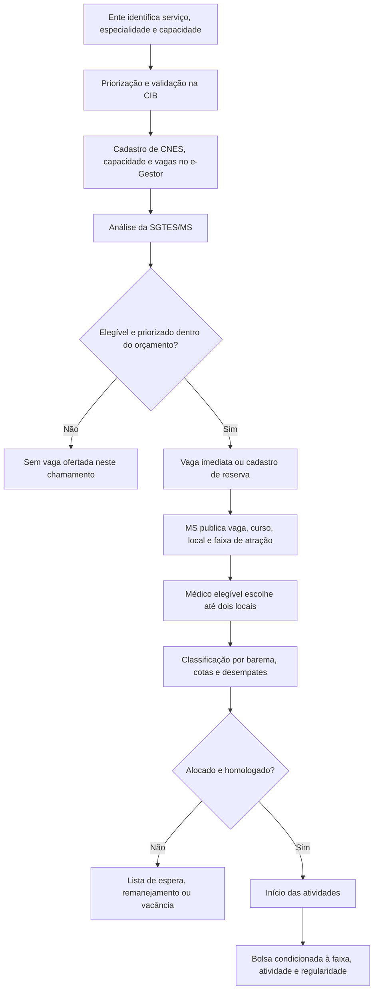

# Auditoria institucional do tratamento

> **Data da auditoria:** 27 de agosto de 2026  
> **Escopo:** regras de adesão, oferta de vagas, seleção de médicos e faixas de bolsa do Projeto Mais Médicos Especialistas (PMM-E).  
> **Não contém:** estimação de efeitos, construção de outcomes ou validação da base de vagas.

## 1. Conclusão executiva

O IVS **não determina de forma mecânica a participação de um município no PMM-E nem o número ou a composição de vagas que ele recebe**. A oferta passa por indicação dos entes, deliberação em CIB, requisitos de capacidade instalada, análise da SGTES/MS, limites orçamentários e decisões de priorização. Depois disso, os candidatos escolhem vagas e são classificados por barema; a ocupação também depende de procura, homologação e permanência.

Condicionalmente à existência de uma vaga ofertada, porém, a categoria municipal do IVS define uma **faixa de bolsa-formação**. Portanto, o estimando institucional mais plausível não é o efeito da elegibilidade ao programa. É o **efeito local da oferta de um incentivo monetário adicional**, possivelmente contaminado por mudanças simultâneas na seleção e composição das vagas.

A auditoria, contudo, **não libera um RDD neste momento**. Faltam três elos essenciais:

1. os atos do PMM-E consultados mencionam a “categorização municipal do IVS”, mas não identificam inequivocamente a vintagem, o arquivo e a precisão do escore usados para classificar cada vaga;
2. a grade de pagamentos mudou entre os chamamentos de 2025 e 2026, de modo que “Faixa 1”, “Faixa 2” e “Faixa 3” não têm significado temporal estável;
3. a categoria de IVS publicada na série local diverge da categoria derivada do arquivo local rotulado como IVS 2010 em 226 dos 531 municípios.

**Classificação do estimando possível:** efeito do incentivo adicional, não efeito do programa.  
**Classificação do desenho hoje:** RDD candidato, ainda não identificado; se os bloqueios não forem resolvidos, nenhum RDD causal é defensável.

## 2. Convenção de evidência

- **[Lei]** obrigação ou autorização constante de lei federal.
- **[Regra administrativa]** portaria, edital, retificação, cronograma ou decisão publicada pelo Ministério da Saúde.
- **[Metodologia externa]** definição produzida pelo Ipea, sem prova de que essa versão foi a efetivamente usada pelo PMM-E.
- **[Inferência do pesquisador]** implicação causal ou econométrica derivada das regras.
- **[Checagem local]** conferência dos arquivos preservados no repositório; não substitui fonte administrativa.

## 3. O que a lei instituiu

**[Lei]** A Lei nº 15.233/2025 incluiu o art. 22-D na Lei nº 12.871/2013. O PMM-E destina-se ao provimento de profissionais para reduzir o tempo de espera em regiões prioritárias definidas pelo Ministério da Saúde; a participação é exclusiva de médicos com diploma brasileiro ou revalidado e certificação como especialista, selecionados por edital. A lei permite bolsa e outros benefícios e prevê adicional para atuação na Amazônia Legal, em territórios indígenas ou em áreas de alta vulnerabilidade, sujeito a regulamentação e disponibilidade orçamentária. A lei não fixa IVS, cutoffs ou valores. [Lei nº 15.233/2025, art. 21, que acrescenta os arts. 22-D a 22-F](https://www.planalto.gov.br/ccivil_03/_ato2023-2026/2025/lei/l15233.htm).

**[Regra administrativa]** A Portaria GM/MS nº 7.177/2025 regulamenta o projeto como integração ensino-serviço e explicita objetivos de provimento, fixação, equilíbrio territorial e formação. Ela não cria uma regra de elegibilidade municipal baseada exclusivamente em IVS. [Portaria GM/MS nº 7.177/2025](https://bvsms.saude.gov.br/bvs/saudelegis/gm/2025/prt7177_11_06_2025.html).

**[Regra administrativa]** A Portaria GM/MS nº 7.266/2025 organiza o Programa Agora Tem Especialistas e adota diretrizes amplas, entre elas desigualdades regionais, tempo de espera e provimento em regiões prioritárias. Também não converte o IVS em regra única e automática de oferta de vagas do PMM-E. [Portaria GM/MS nº 7.266/2025](https://bvsms.saude.gov.br/bvs/saudelegis/gm/2025/prt7266_18_06_2025.html).

## 4. Como uma vaga chega a ser ocupada



O fluxo mostra por que uma descontinuidade de bolsa não equivale a uma descontinuidade de participação. Há escolhas e decisões administrativas antes da publicação da vaga e escolhas dos médicos depois dela.

## 5. Tabela auditável das regras

| Componente | Regra observada | Natureza | Papel do IVS | Fonte oficial |
|---|---|---|---|---|
| Adesão do ente | Estados, DF e municípios indicam serviços e vagas; a priorização é deliberada em CIB e formalizada por ofício | Regra administrativa | Nenhuma regra mecânica de adesão pelo IVS foi publicada | [Edital SGTES/MS nº 2/2025](https://www.gov.br/saude/pt-br/acesso-a-informacao/participacao-social/chamamentos-publicos/2025/chamamento-publico-no-02-2025-saes/edital) |
| Requisito do serviço | Cada vaga deve estar ligada a CNES e capacidade instalada compatível com o aprimoramento | Regra administrativa | Pode mudar a composição de municípios observados independentemente do IVS | [Edital SGTES/MS nº 2/2025, itens 3.1–3.3](https://www.gov.br/saude/pt-br/acesso-a-informacao/participacao-social/chamamentos-publicos/2025/chamamento-publico-no-02-2025-saes/edital) |
| Priorização federal | Considera baixa disponibilidade regional, distribuição desigual, fluxo de usuários, escala regional, escassez e limites orçamentários | Regra administrativa com margem decisória | IVS não aparece como algoritmo suficiente | [Edital SGTES/MS nº 2/2025, itens 3.8–3.10](https://www.gov.br/saude/pt-br/acesso-a-informacao/participacao-social/chamamentos-publicos/2025/chamamento-publico-no-02-2025-saes/edital) |
| Participação do médico | Exige diploma brasileiro ou revalidado, CRM/RQE e requisitos documentais; veda simultaneidade com PMMB/PMM-E em editais recentes | Lei e regra administrativa | IVS municipal não habilita o candidato | [Lei nº 15.233/2025](https://www.planalto.gov.br/ccivil_03/_ato2023-2026/2025/lei/l15233.htm); [Edital nº 28/2026](https://www.gov.br/saude/pt-br/acesso-a-informacao/participacao-social/chamamentos-publicos/2026/chamamento-publico-sgtes-ms-no-6-2026-pmm-e/edital) |
| Escolha e classificação | Candidato indica até dois locais no mesmo aprimoramento; processamento considera preferências, barema, cotas e desempates | Regra administrativa | IVS não integra o barema publicado | [Edital nº 28/2026, itens 4 e 5](https://www.gov.br/saude/pt-br/acesso-a-informacao/participacao-social/chamamentos-publicos/2026/chamamento-publico-sgtes-ms-no-6-2026-pmm-e/edital) |
| Vagas não ocupadas | Podem gerar novas chamadas, lista de espera ou redistribuição a cadastros de reserva segundo dificuldade de acesso e escassez | Regra administrativa com discricionariedade | Pode alterar a exposição e a composição ao longo do chamamento | [Edital nº 28/2026, itens 4.1.7 e 5.7–5.8](https://www.gov.br/saude/pt-br/acesso-a-informacao/participacao-social/chamamentos-publicos/2026/chamamento-publico-sgtes-ms-no-6-2026-pmm-e/edital) |
| Bolsa | Parcela fixa de R$ 10 mil e componente variável segundo faixa de atração; pagamento depende de homologação, atividade e regularidade | Regra administrativa | IVS define a faixa publicada, condicionalmente à vaga e à participação | [Edital nº 28/2026, item 11](https://www.gov.br/saude/pt-br/acesso-a-informacao/participacao-social/chamamentos-publicos/2026/chamamento-publico-sgtes-ms-no-6-2026-pmm-e/edital) |
| Ajuda de custo | Prevista para imersões presenciais, em parcela por ciclo e condicionada às atividades | Regra administrativa | Não foi localizada variação descontínua por IVS | [Retificação do Edital SGTES/MS nº 3/2025](https://www.gov.br/saude/pt-br/acesso-a-informacao/participacao-social/chamamentos-publicos/2025/chamamento-publico-sgtes-ms-no-3-2025-projeto-mais-medicos-especialistas/retificacao-do-edital) |
| Duração e carga | Até 12 meses e 20 horas semanais nos editais auditados | Regra administrativa | Não foi localizada mudança por faixa | [Edital nº 28/2026](https://www.gov.br/saude/pt-br/acesso-a-informacao/participacao-social/chamamentos-publicos/2026/chamamento-publico-sgtes-ms-no-6-2026-pmm-e/edital) |
| Substituição | O serviço não pode substituir profissional já vinculado por bolsista do PMM-E | Regra administrativa | A vedação não prova adicionalidade efetiva; exige auditoria de vínculos | [Edital nº 28/2026, item 2.2.2](https://www.gov.br/saude/pt-br/acesso-a-informacao/participacao-social/chamamentos-publicos/2026/chamamento-publico-sgtes-ms-no-6-2026-pmm-e/edital) |

## 6. Faixas de atração e mudança da regra

### 6.1 Regra dos chamamentos de 2025

| Categoria municipal anunciada | Faixa | Bolsa mensal anunciada |
|---|---:|---:|
| Muito alta vulnerabilidade | 1 | R$ 20.000 |
| Alta vulnerabilidade | 2 | R$ 15.000 |
| Média, baixa ou muito baixa vulnerabilidade | 3 | R$ 10.000 |

**[Regra administrativa]** Essa grade consta do Edital SGTES/MS nº 3/2025 e permanece reproduzida na [FAQ oficial vinculada ao chamamento de 2025](https://www.gov.br/saude/pt-br/acesso-a-informacao/participacao-social/chamamentos-publicos/2025/chamamento-publico-sgtes-ms-no-3-2025-pmm-e/faq/qual-o-valor-da-bolsa-formacao). A retificação posterior esclareceu que os valores eram líquidos, sem alterar no trecho publicado o agrupamento das categorias. [Retificação do Edital SGTES/MS nº 3/2025](https://www.gov.br/saude/pt-br/acesso-a-informacao/participacao-social/chamamentos-publicos/2025/chamamento-publico-sgtes-ms-no-3-2025-projeto-mais-medicos-especialistas/retificacao-do-edital).

### 6.2 Regra dos chamamentos de 2026

| Categoria municipal anunciada | Faixa | Bolsa mensal líquida anunciada |
|---|---:|---:|
| Muito alta ou alta vulnerabilidade | 1 | R$ 20.000 |
| Média vulnerabilidade | 2 | R$ 15.000 |
| Baixa ou muito baixa vulnerabilidade | 3 | R$ 10.000 |

**[Regra administrativa]** A grade aparece tanto no chamamento do segundo ciclo quanto no terceiro ciclo de 2026. [Chamamento SGTES/MS nº 1/2026 e Edital nº 3/2026](https://www.gov.br/saude/pt-br/acesso-a-informacao/participacao-social/chamamentos-publicos/2026/chamamento-publico-sgtes-ms-no-1-2026-pmm-e/chamamento-publico-sgtes-ms-no-1-2026-pmm-e); [Edital nº 28/2026, item 11.2](https://www.gov.br/saude/pt-br/acesso-a-informacao/participacao-social/chamamentos-publicos/2026/chamamento-publico-sgtes-ms-no-6-2026-pmm-e/edital).

### 6.3 Cutoffs candidatos, não ainda cutoffs administrativos confirmados

**[Metodologia externa]** O Atlas do Ipea classifica o IVS em muito baixa vulnerabilidade entre 0 e 0,200; baixa entre 0,201 e 0,300; média entre 0,301 e 0,400; alta entre 0,401 e 0,500; e muito alta entre 0,501 e 1. [Atlas da Vulnerabilidade Social nos Municípios Brasileiros, Ipea](https://repositorio.ipea.gov.br/bitstream/11058/4381/1/Atlas_da_vulnerabilidade_social_nos_municipios_brasileiros.pdf).

Se — e somente se — o PMM-E tiver aplicado exatamente esse arquivo, essa precisão e essas categorias, os saltos monetários candidatos seriam:

| Regra | Fronteira de categoria | Mudança de bolsa | Status |
|---|---|---:|---|
| 2025 | média → alta, entre 0,400 e 0,401 | + R$ 5 mil | Candidato |
| 2025 | alta → muito alta, entre 0,500 e 0,501 | + R$ 5 mil | Candidato |
| 2026 | baixa → média, entre 0,300 e 0,301 | + R$ 5 mil | Candidato |
| 2026 | média → alta, entre 0,400 e 0,401 | + R$ 5 mil | Candidato |

Os atos consultados não publicam esses números como cutoffs próprios do PMM-E nem identificam inequivocamente a vintagem do IVS. Logo, os valores acima são **tradução do pesquisador da taxonomia do Ipea**, não uma regra administrativa já comprovada. Como o IVS municipal costuma ser divulgado com três casas decimais, o suporte também é discreto: não se deve fingir que há observações arbitrariamente próximas de um cutoff contínuo.

### 6.4 O significado de “faixa” não é estável

Em 2025, alta vulnerabilidade era Faixa 2; em 2026, passou a Faixa 1. Média vulnerabilidade era Faixa 3; em 2026, passou a Faixa 2. Portanto:

- nunca se deve empilhar ciclos usando apenas `faixa_atracao`;
- a regra deve ser reconstruída por edital, chamada, data de oferta e data de início;
- é preciso distinguir faixa anunciada na vaga, faixa vigente no pagamento e faixa recodificada posteriormente em painéis;
- o salto em 0,500/0,501 existe na grade de 2025, mas desaparece na de 2026;
- o salto em 0,300/0,301 aparece na grade de 2026, mas não na de 2025.

## 7. Cronologia auditada dos chamamentos de médicos

| Edital/chamada | Publicação ou inscrição | Alocação final | Homologação/início | Grade relevante |
|---|---|---|---|---|
| Edital SGTES/MS nº 3/2025, 1ª chamada | Edital e vagas em 24/07/2025; inscrições 28/07–10/08 | 10/09/2025 | 11–18/09/2025 | 2025 |
| Edital SGTES/MS nº 3/2025, 2ª chamada | Inscrições 30/09–12/10/2025 | 14/11/2025 | 17–24/11/2025 | 2025 |
| Edital nº 3/2026, 1ª chamada do 2º ciclo | Edital e vagas em 03/02/2026; inscrições até 22/02 | 24/03/2026 | 25/03–08/04/2026 | 2026 |
| Edital nº 3/2026, 2ª chamada do 2º ciclo | Vagas em 16/04/2026; cronograma posteriormente retificado | 28/05/2026 na versão retificada | até 08/06/2026 na versão retificada | 2026 |
| Edital nº 28/2026, 3º ciclo | Vagas e inscrições em julho de 2026 | publicação final em agosto de 2026 | janela retificada até 26/08/2026 | 2026 |

Fontes: [cronograma retificado da 1ª chamada de 2025](https://www.gov.br/saude/pt-br/acesso-a-informacao/participacao-social/chamamentos-publicos/2025/chamamento-publico-sgtes-ms-no-3-2025-projeto-mais-medicos-especialistas/cronograma-de-eventos-retificado), [cronograma da 2ª chamada de 2025](https://www.gov.br/saude/pt-br/acesso-a-informacao/participacao-social/chamamentos-publicos/2025/chamamento-publico-sgtes-ms-no-3-2025-projeto-mais-medicos-especialistas/cronograma-pmm-e-2a-chamada), [cronograma retificado da 1ª chamada de 2026](https://www.gov.br/saude/pt-br/acesso-a-informacao/participacao-social/chamamentos-publicos/2026/chamamento-publico-sgtes-ms-no-1-2026-pmm-e/cronograma-de-eventos-retificado-02-04-2026), [cronograma retificado da 2ª chamada do segundo ciclo](https://www.gov.br/saude/pt-br/acesso-a-informacao/participacao-social/chamamentos-publicos/2026/chamamento-publico-sgtes-ms-no-1-2026-pmm-e/cronograma-pmme-2a-chamada-2o-ciclo-retificado) e [página oficial do terceiro ciclo](https://www.gov.br/saude/pt-br/acesso-a-informacao/participacao-social/chamamentos-publicos/2026/chamamento-publico-sgtes-ms-no-6-2026-pmm-e).

## 8. O que uma mudança no IVS altera

| Pergunta | Resposta auditada | Confiança |
|---|---|---|
| Altera a participação do município no PMM-E? | Não de forma determinística; adesão e priorização são multietapas | Alta |
| Altera a elegibilidade do médico? | Não; os requisitos são profissionais e documentais | Alta |
| Altera somente o incentivo marginal? | Essa é a interpretação pretendida da grade, condicional à vaga, mas ainda precisa ser validada contra outros componentes e pagamentos efetivos | Média |
| Altera oferta ou composição das vagas? | Pode influenciar administrativamente a priorização, mas não foi localizado algoritmo descontínuo publicado | Média |
| Altera vários componentes simultaneamente? | Possível se os cutoffs também forem usados na seleção/remanejamento de vagas ou em benefícios não observados | Em aberto |

**[Inferência do pesquisador]** O tratamento causal candidato é a **oferta de R$ 5 mil mensais adicionais por até 12 meses**, e não a participação no PMM-E. Para uma vaga já ofertada, ambos os lados do cutoff podem receber médico, aprimoramento, mentoria e bolsa-base; o que muda nominalmente é o complemento financeiro.

Essa interpretação deve ser reduzida para “efeito de um pacote” se a auditoria de dados mostrar saltos simultâneos na probabilidade de receber vaga, no número de vagas, nas especialidades, na infraestrutura exigida, na ajuda de custo ou em outras condições.

## 9. Checagem dos arquivos locais

**[Checagem local]** A conferência foi apenas diagnóstica; nenhum arquivo em `data/` foi alterado.

- As 7.276 linhas da série histórica foram vinculadas por código IBGE aos 5.565 registros do arquivo local rotulado `ivs_ipea_2010_municipios.csv`.
- Cada um dos 531 municípios da série tem uma única categoria textual de IVS, apesar de variações de caixa, acento e prefixo numérico.
- Apenas 305 municípios (57,4%) têm categoria textual igual à categoria obtida ao aplicar as faixas publicadas pelo Ipea ao `ivs_2010` local; 226 divergem.
- O retrato nominal de agosto de 2026 associa alta vulnerabilidade à Faixa 1, média à Faixa 2 e baixa/muito baixa à Faixa 3 inclusive entre profissionais marcados como ciclo 1, que iniciaram em 2025. Isso pode refletir recodificação do painel, mudança de pagamento, ou ausência de historicização; os arquivos não permitem decidir.

Essas divergências impedem usar o arquivo local como prova da running variable administrativa. A auditoria de dados deve recuperar a fonte oficial por vaga/ciclo e verificar a construção do arquivo local antes de qualquer estimação.

## 10. Plausibilidade dos desenhos causais

### Sharp RDD

**Não plausível ainda.** Poderá se tornar plausível para o efeito da **oferta** do incentivo adicional se forem demonstrados, por vaga e chamamento:

1. o escore exato e pré-tratamento usado pelo MS;
2. o cutoff numérico e a regra de inclusão nas fronteiras;
3. correspondência determinística entre escore, faixa anunciada e valor devido;
4. inexistência de outros componentes descontínuos no mesmo ponto;
5. universo de vagas definido antes da escolha dos candidatos;
6. suporte e quantidade de municípios suficientes em cada mass point próximo ao corte.

Mesmo nesse cenário, “sharp” se refere à **oferta do valor da bolsa**, não ao recebimento efetivo acumulado nem ao preenchimento da vaga.

### Fuzzy RDD

Pode ser necessário se a faixa anunciada não determinar perfeitamente o valor efetivamente recebido, houver regras de transição entre 2025 e 2026, exceções territoriais, revisões de categoria ou pagamentos divergentes. Nesse caso, o indicador de estar acima do cutoff poderia instrumentar o incentivo efetivamente recebido, mas somente com folha de pagamento ou fonte equivalente e primeiro estágio verificável.

### Outro desenho

A mudança da grade entre 2025 e 2026 cria variação temporal potencialmente útil, mas não autoriza automaticamente diferenças-em-diferenças ou diferenças-em-descontinuidades. Seriam necessários pagamentos historicizados, vagas comparáveis, exposição por ciclo e hipóteses adicionais. Esse caminho deve ser considerado apenas no protocolo, depois da auditoria de dados.

### Nenhum desenho causal

Será a conclusão correta se não for possível recuperar a vintagem do IVS, reconstruir a regra histórica de faixa, separar oferta de vaga de pagamento e demonstrar um primeiro estágio. Nesse caso, as faixas podem sustentar descrição estratificada, mas não linguagem causal.

## 11. Ambiguidades ainda não resolvidas

| Prioridade | Ambiguidade | Por que importa | Evidência necessária |
|---:|---|---|---|
| Crítica | Qual vintagem e arquivo do IVS foram usados em cada edital e vaga? | Sem isso não há running variable reproduzível | Nota técnica, dicionário ou quadro oficial com escore e categoria |
| Crítica | A grade de 2026 alterou pagamentos dos participantes iniciados em 2025 ou apenas recodificou o painel? | Define tratamento, dose e data de mudança | Histórico normativo e folha mensal de bolsa por participante |
| Crítica | A faixa publicada é determinada pelo valor bruto do IVS, pelo valor arredondado ou por tabela categórica fixa? | Define cutoff e casos de fronteira | Regra computacional e precisão oficial |
| Alta | O IVS ou sua categoria também entrou na decisão de ofertar/remanejar vagas? | Pode transformar incentivo em pacote e criar seleção no cutoff | Estudos de escassez, notas de priorização e logs de decisão da SGTES/CIB |
| Alta | Amazônia Legal, territórios indígenas e outras áreas receberam adicional ou regra própria além da grade do IVS? | Pode gerar exceções e tratamentos simultâneos | Regulamento de pagamentos e cadastro territorial por vaga |
| Alta | Qual era a faixa anunciada originalmente em cada vaga e chamada? | O painel corrente pode ter sobrescrito a história | Quadros de vagas versionados e retificações |
| Alta | Houve retificação, realocação ou mudança de CNES após a oferta? | Muda unidade, exposição e risco de seleção | Logs de vaga, comunicados e termos de homologação |
| Média | A ajuda de custo ou outro benefício variou com vulnerabilidade ou distância? | Um salto adicional impediria interpretar o coeficiente como apenas bolsa mensal | Manual e pagamentos de ajuda de custo |
| Média | Como foram tratados municípios criados, alterações de código e DF? | Pode explicar divergências de linkage | Crosswalk oficial versionado |

## 12. Decisão para o roadmap

O Prompt 1 entrega uma hipótese institucional clara, mas não abre o portão de estimação.

> **Hipótese a validar no Prompt 2:** dentro do universo de vagas ofertadas, a categoria municipal do IVS gerou uma mudança de R$ 5 mil na bolsa anunciada, sem alterar deterministicamente os demais componentes do PMM-E.

O Prompt 2 deve buscar prioritariamente os quadros de vagas versionados, o escore/categoria oficial por município, a regra histórica de pagamento e as retificações. O Prompt 3 só poderá congelar um RDD se essas peças fecharem. Até lá, a classificação é:

```text
participação no PMM-E:       não determinada pelo IVS
oferta/composição de vagas:  multivariada e parcialmente discricionária
incentivo anunciado:         aparentemente determinado pela categoria do IVS
estimando candidato:         efeito marginal de +R$ 5 mil/mês
desenho liberado hoje:       nenhum; RDD permanece candidato condicionado
```
