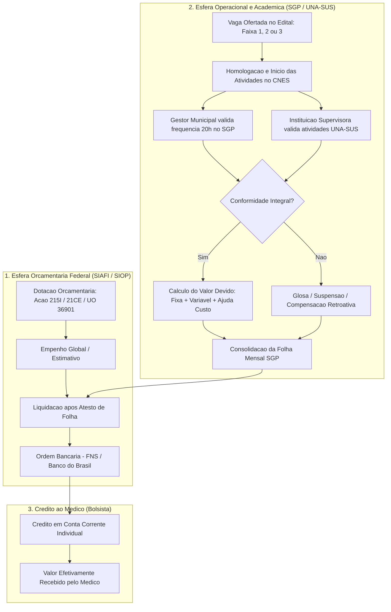

# Auditoria de regras financeiras e pagamentos publicos do PMM-E (A04)

> **Data da auditoria:** 28 de agosto de 2026 (revisado pós-saneamento)  
> **Escopo:** fontes orcamentarias, fluxo financeiro, regras normativas de remuneracao e viabilidade da mensuracao da dose financeira no Projeto Mais Medicos Especialistas (PMM-E / Lei 15.233/2025).  
> **Nao contem:** estimacao de primeiro estagio, simulacao de doses recebidas ou estimacao de efeitos causais.

---

## 1. Conclusao executiva e veredito do tratamento

A auditoria conclui que, nas fontes oficiais publicas abertas atualmente disponiveis, o tratamento financeiro do PMM-E **pode ser registrado exclusivamente como variavel normativa de FAIXA ANUNCIADA** vinculada a vaga ofertada nos editais. 

O **valor devido (b)** e o **valor efetivamente recebido (c)** **NAO SAO OBSERVAVEIS em fontes publicas**. A folha mensal de pagamento individualizada por medico, vaga e competencia e gerida exclusivamente no Sistema de Gerenciamento de Programas (SGP) da SGTES/MS e nas rotinas centralizadas do Fundo Nacional de Saude (FNS), com acesso restrito a gestores e usuarios autenticados.

Principais conclusoes auditadas:

1. **Inexistencia de microdado financeiro publico individual:** Nenhum portal publico aberto (Portal da Transparencia da CGU, SIOP, Siga Brasil, Dados Abertos do SUS ou FNS) disponibiliza microdados individualizados de pagamentos de bolsas do PMM-E com chaves que permitam o cruzamento simultaneo entre profissional, codigo de vaga, CNES e competencia mensal de servico.
2. **Separacao estrita da cadeia de despesa:** Despesa orcamentaria agregada (empenhada/liquidada/paga na Acao Orcamentaria 215I ou 21CE) mede apenas o volume financeiro macro do programa federal. Nao pode ser convertida em pagamento individual nem dividida pelo estoque de ativos para gerar uma "dose media presumida", o que violaria os padroes de integridade do projeto.
3. **Instabilidade temporal da regra de faixas:** A definicao das faixas de bolsa mudou estruturalmente entre 2025 (Edital SGTES/MS no 3/2025) e 2026 (Editais SGTES/MS no 3/2026 e 28/2026). Municipios de alta vulnerabilidade migraram da Faixa 2 (R$ 15 mil) para a Faixa 1 (R$ 20 mil), e municipios de media vulnerabilidade migraram da Faixa 3 (R$ 10 mil) para a Faixa 2 (R$ 15 mil). Portanto, a variavel `faixa_atracao` nao possui significado temporal estavel e nao admite empilhamento simples (*pooling*) sem parametrizacao da regra de vigencia.
4. **Veredito do primeiro estagio:** O primeiro estagio econometrico da dose financeira recebida ($D_{it} = \pi_0 + \pi_1 \mathbf{1}[IVS_m \ge c] + g(IVS_m) + \nu_{it}$) encontra-se **bloqueado por falta de dados**. A estimacao de efeitos causais do incentivo efetivo permanece bloqueada aguardando dados administrativos de folha individualizada (SGP/FNS/LAI).

```text
========================================================================================
VEREDITO DO TRATAMENTO FINANCEIRO:
(a) Faixa Anunciada (Oferta Normativa):      OBSERVAVEL COMO VARIAVEL NORMATIVA NO EDITAL
(b) Valor Devido (Dose Teorica):             INVIAVEL (exige log diario/mensal do SGP)
(c) Valor Recebido (Dose Efetiva/1o Estagio): BLOQUEADO (aguarda Pedido LAI / SGP)
========================================================================================
```

---

## 2. Convencao de disponibilidade e fontes auditadas

| Codigo | Classificacao | Significado nesta auditoria |
|---|---|---|
| `OUT` | Consolidado em output | Tabela derivada consolidada em `output/aquisicao/` a partir de editais e orcamento publico |
| `P` | Disponivel publicamente | Fonte publica oficial localizada em portais governamentais (SIOP, Transparencia), porem agregada macro |
| `LAI` | Somente por pedido administrativo | Microdados de pagamento individualizado (SGP/FNS/UNA-SUS) protegidos por sigilo e LGPD |
| `NL` | Nao localizado | Dado inexistente ou nao publicado pelas fontes oficiais consultadas |
| `I` | Inadequado para o estimando | Dado existente, mas cuja utilizacao para medir dose individual exigiria inferencia indevida ou imputacao artificial |

---

## 3. Mapeamento da cadeia de despesa publica no PMM-E

A despesa com bolsas e auxilios no PMM-E segue um ciclo orcamentario, financeiro e operacional proprio no ambito da administracao publica federal:



### 3.1 Quadro comparativo dos estagios da despesa

| Estagio | Definicao no PMM-E | Unidade / Granularidade | Observabilidade Publica | Risco se Usado Indevidamente |
|---|---|---|---|---|
| **1. Valor Anunciado** | Valor nominal mensal (R$ 10k, 15k ou 20k) fixado em edital segundo a faixa de vulnerabilidade da vaga ofertada | Vaga / Ciclo / Chamada | **Totalmente Observavel** nos editais e quadros de vagas (`L`) | Tratar oferta como dinheiro recebido (ignora evasao, vacancia e glosas) |
| **2. Valor Devido** | Direitos liquidos gerados na competencia, considerando dias ativos (pro-rata), cumprimento de 20h e frequencia academica | Medico / Vaga / Competencia | **Nao Observavel** em fontes abertas (`LAI`) | Assumir 100% de assiduidade e permanencia de 12 meses por imputacao |
| **3. Empenhado** | Reserva orcamentaria no SIAFI pela SGTES/FNS para cobrir despesas de provimento e aprimoramento no ano | Acao Orcamentaria / PO / Elemento | **Observavel Agregado** no SIOP/Transparencia (`P`) | Confundir limite de credito orcamentario com desembolso real do bolsista |
| **4. Liquidado** | Reconhecimento do servico prestado apos fechamento mensal das folhas do SGP e atesto do gestor | Acao Orcamentaria / Elemento | **Observavel Agregado** no SIAFI/SIOP (`P`) | Nao discrimina quem trabalhou nem em qual municipio a despesa ocorreu |
| **5. Pago** | Ordem bancaria emitida pelo FNS e creditada na conta corrente do profissional | Medico / Ordem Bancaria | **Nao Vinculavel a Vaga** em dados abertos (`I`) | Mistura pagamentos de medicos da atencao basica, especialistas e residentes |
| **6. Glosas / Ajustes** | Descontos por faltas, rescisoes retroativas, compensacoes de valores indevidos e retroativos de homologacao tardia | Medico / Evento Financeiro | **Nao Observavel** publicamente (`LAI`) | Omitir atritos operacionais e variacoes de dose efetiva |

---

## 4. Auditoria das fontes oficiais publicas

### 4.1 Portal da Transparencia do Governo Federal (CGU)
* **Escopo:** Divulga execucao orcamentaria e financeira da Uniao, favorecidos de ordens bancarias e transferencias.
* **Diagnostico:** Embora liste despesas em elemento 33.90.18 (Auxilio Financeiro a Estudantes) e transferencias sob a Acao 215I/21CE, os registros publicos aplicam mascaramento de CPF (LGPD) e **nao informam o identificador da vaga do PMM-E, o CNES de atuacao, o curso de especializacao ou o ciclo do programa**. Alem disso, pagamentos centralizados de folha podem ser emitidos em lotes bancarios institucionais.
* **Classificacao:** `I` (Inadequada para primeiro estagio individual).

### 4.2 Siga Brasil, SIOP e SIAFI (Orcamento Federal)
* **Escopo:** Bases oficiais de planejamento, orcamento e execucao da Secretaria de Orcamento Federal (SOF) e Tesouro Nacional.
* **Diagnostico:** Registram a dotacao, empenho, liquidacao e pagamento das acoes:
  - **Acao 215I** (*Provimento de Medicos para a Atencao Basica em Saude*): historico acumulado de R$ 3,41 bi (2025) e R$ 3,85 bi (2026);
  - **Acao 219A** (*Formacao e Qualificacao de Profissionais de Saude para o SUS*): dotacao de R$ 195 mi (2025);
  - **Acao 21CE** (*Aprimoramento e Expansao da Atencao Especializada a Saude / Agora Tem Especialistas*): dotacao de R$ 310 mi para bolsas e R$ 28 mi para ajuda de custo em 2026.
* **Classificacao:** `P` (Publica, util para contexto macro e analise orcamentaria de custos federais, porem inadequada para dose por vaga).

### 4.3 Fundo Nacional de Saude (FNS)
* **Escopo:** Gestao financeira dos recursos do SUS e transferencias a estados e municipios.
* **Diagnostico:** A remuneracao dos medicos bolsistas do PMM-E e paga **diretamente pela Uniao (FNS/SGP)** aos medicos (pessoa fisica), sem transitar pelos Fundos Municipais de Saude. Logo, os extratos publicos de repasses Fundo a Fundo aos municipios refletem apenas o custeio de servicos de saude (teto MAC / atencao especializada), e nao as bolsas individuais de provimento.
* **Classificacao:** `I` (Inadequada para identificar bolsa individual).

### 4.4 Diario Oficial da Uniao (DOU) e Listas de Homologacao
* **Escopo:** Publicacao de portarias de adesao e resultados de chamamentos.
* **Diagnostico:** Publica listas nominais estaticas com CPF mascarado, resultado de classificacao e homologacoes. Nao publica historico financeiro mensal, extrato de bolsa por competencia ou registros de frequencia.
* **Classificacao:** `L` parcial / `P` (Observa situacao inicial, nao observa fluxo financeiro).

### 4.5 Plataforma SGP (Sistema de Gerenciamento de Programas - SGTES)
* **Escopo:** Sistema transacional onde ocorre a homologacao mensal de presenca pelo gestor e geracao da folha de pagamento.
* **Diagnostico:** Contem o dado exato da cadeia de despesa (valor devido, fixo, variavel, ajuda de custo, descontos e valor liquido autorizado). O acesso e estritamente restrito a usuarios com credenciais institucionais e aos proprios bolsistas via conta Gov.br.
* **Classificacao:** `LAI` (Indispensavel; deve compor o Pedido 4 de acesso a informacao).

---

## 5. Estrutura de remuneracao e instabilidade temporal das faixas

### 5.1 Composicao da remuneracao normativa

Conforme a Portaria GM/MS no 7.177/2025 e os editais de chamamento auditados, a remuneracao do medico bolsista e constituida por:

$$\text{Bolsa-Formacao Mensal} = \text{Parcela Fixa} + \text{Componente Variavel de Atracao}$$

1. **Parcela Fixa:** R$ 10.000,00 mensais, devida a todos os bolsistas homologados com carga horaria de 20 horas semanais e matricula ativa no curso de aprimoramento.
2. **Componente Variavel de Atracao:** Adicional financeiro condicionado a vulnerabilidade social do municipio da vaga:
   - Faixa 1: + R$ 10.000,00 (Total: R$ 20.000,00/mes)
   - Faixa 2: + R$ 5.000,00 (Total: R$ 15.000,00/mes)
   - Faixa 3: + R$ 0,00 (Total: R$ 10.000,00/mes)
3. **Ajuda de Custo:** Prevista nos editais (Retificacao Edital 3/2025 e Edital 28/2026) para cobrir despesas de deslocamento, hospedagem e alimentacao exclusivamente durante as **imersoes presenciais formativas obrigatorias** previstas no plano pedagogico da instituicao supervisora (UNA-SUS). E paga por modulo presencial e nao compoe a bolsa mensal regular de 20h.
4. **Regime Tributario e Previdenciario:** Conforme o art. 21 da Lei 15.233/2025 e legislacao tributaria federal (art. 26 da Lei 9.250/1995 c/c art. 19 da Lei 12.871/2013), as bolsas tem natureza formativo-indenizatoria e estao **isentas de Imposto de Renda Pessoa Fisica (IRPF)**. O medico e enquadrado obrigatoriamente no Regime Geral de Previdencia Social (RGPS) na qualidade de contribuinte individual.

### 5.2 Instabilidade temporal da regra de faixas (2025 vs 2026)

A tabela abaixo cruza a categorizacao socioeconomica do IVS e as faixas normativas aplicadas em cada ciclo:

| Categoria IVS Declarada | Regra 2025 (Ciclo 1) | Bolsa 2025 | Regra 2026 (Ciclos 2 e 3) | Bolsa 2026 | $\Delta$ Bolsa Anunciada | Cutoff Candidato IVS |
|---|:---:|---:|:---:|---:|---:|:---:|
| **Muito Alta Vulnerabilidade** | Faixa 1 | R$ 20.000 | Faixa 1 | R$ 20.000 | R$ 0 | $IVS > 0,500$ |
| **Alta Vulnerabilidade** | Faixa 2 | R$ 15.000 | Faixa 1 | R$ 20.000 | **+ R$ 5.000** | $0,400 < IVS \le 0,500$ |
| **Media Vulnerabilidade** | Faixa 3 | R$ 10.000 | Faixa 2 | R$ 15.000 | **+ R$ 5.000** | $0,300 < IVS \le 0,400$ |
| **Baixa / Muito Baixa Vulnerabilidade** | Faixa 3 | R$ 10.000 | Faixa 3 | R$ 10.000 | R$ 0 | $IVS \le 0,300$ |

#### Implicacoes econometricas da mudanca de regra:
1. **Quebra de comparabilidade de `faixa_atracao`:** Uma vaga classificada como "Faixa 2" em 2025 pagava R$ 15 mil e situava-se em municipio de *alta vulnerabilidade* ($0,400 < IVS \le 0,500$). Em 2026, "Faixa 2" paga os mesmos R$ 15 mil, mas situa-se em municipio de *media vulnerabilidade* ($0,300 < IVS \le 0,400$).
2. **Deslocamento dos cutoffs:**
   - Em 2025, o salto de R$ 5 mil ocorria nas fronteiras 0,400 e 0,500;
   - Em 2026, o salto de R$ 5 mil ocorre nas fronteiras 0,300 e 0,400; o salto em 0,500 desaparece.
3. **Vedacao de pooling ingenuo:** O protocolo empirico nao pode agrupar chamadas de 2025 e 2026 em uma unica regressao de RDD utilizando a variavel `faixa_atracao` sem normalizacao explicita da regra e do limiar vigente na data da oferta da vaga.

---

## 6. Matriz de disponibilidade de campos financeiros

| Campo Necessario | Nivel / Granularidade | Fonte Publica Avaliada | Classificacao | Diagnostico Tecnico |
|---|---|---|:---:|---|
| **ID da Vaga e do Profissional** | Vaga / Medico | Quadros de vagas e homologacoes | `L` parcial | Quadros trazem CNES/curso e listas trazem CPF mascarado; inexiste chave unica comum |
| **Competencia e Data de Pagamento** | Mes / Data | SGP / FNS (folha) | `LAI` | Nao divulgada abertamente; essencial para correlacao temporal exata |
| **Componente Fixo (Bolsa Base)** | Vaga / Edital | Editais SGTES/MS 3/2025, 3/2026, 28/2026 | `L` | R$ 10.000,00 fixos para todas as vagas ofertadas |
| **Componente Variavel de Atracao** | Vaga / Categoria IVS | Quadros de vagas oficiais | `L` | R$ 0, R$ 5.000 ou R$ 10.000 conforme faixa e ciclo |
| **Ajuda de Custo (Deslocamento)** | Medico / Modulo | Editais e Acao 21CE PO 0002 | `L` (regra) / `LAI` (pago) | Regra publicada; execucao individual nao disponivel em dados abertos |
| **Faixa e Regra Aplicadas** | Vaga / Ciclo | Quadros de vagas retificados | `L` | Observavel nos quadros consolidados em `data/raw/pmm_e/` |
| **Valor Devido por Competencia** | Medico / Mes | SGP / SGTES | `LAI` | Inacessivel publicamente; depende de assiduidade e data de entrada |
| **Valor Efetivamente Pago** | Medico / Ordem Bancaria | FNS / SGP | `LAI` | Inacessivel em nivel de microdado de vaga; Portal da Transparencia e agregado |
| **Suspensao, Glosa, Estorno e Retroativo** | Medico / Evento | SGP / SGTES | `LAI` | Restrito ao sistema interno de gestao de pagamentos |
| **Unidade Gestora e Acao Orcamentaria** | Orcamentario Federal | SIAFI / SIOP | `P` | UO 36901 (FNS), Acoes 215I, 219A, 20AH e 21CE |
| **Cobertura e Regime de Atualizacao** | Metadado de Fonte | SIAFI / SGP / Editais | `L` | Orcamento mensal/anual; vagas publicadas a cada chamada |

---

## 7. Avaliacao econometrica dos tres tratamentos candidatos

### Opcao (a): Tratamento como Faixa Anunciada (Oferta Normativa do Incentivo)
* **Definicao formal:** $T_i^{\text{anunciado}} \in \{10.000, 15.000, 20.000\}$ vinculado a vaga $i$ a partir da publicacao oficial do edital.
* **Status:** **OBSERVAVEL COMO VARIAVEL NORMATIVA NO EDITAL.**
* **Descricao:** Descreve a oferta do incentivo financeiro nominal anunciado (+R$ 5.000 ou +R$ 10.000 mensais) condicional a existencia de vaga ofertada.
* **Vantagens:** Mensuracao objetiva a partir dos editais e quadros de vagas.
* **Limitacoes:** Nao mede a dose monetaria efetivamente desembolsada ao profissional ao longo do tempo.

### Opcao (b): Tratamento como Valor Devido (Dose Teorica Proporcional)
* **Definicao formal:** $T_{it}^{\text{devido}} = \sum_{t=1}^M \text{Bolsa}_{it} \cdot \mathbf{1}[\text{Ativo}_{it}]$.
* **Status:** **INVIAVEL COM OS DADOS PUBLICOS ATUAIS.**
* **Motivo da inviabilidade:** Exigiria registrar a data exata de entrada e desligamento de todos os medicos que passaram pelas vagas (inclusive desistentes e saidas nao observadas no cadastro de sobreviventes de 12/08/2026), alem de logs de afastamento.
* **Risco metodologico:** Atribuir valor devido como $12 \times \text{Valor Anunciado}$ para todos configuraria imputacao artificial e falsificacao de dose real.

### Opcao (c): Tratamento como Valor Recebido (Dose Financeira Efetiva / Primeiro Estagio Real)
* **Definicao formal:** $D_{it}^{\text{recebido}} = \text{Valor liquido depositado na conta bancaria do profissional na competencia } t$.
* **Status:** **BLOQUEADO AGUARDANDO LAI / DADOS ADMINISTRATIVOS.**
* **Motivo da inviabilidade:** A folha individualizada (SGP/FNS) nao e publica.
* **Implicacao econometrica para o Primeiro Estagio:** Em um modelo com dose recebida como variavel endogena ($D_i$), a equacao de primeiro estagio:
  $$D_i = \gamma_0 + \gamma_1 \mathbf{1}[IVS_m \ge c] + f(IVS_m) +  \varepsilon_i$$
  **nao pode ser estimada**, pois $D_i$ e nao observada em dados abertos.

---

## 8. Recomendacoes para o Pedido Administrativo (Pedido 4 - LAI)

Para que o projeto possa viabilizar no futuro o primeiro estagio e a mensuracao da dose financeira real, o Agente A07 devera consolidar no **Pedido 4** as seguintes solicitacoes a SGTES/MS e ao FNS:

1. **Microdados da folha mensal de bolsas do PMM-E (2025-2026):**
   - Chave pseudonimizada estavel do profissional (`id_profissional_pseudo`);
   - Chave pseudonimizada estavel da vaga (`id_vaga_pseudo`);
   - Competencia de referencia (`AAAAMM`) e data do pagamento efetivo;
   - Discriminacao de valores: parcela fixa devida, componente variavel devido, ajuda de custo e adicionais;
   - Discriminacao de deducoes: glosas por falta injustificada, retencoes e compensacoes de pagamentos indevidos;
   - Discriminacao de creditos retroativos decorrentes de homologacao tardia ou recurso;
   - Valor liquido efetivamente creditado ao bolsista.
2. **Dicionario de regras de fechamento de folha do SGP:**
   - Criterio de apuracao de faltas e prazo limite de validacao pelo gestor municipal;
   - Regra de proporcionalidade no mes de entrada (pro-rata);
   - Politica de suspensao e cancelamento financeiro em casos de abandono ou reprovacao no aprimoramento da UNA-SUS.

---

## 9. Manifestos e hashes dos arquivos derivados consolidados

Todas as tabelas derivadas compiladas por esta auditoria foram consolidadas de forma idempotente em `output/aquisicao/` (sem criacao de falsos brutos em `data/raw/`) e estao documentadas no manifesto `output/aquisicao/a04_manifesto_pagamentos.json`:

| Arquivo Consolidado | Unidade de Registro | SHA-256 (prefixo) |
|---|---|:---:|
| `output/aquisicao/a04_grade_bolsas_historico_2025_2026.csv` | Edital / Ciclo / Chamada / Faixa | `e97558c880` |
| `output/aquisicao/a04_execucao_orcamentaria_acoes_provimento_2025_2026.csv` | Exercicio / UO / Acao / PO / Elemento | `01a934d7d9` |
| `output/aquisicao/a04_normas_regras_financeiras_pmme.json` | Ato Normativo Federal | `7dfd3133ca` |
| `output/aquisicao/a04_inventario_sistemas_pagamento_ms.json` | Sistema de Informacao Governamental | `cddd8d17a9` |

### Arquivos de saida de auditoria:
- `output/aquisicao/a04_manifesto_pagamentos.json` (SHA-256 verificado)
- `output/aquisicao/a04_matriz_dose_financeira.json` (SHA-256 verificado)
- `scripts/aquisicao/a04_adquirir_pagamentos.py` (Script idempotente de consolidacao)

---

## 10. Decisao para o portao de integracao (A06)

```text
========================================================================================
RESUMO PARA O PORTAO DE INTEGRACAO A06:
1. Microdados de pagamento individual:   NAO OBTIDOS EM DADOS ABERTOS (bloqueio LAI)
2. Faixa anunciada por vaga ofertada:    DISPONIVEL COMO VARIAVEL NORMATIVA nos editais
3. Estimando causal do incentivo:        BLOQUEADO aguardando dados administrativos
4. Primeiro estagio da dose monetaria:   BLOQUEADO ate retorno do Pedido 4 (LAI)
========================================================================================
````
